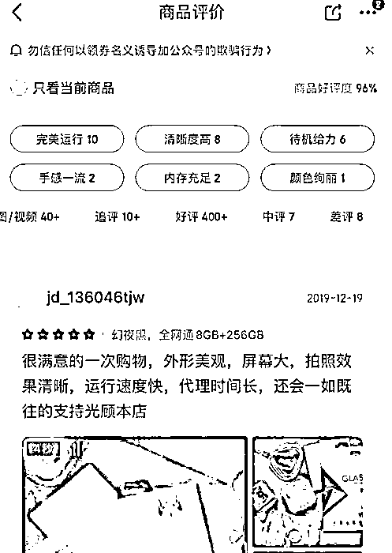

# “淘宝找不到中差评了，这还怎么买东西”

> 原文：[`mp.weixin.qq.com/s?__biz=MzIyMDYwMTk0Mw==&mid=2247503166&idx=2&sn=667cc82d348bcc0dd5fc067be9ccf6a2&chksm=97cb0606a0bc8f10920368d2625b4808cf68027f83a6c36591076f82d7f9759c593a4c8c56e7&scene=27#wechat_redirect`](http://mp.weixin.qq.com/s?__biz=MzIyMDYwMTk0Mw==&mid=2247503166&idx=2&sn=667cc82d348bcc0dd5fc067be9ccf6a2&chksm=97cb0606a0bc8f10920368d2625b4808cf68027f83a6c36591076f82d7f9759c593a4c8c56e7&scene=27#wechat_redirect)

点击蓝字“**灰产圈**”关注我们！

“淘宝什么时候改版的，怎么找不到中差评了，这还怎么买东西？”

今年 9 月末，淘宝个人店铺评价体系迎来改革，“中差评”替换为“感觉不佳”的标签， 这让不少买家无所适从，而个人店主则认为可以保护中小卖家的利益。只是卖家没高兴多久，淘宝又在 10 月份将“中差评”悄悄恢复。

 隐藏中差评，是不是偏袒了卖家？评价体系，又该如何改革才能让各方满意？

**“中差评”走了又来**

9 月 23 日，手机淘宝对评价体系进行了改版。

以往用户点击“宝贝评价”，会看到中差评选项，但改版后，中差评内容被合并在“感觉不佳”中，并且排列在诸多由好评展开的相关条目之后。以往单独展示的中差评就这样被隐藏起来。

9 月末，淘宝客服表示中差评被收纳在“感受不佳”标签里。本文图片均来自 中国新闻网

“中差评”消失的这些天，最欢欣鼓舞的是淘宝个人店主，最恼火的是普通消费者。

 “我一般买东西会特意去看看中差评，如果是和产品品质无关的，就可以比较放心购买。现在的好评很多都是刷出来的，一看就特别假，以前不看中差评还吃过几次亏。” 来自浙江的冯祎向记者表示，如果不是提前知道评价体系改版，自己看到“体验不佳”标签，不点进去可能会以为这家店铺根本不存在中差评。

不少网友表示中差评是重要的购物参考。微博评论截图

某国潮服装品牌工作人员告诉记者，好评率是淘宝个人店铺和商品搜索排名的一个重要指标，会影响到搜索、参与营销活动和淘宝直通车等多个方面。个人店铺销量较低，评价总数远少于旗舰店，这种情况下，一个差评就会大大影响整店铺的好评率。因此隐藏中差评，对于个人卖家是利好。

 “中差评体系”曾是淘宝信用评价体系的重要组成部分，借鉴于 eBay 网，最早于 2003 年上线。此后，尽管淘宝网经历多次调整，但中差评体系一直存在，也成为消费者购物的重要参考。

 但在店家看来，此举可以起到保护中小卖家的作用。“我们做个人店铺的，一个差评就会导致店铺评分下降，销量也会受影响。改版能让部分顾客忽略中差评，可以减少偶然的负面评价对商品的影响。”淘宝个人店主朱先生告诉记者。

 他同时认为，隐藏中差评并不是说中差评被删除了，只是变得不那么明显，减少对买家决策的干预。如果质量不过关导致过多的差评，一样会让店铺评分降低，难以为继。

黑猫投诉的投票，90%的人选择应该直观展示差评。  

但在消费者看来，这提高了购物的选择成本。在黑猫投诉发起的“淘宝中差评不再单独显示，你觉得怎么样？”的投票中：高达 90%的网友都认为“不好，就应该差评直观”。

 近日，记者实测发现，曾经在 9 月末消失的淘宝中差评，10 月份又卷土重来了，唯一的区别是中差评从分开展示变成合并展示。旗舰店不展示中差评，个人店铺中中差评合并展示。

旗舰店不展示中差评 

以某家经营皮具的旗舰店为例，该店的爆款商品是一款替换表带，有多达 24770 个评论。

淘宝将这些评论归纳为六个标签，前五个是“品质好”“外观设计好看”等正面标签，仅最后的“有点硬”是相对负面的标签，但点进去之后并不显示中差评。

个人店铺中中差评合并展示  

而在另外一家经营数码配件的个人店铺，尽管一款手环腕带的历史评价达到 1299 个，数量上比得上部分旗舰店，但点开评论却会发现除了“品质好”“会回购”之外，还有单独的“中差评”可以查看。9 月份的“感受不佳”标签已经消失。

**“中差评”的是与非**

为什么突然撤回隐藏中差评的功能？有卖家向淘宝官方咨询，得到的回复是需要等市场反馈才能确定展示评论的方式。也就是说，官方其实也处在一个探索的阶段，并无定数。

10 月份，中差评回归。论坛截图

经营方便食品的店主桂女士告诉记者，在淘宝 9 月份测试取消“中差评”期间，发现自家店铺的链接转化率比往常有所下降，“买家不知道评论区改版了，逛了一圈看不到中差评，怀疑我们好评是刷的，最后直接去旗舰店下单了。”

但桂女士依然支持隐藏中差评。“过去遇到太多故意给差评的了，不得不破财免灾。虽然改版让中差评存在感低了，但买家依然是能给差评的，所以我们这样信誉等级高的店铺，还是有一些优势。而且还能一定程度上缩小和旗舰店的差距，毕竟他们的中差评一直都是不单独展示的。”

桂女士提到的恶意差评，自从评价体系诞生以来就一直困扰着众多卖家。

个人卖家提问如何修改差评。论坛截图 

2014 年，天津师范大学一项针对网购信用问题的研究报告曾指出，以淘宝为代表的“差评体系”没有考虑买家信用问题，导致买家评价存在较大的不确定性、随意性，更直接催生了“职业差评师”的出现，这些活跃于淘宝的职业差评师演变成为了“损害竞争对手信誉”的工具。

 受访者中就有店主表示，自己刚刚花了 10 块钱让买家消除了一个差评。“隔三差五就会遇到故意打差评的，有运费险也不退货，非要差评。刚刚这个还算好说话的，遇上不依不饶的真是没有办法。”

**“有偿处理中差评”早已形成产业链。**

记者联系到的自称“最专业的评分提升和中差评删除团队”表示，他们接受店主委托，通过自己的客服体系帮助店主和用户进行沟通，来解决中差评。“生意一直不错，尤其最近中差评又回来了，提升评分对个人店主属于刚需，我们团队是帮忙解决问题，绝不是骚扰消费者。”

修改中差评已经成为产业链，图中团队自称在该领域最为专业。 

**“中差评”何去何从？**

**在淘宝评价体系改版背后，是电商行业评价体系的变化趋势。**

 **阿里的老对手京东，采用的是“五星”星级评分，没有明确的好中差选项。同时，京东的评价系统还分出多个标签，给予用户更加直观的信息参考。**

 **目前京东平台的商品评价不仅会展示用户评分，还会展示好评率，也展示中评、差评情况，淘宝当前的与此类似，不过没有好评率。**

****

**截图自京东 App** 

**在评价体系变革上更明显的是拼多多。2019 年，拼多多总成交金额破万亿，活跃用户达到 5.85 亿人，不但超越京东，与阿里的活跃用户数差距也不断缩小。
拼多多从诞生之初就没有中差评选项，评价体系类似于京东，但负面标签更少，几乎不展示。曾经被戏称为“拼夕夕”的拼多多靠什么来获得用户信任？**

 **为了解决消费者信任不足的问题，拼多多特别强调“熟人关系”，并将拼团拉新的模式发展壮大，今年 2 月又上线了拼小圈功能。在拼小圈，用户可以向好友分享自己的消费体验。“这比陌生人评论更容易被信赖。”有业内人士点评。**

****

**拼小圈里可以查看好友的购物记录和评价** 

**这几年，阿里也在顺应趋势的变化。天猫店铺早就取消了单独展示的中差评体系，也采用星级评价，区别在于，用户无法直接筛选查看 1 至 2 星的低分评价。此番手机淘宝的改版可谓是其弱化“中差评”又一次尝试。**

 **中南财经政法大学兼职教授、财经评论员谭浩俊对淘宝的改版予以肯定。**

 **“采用具体标准来替代较为单一的中差评，有一定正面意义。比如说消费者发现皮质不好，就可以针对性提出改进要求，比起只说好评中评差评，更有参考价值。后来改回去了，说明淘宝对评价体系进行探索和改革，正在寻找更好的方案来解决存在的问题。我们应该对改革更加宽容一些。”谭浩俊说。**

 **未来，淘宝的评价体系究竟继续保持“中差评”，还是会另辟蹊径，所有人都在拭目以待。**

**张旭/中国新闻网**************

**← 向右滑动与灰产圈互动交流 →**

****