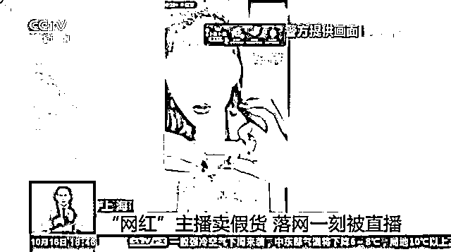
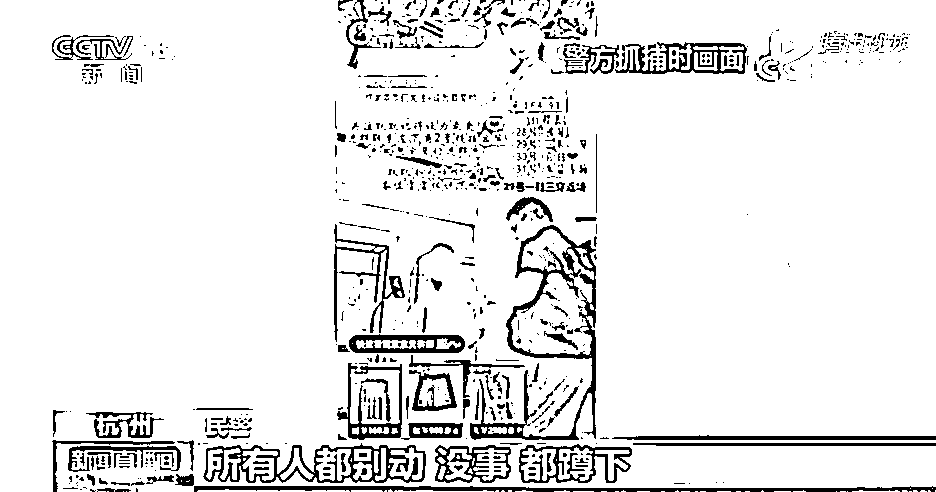
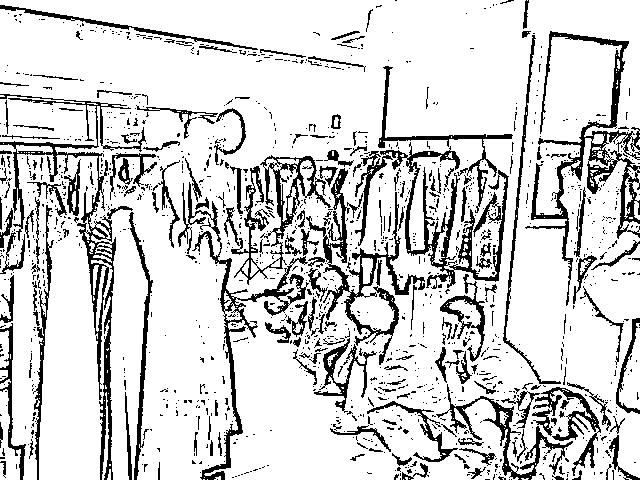
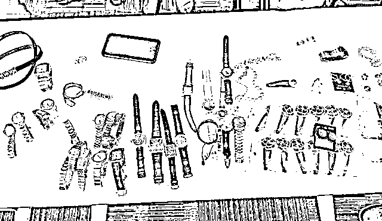
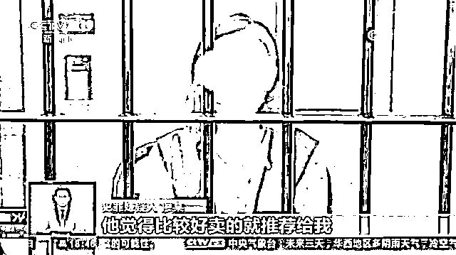
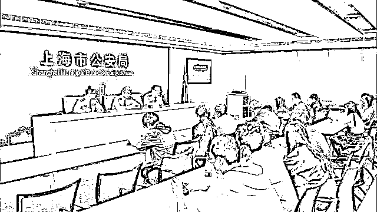

# 纪实 / 年收入上千万的“网红”直播中突然被警察带走

> 原文：[`mp.weixin.qq.com/s?__biz=MzIyMDYwMTk0Mw==&mid=2247503166&idx=3&sn=d393280a1e50955b9e131da844abfaca&chksm=97cb0606a0bc8f10c30d329cbf5d1ee5daf3cb2005c74e90a5b602ef18aa05f94fdb7db5fad4&scene=27#wechat_redirect`](http://mp.weixin.qq.com/s?__biz=MzIyMDYwMTk0Mw==&mid=2247503166&idx=3&sn=d393280a1e50955b9e131da844abfaca&chksm=97cb0606a0bc8f10c30d329cbf5d1ee5daf3cb2005c74e90a5b602ef18aa05f94fdb7db5fad4&scene=27#wechat_redirect)

点击蓝字“**灰产圈**”关注我们！

“网红”主播直播卖货很多人都不陌生。

日前在上海，年收入上千万元的头部主播廖某，怎么也没想到，原本是直播卖货，却把自己被警方抓获的过程全都直播了出去。 

发生了什么事？ 

**“网红”直播**

**售卖大牌假货套路多**

今年 6 月，上海虹口警方接到报案称，有“网红”主播在某电商平台直播间内销售假冒该企业品牌的服饰。经过初步调查，警方锁定这名“网红”主播正是廖某。警方关注这名“网红”主播的直播间，发现其存在知假售假嫌疑。 

据办案民警介绍，这些商品有着某些奢侈品的专有设计和图案标识，但在直播中，**廖某不会提及这些商品的品牌名称，而是用一些具有极强指向性的奢侈品品牌或款式的代号进行介绍。**

展示时，**商品商标会贴上胶带，**商品链接的图片上还会作相应的处理。而这些商品出售的价格是正品店内的几十甚至几百分之一，显然是挂着奢侈品标签的假冒商品。 

警方在调查过程中还发现，为了逃避监管和追查，直播结束后，廖某的直播团队会删除所有涉及假冒产品的购买链接、回看视频等。 

在为期 2 个月的侦查过程中，警方已经将其所有涉嫌售假的直播活动录制了下来。 

**数万粉丝傻眼，**

**镜头前被带走！**

8 月 28 日下午，廖某正在杭州某服装公司直播间内，频繁试穿各类女装产品，数以万计的粉丝正在通过网络围观这场直播。 

然而，让粉丝们意外的是，**前一秒廖某还在试穿产品，下一秒镜头里却走进了一群便衣警察，直播戛然而止。**

[`v.qq.com/iframe/preview.html?width=500&height=375&auto=0&vid=b31615yzb7y`](https://v.qq.com/iframe/preview.html?width=500&height=375&auto=0&vid=b31615yzb7y)

同时，警方在浙江多地抓获售假犯罪团伙 5 个，查处窝点 8 处，当场缴获假冒多个奢侈品牌的箱包、服饰等各类商品 3000 余件。 

             

**“网红”主播**

**场均销售额突破 7 位数**

到案后廖某交代，她于 2017 年签约经纪公司成为带货主播。由于有从事平面模特的职业经历，廖某凭借其独到的直播风格和穿搭技巧，短短三年积聚了百万粉丝，成为一名“头部主播”。 

据统计，**廖某直播间场均观看人数在 20 万以上，场均销售额突破 7 位数，**因此她成为了不少商家想要合作的对象。

廖某交代，**其年收入上千万元，直播中她并不会关心自己带的货是真是假。**

             

据警方介绍，廖某作为一名主播，是售假环节中的传播者，而实际货源是由不法商家提供的。警方侦查发现，与廖某合作的上百个商家中，涉嫌销售假冒奢侈品的有近 30 家。**造假商家会支付高额出场费找廖某带货，然后再根据销售额给廖某团队提成。**

目前，本案中已有 41 名嫌疑人被批准逮捕，警方还在进一步追查曾与廖某合作并存在售假嫌疑的商家。 

**8800 余个**

**违规主播账号已被封**

今年以来，上海警方围绕主播实名、直播内容和直播行为等，强化规范管理。目前，**已累计注销未实名认证主播 4200 余人，封禁违规主播账号 8800 余个。**

警方表示，下一步将持续开展网络直播平台安全检查，对未落实网络安全管理制度的企业进行约谈查处和督促整改，同时，严厉打击网络直播中的违法犯罪活动，构建本市良好的网络直播生态。 

             来源：央视新闻

← 向右滑动与灰产圈互动交流 →

