# 富三代名媛隆胸去世后，我去深挖了整形黑产链

> 原文：[`mp.weixin.qq.com/s?__biz=MzIyMDYwMTk0Mw==&mid=2247503279&idx=1&sn=d6a18accb68c66b2366f1a4a5e596142&chksm=97cb0697a0bc8f810ace98e1a697c64da1c8b0db55159f91db361cf06bbae7ce3996a5fb2286&scene=27#wechat_redirect`](http://mp.weixin.qq.com/s?__biz=MzIyMDYwMTk0Mw==&mid=2247503279&idx=1&sn=d6a18accb68c66b2366f1a4a5e596142&chksm=97cb0697a0bc8f810ace98e1a697c64da1c8b0db55159f91db361cf06bbae7ce3996a5fb2286&scene=27#wechat_redirect)

点击蓝字“**灰产圈**”关注我们！

钢丝上的美丽，危险又迷人

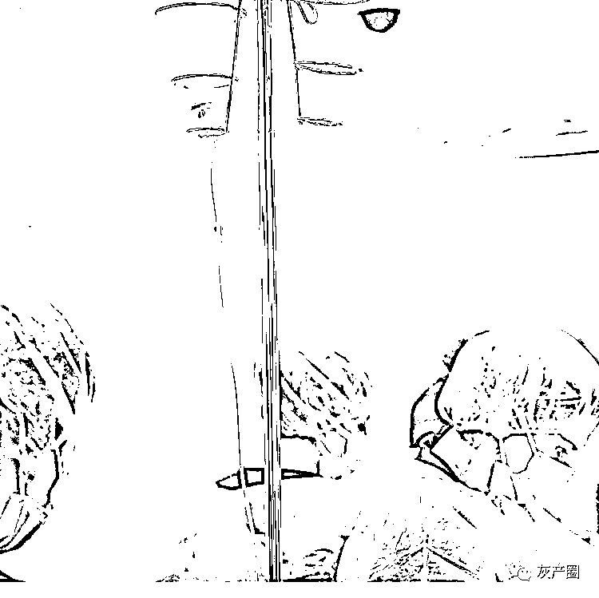

 01 

你身边有做过整形的人吗？

今年 1 月，某知名服装品牌创始人的孙女在中介的帮助下，赴韩国进行抽脂和隆胸手术，不幸身亡，终年 34 岁。

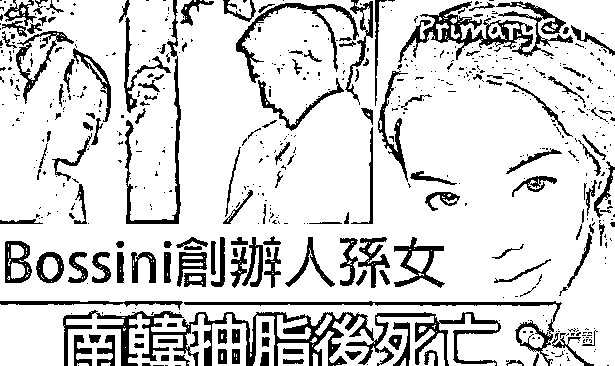

据她的丈夫所说，手术过程中，她突然感到剧烈疼痛，抽搐不停，主刀医生连忙注射了 2 针镇静剂。

不料，她因药物感染导致缺氧，脸色苍白，嘴唇发紫。

医生立刻把她送去医院，但 1 个小时后，还是抢救无效身亡。

她才 34 岁，家里还有 2 个可爱的孩子，可她再也看不到了。

前几天，韩国 MBC 电视台援引警方报告称，这是一次严重医疗过失：

过量注射镇静剂使其体内的丙泊酚超标而引发的并发症。

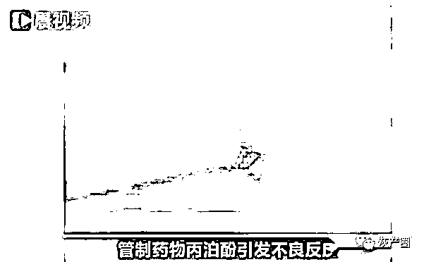

从警方公布的细节中，我们大概能看出一点猫腻：

手术同意书是院方自己随意签的、术前没有做药物测试、现场没有专业的麻醉医生。

看到这则新闻，我倒吸一口凉气。

富三代名媛，为求美错信中介，误入黑诊所。

**原本以为一觉醒来就能看到更“完美”的自己，可却永远没了未来。**

翻阅资料，我发现这不是个例。

今年 5 月，在上海工作的张雨花了 40 万到韩国做颧骨缩小手术，导致嘴巴畸形、面部神经受损，可能永远无法复原。

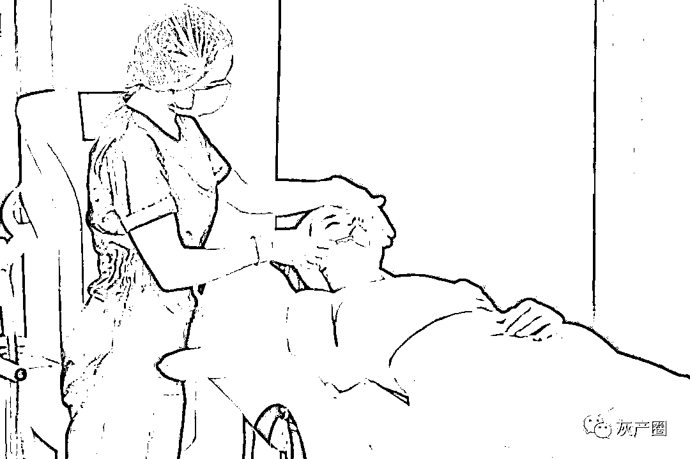

她多次致电韩国整形医院的海外部，对方却对她使“拖字诀”，因为按照韩国法律，一年内不对医院提起诉讼，过时无效。

**维权几乎不可能；**

王小姐为了让自己变漂亮一点，在中介的帮助下赴韩整容，结果全部失败。

转过头，中介带着 33 万的中介费，消失了。

2018 年，赴韩进行美容整形的外国人约有 14 万人，其中，中国人大约有 10 万，占了 71.43%。

**越来越多的中国女性，迷失在韩国整形的骗局里。**

韩国整形，靠谱吗？

让人趋之向往的韩国整形业，到底有什么吸引之处，又藏着多少猫腻？ 

 02 

韩国是世界上整容人口比例最高的国家，每 1000 名韩国人中就有 13.5 人接受过整容手术。

**韩剧中的精致面孔以及剧里制造的美好幻想，让人几乎忘了失败的可能性。**

但由于越来越多外国人到韩国整形，在潮水般涌来的需求面前，各大医院选择把利润放在首位，铤而走险，许多不合格的医院、中介和医生也浮出水面。

韩国整形行业有个非常恐怖的词语：“幽灵手术”。

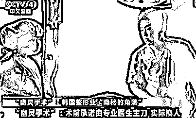

意思是，给你做手术的不是当初承诺的医生，而是安排了许多新手医生，把你当做练手的试验品给你做手术。

这些新手医生，对自己都没有勇气。

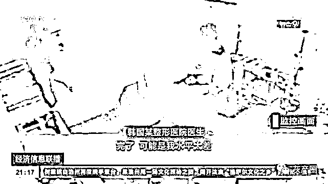

有记者联系上一个两年前赴韩整容失败的中国女孩。

她会一点韩语，事前也做过功课，纠结很久才在朋友的介绍下去韩国做埋线双眼皮。

手术失败后，她恍然大悟：所谓的朋友是医院的托，把她“卖给了医院”，她成了实验品，整容医院让医生换手，给实习医生操作的机会。

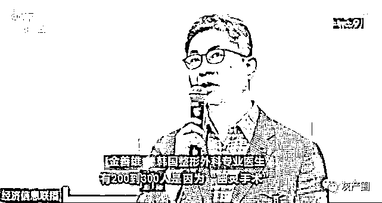

整形行业本质是消费型医疗，由于存在大量利益诱导，消费者和医院之间的信息差，往往比传统医疗更大。

正是这些信息差，加上高利润返点，各种中介如营销号、网红、美容院老板娘和所谓的亲戚朋友，会用尽办法来忽悠你，趁机打劫。

**带着被韩剧植入的幻想前来的国人们拆下手术绷带，才发现看到的不是事先承诺好的精致面容，而是发生在自己身上的失败案例。**

从此，人生中最大的考验，变成了每天醒来后，如何说服镜中那张陌生的脸属于自己。

韩国整形，也许没有想象中那般美好。

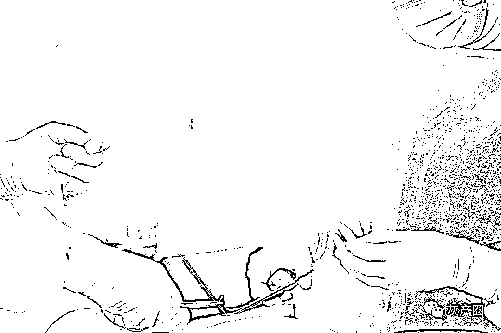

 03 

国人迷恋韩国整形，引得不少中国美容机构动歪念，开始打“韩国整形医生”的主意。

你一定见过这样的广告：

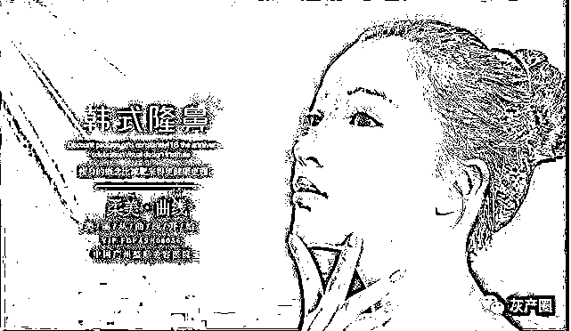

（ 图来源网络 ）

“医生是从韩国请来的，拥有极高的专业资质”
“韩国整形医生 有口碑的整形医院”

但这些医生是真的吗？

未必。

截至 2018 年，我国的外籍整形医生九成没有执业资格。（数据来源：中国新闻周刊）

许多医美机构挂着“外国医生”的招牌，随便找个韩国人，又或者让员工去韩国培训 2 个月，回来也被称为“韩国医生”。

目前，我国合法合规开展医美项目的机构仅占行业 12%，全国有超过 80,000 家医美机构在非法开展医疗美容项目。

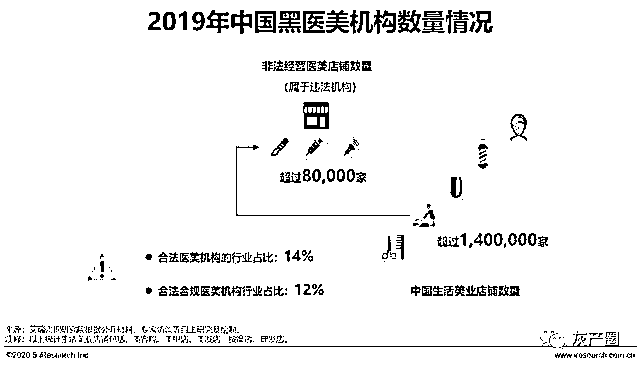

其中，医美非法从业者有十万以上，合法医师仅占行业 28%。（数据来源：艾瑞咨询）

**在看不见的地方，藏着你意想不到的黑色产业链。**

所谓的专业医生，可能是假的。

新京报记者曾经暗访某私人整形工作室。

（ 新京报：暗访微整形视频截图 ）

店主向培训的学员称，无需任何从医资质，只要交 6800 元，培训三五天后即可上岗，甚至自己开工作室接单。

（ 新京报：暗访微整形视频截图 ）

学那么几天就行了吗？

店主告诉记者，随时可以找她复训：

“理论也教，实操也会教，你们可以互相自己练实操。”

一位学员建议记者：

“学会了要回去练。给妈妈打打，给姐姐打打，打上三个你就啥都会了。”

而这样的培训班，她已经开了 7 到 8 年，数不清带过多少学员。

（ 新京报：暗访微整形视频截图 ）

**说实话，穿上白大褂都可以自称医生，给你打针做手术的到底是人是鬼，你真的不知道。**

可就算这样，依然有很多人为了美，做医美手术。

新氧对外发布的《2019 医美行业白皮书》显示，医美开始走向低龄化。

90 后催热了医美行业，医美消费者平均年龄 24.45 岁。

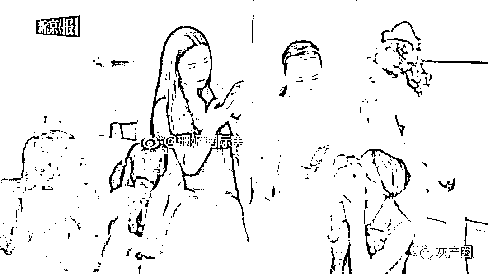

90 后社会经验少，普遍积蓄不多，但又有着较强的分期消费冲动，很容易被“医美贷”瞄准。

无良商家先以“免费整容”噱头先将客户吸引“入网”，甚至说可以推荐你去当模特。

然后安排“一对一”面诊咨询，过程中他们会竭尽所能指出你面貌或身材上存在的不足，帮你设计出“不得不做，做了更漂亮的”整形项目。

**被一个外人严肃地指出你外貌上的不足，还给你改变的建议，这换作哪个女孩都容易动摇。**

当你开始咨询费用，你就入坑了。

他们会查看你手机各个借贷平台可贷额度，“摸清底细”，再根据额度向你报价。

通常，这个报价会是市场 3 倍-4 倍，甚至更多！

最后“手把手教学”，诱骗你签订各种协议约定，利用你的征信申请贷款，缴纳整形费用。

**中介和美容机构“强强联手”，已经是医美贷一个公开的秘密了。**

只是在美丽的包装下，爱美心切的女孩们难以抵挡诱惑。

**最终等待她们的，可能是深渊。**

 04 

在纪录片《亚洲无间道：爱美的代价》中，浙江女孩微微讲述了自己赴韩整容失败的经历：

曾经是模特的她，对自己的外表有着严苛的要求。

在网上看了一些韩国整形的资料后，她决定赴韩整容。

但让她没想到的是，手术彻底失败：嘴巴凹进、下半脸短小、切齿无法咬合，只能吃软质半流食。

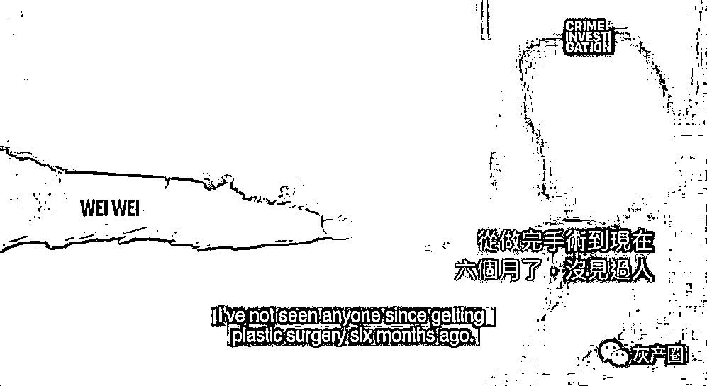

如今，她正准备说服丈夫卖房，让她重新找医生做修复手术，即使再也回不到之前的模样。

整个采访在光线昏暗的房间里进行，微微全程只愿意以模糊的背影示人。

画面里唯一亮色的，是微微女儿的简笔画，贴在玻璃窗上。

**这些稚嫩的画作，仿佛暗示着这个空荡房间里曾经有过的幸福。**

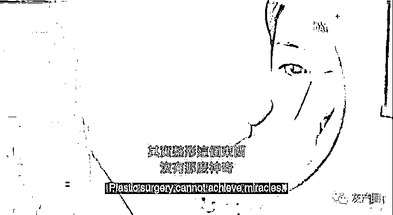

我不知道这个家未来会走向何处，但当看到昔日温馨的踪影在黑暗中闪过，微微会不会有一丝后悔？

**每个人都有追求美的权利，但整形有太多坑，动手前一定要对整形机构有充分的了解，千万不要乱信中介。**

*   看清楚医美机构的《医疗机构执业许可证》和诊疗范围

*   医生的《医师资格证》《医师执业证》

*   主诊医生资质

*   护士《护士执业证书》和药物

*   医疗器械的批件、中文说明书 

等等......

**整形有风险，下刀请谨慎。**

不要等到整容变毁容，只能在窗帘后、黑暗中度日才来后悔。

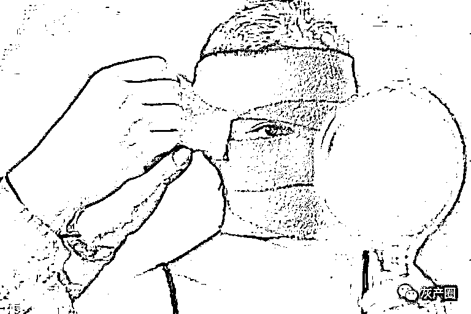

资料来源：

①腾讯大浙网：《花了 9.5 万元的整容成毁容！主刀韩国医生根本不是医疗从业人员》

②中国新闻周刊：《医美乱象：国内的外国整形医生，九成没有执业资格》

③艾瑞咨询：《2020 年中国医疗美容行业洞察白皮书》

④新京报：《暗访微整形 “零基础培训三五天可接单”》

⑤人民网：《韩国曝幽灵整容 黑中介坑你没商量》

⑥前瞻经济学人：《2020 年全球美容整形行业发展现状分析：国人成韩国整形业最大消费群体》 

来源：极物来了   

← 向右滑动与灰产圈互动交流 →

