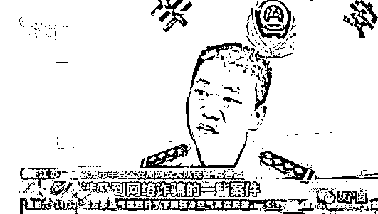

# 养了 2 亿个 QQ 号供骗子选用，这个平台被端了！

> 原文：[`mp.weixin.qq.com/s?__biz=MzIyMDYwMTk0Mw==&mid=2247503279&idx=2&sn=30176b3adc42750c7d83b6bce28ac71f&chksm=97cb0697a0bc8f81218eaaf3d4690a0089688f04cc09be37c7695b725ce28353ce449b2c2247&scene=27#wechat_redirect`](http://mp.weixin.qq.com/s?__biz=MzIyMDYwMTk0Mw==&mid=2247503279&idx=2&sn=30176b3adc42750c7d83b6bce28ac71f&chksm=97cb0697a0bc8f81218eaaf3d4690a0089688f04cc09be37c7695b725ce28353ce449b2c2247&scene=27#wechat_redirect)

点击蓝字“**灰产圈**”关注我们！

对于网络诈骗的犯罪分子来说 

除了非实名的电话卡和银行卡之外

非实名的微信号和 QQ 号

也是他们实施犯罪的主要工具

而这些号码在一些所谓的养号平台上

就可以轻松买到

近期

在公安部“净网 2020”集群战役中

**江苏徐州警方就捣毁了一个**

**为网络诈骗、赌博等犯罪**

**提供即时通信工具“养号”、交易的**

**特大黑产平台**

**抓获犯罪嫌疑人 84 名**

**串并各类网络诈骗案件 1300 多起**

**涉案金额 5000 多万元**

**抓获嫌疑人 84 名**

**涉案金额 5000 余万元**

去年年底，徐州市民韩先生的 QQ 上收到了一个女网友主动添加好友的申请，这名女网友自称姓徐，是福建厦门人。

受害人韩先生表示，**“当时她加我的时候，我看一下她资料比较完整，而且 QQ 等级还比我高，所以我就通过了。”**

**女网友推荐赚钱平台**

**点击轻松赚取 1500 元**

随着聊天的深入，二人很快从陌生到熟悉，并逐渐以男女朋友的口吻进行聊天。半个月后的一天，徐女士发来了一个平台二维码，说可以在上面赚钱。**韩先生扫描登录这个平台后，转账充值了 1000 元，很快赚了 49 元，并且顺利提现。**

**第二天韩先生又充值了 2 万元，赚了 1499 元，两次操作轻松就赚到了 1500 多元，这让韩先生彻底放松了警惕。**

**屡次提现失败**

**受害人被网友拉黑**

在徐女士的引导下，韩先生当天又充值了 6 万元，没多久平台账户里显示赚了 15000 多元，然而这一次韩先生在提现时却遇到了麻烦。

**韩先生 受害人：**

> 后台提示我说是提现失败，我就联系她，她说这次需要充值 10 万块钱才能提现。我就感觉我是被她骗了，我又多次提现都是失败，我再联系她，她就不怎么回我，最后把我拉黑，我就报警了。

**多起网络犯罪案件中 **

**QQ 号来自同一客户端**

徐州警方接到报警后，对自称徐女士的 QQ 号进行了调查，发现这个号码来自一个叫小果平台的客户端，而所谓女网友徐女士的身份也是虚假的。随着调查的深入，警方发现有多起网络犯罪案件中的 QQ 号都来自小果平台客户端。

**徐州市公安局网安支队伍大队副大队长 王善翌：**

> 这个平台就是一个养号平台，主要提供给号商对他们掌握的 QQ 号进行批量管理，这个平台上绑定了大量的 QQ，都是没有经过实名认证，这就为犯罪嫌疑人使用 QQ 来进行违法犯罪活动提供了便利。

**绑定非实名 QQ 号 2 亿多个 **

**涉案 1300 多起**

警方侦查后发现，**小果平台绑定的 QQ 号有 2 亿多个，而且还发现，在全国 1300 多起网络诈骗案件中，犯罪分子使用的 QQ 号都是来自这个平台。**那么，小果平台为什么会有这么多 QQ 号？这些 QQ 号码都是怎么获取的呢？

号商手里有大量的 QQ 号码，为了对这些 QQ 号码控制和使用，他们需要绑定大量的手机卡。小果平台上的卡商拥有大量的手机卡，号商把这些 QQ 号码批量绑定到小果平台上卡商的手机卡上，卡商通过购买猫池、卡池和物联网卡，租用场地建立猫池窝点，通过小果平台的客户端软件接入小果平台，远程对手机卡进行批量的操作。

**QQ 号可随意买卖 **

**价格从几元到上万元不等**

警方侦查发现，**小果平台就像一个 QQ 号的电商中介平台，平台客户端具备对 QQ 号进行批量解绑、换绑、找回密码、解冻等 120 项功能。同时，在小果平台上的 QQ 号可以随意买卖，而且根据 QQ 号的等级不同，价格从几元到上万元不等。**

**徐州市丰县公安局网安大队民警 常善路：**

> 涉及到网络诈骗的一些案件，包括有冒充好友的、冒充企业老板的、办理什么信用卡的，退税的，理财类的诈骗，冒充公检法司的购物诈骗，还有刷单类的诈骗交友的，诈骗涉及的金额统计下来超过 5000 万元。

**涉案平台绑定手机号 600 余万个**

警方经进一步侦查发现，**在小果平台上注册的卡商、QQ 号商会员共计 14 万余名，绑定手机号 600 余万个，QQ 号 2 亿多个，可以说是目前国内最大的 QQ 养号平台。**

警方通过小果平台的服务器地址，**成功锁定了 20 多名主要犯罪嫌疑人。**

**徐州市丰县公安局网安大队民警 焦国庆：**

> 小果平台推广网站的服务器是在香港，然后我们通过服务器维护的日志发现犯罪嫌疑人是在湖北，我们就到湖北通过地面工作，明确了犯罪嫌疑人刘某和李某，然后他们两个是共同合作的关系。

**平台成犯罪帮凶 **

**半年非法获利近 3000 万元**

据了解，小果平台是刘某松 2016 年创办的，刚开始主要做游戏代练，由于没有赚到钱，刘某松就开始做起了养号业务，通过收取号商的充值费和各种手续费，仅 2019 年半年多的时间，刘某松等人就非法获利近 3000 万元。

**警方多地收网 **

**扣押手机卡超百万张**

今年 6 月中旬，徐州警方抽调警力 100 余人赶赴湖北、河南、山东等地，对小果平台运营团队、部分 QQ 号商、手机卡商以及发卡平台相关嫌疑人进行集中收网抓捕。

警方抓获了小果平台两名合伙人刘某松和李某，捣毁相关卡商、号商窝点，扣押电脑 50 余台，手机 100 余部，卡池、猫池设备 5000 余台，手机卡 100 余万张。

**犯罪嫌疑人 刘某松：**

> 我们大概自己做了两年多时间，到 2018 年底 2019 年的时候，那个时候在网上买了一些别人做的一些东西，买了以后把它集成在一起，这样的话用户面就越来越广了，然后就往上面增加了一些功能，比如说绑手机换手机，或者找密码，这一类的功能。这些东西做完了以后，客户量大了以后自己就搞不过来了。

随着平台功能增多和用户量的逐渐扩大，2019 年 10 月份刘某松就找到了李某来共同运营管理小果平台，刘某松负责整个平台的技术支撑，李某负责平台的运营，二人按比例进行分成。

办案民警介绍，小果平台自去年 10 月份开始业务量非常庞大，半年多时间刘某松和李某就非法获利近 3000 万元。

目前，**徐州警方正会同全国各地公安网安部门对小果平台涉及的卡商、号商等犯罪嫌疑人实施抓捕，已经到案 50 多人，案件还在进一步侦办中。**

来源：光明日报

← 向右滑动与灰产圈互动交流 →

