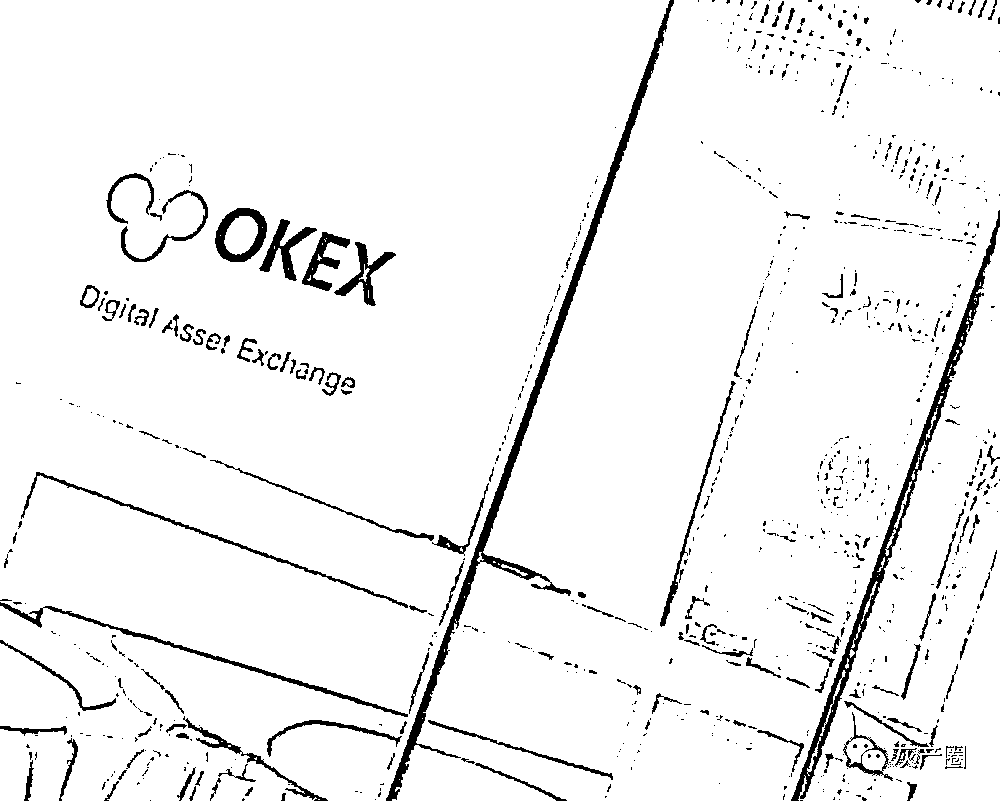
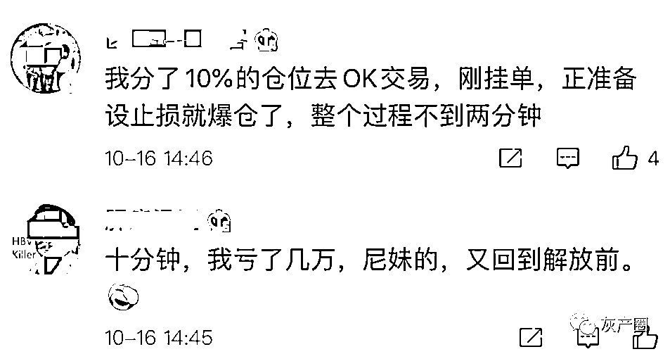
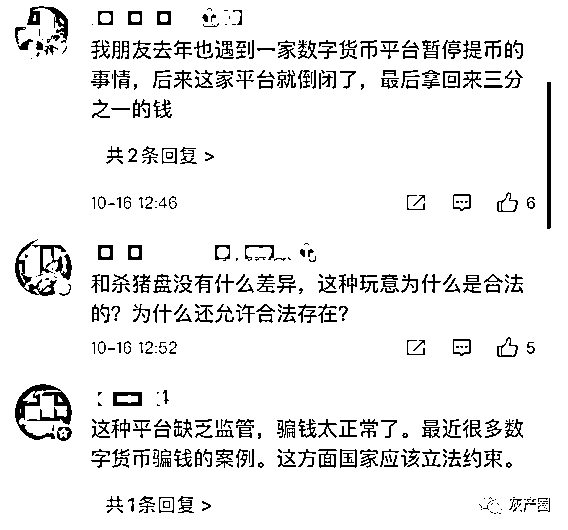
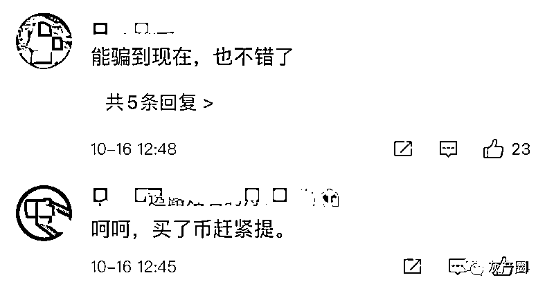
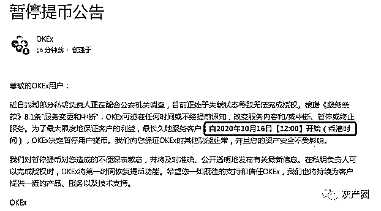
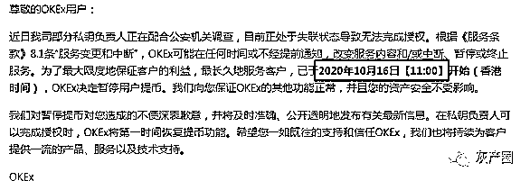
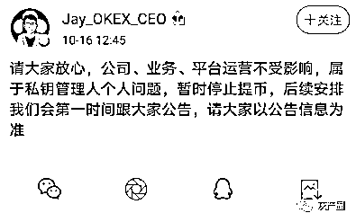
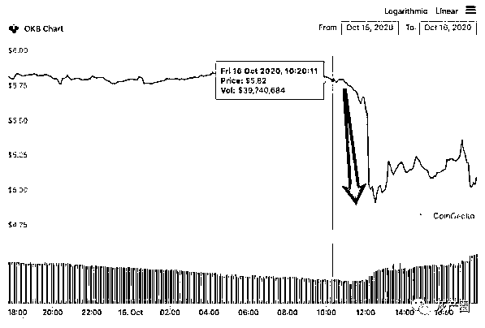
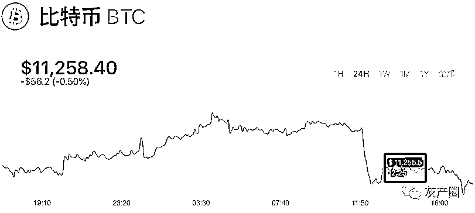

# 币圈惊雷！徐明星被警方带走！OKEx 交易所暂停提币！

> 原文：[`mp.weixin.qq.com/s?__biz=MzIyMDYwMTk0Mw==&mid=2247503279&idx=3&sn=ce7ff2261a85cbe8e88f1c4769059899&chksm=97cb0697a0bc8f819654a1b8863950a243d18ab90dfd46a9236f0cfbb3d93172f0b44251e9a1&scene=27#wechat_redirect`](http://mp.weixin.qq.com/s?__biz=MzIyMDYwMTk0Mw==&mid=2247503279&idx=3&sn=ce7ff2261a85cbe8e88f1c4769059899&chksm=97cb0697a0bc8f819654a1b8863950a243d18ab90dfd46a9236f0cfbb3d93172f0b44251e9a1&scene=27#wechat_redirect)

点击蓝字“**灰产圈**”关注我们！

10 月 16 日，一则“数字货币交易平台 OKEx 暂停用户提币”消息震动币圈，受此消息影响，OKB 暴跌超 17%，主流数字货币也全线下跌，BTC 一度跌破 11200 USDT。

还没等投资者回过神来，晚间又曝出 OKEx 创始人徐明星一周前已经被警方带走配合调查。对此消息，OKEx 方面表示，暂时不清楚，以上市公司公告为准。无法透露中国警方调查的性质, 调查无关洗钱或交易所本身,且将尽快恢复全部服务。

由于 OKEx 暂停用户提币，一些投资者因此遭受亏损，甚至爆仓。还有人认为，此等操作和“杀猪盘”无异。

***OKEx 暂停用户提币创始人被曝已被警方带走***

10 月 16 日早间，OKEx 发布公告称，因近日 OKEx 部分私钥负责人正在配合公安机关调查，目前正处于失联状态导致无法完成授权。因此，OKEx 将于 10 月 16 日 15:00 开始暂停用户提币。

然而之后不知为何，OKEx 官网暂停用户提币时间一改再改，不断提前。当基金君登陆 OKEx 官网发现，OKEx 暂停用户提币时间改为自 2020 年 10 月 16 日【12:00】开始。

OKEx 公告称，根据《服务条款》8.1 条“服务变更和中断”，OKEx 可能在任何时间或不经提前通知，改变服务内容和/或中断、暂停或终止服务。为了最大限度地保证客户的利益，最长久地服务客户，自 2020 年 10 月 16 日【12:00】开始（香港时间），OKEx 决定暂停用户提币。我们向您保证 OKEx 的其他功能正常，并且您的资产安全不受影响。

OKEx 称，对暂停提币对您造成的不便深表歉意，并将及时准确、公开透明地发布有关最新信息。在私钥负责人可以完成授权时，OKEx 将第一时间恢复提币功能。

不过，当再次刷新 OKEx 官网，OKEx 的公告已经改为，“2020 年 10 月 16 日【11:00】开始暂停用户提币”。

随后，OKEx 数字资产交易平台 CEO Jay Hao 在其个人微博中称，公司、业务、平台运营不受影响，属于私钥管理个人问题，暂时停止提币。

受此消息影响，OKB 价格短时暴跌超 17%，一度从 5.82USDT 跌至 4.8USDT。截止发稿，OKB 报价 5USDT。

同时主流数字货币全线下跌，BTC 也跌破 11200 USDT 一线。

晚间据财新报道，有两位接近 OKEx 的消息人士表示，公告中“配合公安机关调查”的正是 OKEx 的创始人徐明星。其中一位人士还表示，徐明星至少一周前已经被警方带走，多日未在工作大群中现身。

对此消息，OKex 方面表示，无法透露中国警方调查的性质, 调查无关洗钱或交易所本身, 将尽快恢复全部服务。

早在 2018 年 9 月，徐明星就曾被传出被带入派出所协助调查涉嫌数字货币欺诈警情。后来，徐明星在其朋友圈回应，不信谣，不传谣，共创美好区块链舆论环境。

据公司官网显示，OKEx 是境外数字资产交易平台，2017 年 5 月成立，支持 30 多种法币通过多种支付方式购买比特币、以太坊、USDT 等数字货币。2018 年 7 月 2 日，OKEx 注册地由伯利兹迁至马耳他。OKEx 曾是国内三大数字货币交易所之一，其余两家分别为火币和币安。OKEx 网站披露的联系信息均位于中国境外，公司地址位于马来西亚吉隆坡，但客服电话号码属于加拿大。

***什么是私钥？私钥负责人是做什么的？***

根据 OKEx 发布公告称，近日该公司部分私钥负责人正在配合公安机关调查，目前正处于失联状态导致无法完成授权。

那么什么是私钥？私钥负责人是做什么的？

公开资料显示，私钥是相对于公钥而言的，公开的密钥叫公钥，只有自己知道的叫私钥，如果用公钥对数据进行加密，需用对应的私钥才能解密。

此外，虚拟货币存放的钱包也分为冷钱包和热钱包，冷钱包也叫离线钱包，热钱包则需保持联网上线，冷钱包会比热钱包更安全。

一位业内人士接受澎湃新闻采访时表示，交易所的热钱包，就相当于一个资金池，但是这个池子里的钱，是不多的，因为交易所为了资产安全（不被盗走），大部分资产都是在冷钱包里存着的。正常来讲，热钱包没币了，私钥持有者可以打开冷钱包去取出来一部分，放到热钱包里。这样交易所里面，大家可以进行正常的充币和提币，就是可以进出的。“如果没有冷钱包私钥的管理人打开冷钱包，那么热钱包里的钱，是可以被提完的，“就是币圈的‘挤兑’”。

“私钥负责人实际上是交易所上资产的保管人和实际控制者。”他说。

不过，该业内人士也表示，大家对 OKEx 的风险误判很高，因为担心钱出不来，平台会出问题，就短期疯狂卖出代表对 OKEx 信心的 OKB。

**专家：加大监管 警惕币圈跑路潮**

据了解，OKex 曾对外公开比特币冷钱包技术方案。该方案为多重签名方案，即所有冷钱包比特币分散在多个私钥存储，且每个私钥的使用需要两个人双重授权才能打开；私钥的双重授权有异国备份，即使出现自然灾害，也不会发生丢币；私钥有一个授权保存在银行保险柜，即使掌握人被绑架，也无法被迫获取比特币。

目前暂不清楚 OKex 私钥的多重签名数量，但多位业内人士分析称，此次私钥无法完成完整授权，大概率不只是一个人行动不便，或有多人“失联”。

另有业内人士向界面新闻直接透露，此事牵扯达三人，疑似涉及 OTC（场外交易）洗钱，或间接使得用户资金流出中心化交易所。

自 2017 年 9 月央行发布《关于防范代币发行融资风险的公告》后，境内数字货币交易所纷纷关停或将业务转移至国外。然而，国内数字货币交易所却一直存在，且时常发生跑路关闭的现象。

去年 7 月，数字货币交易所币创（Btron）发布公告称，自 2019 年 7 月 11 日起将停止服务，并称请用户在 2019 年 7 月 31 日 24:00（UTC+8）前提走在其交易所的全部资产，并表示 100%准备金刚性兑付。在此之后，币创的服务器将关停。

业内人士认为，从金融稳定的角度来说，对交易所加大监管，有利维护金融秩序稳定。对于链圈的从业者而言，由于大量资本流入交易所，在商人逐利影响下，币圈时常发生跑路关闭现象，为了规范市场，有关部门加强交易所监管很有必要性。

来源：中国基金报

← 向右滑动与灰产圈互动交流 →

