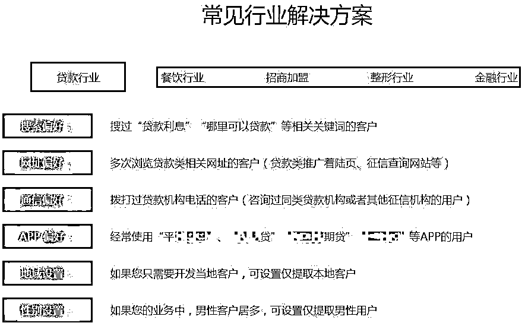

# 为何陌生人比你还了解自己？

> 原文：[`mp.weixin.qq.com/s?__biz=MzIyMDYwMTk0Mw==&mid=2247503379&idx=1&sn=9978f55c848454c47f4eb5781b893b78&chksm=97cb052ba0bc8c3dcc07576d28807db1049e1445b1300fbfe532a29593f498de2d0f86728be3&scene=27#wechat_redirect`](http://mp.weixin.qq.com/s?__biz=MzIyMDYwMTk0Mw==&mid=2247503379&idx=1&sn=9978f55c848454c47f4eb5781b893b78&chksm=97cb052ba0bc8c3dcc07576d28807db1049e1445b1300fbfe532a29593f498de2d0f86728be3&scene=27#wechat_redirect)

点击蓝字“**灰产圈**”关注我们！

垃圾短信源源不断骚扰电话接二连三**对方本是陌生人****却对自己的信息了如指掌**不用怀疑，这就是个人信息泄露了

  随着网络技术发展，信息贩卖形势日益严峻。近日新闻爆出，某知名相亲网站帐号被倒卖，六千余人信息遭泄露，买卖公民信息，**有的用于产品推销业务，有的用于实施精准诈骗。**尽管我们都注重隐私，但有时却容易忽视一些场景，导致隐私泄露，以至招来推销电话，甚至是诈骗，那我们的信息是如何泄露的呢？

* * *

01 

**“资源方向你定，质量我们来做”****黑市交易的个人信息包含姓名、手机号码、身份证号、银行卡号等，即俗称的四件套，**此外还有行踪、住宿、通信、交易等信息，这些隐私的泄露大致有三个原因。
1 盗取信息的网络骗局**这主要是个人原因**。比如在线下登记手机号、**提供信息让他人调查**、租******卖个人帐号，遭遇免费送、网络兼职诈骗**等，都容易导致信息泄露。

2 多行业的贩卖链**这主要是源于企业内鬼**。近日江苏警方破获了一起公民信息倒卖案，涉及家装业、房产中介业、地产开发业等多个行业。行业内鬼造成的信息泄露往往是灾难性的，他们甚至还整合了常见行业解决方案。

以贷款举例，**当你刚查了征信或浏览了贷款网页，很快就有人打电话询问你是否贷款**，这是为什么？其中的门道，你细品。3 网络爬虫自动抓取**黑客利用安全漏洞盗取信息。**一般是通过木马病毒或钓鱼程序，以及自动抓取脚本，即俗称的**网络爬虫**，其抓取网络信息的目的性和高效性令人咋舌，从腾讯 110 已处置的案例分析，黑产团伙善于根据买家需求，精确抓取用户信息。

在他们的抓取模型里，只要你提供需求，就可以精准建模，所谓“**资源方向你定，质量我们来做**”，对一些急需客户的人来说，是很有吸引力的。

* * *

02 

**个人隐私明码标价**信息一旦泄露，很快就会传播到黑产网交易，即所谓“暗网”，**普通网民无法通过常规手段搜索访问，需要使用一些特定的软件、配置才能登录**。

（图片来自网络 ）

**不法分子常以安装软件收费，**通过虚假定位链接，盗取受害人信息。常见的还有查**开房记录、追踪定位**等，这对于部分正受情伤的人来说，很容易上当受骗。

面对明码标价的信息交易，大家一定要保持警惕，保护好自己的隐私，切勿通过网络查询个人信息，**所谓“精准查询”，往往都是以此为噱头实施诈骗。**

* * *

03 

**信息泄露后患无穷****信息泄露有着严重的安全隐患，轻则接到骚扰电话，重则遭受财产损失，甚至威胁到人身安全。**比如在裸聊诈骗中，骗子发来**钓鱼链接，轻易就套取了受害人通讯录**，再以公开裸聊视频威胁转账，这不仅是骗财，还会给受害人带来巨大的精神压力。近日警方还破获一起非法侵犯公民信息案，某行外包人员利用职务之便，倒卖贷款信息，查询并售卖个人征信报告，事发后最终被判刑。此外，网上信息贩卖往往都还伴随着诈骗，交易时，他们会**以删除文件的名义要保证金、保密费**等，这些都是信息贩卖诈骗的常见套路。我们明白了信息如何泄露，以及泄露后的危害，那怎么做才能有效防止信息泄露呢？

*   **不轻易点击陌生链接或网站，不给网络爬虫抓取信息的机会；**

*   **网络上不轻易透露个人信息，尤其是遇到免费送、刷单时要保持警惕；**

*   **切勿租卖帐号，或在不正规网站批量投递简历，帐号和简历都包含了大量个人信息。**

* * *

网络不是法外之地，也不是避罪天堂，根据相关法律法规，出售公民信息将被判刑。

**国家相关法律规定**

**《刑法》第二百五十三条：违反国家有关规定，向他人出售或者提供公民个人信息，情节严重的，处三年以下有期徒刑或者拘役，并处或者单处罚金；情节特别严重的，处三年以上七年以下有期徒刑，并处罚金。****《网络安全法》第四十四条****：****任何个人和组织不得窃取或者以其他非法方式获取个人信息，不得非法出售或者非法向他人提供个人信息。**

**腾讯 110 对信息贩卖行为始终保持“零容忍”态度，一经核实，绝不姑息。**

最后也提醒广大用户，要加强信息保护意识，如果遇到贩卖个人信息，可及时向当地公安报警，并使用小程序举报。

来源：腾讯 110 作者：鹅探长

← 向右滑动与灰产圈互动交流 →

