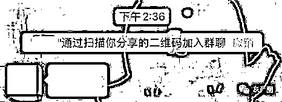
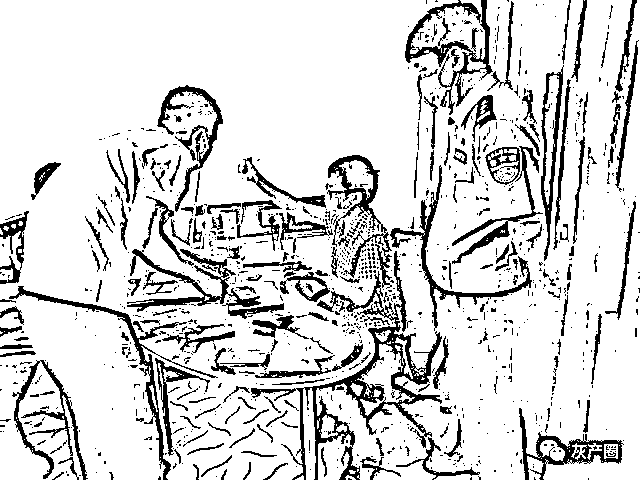
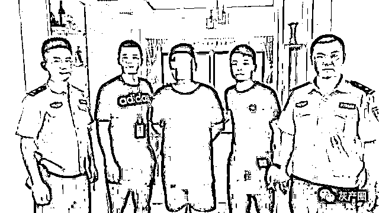
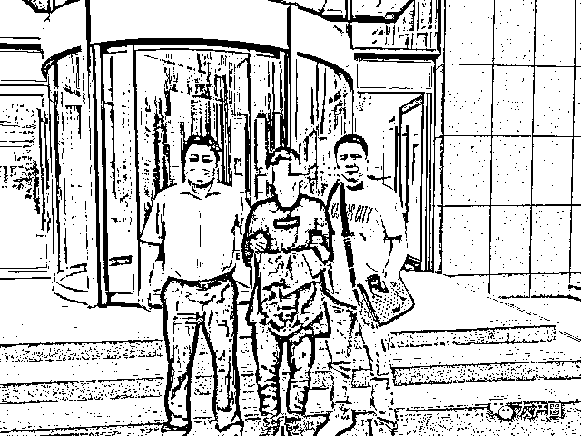
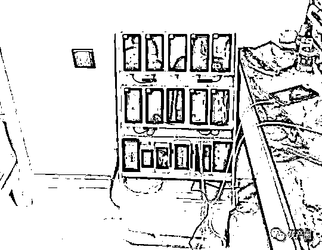
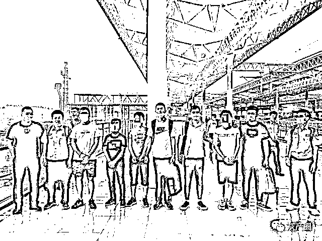
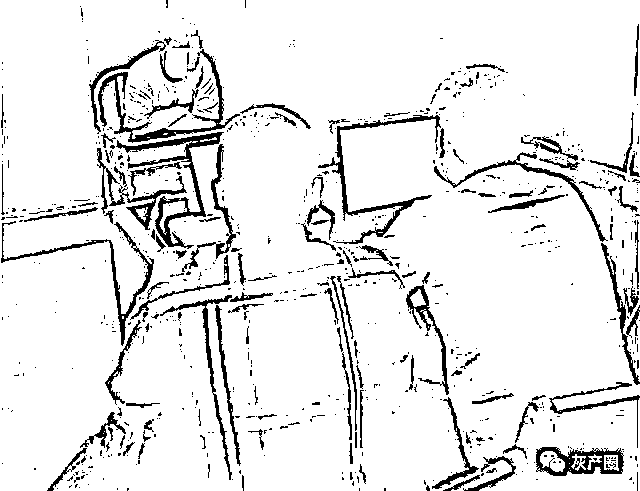

# 别再扫“清粉二维码”了！

> 原文：[`mp.weixin.qq.com/s?__biz=MzIyMDYwMTk0Mw==&mid=2247503379&idx=2&sn=174b4d798dba612ef9385d5006ebefb4&chksm=97cb052ba0bc8c3d25cb786bc01635b7684087117051626d85966caba00ca62212ff3f8ededc&scene=27#wechat_redirect`](http://mp.weixin.qq.com/s?__biz=MzIyMDYwMTk0Mw==&mid=2247503379&idx=2&sn=174b4d798dba612ef9385d5006ebefb4&chksm=97cb052ba0bc8c3d25cb786bc01635b7684087117051626d85966caba00ca62212ff3f8ededc&scene=27#wechat_redirect)

点击蓝字“**灰产圈**”关注我们！

导语

不知道大家有没有遇到过这样的情况：某个微信群突然有陌生人通过扫描自己分享的二维码加群，然后发布各种违规小广告狂轰乱炸。

但是自己根本没有分享过群二维码，到底是怎么泄露的？

据微信安全中心消息，出现这种状况的微信用户有一个共同点：**他们基本都使用过市面上“清理僵尸粉”的服务。**

部分用户为图省事和方便会使用这种“清粉”服务来清理久不联系的好友，殊不知此类服务中暗藏重大安全风险，严重时还会导致重要个人隐私信息泄露、遭受网络诈骗等。

日前，在温州市局网安支队的指导下，经 3 个多月的缜密侦查，温州苍南警方分别在北京、山东、福建、湖北等地展开抓捕行动，成功侦破一起开发微信“清粉”软件的非法控制计算机信息系统案件，一举拿下了以肖某为首的网络黑产犯罪团伙，初步查明涉案金额达 800 余万元，到案 16 人。

**“清粉”程序 暗藏重大风险**

“系统正在检测删除我的人，勿回”“清粉请见谅”“关注公众号可免费检测”……朋友圈里是否有人给你发过这样的清粉信息，或者自己也用过这样的“清粉服务”？

据说在微信通讯录群发这类软件程序，便能将那些拉黑或删除你的好友一一筛选出来，不少微信用户都用过这样的“好友清理服务”来控制自己的微信好友人数。简单方便就能清理，而且还免费，对微信用户而言简直是一大利好消息。

然而天下没有免费的午餐，今年年初，网友黄女士在使用“清粉”服务后，很快发现微信中有大量陌生人向其提出添加好友的请求，还莫名关注了许多微信公众号，甚至还有人仿造其微信账号添加他的亲属试图骗取财物，对其生活造成严重影响。黄女士怀疑自己的个人信息已被“清粉”软件盗取。

细思极恐！该类情况引起苍南警方高度关注，莫非该类“清粉”服务中暗藏玄机？

今年 2 月，苍南县公安局网安大队对此类“清粉”程序进行深入分析，发现此类程序有别于一般微信外挂“插件”，嫌疑人通过计算机技术开发出与微信相兼容的“云端”程序进行非法牟利。

简单地说，不法团伙通过这些所谓的“清粉”程序诱骗用户授权登录后，通过“云端程序”非法获取微信通讯录，批量关注、阅读、点赞等。一旦有用户因为想要清粉被诱骗在他们的软件中进行了扫码授权登录，他的微信帐号就成为了“傀儡”，在用户不知情的状态下，会主动关注大量微信公众号并进行点赞、转发、收藏，更可怕的是你的个人信息数据、好友信息将会流向不法分子，极易滋生出网络盗窃、诈骗等违法犯罪。

**抽丝剥茧 揭开“高新”企业面纱**

今年 5 月初，苍南警方成功锁定了一个专门开发制作清粉软件的犯罪团伙，对该案展开调查时，困难重重。

首先这是一家 “高新”企业，该犯罪团伙由专业技术人员组成，所有成员包括公司会计都通晓计算机技术，掌握最前沿的网络技术，4 名核心技术人员均为计算机系毕业，长期从事编程工作，整个团队技术实力处于行业第一梯队，作案手段专业性极强。他们为需求方提供定制服务，共制作并售出 20 余款清粉软件。

除了计算机技术，老板肖某以不整合涉及转账功能的业务，游走在灰色地带，以逃避法律处罚。并且肖某自作聪明把服务器架设于境外，就此以为万无一失。

今年 6 月初，苍南警方理清犯罪团伙脉络后，在北京等 7 省市开展统一抓捕行动，一举拿下了以肖某为首的网络黑产犯罪团伙。

“ 该犯罪团伙开发的清粉软件在行业内具有一定的‘技术’领先性，具有方便操作、危害大、被害人感知小、传播范围广的特点，扫码即能操作，扫码后在用户不知情情况下会发送好友清粉二维码广告，并发布朋友圈，而用户难以发觉。截止被抓获前，该公司已为其他公司定制开发 20 余款清粉软件，可以说是利用清粉软件获取信息犯罪的源头。”该案办案人员介绍。

**85 后北大高材生 竟是幕后主谋**

令人唏嘘的是，该案为首的肖某是一名 85 后，北京大学计算机硕士，在深圳有车有房。从北京大学毕业后，他先后在多家知名互联网公司工作过，年薪将近百万，但肖某最后还是选择辞职开公司创业，可他的公司没有开发高新技术，却干起了黑灰产业，最终把自己送入了班房。

肖某妻子也是研究生学历，还留过学，夫妻俩还有个可爱的儿子，也许如今对他来说，一家人安分守己，平平淡淡的过日子才是最幸福的事。

截止目前，该案 16 名主要涉案犯罪嫌疑人均已到案，并被苍南警方以采取刑事强制措施。

来源：浙江省公安厅

← 向右滑动与灰产圈互动交流 →

