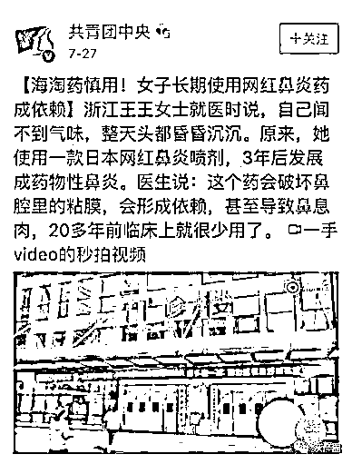

# 神药变毒药！暴利催生黑色产业链，每年捞金上亿元……

> 原文：[`mp.weixin.qq.com/s?__biz=MzIyMDYwMTk0Mw==&mid=2247503379&idx=3&sn=bccbe9c84e992f43b059d5539f17db33&chksm=97cb052ba0bc8c3dfeae40bbed2229fe520589170dbc8282f9a9660505f56fed5fe302e7571c&scene=27#wechat_redirect`](http://mp.weixin.qq.com/s?__biz=MzIyMDYwMTk0Mw==&mid=2247503379&idx=3&sn=bccbe9c84e992f43b059d5539f17db33&chksm=97cb052ba0bc8c3dfeae40bbed2229fe520589170dbc8282f9a9660505f56fed5fe302e7571c&scene=27#wechat_redirect)

点击蓝字“**灰产圈**”关注我们！

“代购的胆子实在太大了，什么都敢卖，有些处方药是明令禁止通过网络销售的。”一位国内三甲医院就职的药师表示。

加拿大鱼肝油、日本止痛药、德国咳嗽水……朋友圈的代购化身药神，小到生发液、眼药水，大到救心丹、降压药等，只有想不到，没有买不到。

但是你敢想吗？你以为的“神丹妙药”，也许是隐性假药，甚至是毒品。

01、海淘“神药”，真能治病吗？

我国药品管理法规定：“药品进口，须经国务院药品监督管理部门组织审查，经审查确认符合质量标准，安全有效的，方可批准进口，反之，则按假药论处。”

然而，在庞大的市场需求下，还是有人选择铤而走险，钻法律的空子牟取利益。

如果说真的有效也就罢了，但可怕的是有些药不仅没有用，而且还有害。

***案例一：***

2019 那年初《新京报》报道了一则新闻，一名妈妈看到女儿艰苦备战高考，心疼女儿，于是打算去找点“偏方”。

这位妈妈悄悄购买了一瓶“聪明药”给女儿，并告诉女儿：“这是聪明药，吃了成绩会变好，你试试。”殊不知将女儿推进了毒品的深渊，因为她给女儿吃的根本不是聪明药，而是打着“聪明药”旗号的摇头丸。

***案例二：***

2019 年 7 月，上海一名小伙子，因为平时工作压力大，还要准备很多考试，所以通过淘宝购买印度“神药”，希望可以提神。

但实际上所谓的“神药“是我国一类精神管制药物阿莫达非尼。

***案例三：***

2019 年，白领小陈代购了日本网红眼药水，使用一两天后眼睛干涩症状有所缓解，但一个星期后，眼睛突然出现了视觉模糊症状，被诊断为角膜溃疡，如果再去医院晚些，很可能会演变为青光眼。

***案例四：***

2018 年，浙江王女士去医院就诊时，发现自己发展成了药物性鼻炎，罪魁祸首居然是自己代购的日本“NAZAL 鼻炎水”。

这种喷剂里含有大量羟甲唑啉、萘甲唑啉或麻黄碱等鼻黏膜收缩剂，属于临时性的应急药物，连续使用不能超过一周，否则会引起反跳性充血或鼻息肉，需要终身用药。

***案例五：***

2020 年 8 月，上海市禁毒办曝光了一例特殊的“走私贩毒案”，就是泰国 DC 减肥药，有人因吃了这种减肥药患上了甲状腺功能亢进症；有人因吃了它肾衰竭致抢救无效，家庭支离破碎；几乎所有人吃这种药的人都有不同程度的心悸、头痛、狂躁、厌食等后遗症。

这些惨痛的教训，鲜活的例子摆在还有很多，外国的月亮并不比国内圆，国外的产品未必就有效。

“虽然海淘代购的药品有些并非假劣药，但海淘不是药剂师，对药品剂量、疗效及禁忌人群等注意事项一无所知，这样做等同于人体小白鼠实验。”一位药师说。

02、乱象丛生，暴利催生黑色产业链

**海淘药有多赚钱？**

马克思说过：“如果有 50%的利润，它就敢铤而走险；有 10%的利润，它就敢践踏一切人间法律；有 300%的利润，它就敢犯任何罪行，甚至绞首的危险。”

某药品代购网站显示，100 片左甲状腺素钠片售价约为 191 元，而成分相似的优甲乐在国内电商平台的售价仅为 28 元/100 片。

有网友服用 DC 减肥药，花了 6000 块钱，耗时一个半月，瘦了 18 斤，随后患上重度精神疾病，又花了将近 10 万，进行神经递质调控手术。

靠着信息不对称赚差价，一些代购轻轻松松月入过万。

还有一些网红海淘药，打着不同版本不同组合等虚张声势的“障眼法”，有的甚至是成本几毛钱的果蔬颗粒，你一位正规医院开药，其实都是代购人员自己随意加的，一个疗程 20 天，售价就要 1500-2500 元不等。

2019 那年 3 月，浙江丽水警方破获一起制假售假泰国减肥药恶性案件，窝点位于一处老式出租房内，从外观上看，防伪标签、干燥剂等该有的都有，但胶囊内掺杂着的却是泻药、面粉和一些劣质西药，短短两年就获利超 5000 万元（一粒假药成本不足 2 块）。

2019 年 8 月，广州市公安机关在广州、汕头、江门三地同步开展联合行动，破获一起特大假药案，查获假冒“万艾可”“西力式”约 200 万粒，靠着贴标“洋马甲”，疯狂敛财 5 亿元。

光所不及的地方，总有黑暗恣意蔓延，所谓“海淘神药”背后的产业暴利，你想不到。

03、结语

医药是人命关天的大事，专业人士在选择治疗手段上都十分谨慎，更何况压根没有医师资格的代购？

利欲足以熏心，与其指望代购们良心发现，黑色产业链悬崖勒马，不如保持自身的理性与客观，毕竟生命是我们自己的。

不要忘了：代购不能包治百病，我们的生命，容不得一次侥幸。

参考资料：

《神药变毒品，每年捞金上亿元：海淘“网红药”毁人不倦》 快刀财经

《海淘族注意，国外处方药切勿轻易找代购！》 江门禁毒

← 向右滑动与灰产圈互动交流 →

