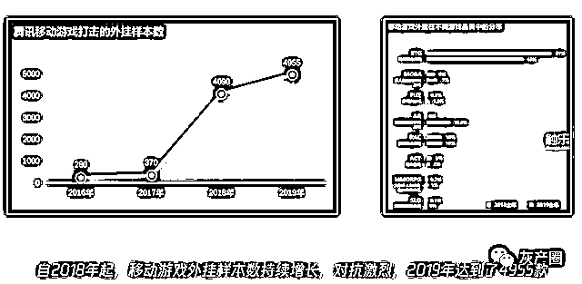
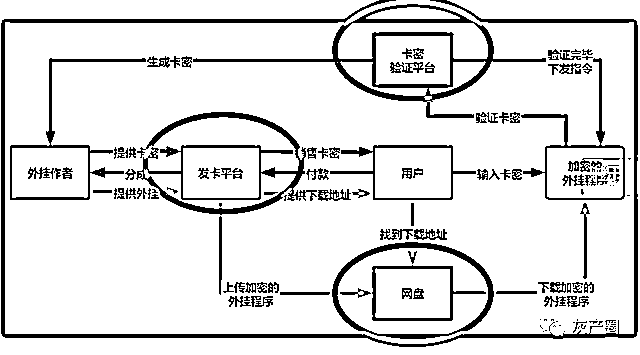
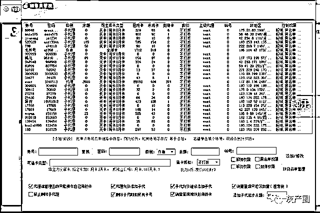
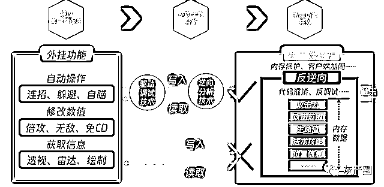

# 产业化、工业化、全球化：游戏外挂的黑色产业链

> 原文：[`mp.weixin.qq.com/s?__biz=MzIyMDYwMTk0Mw==&mid=2247503379&idx=4&sn=a702fd8ab98a3a71a7d043669621fe2d&chksm=97cb052ba0bc8c3dbea069f77411d3b768f60307a0bef334836c10e131ab80a8afa6ca5a6682&scene=27#wechat_redirect`](http://mp.weixin.qq.com/s?__biz=MzIyMDYwMTk0Mw==&mid=2247503379&idx=4&sn=a702fd8ab98a3a71a7d043669621fe2d&chksm=97cb052ba0bc8c3dbea069f77411d3b768f60307a0bef334836c10e131ab80a8afa6ca5a6682&scene=27#wechat_redirect)

点击蓝字“**灰产圈**”关注我们！

2019 年 6 月，张家港警方与腾讯的安全团队合作，破获了一起通过聚合外挂平台“叉叉助手”非法牟利的案件。这一平台主要活跃在移动端，相关团队不仅建立了开发者平台，招募大量外挂开发者进行统一管理、开发，而且集成了外挂的下载、代币支付、手游开挂必备的 root、免越狱功能，首创功能化、生态化聚合的外挂平台运营模式。

这条前所未见的“黑色产业链”自然带来了暴利。经过缜密侦查，警方抓获平台的开发者以及相关的外挂作者 70 余人，查获各类外挂样本 60 万个，涉案资金整体超过 1 亿元。这几乎可以说是外挂制售所能达到的终极形态。

持续增长的移动游戏外挂数量

在昨天（9 月 1 日）举办的媒体沙龙上，腾讯游戏与公安部门的相关办案人员一同披露了外挂制售这一黑色供给链的产业结构——用产业结构或产业链来形容外挂制售这一见不得光的行当或许显得有些夸张，但事实正是如此。

成熟的分销体系

“目前最为流行的外挂分销模式就是卡密模式。”来自腾讯守护者计划安全团队的杜勇在会议中分享，“（平台）通过将外挂使用权转为卡密文本的方式进行分销，再通过固定的地址下载外挂程序，使用外挂时利用网络验证平台进行鉴别和时长控制。”

杜勇认为，这种模式极大提高了外挂的分发效率，同时便于隐藏开发者及其上级代理的身份。在这个过程中，发卡平台、卡密验证平台和网盘三类网络平台是必经节点。

为了规避法律风险和网络爬虫的抓取，游戏外挂的发卡平台往往不会直愣愣地用“外挂”来称呼自己。相反，它们会使用类似“卡盟”这样的代号作为网站的公开名字，在商品的展示页面也往往使用谐音式的暗语。这类网站由于在网上有公开的源码，所以能够模块化搭建和复制，便于进行外挂交易。平台一般不直接制作外挂，主要起销售渠道的作用，从中抽成 3%～5%获利。

***成熟的外挂分销体系***

在发卡平台交易后，外挂制作者会通过特制的网盘发货，还会在卡密验证平台上进行加密验证。卡密验证平台一方面提供软件加密方案，对软件进行加密，保证开发者的利益。另一方面提供网络服务器进行卡密鉴别。在目前国内以免费为主的互联网商业模式下，卡密验证平台被大量使用于游戏外挂的验证。外挂作者将自己的作品加密挂到发卡平台上，用户从网盘下载软件后再从发卡平台购买使用权和时长，再到卡密验证平台进行解密。

除了各种平台自身的存在，无孔不入的外挂广告也为外挂制售推波助澜。软件类的产品通常需要更好的宣传才能更好推广分发，外挂产品也不例外。然而，尽管警方不断对外挂的制售行为进行打击，大量的网站、论坛、社区仍然公开为外挂进行广告引流，为外挂产业链上下游提供潜在客源，从而赚取中间费用。铺天盖地的广告使得外挂的制售人员和购买外挂的玩家能够快速获得外挂信息，进一步加剧了游戏外挂的泛滥。

卡密验证平台页面

***工业化生产***

除了搭建得相当成熟的分销平台，外挂制售团队还会自行建立开发者社群，吸引大量外挂开发者参与到游戏外挂的开发中，提供开发支持：从框架、函数库到统一管理的脚本，甚至还有一个相当成熟的收益分成机制。

对此，杜勇认为，资深外挂专家掌握的知识体系类似于安全人员，涉猎的领域非常广泛，对每个领域的纵向深度非常熟悉。而且很多内容不是通过书本可以获得的，需要长期试错和试验的过程，完整能够掌握外挂的开发技能至少需要 3～6 年的大量练习才能掌握。

外挂功能实现原理

但是，由于开源社群的存在，大量关键的核心技术被工具化，变得易于上手。各类社区论坛中存在着大量开发工具、调试工具、修改器等等，这些都使得普通的外挂作者可以跳过基础知识的学习和练习，只需要学习了大致原理，用好专业工具，就能实现外挂的基本功能。就好比培养一个汽车工程师需要的时间非常长，但培养一个在流水线上装配汽车的工人却花不了多少时间。

这使得外挂的开发越发工业流程化。在外挂开发过程中，最主要的技术门槛就在于驱动调试技术和逆向分析技术，也就是绕过基本安全保护和寻找关键数据位置的技术。然而在一些技术达人开发出的调试工具及破解器的帮助下，国内的外挂开发者建立起了专门的论坛，不仅分享相关技术知识和各种外挂源码，而且对接上下游产业的需求。这就使得外挂开发者不再需要从零开始造一辆汽车，只需要把各种现成的配件组装起来。外挂的开发门槛因此大大降低。

流水线生产

***困难与挑战***

在分享的过程中，来自泰州警方的郭警官特别谈到，目前公安机关和司法机关在打击外挂犯罪上存在两方面的困难。

一是司法实践上存在争议。由于执法部门的人员大多是法律专业出身，缺少精通计算机的技术人员，在面对外挂这样的新型技术犯罪时往往显得经验不足。同样地，作为互联网发展过程中诞生的新生事物，游戏外挂的法律定义也存在争议。对于外挂所造成的损失，也很难有比较精确严格的计算方式。

二是取证难度较大，这一点同样是由于执法部门人员往往缺少游戏外挂相关的技术知识。目前对于涉及到游戏外挂的案件，并没有一个统一的取证标准。在没有统一标准的情况下，外挂自身也在不断迭代，对不同版本的认定也是一大难题。

湖北警方抓获外挂制售犯罪嫌疑人

此外，杜勇还提到，目前外挂制售产业已经呈现出了全球化的特征。国外开发的外挂软件会被“搬运”到国内论坛和社区，提供源源不断的新技术。许多国外的外挂作者会将自己的作品放到国内出售，而国内的外挂作者也会在一些平台的帮助下“出口”自己的作品。另外，市面上还存在着全球化销售的外挂软件，如 Hanbot、Sharp Shooter 等。

制售外挂属于违法犯罪行为，但在巨额收益的诱惑下，仍有不少人投身其中。随着游戏的发展，安保技术的升级，乃至利润空间的提升，游戏外挂的制售早就脱离了许多人想象中“掌握技术的孤胆黑客挑战大公司”式的形态，走向产业化的团队运作。对于游戏公司来说，如何应对快速迭代的外挂，维护游戏环境，已经成为需要整个行业联合应对的问题。

来源：触乐

← 向右滑动与灰产圈互动交流 →

# 原文：[`mp.weixin.qq.com/s?__biz=MzIyMDYwMTk0Mw==&mid=2247503427&idx=1&sn=241036968f57050fe602d7d09cfbd37e&chksm=97cb057ba0bc8c6dae521042b595dfd35bbb261a9e20b9693e890afafda1d822b95b82d03f66&scene=27#wechat_redirect`](http://mp.weixin.qq.com/s?__biz=MzIyMDYwMTk0Mw==&mid=2247503427&idx=1&sn=241036968f57050fe602d7d09cfbd37e&chksm=97cb057ba0bc8c6dae521042b595dfd35bbb261a9e20b9693e890afafda1d822b95b82d03f66&scene=27#wechat_redirect)