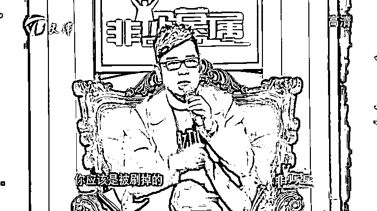

# 疑圈钱跑路？这家拥有 1100 个校区的教培机构总部人去楼空！

> 原文：[`mp.weixin.qq.com/s?__biz=MzIyMDYwMTk0Mw==&mid=2247503427&idx=2&sn=84177ba5df1d3f8c039226f91ab2fbcc&chksm=97cb057ba0bc8c6ded1ff3dd79c515bf7340f14f966e8e997f7c1af07f6891dd48667acc21b9&scene=27#wechat_redirect`](http://mp.weixin.qq.com/s?__biz=MzIyMDYwMTk0Mw==&mid=2247503427&idx=2&sn=84177ba5df1d3f8c039226f91ab2fbcc&chksm=97cb057ba0bc8c6ded1ff3dd79c515bf7340f14f966e8e997f7c1af07f6891dd48667acc21b9&scene=27#wechat_redirect)

点击蓝字“**灰产圈**”关注我们！

## 老牌教育机构北京优胜教育竟然暴雷了！

**最近**<h-char unicode="ff0c">**，**</h-char>**国内陆续有媒体报道**<h-char unicode="ff0c">**，**</h-char>**当地的优胜教育校区频频突然停课**<h-char unicode="ff0c">**，**</h-char>**学生家长退费困难重重**<h-char unicode="3002">**。**</h-char>昨日，优胜教育北京总部所在的光华路 SOHO，被人群包围得水泄不通！数百名家长和几十名优胜教育员工围堵优胜教育北京总部，要求退款和讨薪！

**不过就在 10 月 17 日，优胜教育官方还在发表声明：**优胜教育没有破产，请那些不怀好意，别有用心之人停止你不雅的行为和语言，会用法律武器维护自己合法权益。

仅隔两日，画风突变，优胜教育到底是出了什么问题？是否早有预料？

01

## **优胜教育多地分校区纷纷被曝跑路**

## 近期，据多方媒体报道称，优胜教育北京、上海、天津、成都、重庆、哈尔滨等**多地校区出现闭店、负责人跑路、拖欠员工工资、消费者退费难等一系列问题。**

## 据辽沈晚报报道，在国庆后的第一个工作日，沈阳市浑南区恒达路的优胜教育分校区便大门紧闭，只留下门前的数十名按约定时间赶来上课的家长。

            

**据媒体了解，超 200 位家长的预交学费没有返还，据家长表示，预交学费在数千元至万元不等。**此外媒体的报道中还提到，“家长表示‘优胜教育’北京总部已经获悉此事，近期将有工作人员来沈了解情况。”

同样一幕发生位于哈尔滨香坊区民生路 307 号的优胜教育。10 月 9 日，据新晚报消息，9 月，曾因线上转线下产生的学费问题，一位家长向北京总部客服投诉，客服人员告诉她，会有人处理此事，请耐心等电话。**但事隔一个月，该家长仍未接到北京客服总部的处理电话。**

图片来源：哈尔滨新闻网 

随之而来的便是优胜教育北京总部的人去楼空。

10 月 18 日，家长到优胜教育北京总部办理学费退费时，其总部已经人去楼空，只剩下桌椅板凳堆叠在一起。

据界面教育采访报道，相关家长代表表示： 

**“优胜教育一共欠我 107840 元。”**

**“其实在 11 月份，我就已经感觉到不太对劲。销售离职率高，教师的离职率也很高。”**

由于对其教学服务不满意，该家长在去年 12 月就已向优胜教育提出退款。对方回应称，退款需要六个月的时间。今年新冠疫情爆发，后者又以没有复课、老师在家教学、财务没有回京等各种理由拖欠退费、拒不见面。

尽管优胜教育信誉度逐日降低，但这种崩盘级别的“倒闭”对家长来说还是一夜之间的事情。

02

**拖欠工资、学费退费难**

## **六天前曾变更法人**

今年以来，优胜教育麻烦不断，拖欠工资、学费退费难等问题陆续曝光。近日，北京海淀市场监管局发布消费预警，曝光当地教育培训行业投诉率高的机构。**其中，优胜教育高居黑榜榜首，这已是该机构第三次上榜，投诉案件最多，解决率最低，仅有 3.63%。**

**在今年疫情期间，优胜教育 CEO 陈昊曾发布了一封高开道歉信《优胜教育创始人陈昊：恳表歉意，定克时艰!》，**信中表示，“在疫情改革的过程中，有些决策为了追求效率，从而欠缺细致和周到，尤其是近日个别加盟校区出现了一些拖欠员工工资的情况。”

“痛定思痛，究其原因还是我们对个别加盟商管控出现疏忽所致。时局突变，我们没有对存在经营隐患的加盟商进行重新评估，导致其预留资金不充分，从而产生出现大量退费问题后，处理不及时的现象，导致消费者和员工缺乏安全感，酿成负面情绪。”陈昊提道。

**但从目前的情况来看，优胜教育的问题丝毫未解决，并已经让企业彻底崩盘。**

**而就在 10 月 14 日，该公司原法定代表人，即优胜教育创始人陈昊退出，由唐芳琼接任，唐芳琼的职务也从此前的监事调整为经理、执行董事。**

另据天眼查 App 司法风险信息显示，目前，该公司有数十条法律诉讼，案由包括教育培训合同纠纷、劳动合同纠纷等。

03

** 曾试图对赌并购上市**

**卷入上市公司 5 亿“忽悠式重组”**

最引人注目的是，就在今年 5 月，A 股上市公司金洲慈航发布公告称：**已签署意向协议**<h-char unicode="ff0c"><h-inner>**，**</h-inner></h-char>**拟收购陈昊等交易对手持有的北京优胜腾飞信息技术有限公司**<h-char unicode="ff08"><h-inner>**（**</h-inner></h-char>**优胜辉煌母公司**<h-char unicode="ff09"><h-inner>**）**</h-inner></h-char>**100%股权**<h-char unicode="ff0c"><h-inner>**，**</h-inner></h-char>**对价不超过 5 亿元**<h-char unicode="3002"><h-inner>**。**</h-inner></h-char>

<h-char unicode="3002"><h-inner></h-inner></h-char>

据公开资料显示，金洲慈航是一家涵盖黄金饰品加工、融资租赁等业务的上市公司，旗下拥有知名金饰品牌金叶珠宝。据财报，2020 年第一季度公司营收 8.44 亿元，同比增长 43.41%，净亏损为 3.16 亿元。截至 2020 年 3 月 31 日，归属于上市公司股东的净资产为 6655 万元，较上年末减少 81.84%，经营活动产生的现金流量净额为-8.26 亿元。

而这次收购计划也披露了优胜教育的业绩情况，并不理想。数据显示，优胜腾飞 2017 年-2019 年，净利润分别为 3864 万元、5920 万元、5340 万元，同期净资产分别为-1.06 亿元、-4703 万元、637 万元。

<h-char unicode="3002"><h-inner>我们可以看到，**2018 年和 2019 年**<h-char unicode="ff0c">**，**</h-char>**公司连续巨亏**<h-char unicode="ff0c">**，**</h-char>**两年亏损超过 90 亿元**<h-char unicode="3002">**。**</h-char>**公司计划置出无力挽救的黄金和融资租赁业务**<h-char unicode="ff0c">**，**</h-char>**收购优胜教育**<h-char unicode="ff0c">**，**</h-char>**转型教育培训行业；优胜教育也已经负面缠身，可持续经营能力存疑。**</h-inner></h-char>

收购消息一出<h-char unicode="ff0c"><h-inner>，</h-inner></h-char>市场普遍质疑<h-char unicode="ff0c"><h-inner>，</h-inner></h-char>甚至被怀疑为忽悠式重组。

随后，深交所也火速下发关注函，要求<ai type="6" parm="{">*ST 金洲</ai>就业绩承诺实现、交易的商业合理性、支付方式合理性等方面进行解释。深交所甚至两次追问，公司和交易对手方是否存在“忽悠式重组”？

**到 6 月 9 日，**<ai type="6" parm="{">***ST 金洲**</ai>**在对深交所关注函的回复当中表示，公司收购优胜腾飞仅处于“意向阶段”。此后，**<ai type="6" parm="{">***ST 金洲**</ai>**再无有关优胜教育的公告内容。**

自今年 5 月以来<h-char unicode="ff0c">，</h-char>金洲慈航已发布 9 次公司存在中止上市风险公告，公司多名高管辞职<h-char unicode="3002">。</h-char>10 月 15 日<h-char unicode="ff0c">，</h-char>金洲慈航发布前三季度预告称<h-char unicode="ff0c">，</h-char>公司前三季度预计亏损达 20 亿元至 26 亿元<h-char unicode="ff0c">，</h-char>去年同期亏损 21.4 亿元。

04

## **老板曾上《非你莫属》 **

**目前已成立新公司**

优胜教育成立于 1999 年，2006 年建立教育研究院，据官网介绍，优胜教育旗下涵盖针对 6-18 岁人群的个性化教育培训项目“优胜 1 对 1”、素质教育培训项目“优胜派”以及家庭教育培训项目“优胜家”等。

据中国基金报整理，**优胜教育在 2018 年初便在全国拥有超 1100 家校区。**

在 10 月 14 日之前，公司的实控人和创始人是陈昊。

据官网介绍，陈昊 1978 年出生在北京的一个书香门第，其父亲母亲均是中科院研究员、教授，他本人毕业于对外经济贸易大学。 

**而让陈昊出圈的是，他曾上过求职节目《非你莫属》，是其中的大 BOSS。2014 年其还参与过《老板变形计》节目录制。**在电视节目中，陈昊个性张扬，以大胆敢言、喜欢怼人著称，谈问题往往一针见血，也因此受到不少观众的青睐。

**自 10 月 19 日优胜教育跑路信息被广泛报道至今，公司并未出面作任何形式的说明。**

另据天眼查，公司创始人陈昊还在谋求打造新的教育培训机构品牌。今年 1 月份<h-char unicode="ff0c"><h-inner>，</h-inner></h-char>泰州优胜牛师来了文化传播有限公司成立<h-char unicode="ff0c"><h-inner>，</h-inner></h-char>陈昊持股 99%<h-char unicode="ff0c"><h-inner>，</h-inner></h-char>注册资本 3000 万<h-char unicode="ff0c"><h-inner>，</h-inner></h-char>今年 4 月份<h-char unicode="ff0c"><h-inner>，</h-inner></h-char>天津海思科技有限公司成立<h-char unicode="ff0c"><h-inner>，</h-inner></h-char>**10 月 13 日**<h-char unicode="ff0c"><h-inner>**，**</h-inner></h-char>**泰州牛师来了教育科技有限公司成立**<h-char unicode="ff0c"><h-inner>**，**</h-inner></h-char>**注册资本 100 万元。**

综合自：界面、中国基金报、三言财经 来源：雪球网

← 向右滑动与灰产圈互动交流 →

