# 花 2 万元，就能去“联合国总部”上班？

> 原文：[`mp.weixin.qq.com/s?__biz=MzIyMDYwMTk0Mw==&mid=2247503427&idx=3&sn=2721da9bee67ab0245b741898ebac6e7&chksm=97cb057ba0bc8c6d49a8bfe60c03bf2b17add78d175dc742ceff20376aa6ad5b47dd548797ef&scene=27#wechat_redirect`](http://mp.weixin.qq.com/s?__biz=MzIyMDYwMTk0Mw==&mid=2247503427&idx=3&sn=2721da9bee67ab0245b741898ebac6e7&chksm=97cb057ba0bc8c6d49a8bfe60c03bf2b17add78d175dc742ceff20376aa6ad5b47dd548797ef&scene=27#wechat_redirect)

点击蓝字“**灰产圈**”关注我们！

前段时间，陕西省西安市新城区人民法院开庭审理了一起荒唐的诈骗案。本案中，被告人吴某自称是联合国主席，宣称他的公司拥有“联合国总部将搬迁至西安”等大项目，并且还虚构“解冻民族资产”，在网络和现实中大肆宣传，引诱不明真相的群众投资。

01

**陕西西安**

**男子以“联合国总部搬迁”为由进行诈骗**

[`mp.weixin.qq.com/mp/readtemplate?t=pages/video_player_tmpl&action=mpvideo&auto=0&vid=wxv_1568836374521249793`](https://mp.weixin.qq.com/mp/readtemplate?t=pages/video_player_tmpl&action=mpvideo&auto=0&vid=wxv_1568836374521249793)

△央视财经《正点财经》栏目视频  

**审判长**：联合国要搬迁至西安？你的依据是什么？ 

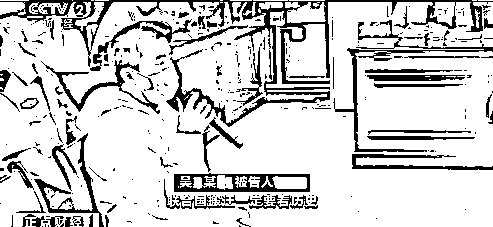

**被告人 吴某**：首先是选址，联合国搬迁一定要看历史，因为西安是古老的长安，它在历史上对世界各个国家都有非常大的影响，因此我决定联合国要搬迁至西安。我们有一个特殊系统，有权力决定联合国新址的走向。

本案的**被告人吴某自称联合国主席，声称联合国总部搬迁的计划对他来说只是小事一桩**，他的能力足以影响世界的每一个角落。有如此大能量的男子，又是如何站在被告席上的呢？

2019 年 5 月，西安警方接到报案，报案人小朱称，他的母亲邓某表示可以把他介绍到联合国总部上班。

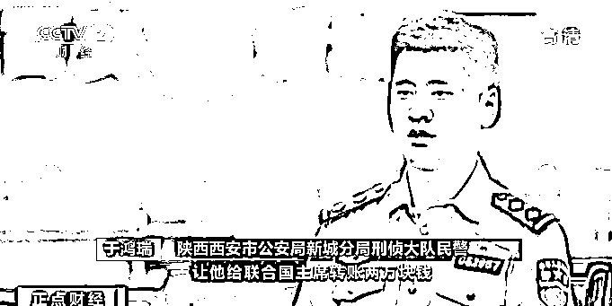

**陕西西安市公安局新城分局刑侦大队民警 于鸿瑞**：最近的一次是报案人母亲称， 给联合国主席转账两万元，可以让他立功，把他调到联合国总部上班。 

为了搞清楚其中的玄机，警方找到了邓某，征得邓某同意后，办案人员对其手机展开了调查，民警发现邓某手机的聊天记录里有大量的所谓工程计划书，手机里的人也似乎个个都不简单，

西安市公安局新城分局刑侦大队民警于鸿瑞称，邓某手机的聊天记录里面，有各种备注为首长、将军、政委的人。

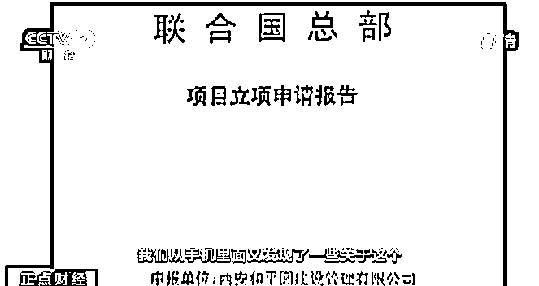

西安市公安局新城分局刑侦大队民警于鸿瑞称，从**手机里面还发现了一些关于联合国总部的项目规划的方案，独家承办方就是邓某所在的西安和平圆建设管理有限公司。 **

**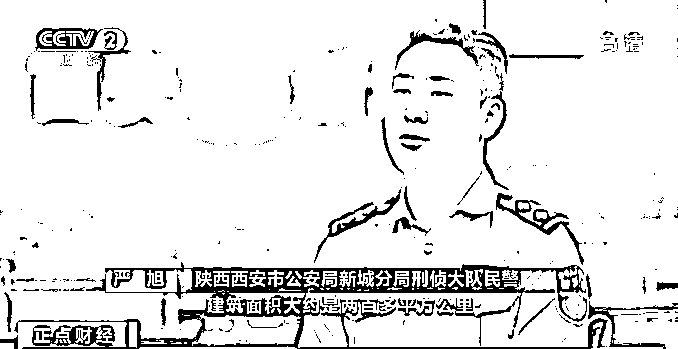**

****陕西西安市公安局新城分局刑侦大队民警 严旭**：他说是要从西安的永宁门一直要建设到秦岭北麓，建筑面积大约是两百多平方公里，投资金额说是六万亿美元。 **

**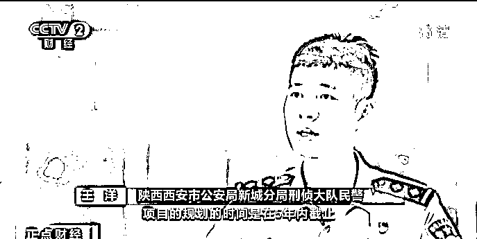**

****陕西西安市公安局新城分局刑侦大队民警 王洋**：项目的规划时间是在 5 年内截止，这样一个浩大的工程在 5 年内去实施完成，简直就是天方夜谭。** 

**在这个所谓的联合国搬迁项目中，和平圆公司计划将几百公里区域内的所有建筑物全部拆除后，重新建造一个所谓的新联合国总部。**

**02**

****公司从成立开始就没有任何资金进出记录****

 ****[`mp.weixin.qq.com/mp/readtemplate?t=pages/video_player_tmpl&action=mpvideo&auto=0&vid=wxv_1568836623042150405`](https://mp.weixin.qq.com/mp/readtemplate?t=pages/video_player_tmpl&action=mpvideo&auto=0&vid=wxv_1568836623042150405)**** 

****△央视财经《正点财经》栏目视频**** 

****警方对和平圆建设管理有限公司展开调查，发现这家神秘的公司疑点重重。这家**公司从成立开始就没有任何资金进出的记录**，这意味着，**这家公司根本就没有进行过任何经营活动**。 ****

****西安市公安局新城分局刑侦大队民警王洋称，他们主要就是在网上摘抄一些所谓工程的文字，拼凑成自己的工程项目的实施方案。 ****

****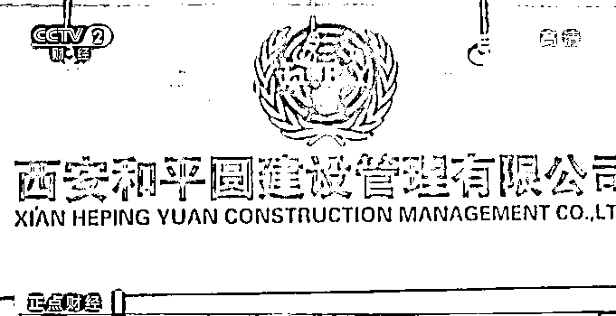****

****虽然这家**公司从未有过盈利**，但**老板吴某的个人账户里却陆陆续续分多笔转入了近两百万元**，这些资金大部分被吴某用来个人消费，其中就有报案人母亲邓某的多笔转账记录。 ****

****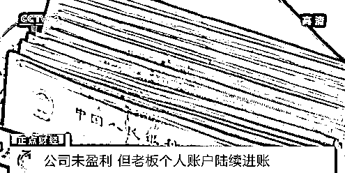****

****在掌握了相关证据后，警方对吴某以及西安和平圆建设管理有限公司的相关人员展开行动。令办案人员意外的是，看到前来抓捕的民警，吴某并不惊慌，反而不停地埋怨办案人员，**责怪警方耽误了他的民族大计**。 ****

****西安市公安局新城分局刑侦大队民警于鸿瑞称，吴某说自己是联合国主席、是首长，民警没有权利讯问他，赶紧把他放了。 ****

****西安市公安局新城分局刑侦大队民警王洋表示，民警们觉得不可思议、啼笑皆非。还有一个所谓的普渡大运河项目，初期规划是将天山上面的水一直引到东部的一些所谓的缺水的地区。 ****

****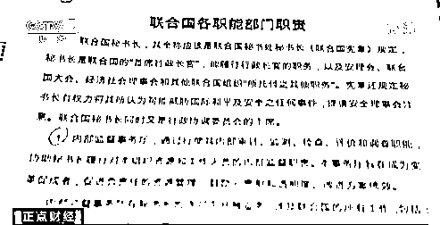****

****根据现场询问，办案人员了解到，这些神乎其神的项目方案都出自和平圆公司一个叫做神仙班的部门。 ****

****西安市公安局新城分局刑侦大队民警严旭称，这个部门只有三个六十多岁老太太，通过讯问得知，**这三个老太太在公司就负责做梦，每天的任务就是做一些梦，梦到一些工程项目并告知吴某**。****

****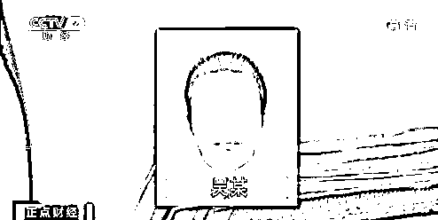****

******吴某还让公司里的员工称呼他为首长，并对几名心腹员工冠以将军、政委的称号**，在和平圆公司里，吴某多次以各种理由向员工们“求助”索要钱财。许多员工就会像报案人的母亲邓某一样向自己的亲朋好友借钱。 ****

****03****

******被索要近百万元******

******员工为何心甘情愿出钱******

 ****[`mp.weixin.qq.com/mp/readtemplate?t=pages/video_player_tmpl&action=mpvideo&auto=0&vid=wxv_1568836878760476673`](https://mp.weixin.qq.com/mp/readtemplate?t=pages/video_player_tmpl&action=mpvideo&auto=0&vid=wxv_1568836878760476673)**** 

****△央视财经《正点财经》栏目视频**** 

****经过警方调查，自 2018 年和平圆公司成立以来，吴某先后以交租金、物业费等形式向员工索要了近百万元，他手下的职员为何会心甘情愿为吴某掏腰包呢？ ****

****西安市公安局新城分局刑侦大队民警严旭表示，**吴某给手下员工、将军、政委以及各个负责人分派了十余个这种类似于联合国总部搬迁、普渡大运河修建的工程项目，让他们来负责这些项目正常运转，工程运营下去获利就是他们自己的。****** 

****在高额回报的驱使下，员工们纷纷慷慨解囊，在和平圆公司内部，吴某以运营公司为由对几十名职工实施诈骗，除此之外，吴某还要求手底下的员工通过各种方式拉人参与所谓的民族资产解冻等项目。 ****

****虽然吴某的言论荒谬至极，但令人意外的是，和平圆公司的员工们居然对他深信不疑，**就算民警告诉他们被骗了，仍然有人难以接受这个事实。******

****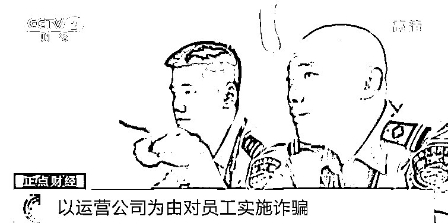****

****西安市公安局新城分局刑侦大队民警王洋称，他们购买了一些虚假的、所谓的传国玉玺和权杖来进行包装和定位。****

****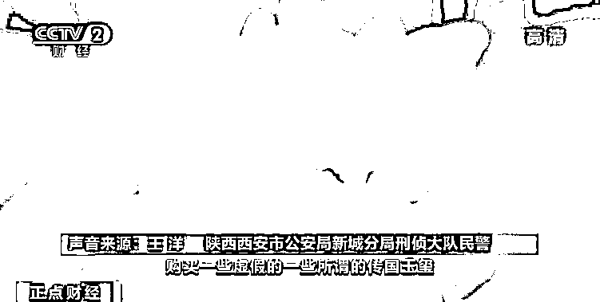****

****西安和平圆建设管理有限公司的工商营业执照上，公司注册资本上这一栏，**99 亿元的注册资金格外抢眼，而这巨额的注册资本也是吴某能够获取他人信任的一个重要砝码**。 ****

****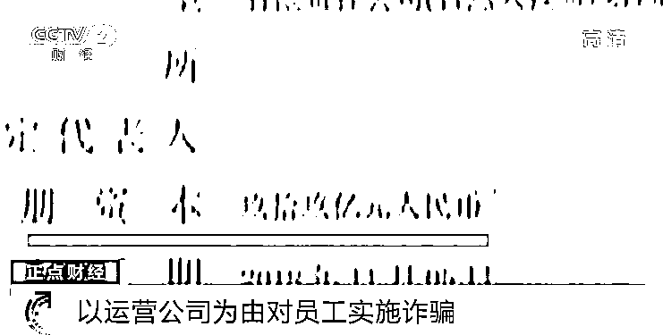****

****法院经审理后认为，被告人吴某、王某某以非法占有为目的，虚构大型项目，以高额回报为诱饵，骗取被害人财物，其行为均已构成诈骗罪。被告人吴某涉案数额 78 万余元，被告人王某某涉案数额 9 万元。****

****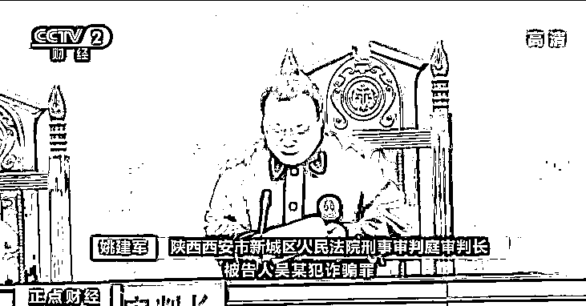****

******陕西西安市新城区人民法院刑事审判庭审判长 姚建军**：被告人吴某犯诈骗罪，判处有期徒刑十年六个月，并处罚金人民币十万元。被告人王某某犯诈骗罪，判处有期徒刑两年，并处罚金人民币两万元。 ****

****来源：央视财经****

****************

****← 向右滑动与灰产圈互动交流 →****

********