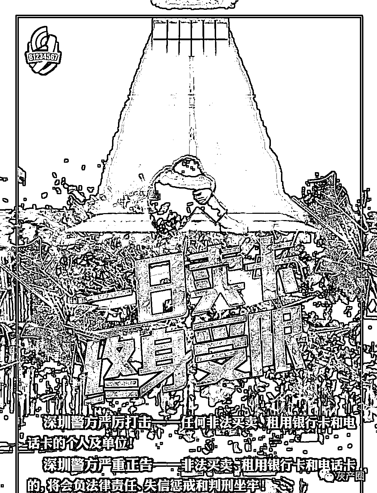
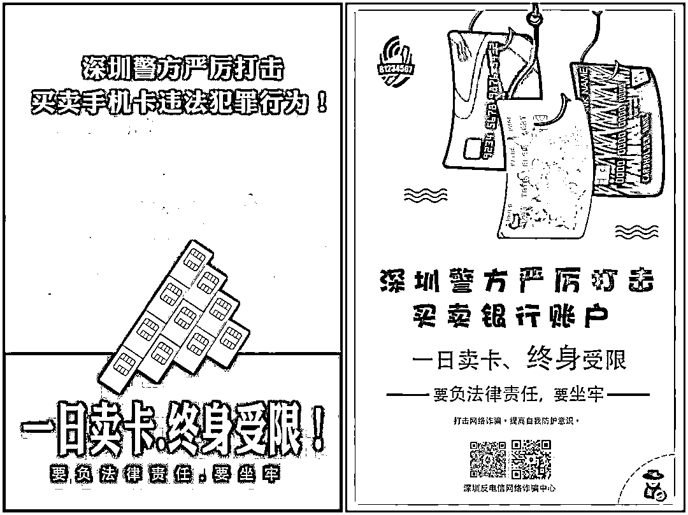

# 买卖银行账户、电话卡者的忏悔心声，早知今日何必当初！

> 原文：[`mp.weixin.qq.com/s?__biz=MzIyMDYwMTk0Mw==&mid=2247503427&idx=4&sn=00123705ecd2135e37ac845df8b531ed&chksm=97cb057ba0bc8c6d1b55d25c9b560acb5acb0661774d23fb32720507d9e156ec573ab2f378d2&scene=27#wechat_redirect`](http://mp.weixin.qq.com/s?__biz=MzIyMDYwMTk0Mw==&mid=2247503427&idx=4&sn=00123705ecd2135e37ac845df8b531ed&chksm=97cb057ba0bc8c6d1b55d25c9b560acb5acb0661774d23fb32720507d9e156ec573ab2f378d2&scene=27#wechat_redirect)

点击蓝字“**灰产圈**”关注我们！

 当有人向你抛出：“出售自己银行卡、电话卡

能赚几百块甚至几千块”的诱饵

在你急需用钱时，

是不是感觉简直是天上掉馅饼？ 

这正是不法分子为你设下的圈套！

这些都是不法分子在利用收购他人的身份

办理的银行卡和电话卡进行违法犯罪活动

涉及洗黑钱、电信网络诈骗等违法犯罪行为

**参与买卖，小心等待你的将是法律的制裁！**

**一日卖卡 终身受限**

****

**近年来，深圳警方始终保持高压态势打击电信诈骗，逐步摸索出全链条打击模式，取得了显著成效，买卖自己银行卡账号、电话卡者纷纷落网。**他们中有些人在走上帮助电信诈骗这条路之前，甚至不知道买卖自己银行卡、电话卡是违法犯罪，往往受朋友的鼓动诱惑而被拖下水，直至被抓了才幡然醒悟。

下面这份**“忏悔录”，**

愿能以他们的亲身经历，

撼动每一位正在观看视频的你。

↓↓↓

 **[`mp.weixin.qq.com/mp/readtemplate?t=pages/video_player_tmpl&action=mpvideo&auto=0&vid=wxv_1558523108578344961`](https://mp.weixin.qq.com/mp/readtemplate?t=pages/video_player_tmpl&action=mpvideo&auto=0&vid=wxv_1558523108578344961)** 

****

****友情提醒****

**01**

**非法买卖的银行卡、身份证等都可能被用于洗钱、诈骗、网络赌博、贿赂、逃税等违法犯罪活动，不但扰乱正常社会秩序，还有可能涉嫌帮信罪。**

**02**

**银行卡存储了很多个人信息，如果被用来从事非法活动，将给自己带来巨大的法律风险，甚至承担刑事责任。**

**03**

**银行卡绑定了犯罪团伙的手机号后，犯罪分子即可操控银行卡相关账户，用于贷款、衍生开户等等，一旦所售银行卡出现信用问题，最终都会追溯到开卡人账户，导致个人信用受损。**

********

****

****惩 戒 措 施****

**《刑法》第二百八十七条之二　**【帮助信息网络犯罪活动罪】**明知他人利用信息网络实施犯罪，为其犯罪提供互联网接入、服务器托管、网络存储、通讯传输等技术支持，或者提供广告推广、支付结算等帮助，情节严重的，处三年以下有期徒刑或者拘役，并处或者单处罚金。**

**此外，明知将银行卡出售给别人，极大可能用于电信网络诈骗、洗钱及逃税等违法犯罪行为，但是因贪图蝇头小利，不顾后果，仍然非法出售银行卡给他人使用，已经涉嫌妨害信用卡管理罪和帮助信息网络犯罪活动，犯罪情节严重者将会被追究刑事责任。**

**出售贩卖银行卡及对公账户行为，为各种电信网络诈骗犯罪提供了便利，助推了电信网络新型违法犯罪。打击违法犯罪行为，斩断黑灰产链条，需要每一位公民的支持。希望广大持卡人提高防范意识，妥善保管好身份证、银行卡、对公账户等信息，对于废弃不用的银行卡和对公账户，及时办理销户。发现买卖银行卡和对公账户的违法犯罪行为，及时拨打 110 向公安机关举报。**

**来源：深圳市反电信网络诈骗中心**

********

**← 向右滑动与灰产圈互动交流 →**

****