# “美女主播”被曝光时正在直播……网友：315 正在说你

> 原文：[`mp.weixin.qq.com/s?__biz=MzIyMDYwMTk0Mw==&mid=2247531724&idx=5&sn=efba79d08aa564b47e1e2f25f124d08f&chksm=97cbb7f4a0bc3ee2ede05ebb7f2b82321604f8c073d016ac734554d9721dc761386c5272cca6&scene=27#wechat_redirect`](http://mp.weixin.qq.com/s?__biz=MzIyMDYwMTk0Mw==&mid=2247531724&idx=5&sn=efba79d08aa564b47e1e2f25f124d08f&chksm=97cbb7f4a0bc3ee2ede05ebb7f2b82321604f8c073d016ac734554d9721dc761386c5272cca6&scene=27#wechat_redirect)

一年一度的 

央视 3·15 晚会备受关注

不出意外

热搜又又又刷屏了

↓↓

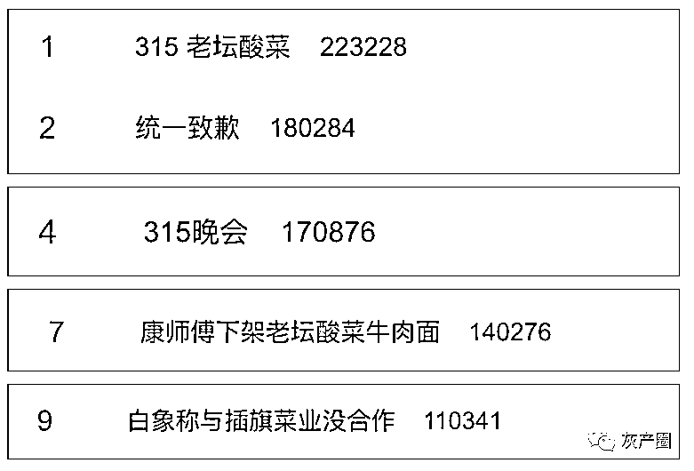

**315 曝光时正在直播？**

**网友狂刷：快开电视** 

在 2022 年“315 晚会”上，央视第一个节目揭露“女主播背后的秘密”，直指直播领域乱象。

“315 晚会”指出，聚享互娱公司依靠男运营冒充女主播和粉丝互动、刷礼物获取收益。

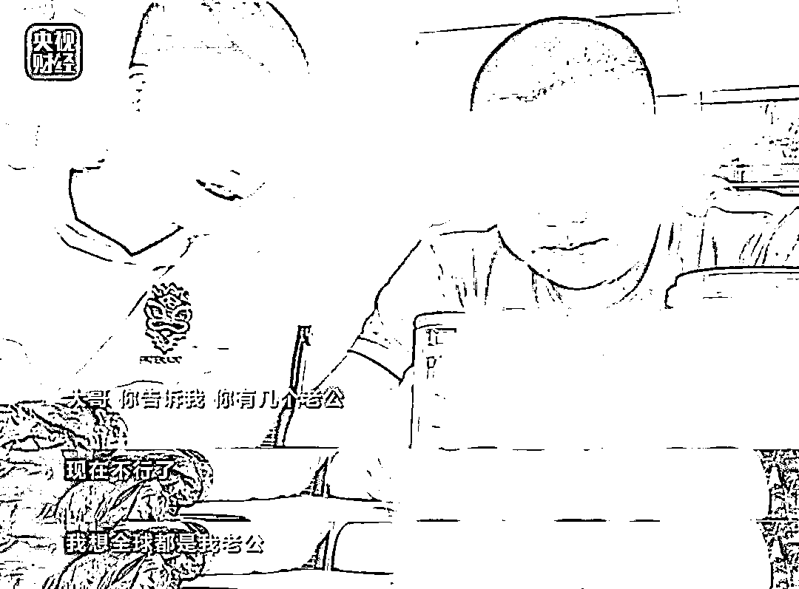

[`mp.weixin.qq.com/mp/readtemplate?t=pages/video_player_tmpl&action=mpvideo&auto=0&vid=wxv_2311148117586739202`](https://mp.weixin.qq.com/mp/readtemplate?t=pages/video_player_tmpl&action=mpvideo&auto=0&vid=wxv_2311148117586739202)

节目播出时，

聚享互娱旗下被曝光的主播

伍伍的直播间已被

平台官方封禁，

当时她正在直播。

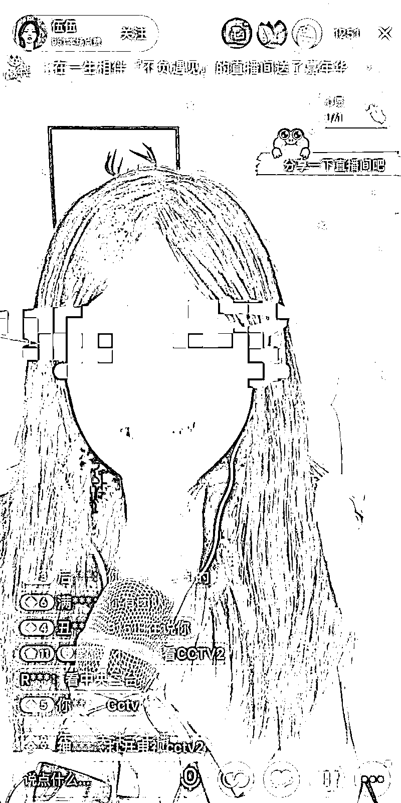

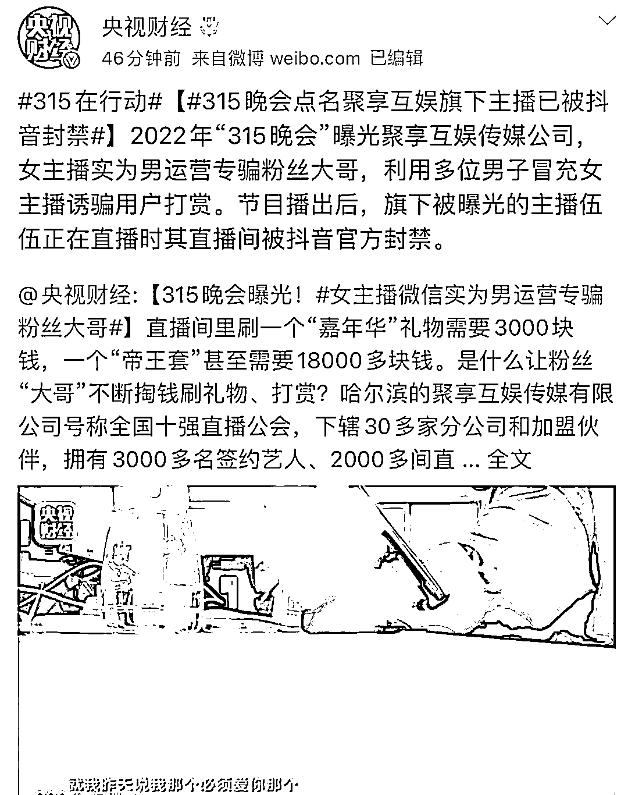

不少网友表示 

“榜一”大哥哭晕 

再也不相信所谓美女主播 

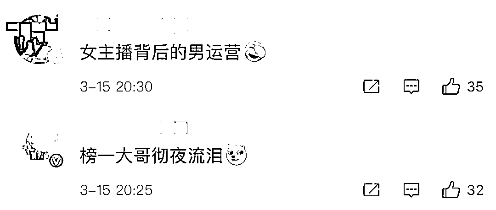

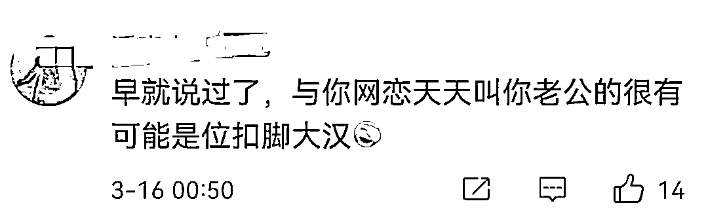

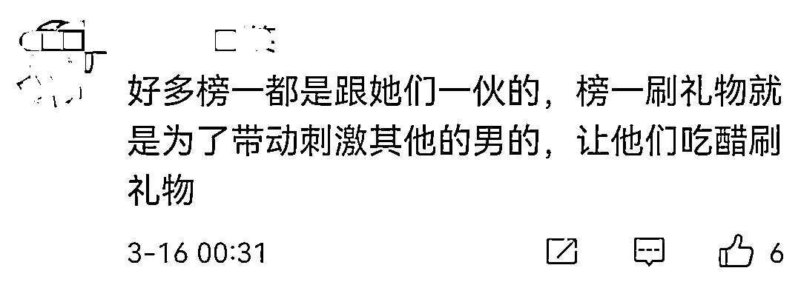

还有人呼吁

平台关闭打赏功能

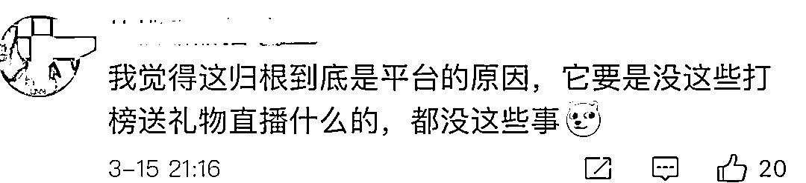

**涉事企业回应** 

**监管部门火速出手** 

**“土坑酸菜被曝光”，康师傅、统一致歉！** 

土坑酸菜一经曝光，湖南省市场监管局立即行动，前往岳阳市君山区雅园酱菜食品厂、华容县插旗菜业执法。

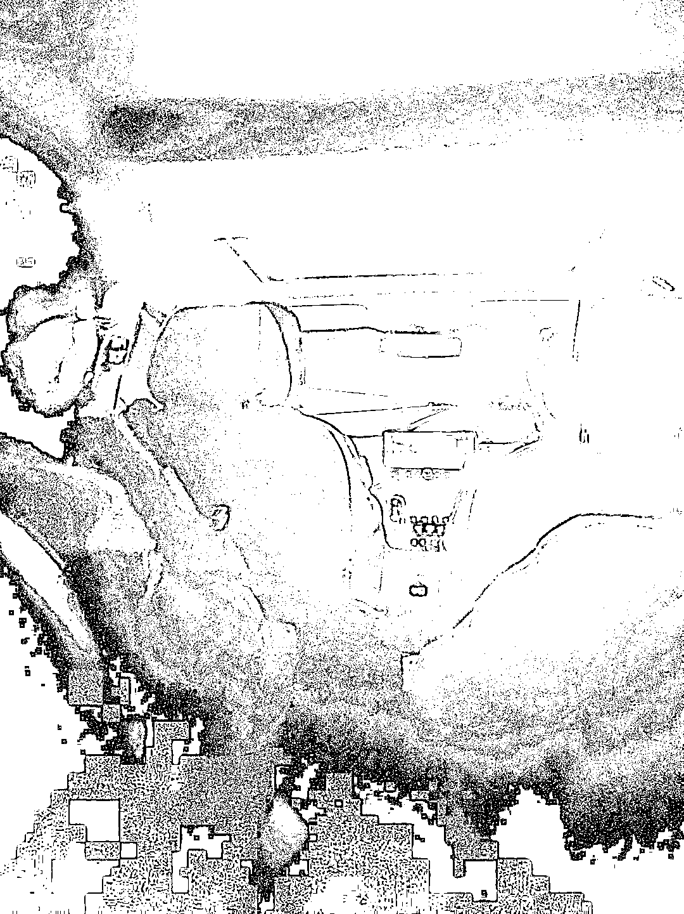

16 日凌晨，康师傅方便面投资（中国）有限公司发布声明称：

湖南插旗菜业有限公司是我司酸菜供应商之一，已立即中止其供应商资格，取消一切合作，封存其酸菜包产品，积极配合监管部门调查和检测。同时声明称，此次事件辜负了消费者信任，深表歉意并将引以为戒！

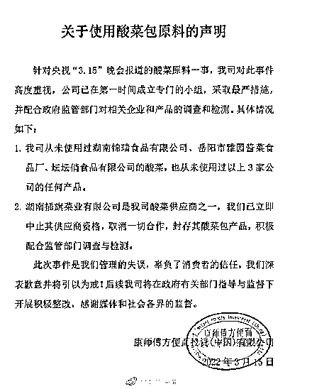

统一（中国）投资有限公司当晚在官网发布声明回应称，公司高度重视，已于 3 月 15 日当天在长沙市市场监督管理局的现场排查下，对采用的酸菜包原料及相关留档记录进行了彻底检查。

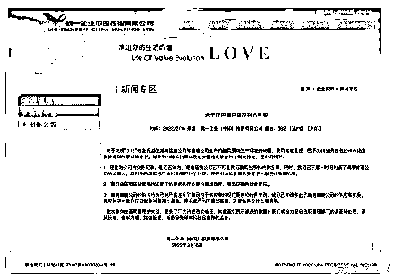

插旗菜业公司的官网显示，其与康师傅、统一等一大批知名企业建立了产品代加工和原料直供等方面的战略合作关系。在康师傅官方旗舰店（天猫），老坛酸菜整箱方便面已经下架，无法购买。

# **中关村在线：关闭整改 ZOL 软件下载频道**

昨晚接近 12 时，中关村在线在微博上对“315”报道中高速下载器涉嫌捆绑的问题发布了声明。

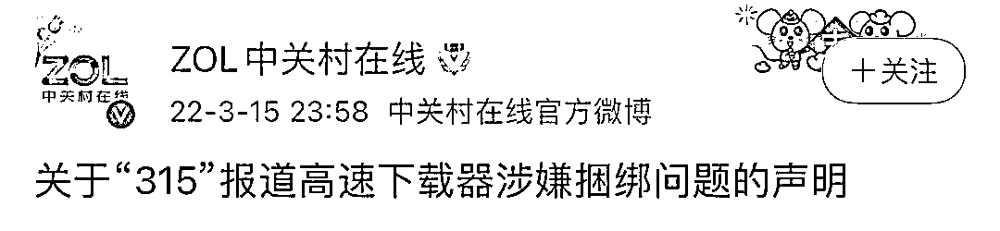

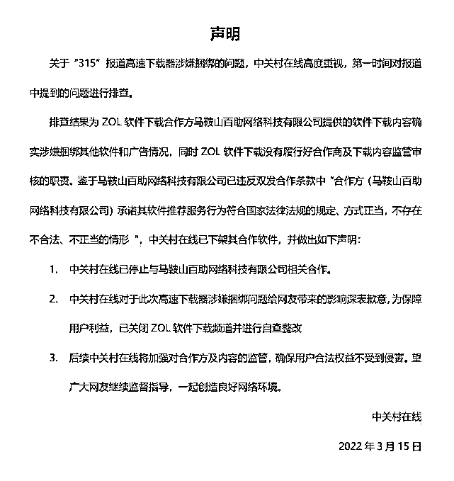

晚会播出后，中关村在线软件下载页面中的“高速下载”链接已被移除。

**315 晚会点名翡翠直播间停播**

目前涉事企业承泽翡翠和罗旺珠宝所在地的市场监管部门开始对涉事企业进行调查。

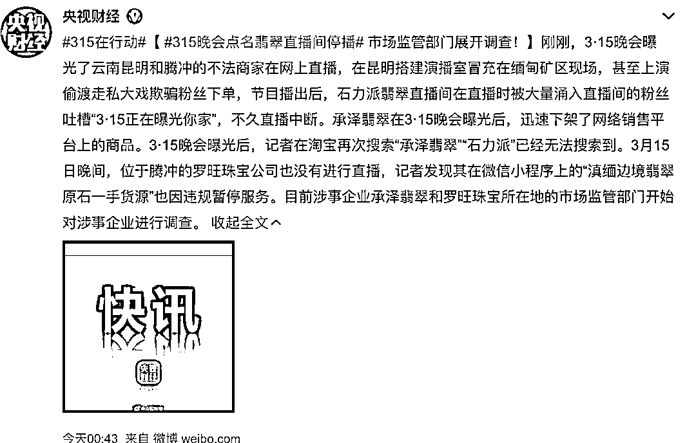

# **安徽六安：查处设抽奖游戏坑小学生小卖部** 

央视“3·15”晚会曝光六安一家小店的 66 枚金蛋里面，只有 7 个蛋设置了现金奖，5 个一元钱，2 个五元钱，中奖金额仅仅 15 元钱。这种金蛋还可以重复利用，中奖率和中奖额度完全由店家说了算。即使有些孩子吸取教训后，已摸清了其中的套路，但更多的孩子仍然深陷其中，难以自拔。**对此，六安市监局工作人员赶到现场查处、查扣物品。**

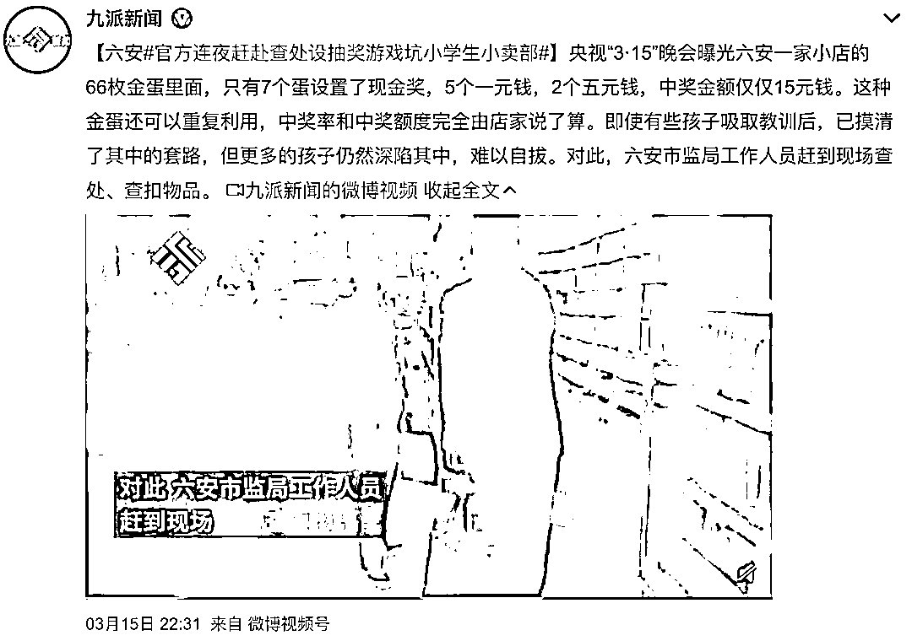

**杭州连夜突击检查骚扰电话黑色产业链**

只是用手机浏览了某些网站，并没有留下电话，但是却接到了相关行业的推销电话。

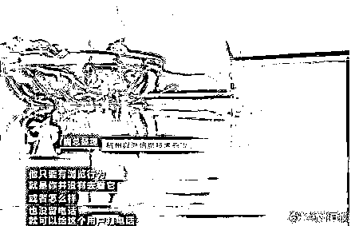

15 日晚，央视 315 晚会曝光了这条黑色产业链，杭州以渔信息科技有限公司也被曝光。当晚，杭州拱墅区市场监管局执法人员出发前往位于复尚发展大厦的杭州以渔信息科技有限公司进行突击检查。

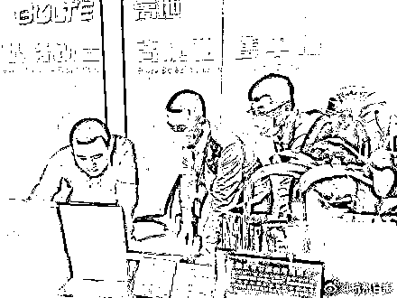

**河南禹州粉条涉事生产经营场所被查封** 

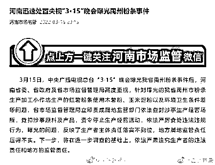

****安徽合肥：立即严查美希淑颜医美问题**** 

**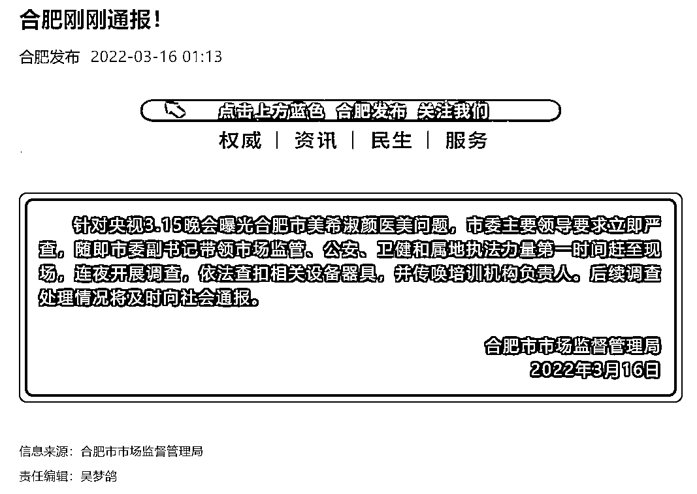**

****广东：连夜派出执法小组调查“非标”电缆等问题****

**2022 年“央视 315 晚会”曝光了直播涉嫌虚假宣传、校园周边存在涉嫌销售问题玩具、个别地区生产销售“非标”电缆等相关问题，广东省政府高度重视，省市场监管局第一时间要求相关地市市场监管部门开展执法检查，并连夜派出执法小组赶赴揭阳市开展执法督导。相关地市市场监管部门迅速组织精干执法力量，联合公安等有关部门，连夜在辖区内开展突击执法检查。**

**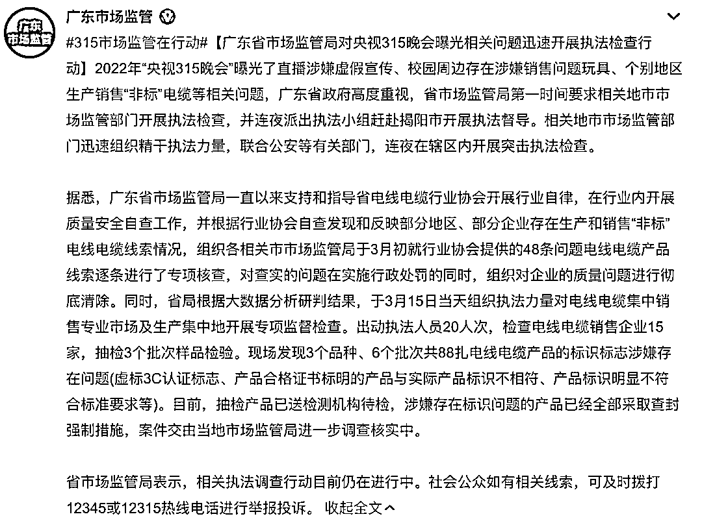**

****

# ****广东深圳：3·15 晚会曝光的非法口碑营销问题已展开核查****

**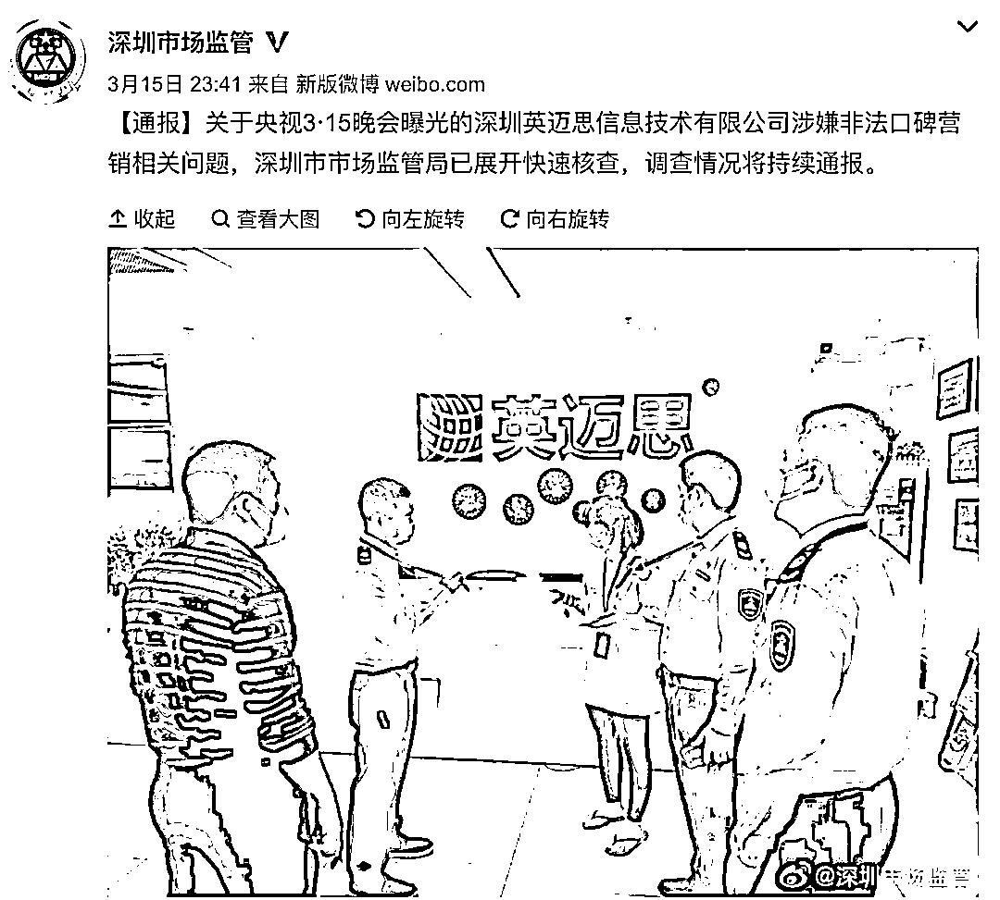**

**来源：中国青年报综合央视财经等**

****

**← 向右滑动与灰产圈互动交流 →**

****