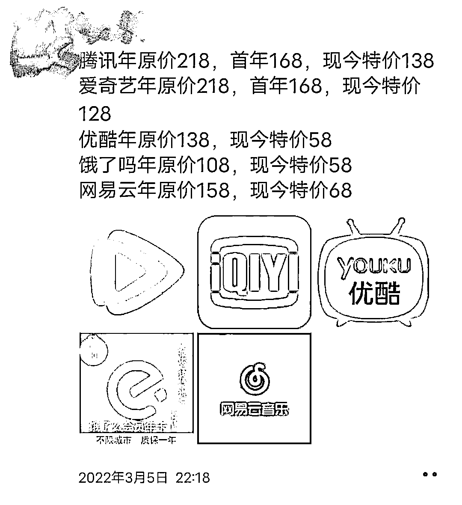

# 盗版永不眠：周杰伦音乐 5 元打包，视频大会员半价甩卖

> 原文：[`mp.weixin.qq.com/s?__biz=MzIyMDYwMTk0Mw==&mid=2247531724&idx=6&sn=4151d42adc50ac25cbf7c62c8ed13b64&chksm=97cbb7f4a0bc3ee2b02390186ee0ac450cd7b645ffe8fbdd5d933c2493f70cf315f816249605&scene=27#wechat_redirect`](http://mp.weixin.qq.com/s?__biz=MzIyMDYwMTk0Mw==&mid=2247531724&idx=6&sn=4151d42adc50ac25cbf7c62c8ed13b64&chksm=97cbb7f4a0bc3ee2b02390186ee0ac450cd7b645ffe8fbdd5d933c2493f70cf315f816249605&scene=27#wechat_redirect)

©️真探 AlphaSeeker 原创 

作者 | 祖杨

## 

周杰伦可能怎么也想不到：自己所有歌曲正在以不足 5 元的价格被打包售卖，并且还养活了一大批电商小贩。

在淘宝、拼多多、闲鱼上搜索“周杰伦”，你会发现出现的商品全部都是“周杰伦 300 首打包售卖”，价格在 1 毛到 6 元不等。为了吸引买家注意，店铺首页图片大多是鲜明颜色的字体——“无损音质”、“永久有效”、“代上传网易云”……这些主要卖点简单粗暴的被突出显示，另外还有店家会送上“赠品大礼包”：购买周杰伦，评论区晒图赠送陈奕迅 MP3 合集。

按销量来看，不少商品链接的销量已经突破 10 万+，以平均 3 元一次的交易价格计算，这些店家只靠周杰伦一人就至少收入 30 万。

在音乐平台上，听周杰伦的歌曲，一首单曲大概两元，一张专辑便宜也要三元，想要听更多，就得充每月 10 元的年卡会员，而且会员到期之后歌曲也全部失效。即便咪咕音乐可以免费收听周杰伦的歌，但还是有买家在电商平台的评论区里对比：“咪咕只能听那么几首，这里花几块钱就能听永久，更值。”

**价格低、数量全、永久有效、音质也与花钱在音乐平台上购买的无异，年轻人尤其是学生党们，自然将选择指向了隐秘的电商小贩。**

### **有“许可证”的盗版生意**

售卖歌曲的电商小贩涉猎范围颇广，看上的其实也不只是周杰伦。

以拼多多上销量比较高的一家店铺为例，其售卖歌曲的演唱歌手中既有周杰伦、陈奕迅、林俊杰这样的大众向实力派，也有小众的地下 Rapper，以及韩国偶像团体。这些歌曲都是一次性打包售卖上百首，以代上传网易云音乐云盘或者百度网盘链接的形式销售给买家。

卖家将这些歌曲从网站上下载之后挂在电商平台，**虽然价格仅有几块钱，但一款产品可以产生成千上万次交易，其中还有不少回头客，收入实际非常可观。**

根据淘宝卖家公开的经营许可证，其经营范围属于个人经营的音像制品零售（网上销售），注册的资金也只有一万元。在后续的经营中，店家只有人力上传、下载的成本，整体算下来，成本趋近于零。

低成本、薄利、多销，看起来这似乎是一笔特别划得来的买卖，但我们忽视了最根本的“版权问题”。当「真探」询问淘宝上的某位卖家商品是否安全、是不是正版时，对方都给出了肯定的答复，而且根据其提供的经营许可证，也看起来有更高的可信度。

但是，音乐版权公司的海海告诉「真探」，这大概率只是应付淘宝平台开店的资质审核需要。虽然有**音像制品零售的经营许可，卖家售卖音像制品的这个行为合法合规，但其获取制品、制作制品的过程却违反了法规。**

有的店家主动规避版权风险，在店铺的详情页下方标注出免责声明：所销售的全部商品（包括但不限于软件）来源于互联网，此标价及软件素材标价是人工整理收集素材和远程服务人工费用。

先不说所获得的销售额是否覆盖了人工成本，在业内人士看来，这张免责声明更像是“此地无银三百两”。

海海分析称，**免责声明中写道“全部商品来源于互联网”，其实已经表明了音乐未获得任何授权（无论使用、转售、复制品拷贝），商家销售牟利的行为超出了《著作权法》中可以不经著作权人授权直接使用的范围（法规第二章第四节），这个免责声明显然并没有实际效力。**

也就是说，在电商平台上打包销售热门歌手的歌曲已经明显构成了侵权。

当然，这也仅是盗版音乐猖獗的冰山一角。在电商平台上，除了打包售卖音乐文件，盗版音乐光盘这一“古早”的买卖至今仍然流行：卖家通过从音乐网站上下载歌曲刻录到光盘内，再通过淘宝和微信等方式贩卖盗版音像光盘或是车载音乐 CD。

此外，去年年底，重庆警方破获了一起音乐网站侵权案，一男子通过从国外专业音乐网站下载，或自行购买唱片上传等途径，搭建起了一个音乐网站，并在网站上提供付费下载服务，自建立开始算起，这个网站上充值会员达到 9000 人，男子从中非法获利 121 万元。

从盗版这一隐秘生意存活的时间和带来的巨大利润空间来看，想要完全消除，仍然道阻且长。

### **漫画、网文、视频会员，万物皆可卖**

事实上除了打包售卖的热门音乐文件，部分电商小贩的“营收结构”更加多元，其所售卖的品类还包括动漫、网文，甚至是视频平台的会员。

在多数的正规漫画平台，用户想要观看漫画就要充值成为会员或者单独购买付费。以快看漫画为例，如果选择成为会员，就需要连续每月支付 15 元；如果是非会员，想要看平台热推的《末世恋爱法则》，限免的只有部分章节，之后每一章节都需要付费，想要看完这一整本漫画，非会员用户至少要充 100 块钱的 KK 币。

但在电商平台上，这一价格被压缩至不足六块钱。卖家在商品详情页上重点标注“全平台漫画免费观看”，包括看漫画、漫画台、快看漫画、哔哩漫画等平台，价格分为 5.88 元的永久版与 4.88 元的正式版，正式版只能使用一个月，相比较之下，价格较贵一点的永久版更为划算。

在购买了永久版链接之后，店家提供的下载链接其实也只是一个盗版漫画平台的 App，上面按照分类划分了国漫、日漫、韩漫，这些丰富的资源均是正版漫画平台的盗版。

特别的是，店家提供下载链接但却不会直接提供下载密码。买家晒图评论之后，系统才会自动发布密码。**也就是说，卖家在某种程度上“强制”买家评价，利用好评率提升其可靠性，以招揽更多的生意。**

买家评论

相比近几年才快速发展起来的动漫内容，网络小说自诞生开始就与免费阅读的盗版网站共存，最为知名的笔趣阁更是在地下存活了七年之久。即便是在笔趣阁被查封之后，至今还有无数个披着“笔趣阁”外衣的盗文平台游走在灰色地带。

此外，免费阅读平台的出现也养成了不少读者更青睐于免费阅读的习惯，比如七猫小说、番茄小说都是以免费来吸引读者。

但即便是免费阅读的渠道如此之多，电商平台上的卖家依然找到了靠网文资源赚钱的方法。

搜索“网文”关键词时，你会发现很少能够看到售卖盗版的情况，**反而是“代找小说电子版”生意比较流行。**所谓代找小说，基本上是买家有着明确目标，小说或因比较小众、找不到资源，而要求卖家提供帮助。浏览下来，代找小说的价格多在 1 元、两元左右，销量高的能达 3 万件，也是一笔成本趋近于零的生意。

除了漫画和网文，这些卖家们的生意也延展到了视频领域。

同网文一样，视频平台在养成用户付费观看的习惯上艰难走过了七八年。**而如今视频平台会员价格普遍上调，再加之本就不强烈的用户付费意愿，视频平台会员倒卖生意在电商平台上逐渐走俏。**

在拼多多上，点进视频会员销量最高的一家店铺可以看到，腾讯视频三个月会员商品的销量已超过 10 万+，价格为 34.5 元，而官方视频平台的季卡为 50 元，整体算下来便宜了 15 块钱，而且电商小贩还培养了一批忠实粉丝，在 10 万+的销量里，回头客 6000+。

**有趣的是，在腾讯视频 3 个月会员的买家评论区里，还有公开截胡的“二贩子”。**在评论中，常可以看到“我这边只需要一半的价格，渠道价看图片，非常便宜”，然后附带上自己的微信截图。虽然在尝试联系后，「真探」发现他们给出的价格与电商平台上的卖家相比也并没有相差太多，但其价格也会比视频平台正常购买时便宜不少。

音乐、动漫、网文的盗版版本很容易获得，大多都是资源下载之后转手倒卖，而视频会员更像是虚拟商品，且正常购买都需要绑定个人账号，那这些电商小贩又是从何处获取资源？又是如何转手卖出？

事实上，这一领域也早就和倒卖电影票、微商生意一样形成了完整的产业链：位于产业链上游的，是有渠道、有技术能够囤取大量优惠券的“头号商贩”；位于中游的，属于头号商贩的“一级代理”，负责在各大社交平台上引流宣传，继续发展下线；而位于下游的则是常看到的如淘宝、拼多多、闲鱼上的卖家。

在与上述中的“二贩子”沟通时，对方提到，“倒卖一张年卡会员也就能赚 2-3 块钱”，而且这笔生意并非稳赚不赔，也会出现批量购买后卖不出去，最终货砸手里的情况。可以说在整条产业链中，单纯靠倒卖做生意的竞争极为激烈，其获得的利润也并不高。**这也导致不少卖家一边售卖会员，一边还要依靠“拉人头”来赚更多代理费。**

对方微信朋友圈

天下熙熙皆为利来，天下攘攘皆为利往，无论是音乐、动漫、网文还是视频平台会员，繁荣的地上市场中总会催生出一个见不得光但又相对暴利的地下市场。

当地下生意越暴利、越猖獗，背后体现出的则是大众对侵权的了解程度之低、创作者的维权之难，以及对正版内容的伤害之深。

← 向右滑动与灰产圈互动交流 →

