# 冯巩讽刺国足吃海参段子走红，以后国足不让骂了？网友：学学姚明！

> 原文：[`mp.weixin.qq.com/s?__biz=MzIyMDYwMTk0Mw==&mid=2247531819&idx=1&sn=00c42da8b2b1eff59340fe59046c0456&chksm=97cbb613a0bc3f051f1f44fc949d75d63ae44d4cebb25e757d90c1d4bdf23d386672c4da3975&scene=27#wechat_redirect`](http://mp.weixin.qq.com/s?__biz=MzIyMDYwMTk0Mw==&mid=2247531819&idx=1&sn=00c42da8b2b1eff59340fe59046c0456&chksm=97cbb613a0bc3f051f1f44fc949d75d63ae44d4cebb25e757d90c1d4bdf23d386672c4da3975&scene=27#wechat_redirect)

近日巩汉林谈到了足球，狠批某些球队年收入高，但球场上不进球，完全给中国人丢脸。前国足队长冯潇霆回应后，骂战升级。 

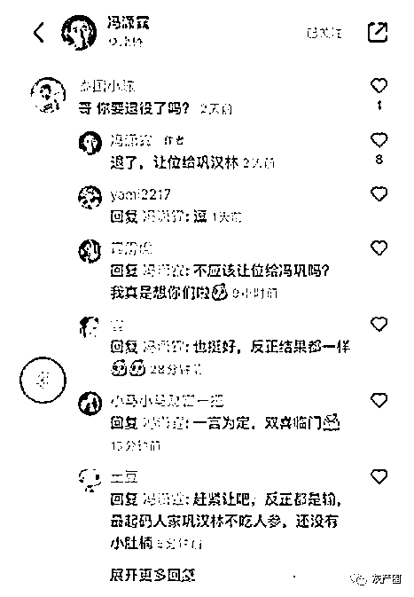

冯潇霆发文表示：球员很心寒，中国足球不要键盘侠。这也引发了圈内人和网友的热烈讨论，有网友称这次争论为“冯巩大战”。对于在微博上发表长文一事，冯潇霆解释了自己的初衷：“有人困在雨里，有人雨中赏雨。希望大家的最后一张牌，永远是真诚。”

猪队长的发言也被网友骂惨了

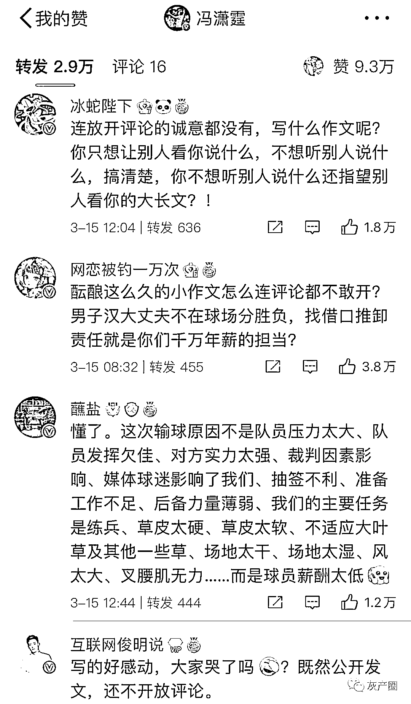

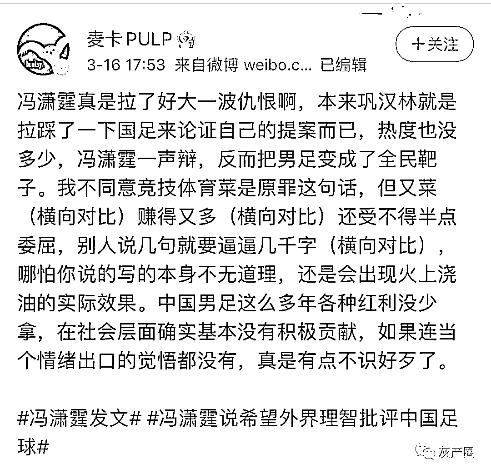

  就在冯潇霆公开在网络上调侃巩汉林，从而引发一系列热议话题的时候，而相声演员冯巩本人在 2 月份发布的一则调侃“国足爱吃海参”的视频也被外界挖掘出来。 

冯巩在视频中表示运动员体育成绩和美食挂钩！并且用谷爱凌爱吃馅饼来举例子，因为馅饼馅子是黄色所以拿到金牌，被问到中国女足的时候，冯巩表示女足队员喜欢吃面，因为他们知道给中国人争面子！最后被问到中国男足喜欢吃啥，冯巩老师说男足喜欢吃海参！所以男队看着浑身是刺，其实吧挺软的！这波比喻可谓是高级啊，既形象生动，又讽刺辛辣深刻！ 只是不知道我们的冯潇霆队长这次会不会再次回应！当然冯潇霆毕竟是前队长，这次应该是现任队长吴曦上场了，再说吃海参吴曦比冯潇霆更有发言权！

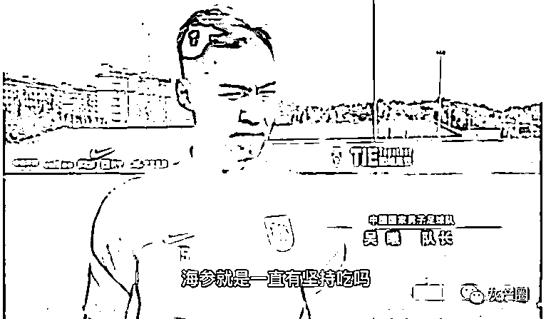

[`mp.weixin.qq.com/mp/readtemplate?t=pages/video_player_tmpl&action=mpvideo&auto=0&vid=wxv_2313191466917117952`](https://mp.weixin.qq.com/mp/readtemplate?t=pages/video_player_tmpl&action=mpvideo&auto=0&vid=wxv_2313191466917117952)

巩汉林和冯巩是把笑话变成工作，某些人是把工作变成笑话。

网友：不仅软，还贵。

对于小品演员的批评，为国足说话也有 

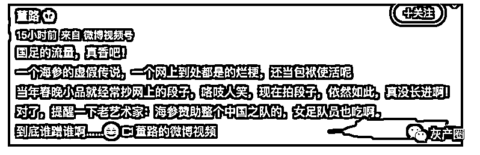

结果董路的评论区变成了这样

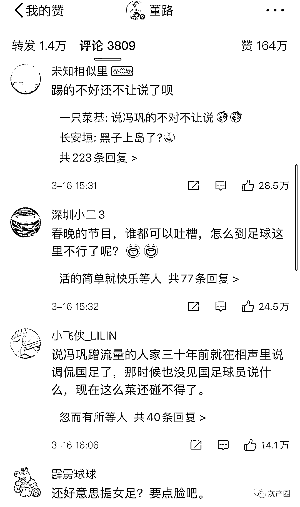

还有爱情公寓的“张伟”想帮男足说几句话，又觉得男足烂泥扶不上墙，最后，只能无奈的自嘲球盲了……

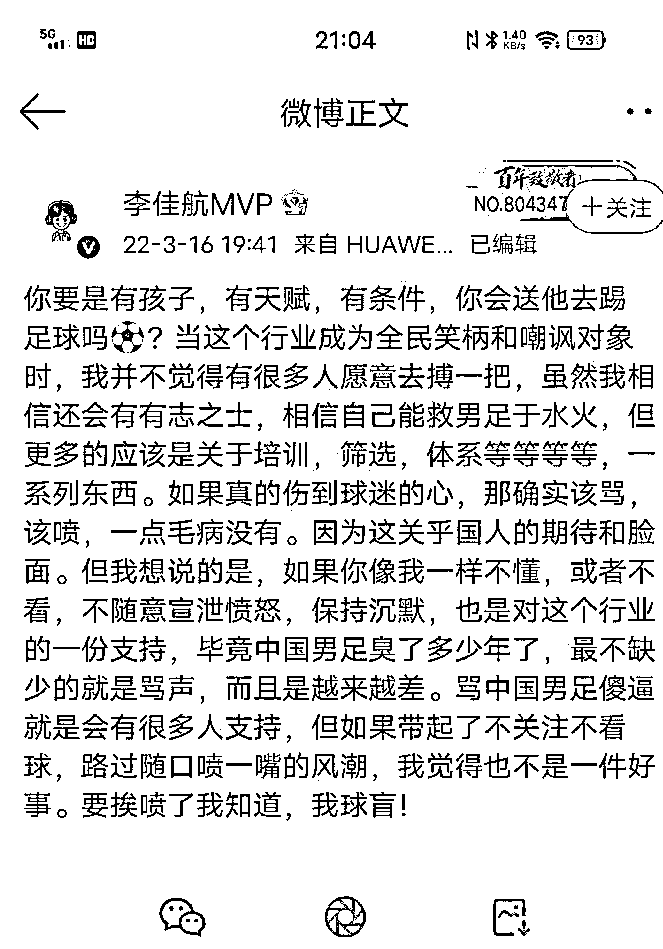

一位 30 年的老球迷的看法 

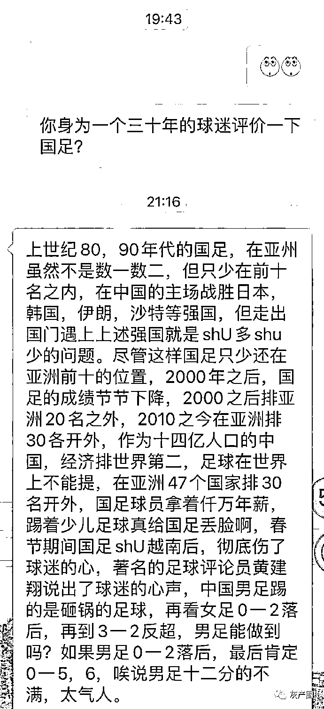

舆论对国足越来越失望，官媒也想拉一把国足，结果评论区被网友淹没了 

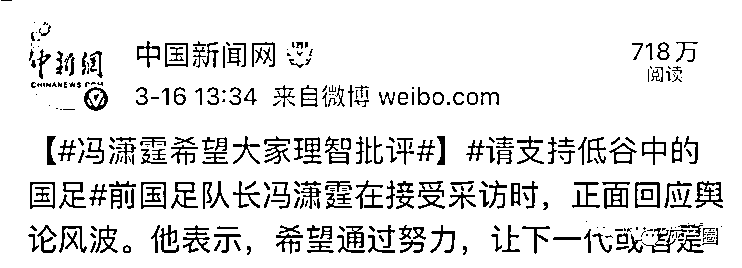

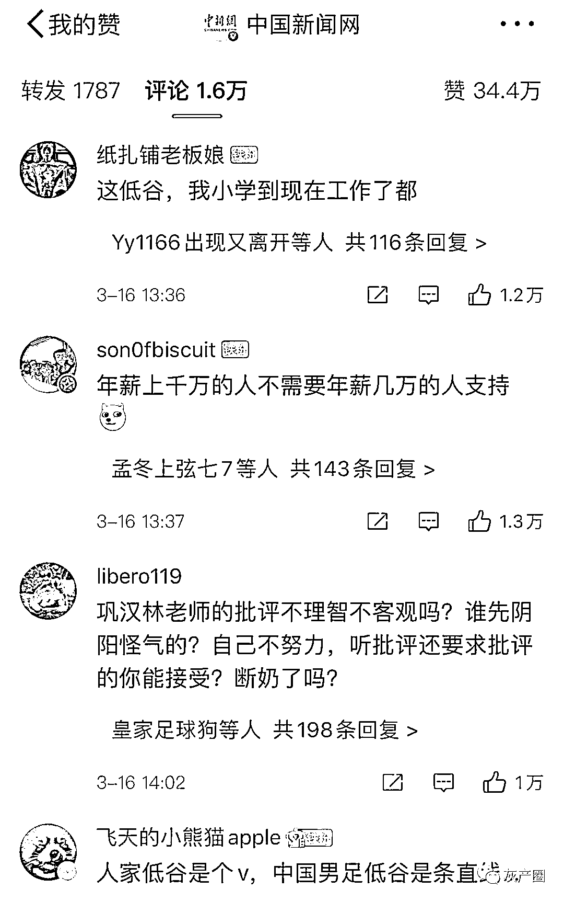

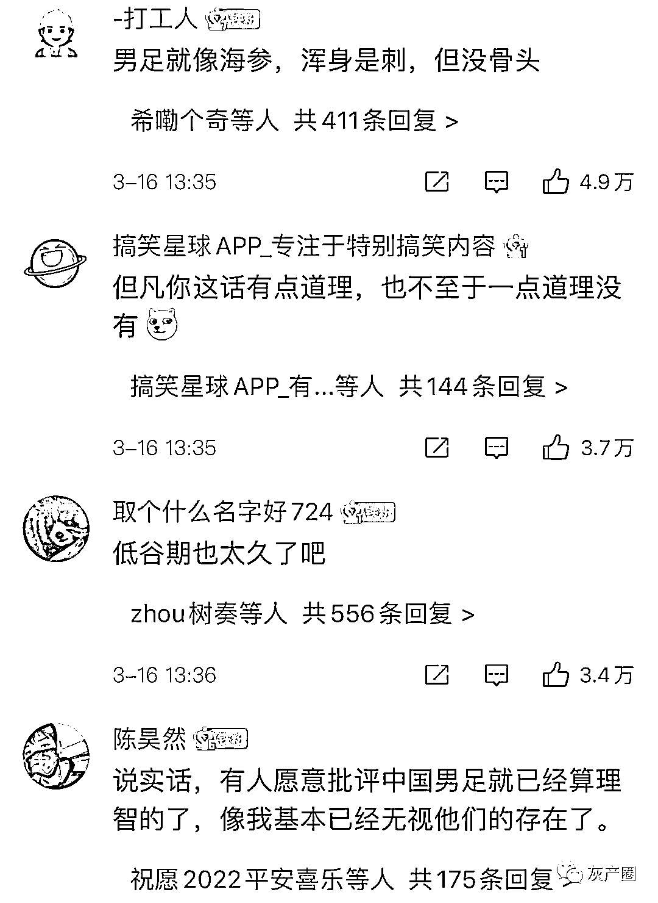

看看姚明面对负面言论时的态度
“兴你打成这样，不兴别人说啊？”
“要转变这些不利因素，唯一的办法就是说把比赛打好。”

[`v.qq.com/iframe/preview.html?width=500&height=375&auto=0&vid=u0042orncrg`](https://v.qq.com/iframe/preview.html?width=500&height=375&auto=0&vid=u0042orncrg)

来源：微博那些事儿

← 向右滑动与灰产圈互动交流 →

