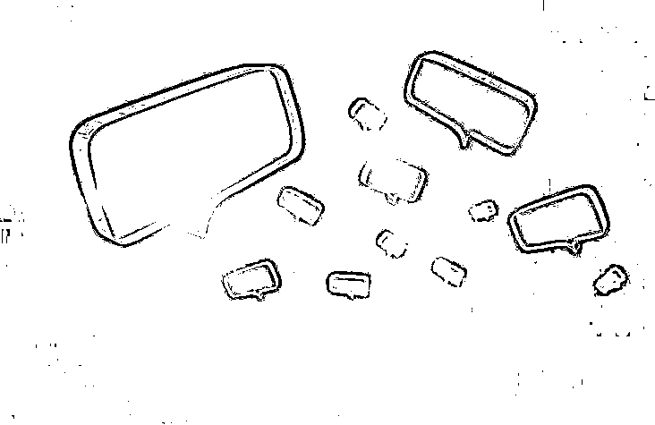
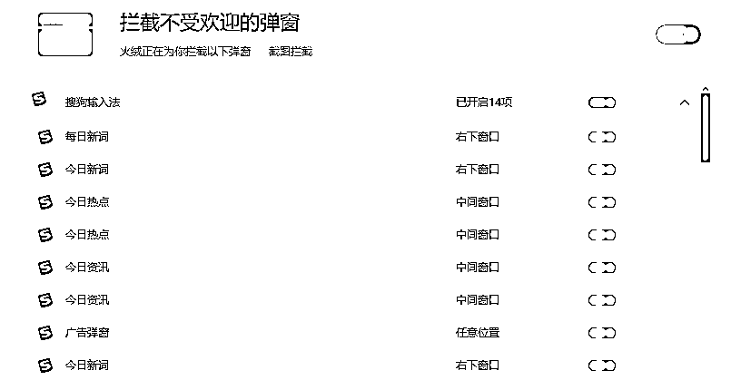

# 弹窗广告：你以为的“癣疥之疾”，撑起了完善的灰色产业链

> 原文：[`mp.weixin.qq.com/s?__biz=MzIyMDYwMTk0Mw==&mid=2247531819&idx=2&sn=be23557d609acc77cb98eac82f6dcce5&chksm=97cbb613a0bc3f052517d4787a7c8ee498429d83c8469925778d64fd625cf50ee9f259d5a674&scene=27#wechat_redirect`](http://mp.weixin.qq.com/s?__biz=MzIyMDYwMTk0Mw==&mid=2247531819&idx=2&sn=be23557d609acc77cb98eac82f6dcce5&chksm=97cbb613a0bc3f052517d4787a7c8ee498429d83c8469925778d64fd625cf50ee9f259d5a674&scene=27#wechat_redirect)

**来源 | 零壹财经**

**作者 | 沈拙言**

“我也很烦弹窗广告，但是很无奈，因为我还要用这款软件，只能忍着。”

一位电脑用户如是说。

不同于笔者的“电脑使用洁癖”——桌面不能有任何文件或快捷方式、完全依靠快速启动栏和文件资源管理器以及开始菜单、任何非系统文件都别想装到系统盘等极端操作，**大部分用户对于电脑弹窗以及软件捆绑虽有微辞，但并不觉得这是很严重的问题，只是“癣疥之疾”。**

开头那位用户甚至认为，作为用户想要使用某软件是“欲戴王冠”，而被迫接受该软件的夹带私货是“必承其重”。

只是大多数人想不到的是，一些软件的弹窗广告这类的大家司空见惯的“小动作”，竟有一套完善的产业链，而且赚得盆满钵满——**在 2022 年央视“3·15 晚会”中所曝光的，一些专业做软件捆绑间杂弹窗广告的公司，年营收能达到 12 亿元之巨。**

**上游：流量入口提供展示位置**

在弹窗这一产业链的上游位置生存的，是各大流量入口。

在笔者日常的电脑使用过程中，“电脑使用洁癖”的驱动下，对于软件本身的纯净度要求颇高，发现某软件在某位置弹出窗口后，即刻点开该软件的设置，找寻关闭弹窗的开关，如果软件并未提供这一开关的话，笔者可能会壮士断腕，忍痛卸载。

而对待一些无法关闭但由于使用习惯问题无法卸载的软件，笔者选择采用其它渠道进行弹窗拦截。

以搜狗输入法为例，“每日新词”、“今日热点”、“今日资讯”、“搜狐新闻”等弹窗是主要输出位置，且在设置中没有关闭的选项。即便是用户不堪其扰通过其它渠道下载安装纯净版软件，依然会存在强制弹窗。

2020 年，搜狗浏览器（含搜狗输入法）曾被处罚。据中国网信网消息，搜狗浏览器(含搜狗输入法)等 6 家平台 13 款常用软件工具，捆绑安装多个弹窗插件，在青少年上网课时频繁弹出，部分弹窗过大影响网课呈现，部分弹出页面关闭按钮不明显或无法一键关闭，甚至弹窗推送低俗色情内容，严重干扰青少年上网课。

为此，国家网信办视违规情节和问题性质，依法分别采取约谈、责令限期整改、暂停相关频道栏目更新、全面下架，停止互联网接入服务、严肃处理相关责任人等处罚措施。

时至今日，弹窗依然存在。

以此为延伸，QQ、迅雷、百度网盘以及 Adobe Flash Player 驱动等电脑用户常用的软件也是弹窗大户，弹窗内容既有广告内容，也有每日资讯，只是不管广告也好，资讯也罢，内容质量堪忧，一些“标题党”信息充斥其中。

**如果连熟练使用电脑、手机的年轻人都对弹窗广告进行无奈和妥协，那降临到老年人身上可谓是灾难。**大部分老人总会遇到“手机越来越卡”的问题，弹窗广告贡献了一份力。

O2O 百团大战、网约车大战、共享单车大战等互联网行业内的知名混战都曾用补贴的方式培养用户习惯，然后在市场培育初期注重用户体验。先后顺序很重要，当用户逐步形成了使用自身产品的习惯后，是否依然注重用户体验，则是企业道德范畴的问题了。

“当你真正饿的时候，饭里有根头发，你也顾不了那么多了，挑出头发接着吃呗。”一位用户如是说。

弹窗的发明者是一位名叫伊凡·佐克曼的程序员，他的初衷是用弹窗的方式将网页与广告分离，避免用户将某些负面的网页内容与网页展示的广告相关联。

这一“伟大的发明”成了网站开发者和广告主的福音，迅速火遍全球，成为让广告主欢呼的蜜糖、普通用户哀号的砒霜。

伊凡·佐克曼公开在《大西洋月刊》上发表文章表达忏悔，**称弹窗是他最糟糕的发明。**

这一情节很容易让人联想到爱因斯坦。爱因斯坦曾在《大西洋月刊》、《写给“国际知识界和平大会”的信》、纽约诺贝尔大学的演讲等多个场合表达了遗憾，他只是想把原子弹这一罪恶的杀人工具从疯子希特勒手里抢过来，却把它送到另一个疯子的手里，让这些武器造成无法形容的灾难。

2014 年，国家互联网信息办、工信部、国家工商总局就启动了“整治网络弹窗”的专项行动。5 年后，人民日报微博发布《“弹窗广告”不能想弹就弹》一文登上热搜，阅读量超 4.4 亿次。再两年后，工业和信息化部印发《关于开展信息通信服务感知提升行动的通知》，决定从 2021 年 11 月至 2022 年 3 月，开展信息通信服务感知提升行动。2022 年 3 月，国家网信办又起草了《互联网弹窗信息推送服务管理规定（征求意见稿）》，要求互联网弹窗信息推送提供者应自觉接受社会监督。

**八年时间，多项整治，弹窗广告并未完全消失，而是规避了相关监管要求，用另一种方式存活了下来。**广告是相当数量的网站赖以生存的收入手段，纯靠自觉，不太现实。唯有重典，方可缓解。

**中游：长袖善舞的广告服务商**

弹窗广告为何屡禁不绝？背后牵扯到多方利益。

广告者，广而告之也。对品牌方而言，广告是要展示给更多的人，有了这层展示，消费者才会对产品留下印象，再进一步产生兴趣，最后达成交易。时至今日，“孝敬爸妈脑白金”的洗脑循环依然在笔者的脑海中挥之不去。

万事开头难，完成开头的展示环节，就需要借助大流量入口的支援。同时，广告服务商的诞生可以对产品宣传信息进行包装、对广告进行分发，省去单一品牌方想要多多投放需要联系多个大流量入口的烦恼。

广告服务商能量不可谓不强大。

援引时代周报的报道，“记者联系了广告服务商，投一个弹窗广告并不复杂，只要准备好产品图片，等待 20 分钟左右即可制作完成并发布。广告服务商甚至拍拍胸脯表示，哪怕没有营业执照也能解决。而投放的价格是 5000 元 30 万次弹窗广告，广告服务商一般拥有一些各种渠道获得的客群画像，广告主可以在后台选择相应的标签，对广告进行展示。在一些用户数据买卖交易中，也常常见到此类型的广告服务商的身影。”

在 2022 年“3·15 晚会”中，央视报道的软件下载平台也神通广大。该平台主要提供“高速下载器”，在各个软件下载网站的页面中有醒目的绿色“高速下载”标识，目前 80%~90%的软件下载网站采用了这一设计。“高速下载器”主要是捆绑软件，一带六，用户在软件安装的过程中默认勾选安装推荐软件，**即便用户警觉，取消了对推荐软件的勾选，依然会有隐藏的捆绑软件进行静默安装。**

至于“高速下载器”与普通下载相比是否具有高速的功能，该平台人员回答十分中肯：下载速度并无二致，“高速下载”只是一个商业化标识，仅此而已。

在推荐的软件中，收费高的软件排名靠前，这与弹窗广告的逻辑一致，广告主需要更好的展示位，需要付出更高的成本，究竟多高的成本才算高？那就需要竞价了。

比如用户需要下载软件 A，而软件 B 和“高速下载器”平台有合作，那有可能用户通过“高速下载器”下载的软件 A 的安装包，其实是软件 B，这种行为称之为“换包”。

而软件捆绑是弹窗广告的上游产业，弹窗广告依附软件存在。软件开发商为了提升产品下载率，支付竞价费用给软件捆绑商，产品下载率上去后，付出的成本需要靠弹窗广告捞回来。

“

只能苦一苦百姓了。

——《大明王朝 1566：嘉靖与海瑞》

”

在央视的曝光中，主营“高速下载器”的软件捆绑服务商马鞍山百助网络科技有限公司，**相关负责人表示年营收超过 12 亿元。**

**下游与底层：广告主与用户**

处于产业链下游的是广告主。从 5000 元购买 30 万条弹窗广告的价格推测，单条仅需不到两分钱，这个展示成本相对于正规媒体或主流网站的广告投放低很多。更核心的问题在于，当别人都在做时，你不做可能就要死。

而对软件本身来说，现今流量变现趋于困难，进行软件付费的探索也是一条荆棘之路，只能依靠卖卖广告展示位才能维持得了生活这样子。

于是即便软件方或广告主稍存良心，但被这样的“行业潜规则”所携裹向前，那点仅存的良知也被生存的压力所磨灭了。

**至于处于底层的用户，所能获得的体验，就不在他们的考虑范围之内了。**

央视的报道中，“高速下载器”所捆绑的软件甚至有一些没有正常流程内的卸载功能，选择卸载只能看到“填写建议”以及“点错了”的选择。当马鞍山百助网络科技有限公司相关人员被问到这一问题时，毫不犹豫的表示：

**“当然是故意做成这样子了，不然我们怎么挣钱呢？”**

← 向右滑动与灰产圈互动交流 →

