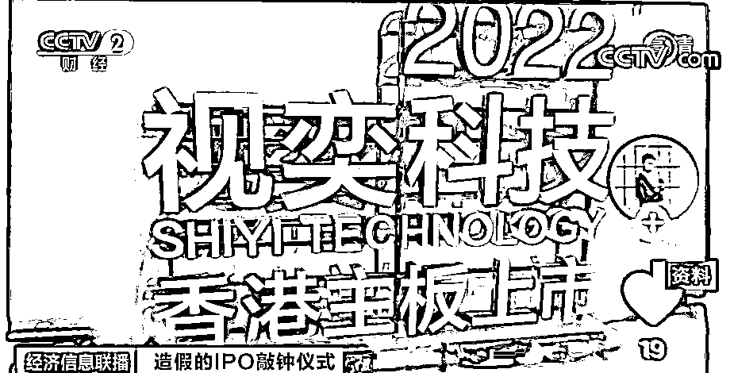
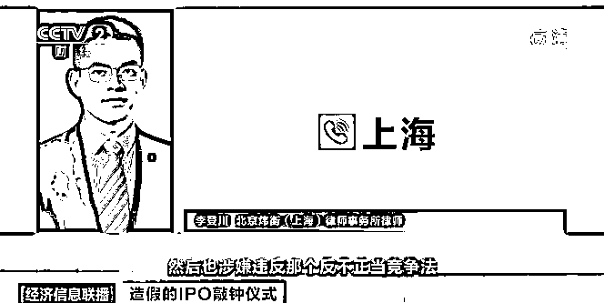

# 荒唐至极！上市仪式，竟是造假？交易代码还能“套牌”？这家公司“官宣上市”，竟是“自导自演”一出戏...

> 原文：[`mp.weixin.qq.com/s?__biz=MzIyMDYwMTk0Mw==&mid=2247531819&idx=5&sn=d5e64fd807a431a371eef7e66762ec4a&chksm=97cbb613a0bc3f05eacb16d43ce8245135a58e7bb26672382717d7da3ed91b0e81a8981e6ef1&scene=27#wechat_redirect`](http://mp.weixin.qq.com/s?__biz=MzIyMDYwMTk0Mw==&mid=2247531819&idx=5&sn=d5e64fd807a431a371eef7e66762ec4a&chksm=97cbb613a0bc3f05eacb16d43ce8245135a58e7bb26672382717d7da3ed91b0e81a8981e6ef1&scene=27#wechat_redirect)

可能很多投资者都听说过上市公司财务造假，但最近，福建厦门有一家公司却给自己伪造了一场在香港证券交易所上市仪式。这究竟是怎么一回事？

**上市仪式竟是“自导自演”？**

[`mp.weixin.qq.com/mp/readtemplate?t=pages/video_player_tmpl&action=mpvideo&auto=0&vid=wxv_2314115953594433539`](https://mp.weixin.qq.com/mp/readtemplate?t=pages/video_player_tmpl&action=mpvideo&auto=0&vid=wxv_2314115953594433539)

△央视财经《经济信息联播》栏目视频

今年 1 月 22 日，福建厦门某酒店，一家名为视奕科技的公司在此举办了在港交所主板上市的活动，吸引了大量人员参加。 

从参与这场敲钟仪式的人员发布在社交平台上的视频来看，视奕科技在厦门某酒店租赁了场地，**现场装饰明确显示该公司举办的是“香港主板上市仪式”**，视奕科技还煞有介事地按照港交所惯例，在现场安排了敲锣仪式，**还发布了所谓的新闻通稿**。

但记者发现，当天港交所并没有名为视奕科技的公司挂牌上市，在港交所也根本查不到该公司。

从当天的活动视频来看，该公司公布其港交所交易代码为 01592，记者查询后发现，**该交易代码其实属于另一家上市公司****基石控股。** 

记者今天致电视奕科技，询问其上市的相关事宜，得到的答复却是，**这个问题“不便回答”**。

*   **厦门市地方金融监督管理局：“视奕科技在港上市”不属实**

记者随后又联系了厦门市地方金融监督管理局，工作人员表示，3 月 11 日，他们已就此事发布声明。

**声明称**：“视奕科技即将于港交所正式敲钟上市”的消息并不属实。 

**视奕科技关联公司涉嫌网络传销**

[`mp.weixin.qq.com/mp/readtemplate?t=pages/video_player_tmpl&action=mpvideo&auto=0&vid=wxv_2314114838429663235`](https://mp.weixin.qq.com/mp/readtemplate?t=pages/video_player_tmpl&action=mpvideo&auto=0&vid=wxv_2314114838429663235)

△央视财经《经济信息联播》栏目视频

一家根本就没上市的公司，如何自导自演了一场闹剧？

记者在采访中发现，视奕科技主要从事的是视力恢复产品的销售，与当地另一家名为眼波科技的公司关系密切，两家公司在同一个地址的不同楼层办公，甚至联系电话都是一模一样的。**而当记者致电眼波科技询问两家公司的关系时，又得到了无法回应的答复**。 

*   **港交所上市公司飞扬集团：与视奕科技并无实质性合作关系**

据了解，眼波科技的关联公司眼波优品前几天刚被河南省新乡市监管部门点名，**眼波优品利用互联网平台从事网络传销活动**被列为河南新乡当地的**2021 年的十大典型侵权案例**。采访过程中，记者发现，视奕科技自导自演的这一出“上市”闹剧，或许与其签订的一份战略合作框架协议有关。

今年 2 月 10 日，视奕科技和港交所上市公司飞扬集团订立了一份战略投资合作框架协议，这份战略合作框架协议表明，**双方未来可能会通过“成立及投资合营公司”等方式开展合作**。

但截至 3 月 11 日，双方并未实质性达成任何协议或安排。而飞扬集团也在 3 月 11 日当天发布澄清公告并表示，其与视奕科技在业务及财务运作方面是相互独立的，**双方也没有相互持股的关系**。 

法律人士表示，视奕科技虚张声势、自导自演这场大戏，背后的目的，**很可能是为了公司的商业利益，但这种行为已经涉嫌违法**。 

**北京炜衡（上海）律师事务所律师 李登川：**它涉嫌违反广告法，也涉嫌违反反不正当竞争法，以广告法来讲，它有可能会被处以罚款，同时会吊销医疗机构执业许可证。如果是以反不正当竞争法来讲，它有可能除了罚款以外会被吊销营业执照。

来源：央视财经（ID：cctvyscj）

← 向右滑动与灰产圈互动交流 →

