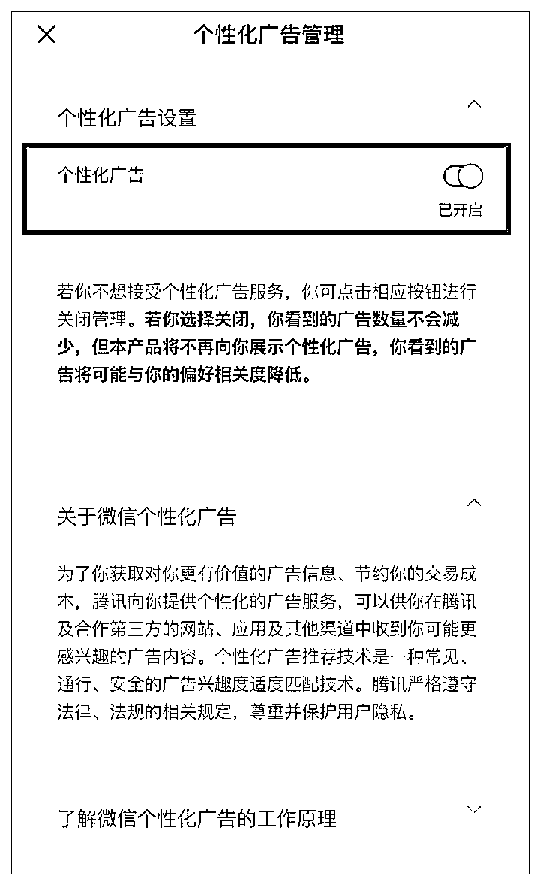
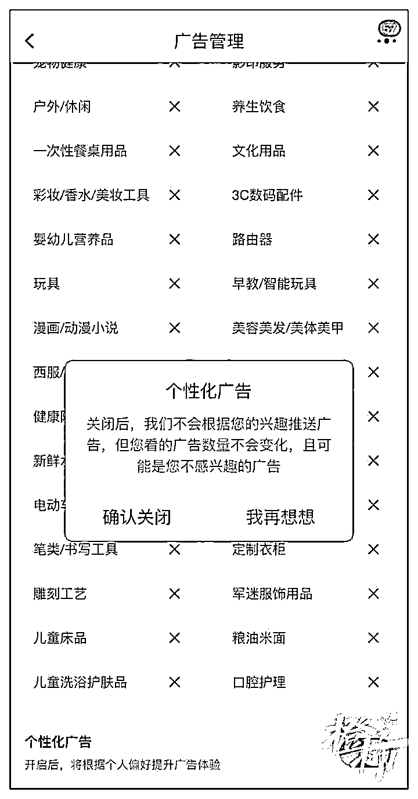

# 改了! 微信、抖音、淘宝等可关闭这一功能

> 原文：[`mp.weixin.qq.com/s?__biz=MzIyMDYwMTk0Mw==&mid=2247531819&idx=7&sn=adaea42d976fee839d47aff781a68fe3&chksm=97cbb613a0bc3f05d43effc556a2a725723cb5cf685f96d40c5b0c9da44767bb4437b6b8171b&scene=27#wechat_redirect`](http://mp.weixin.qq.com/s?__biz=MzIyMDYwMTk0Mw==&mid=2247531819&idx=7&sn=adaea42d976fee839d47aff781a68fe3&chksm=97cbb613a0bc3f05d43effc556a2a725723cb5cf685f96d40c5b0c9da44767bb4437b6b8171b&scene=27#wechat_redirect)

大部分人有过这样的经历，曾经浏览过的新闻，或在电商平台上购买过商品后，App 会源源不断地向你推送相关的新闻或商品。

这就是基于算法的个性化推荐。**不过从现在开始，你可以自己决定要不要被推荐。 **

记者发现，抖音、微信、淘宝、今日头条、小红书、微博、大众点评等多款 App，近期均上线了算法关闭键，**允许用户在后台一键关闭“个性化推荐”。 **

不过，目前大部分 App 把“个性化推荐”关闭键埋得比较深，一般会在隐私、广告相关的设置选项中找到。

比如微信，可以通过后台打开“设置”，进入“个人信息与权限”，再点进“个性化广告管理”，关闭个性化广告。 

这个页面的提示信息显示：**若你不想接受个性化广告服务，你可点击相关按钮进行关闭管理。若你选择关闭，你看到的广告数量不会减少，但本产品将不再向你展示个性化广告，你看到的广告将可能与你的偏号相关度降低。 **

进入淘宝 App 的个性化广告推荐，橙柿互动记者打开自己的“个性化广告”页面，**发现后台被智能算法标注了“身体护理”“创意礼品”“速溶冲调”“宠物健康”等 60 多个广告标签。 **

这些个性化广告标签是怎么确定的呢？淘宝后台的隐私说明显示：我们会将您填写的账户资料、订单信息、设备信息和服务日志信息去标识化处理后用于广告推荐。智能算法会基于机器学习、模型预测和知识图谱向您推荐可能感兴趣的商品或服务的广告。 

如果想要关闭淘宝的个性化广告，可以通过后台的“设置”，进入隐私的“广告管理”进行关闭。 

作为算法算法的鼻祖，日前，今日头条也上线了关闭键。可以通过后台的“隐私设置”，进入“个性化推荐设置”进行关闭。今日头条的个性化推荐维度比较多，有 4 个按钮。比如可以一键关闭“个性化推荐”，也可以根据自己的个性需求定向关键。又比如有基于所在地位置个性化推荐，基于搜索记录个性化推荐，基于关注列表个性化推荐等。

今年 1 月，《互联网信息服务算法推荐管理规定》出台，明确了算法推荐服务提供者应当以显著方式告知用户其提供算法推荐服务的情况；向用户提供不针对其个人特征的选项，或者向用户提供便捷的关闭算法推荐服务的选项，该规定自 3 月 1 日起施行。

来源：都市快报，长沙晚报

← 向右滑动与灰产圈互动交流 →

