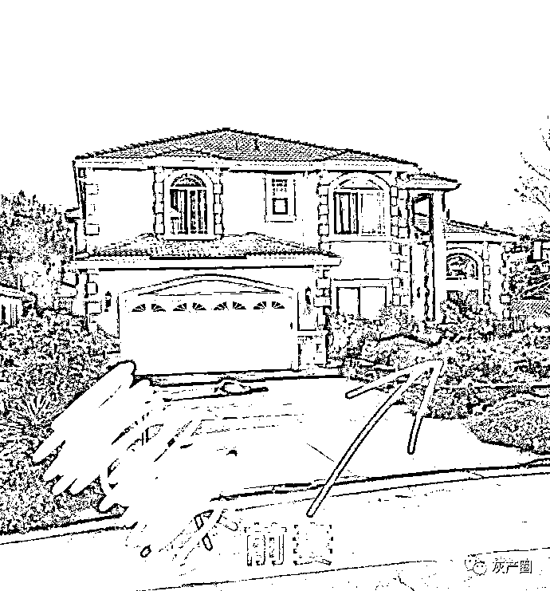

# 美国湾区渣男，前妻刚走 1 个月就结婚，赶走前岳父母，把前妻骨灰冲下水道

> 原文：[`mp.weixin.qq.com/s?__biz=MzIyMDYwMTk0Mw==&mid=2247531903&idx=1&sn=c44dae269e0da83c3e6c0f5a2346765e&chksm=97cbb647a0bc3f51b77eae2588b35bac196210b2e3d4bd5bae624fd1dd18e4d6c9bbc2437458&scene=27#wechat_redirect`](http://mp.weixin.qq.com/s?__biz=MzIyMDYwMTk0Mw==&mid=2247531903&idx=1&sn=c44dae269e0da83c3e6c0f5a2346765e&chksm=97cbb647a0bc3f51b77eae2588b35bac196210b2e3d4bd5bae624fd1dd18e4d6c9bbc2437458&scene=27#wechat_redirect)

这两天爆出湾区渣男事件，引起无数国人共情！ 

某🐶家员工和前妻脸家员工，结婚近 20 年，女方为独生女，二人育有一女一子。
女方 2020 年不幸患胃癌，2021 年春病情恶化，
2021 年 3 月女方父母来美国临终关怀；
2021 年 5 月女主去世，遗产受益人是两个未成年的孩子和老公。女主预计获得 200 万美元脸家保险赔偿。  

保险的遗嘱百分之 80 是孩子，百分之 20 是配偶

2021 年 6 月 13 日男主拿到前妻死亡证明，开始网上交友。
2021 年 6 月 21 日认识新妻子，并于 9 天后网上结婚。（对，9 天）；
2021 年 8 月新妻子入住亡妻故宅，9 月怀孕。
2021 年 11 月老人表示要等女儿的纪念椅建造完成再走；
2022 年 1 月椅子建造完成但是国内疫情恶化老人无法回国，希望打完加强针再走。但彼时机票价格高涨，男主拒绝购买全额商务舱机票，表示可以给 3000 刀每人买机票，余额自付；

 2022 年 3 月，男主因为女方父母干扰他“其乐融融”的新家庭，报警强制驱逐二老 30 天离境；
前妻骨灰一分为二，父母带一半回国、男主留一半要撒海里海葬。男主认为海葬不需要购买加州墓地，并认为国内墓地太贵（4 万美元-更正），一度抗拒。
不知中间发生了什么，总之现在的结果是前妻骨灰被埋在豪宅前院。

男主对于前院埋骨灰和墓地的澄清

二老因为不堪其辱对女儿同学同事发起求助，将此事公开。

男主对此事的回应

湾区渣男的后续让人难以相信：业主群爆出来他把前妻的骨灰冲进下水道了

他的新老婆心理素质也真是好，pyq 晒着住着亡妻打理过的房子也是心安理得……

网友还爆料了一些更让恐怖的

华人群里都在商量改保险受益人交流咨询 trust 了

湾区渣男的事情让网友充分理解了那句话：在美国，如果一个人遵纪守法，那他完全有可能是个人渣。
老婆去世后 9 天再婚：不犯法。
把老婆骨灰埋在前院：不犯法。（后来说那个位置不能埋要换个位置）
老婆的遗产不分给老婆的父母：不犯法（说美国父母不是第一顺位继承人）
女儿没有生日蛋糕而新老婆有玛莎拉蒂：不犯法
把老婆一部分骨灰冲进下水道：不犯法
激怒死去老婆的父母让他们动手、然后报警把他们驱逐：不犯法
……
充分理解了法律是底线，是底线。

来源：微博那些事儿

← 向右滑动与灰产圈互动交流 →

