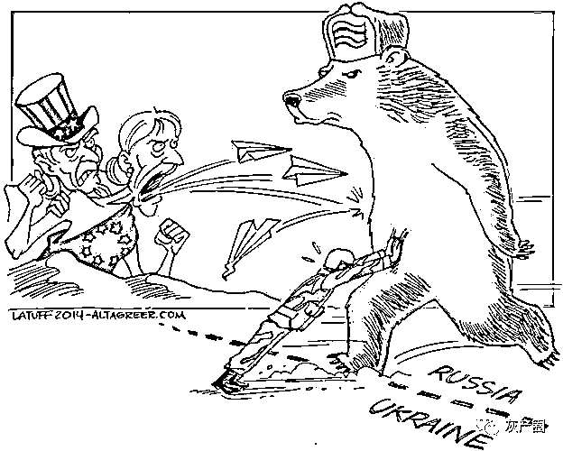
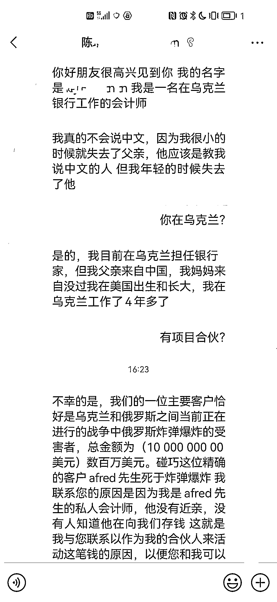
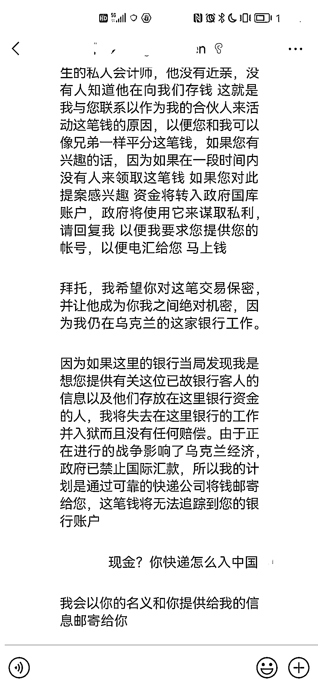

# 天降乌克兰百万遗产？

> 原文：[`mp.weixin.qq.com/s?__biz=MzIyMDYwMTk0Mw==&mid=2247531903&idx=4&sn=9191896faf8534d30f28a92d37eeafd7&chksm=97cbb647a0bc3f510cb3b1fa7ada8150bd5cc34ecaf745cc17903fcb4e3ac6284620a64e6988&scene=27#wechat_redirect`](http://mp.weixin.qq.com/s?__biz=MzIyMDYwMTk0Mw==&mid=2247531903&idx=4&sn=9191896faf8534d30f28a92d37eeafd7&chksm=97cbb647a0bc3f510cb3b1fa7ada8150bd5cc34ecaf745cc17903fcb4e3ac6284620a64e6988&scene=27#wechat_redirect)

近期，国际局势变化引起社会各界广泛关注。在国际局势牵动人心之际，骗子却开始利用时事进行诈骗。微信平台近期就收到了不少用户举报：**有人伪装成在乌克兰银行工作的会计师，声称其客户在战争中遇难，遗留下数百万美元无人认领，邀请用户与其合作瓜分钱财。**

诈骗分子先通过短信或社交平台广撒网式的发送信息，吸引用户进一步沟通。

只要有人回复，骗子就会用提前编好的话术诱骗用户与其合作，**并提出通过邮寄的方式将现金寄来，后续再通过运费、海关费、保证金等借口要求用户向其支付费用以实施诈骗。**

其实这个骗局就和常见的杀猪盘类似，同样是通过社交平台促成双方的进一步交流，在交流中向受害者透露自己有赚钱的方法，吸引受害者与其合作共谋财富。

但在这次的骗局中我们不难看出漏洞，暂且不说如何把这笔巨款从乌克兰银行中取出，就说“邮寄现金”，《快递市场管理办法》中规定快递是不能寄送流通货币的，那么这百万美元又要如何从遥远的乌克兰寄回国内呢。

看到这里一定有朋友疑惑了，是呀，这不很明显是个骗局吗？

是的，对于我们 5G 冲浪且游走在社会潮流前端的年轻朋友来说，这样的骗局可以说是“一眼假”。可是，对于那些刚学会用智能手机、不网购不了解快递的中老年人来说呢？骗子当然也是拿捏了这一点，所以专挑这类人群下手。

一哥想说，比起年轻人早早就接触网络，不少中老年人是在智能手机普及后，才学会了如何上网，一些听着就离谱的事情他们也只当是自己落伍了而轻易相信。

所以啊，当你看到这篇文章的时候，一定要告诉家里的长辈：**陌生人不会平白无故给你好处，涉及钱财的事情再三思量，不轻信，不转账。**

我们强烈谴责那些利用乌俄冲突做幌子企图诈骗的违法违规行为，如果大家在微信平台发现此类骗局，请积极投诉举报，核实相关证据后我们将会第一时间进行处理。

来源：微信 110

← 向右滑动与灰产圈互动交流 →

