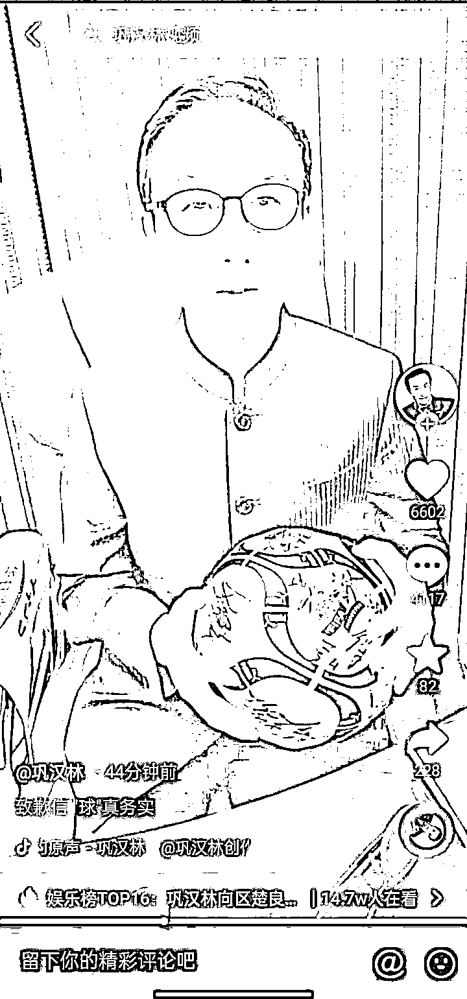
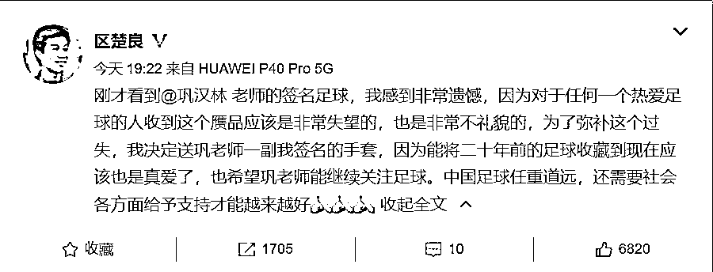
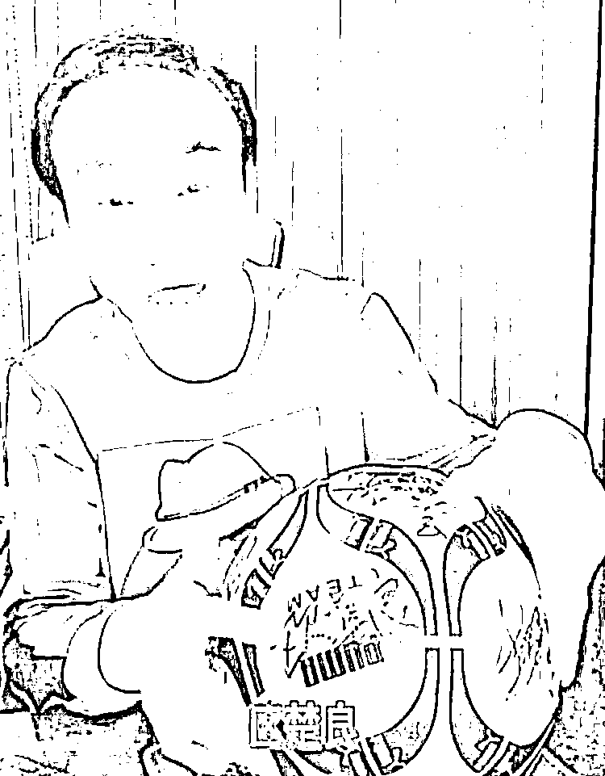
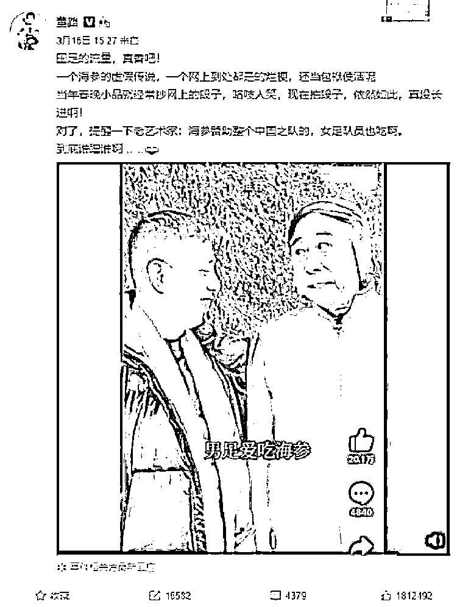
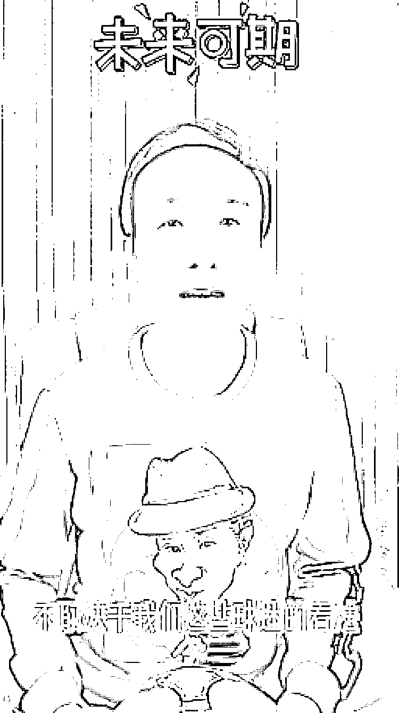
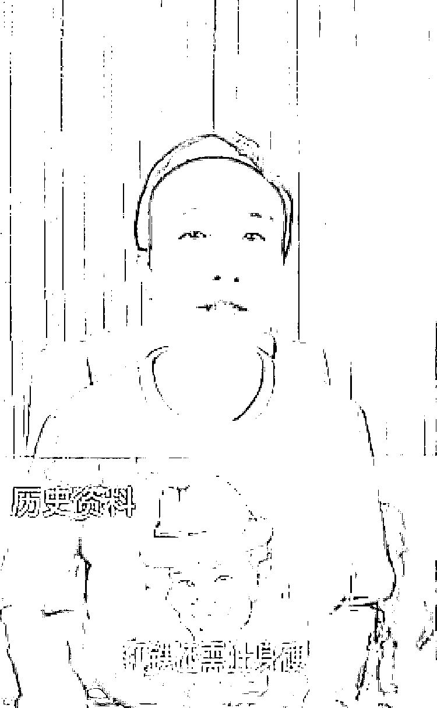

# 巩汉林致歉

> 原文：[`mp.weixin.qq.com/s?__biz=MzIyMDYwMTk0Mw==&mid=2247531903&idx=5&sn=5e08eca4aa41d2eee3b8dd764d58e85e&chksm=97cbb647a0bc3f5180b76a386d01899a103606563fae3dfb64ee181abf73e5dee476eedd54ad&scene=27#wechat_redirect`](http://mp.weixin.qq.com/s?__biz=MzIyMDYwMTk0Mw==&mid=2247531903&idx=5&sn=5e08eca4aa41d2eee3b8dd764d58e85e&chksm=97cbb647a0bc3f5180b76a386d01899a103606563fae3dfb64ee181abf73e5dee476eedd54ad&scene=27#wechat_redirect)

“20 年前，我收藏了这枚足球，误以为得到了国足黄金一代球员的签名，当时对签名的真伪没有得到认证。”17 日晚，喜剧表演艺术家巩汉林在个人短视频平台账号上发布的一条致歉视频引发热议，而故事还要从 17 日下午讲起。 

图片来源：巩汉林短视频作品截图。

在此条致歉视频之前，巩汉林在 17 日下午发布了一条带有 #打铁还需自身硬# 词条的短视频。在视频中，他向网友们介绍着自己收藏的一个黑白相间的足球。

[`v.qq.com/iframe/preview.html?width=500&height=375&auto=0&vid=o3328zy58l7`](https://v.qq.com/iframe/preview.html?width=500&height=375&auto=0&vid=o3328zy58l7)

“这上面的签名，都是当年中国足坛上叱咤风云的人物，资深的球迷一定会熟悉他们。”面对着镜头，巩汉林细数着足球上写满的签名。从范志毅、马明宇、黎兵，到区楚良、孙继海，当一串串熟悉名字的浮现在眼前，巩汉林将记忆带回到了 2001 年 10 月 7 日的五里河体育场。那一天，国足以 1:0 战胜阿曼队，提前 2 轮进入到 2002 年韩日世界杯决赛圈。 

一段颇具情感的视频，引得网友们纷纷送上赞誉。可在晚些时候，事件却发生了反转。

图片来源：区楚良微博截图。

前国足门将区楚良发布微博说道，“刚才看到巩汉林老师的签名足球，我感到非常遗憾，因为对于任何一个热爱足球的人收到这个赝品应该是非常失望的。”而为了弥补这个过失，区楚良决定赠送巩汉林一副手套。他表示，能将二十年前的足球收藏到现在是真爱，希望巩汉林能够继续关注足球。

之后才出现了文章开头的那一幕。巩汉林真诚地向区楚良，向诸多球员致歉。“我发布的视频中提到的球员，都是我心目中的英雄。”巩汉林的话语间满是真诚以及对国足“黄金一代”球员们的敬意。

## **“躺枪”冯巩：**

## **爱之深责之切，只是说出老百姓心里话**

这两天，巩汉林和冯潇霆关于中国男足的隔空对话引发网友关注，甚至因“冯巩”之争，“冯巩”这个词条也上了热搜，冯巩本人以往发的针砭时事的短视频也被许多翻了出来。

今天，被卷入“冯巩”两人关于中国足球的话题争议之中的**冯巩方做出了回应。**

**冯巩经纪人接受媒体采访时表示，被卷入“冯巩之战”是躺着中枪，早前发布的谈及国足的视频被有人拿出来，纯粹是蹭流量，蹭热度。**

**对于足球评论人董路“小品抄袭网络段子”的指责，冯巩经纪人回应称，“这不叫抄袭，是来源于生活，然后再把它艺术加工，**按照我们的规律和方式、方法呈现给观众。”****

********

****同时，他也表态支持巩汉林：“汉林老师也是出于内心的、善良的一方面，没有完全贬低中国足球，是对于中国足球的爱护和爱戴。就说了一个普通老百姓的心里话。”**** 

****而对于“冯巩”之争不断发酵，**巩汉林本人今天也发视频对此进行了回应**。****

****巩汉林先回忆了在老家沈阳五里河体育场看的中国男足比赛，那时候中国男足 1:0 赢了安曼，提前两轮进入了 2002 世界杯决赛圈，这是中国男足历史上第一次也是至今唯一一次进入世界杯，“当时可以说是举国欢腾，大家都走上街头庆祝，热闹非凡。”****

****接着，巩汉林感慨道：“21 年后，世界杯又来到了我们面前，遗憾的是我们这些球队和球迷成为了门外的看客。”****

****巩汉林接着真诚表示：“说句真心话，凡是中国球迷，都不希望自己的球队倒下，我们只是爱之深，责之切，从这个意义上讲，打铁还需自身硬。****

****正像《人民网》评论，中国足球的未来不取决于球迷的看法，而是取决于足球人如何正确认识中国足球，真心改变，希望国足在 12 强赛最后两场取得好成绩，我坚信中国足球终将有一天还会冲进世界杯。”****

********

********

****其实，无论是巩汉林和冯巩，还是网友球迷，大家共同的心愿都是希望中国男足能够进步取得好成绩，发表一些评论或者建议也大多本着“爱之深责之切”的心态。****

****对于冯巩方和巩汉林的回应，你怎么看呢？****

******此前报道：******

****[巩汉林批评男足，被男足队长暗讽，巩汉林：演小品怎么丢脸了？你才丢脸](http://mp.weixin.qq.com/s?__biz=MzIyMDYwMTk0Mw==&mid=2247531669&idx=4&sn=73c055b7c36b15b384763ccfc25ed6a4&chksm=97cbb7ada0bc3ebb5c216cc8f37f08aff3f9aad82341029347cea6ee779491eea18c75ceb404&scene=21#wechat_redirect)****

****[冯巩讽刺国足吃海参段子走红，以后国足不让骂了？网友：学学姚明！](http://mp.weixin.qq.com/s?__biz=MzIyMDYwMTk0Mw==&mid=2247531819&idx=1&sn=00c42da8b2b1eff59340fe59046c0456&chksm=97cbb613a0bc3f051f1f44fc949d75d63ae44d4cebb25e757d90c1d4bdf23d386672c4da3975&scene=21#wechat_redirect)**** 

****来源 ：新闻晨报、周到上海 APP、中国新闻网、红网、潇湘晨报****

********

****← 向右滑动与灰产圈互动交流 →****

********