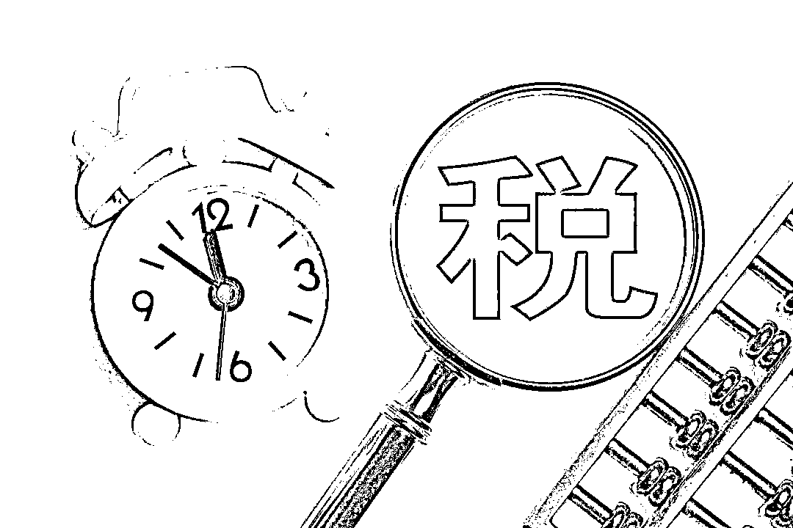
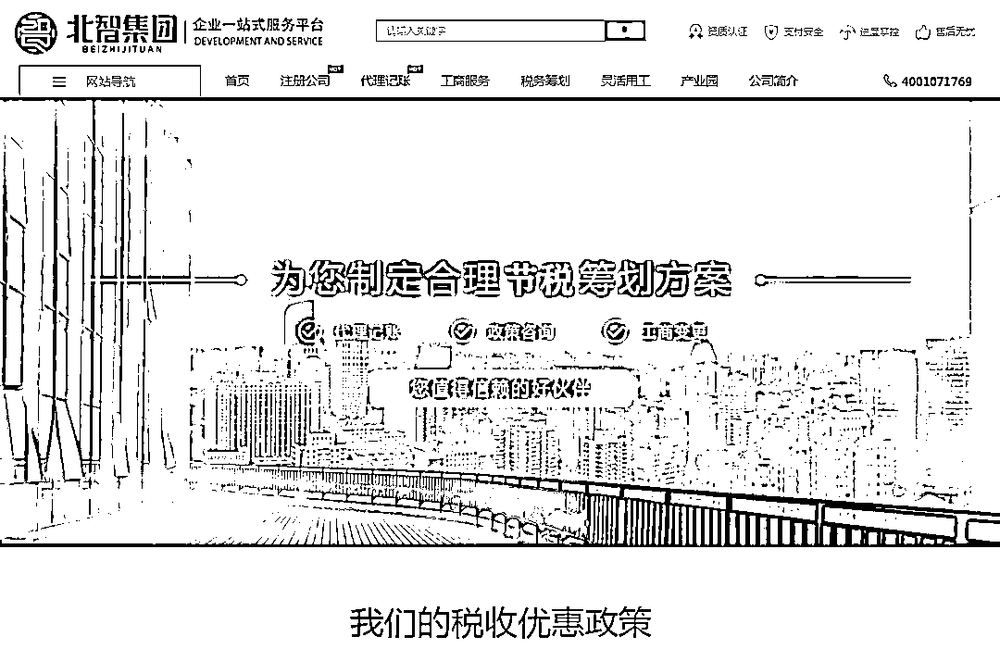
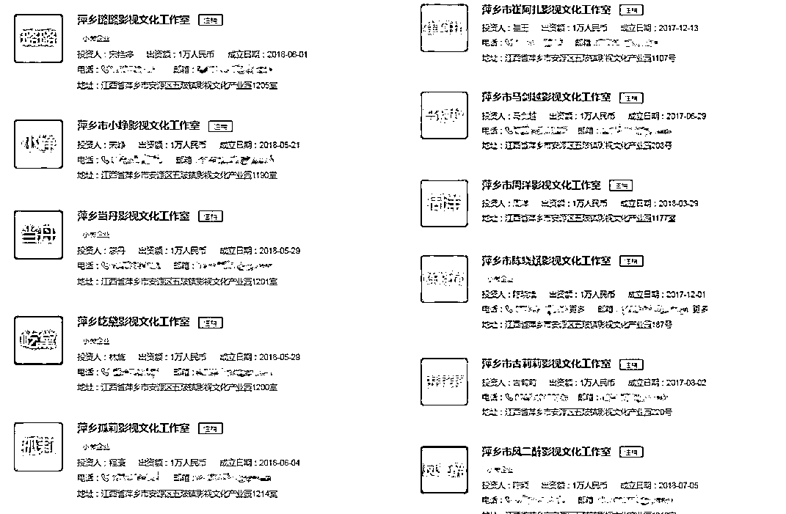

# 揭秘明星偷逃税套路：让亲戚成立公司，千万片酬可“省”税超 300 万

> 原文：[`mp.weixin.qq.com/s?__biz=MzIyMDYwMTk0Mw==&mid=2247531903&idx=7&sn=9088d69a57aa6d620ef2d9501732b02f&chksm=97cbb647a0bc3f51bfec85ee02baca8237576d0ee257b038af03af2e4102b8a83348c534e84a&scene=27#wechat_redirect`](http://mp.weixin.qq.com/s?__biz=MzIyMDYwMTk0Mw==&mid=2247531903&idx=7&sn=9088d69a57aa6d620ef2d9501732b02f&chksm=97cbb647a0bc3f51bfec85ee02baca8237576d0ee257b038af03af2e4102b8a83348c534e84a&scene=27#wechat_redirect)

从范冰冰到郑爽，从雪梨到薇娅，又一个偷税漏税的人出现了。

演员邓伦因为偷逃税款，被追缴并罚款 1.06 亿元，而后，其个人微博、抖音账号等均被封禁，代言品牌也纷纷解约。

3 月 16 日、17 日，红星资本局采访了一家号称可以为客户制定合理节税筹划方案的公司，了解了明星们偷税逃税的常见套路。通过该公司提供的税务框架，一位片酬千万的演员可以“节省（偷逃税）”超过 300 万元。

但红星资本局了解到，税务部门所使用的的税收大数据已经实现对税务系统业务流程的全监控。一位资深的税务筹划行业从业人士也对红星资本局表示，明星应该对相关政策的解读更加准确，以正确的缴税方式还原真实的业务经营轨迹。

**从 40%的税率降到 9.5%**

**千万片酬或可“节省”税费三百万**

3 月 16 日，红星资本局通过搜索引擎输入“税务筹划”等关键词，从前排显示为“广告”的网页中随机挑选了一家企业——北智集团进行咨询。

该公司的网站页面显示，其能为客户制定合理的节税筹划方案，一站式解决个人所得税、企业所得税、增值税等税务筹划。在留下联系方式后，工作人员小王（化名）主动联系了红星资本局。

截图自北智集团官网 

小王（化名）告诉红星资本局，他们公司曾为艺人、主播提供过服务，不过，该行业现在查得比较严。

在咨询的过程中，**红星资本局虚构了一名片酬 400 万元（税前）的演员 A 进行咨询，如果按照个人劳务报酬所得税进行缴纳，A 应缴纳 40%的税款。**

而小王称，**按照他们公司的税务框架走，可以只缴纳 9.5%左右的税收，**“一般来说，我们的正常架构是：注册一家一般纳税人的个人独资企业，建立业务往来模式，然后做核定征收。”

简单来说，演员 A 的名下会有主体公司 X，在制作公司要付给 A 片酬时，不直接打给 A，也不通过公司 X，而是让 A 找一个可以信任的人 B，重新成立一家公司 Y（个人独资企业）。

**“找的 B 不能是你们公司（指 X 公司）的高管、股东，必须要跟你们毫无关联，可以去找这个艺人的亲戚来成立 Y 公司。”**小王对红星资本局说。

小王称，只需要提供 B 的相关资料，他们会帮助在合作的园区成立 Y 公司，明面上看，Y 公司的主营业务是信息服务、咨询、业务推广等。

实际上，演员 A 的 400 万元片酬会打到 Y 公司的账户上，因为 Y 公司所在的园区有优惠的税收政策，只用缴纳 3.5%的核定个税、6%的增值税，可能会存在一定的附加税（不定）。

**“这笔钱本来是在公司 Y 的公户上，但是在完税后，B 作为法定代表人可以把钱直接转到自己的私户上，然后就可以随便转了。”**小王对红星资本局说。

以此计算，演员 A 在获得 400 万元的片酬后，理应缴纳 160 万元的税款，但经过北智集团的“税务筹划”后，只用缴纳 38 万元的税费。

**如果把片酬放大到 1000 万元，则可“节省”税费约 305 万元。**

**合作的园区在哪里？**

**自称合法合规，但需一年一注销**

在沟通的过程中，红星资本局曾问及上述做法是否合法合规，小王表示，这是合理合法合规的，“江西省萍乡市有一个园区，我们签了招商引资的合同，这里被称为‘税收洼地’。”

不过， 在谈论到具体操作细节时，**小王又提及要注意控制风险，“新成立的公司要一年一注销。”**

当红星资本局问及可能存在什么风险、是否可能被查时，小王回答称：“对，所以我们一年一注销，就可以把控风险。”

“我们提供的是一站式服务，去帮你注册刻章、报税、纳税、记账，一站式服务做下来，一年只收 3 万元的管理服务费用。”小王对红星资本局说。

据小王提供资料，**在去帮忙成立个人独资企业（即前文提到过的 Y 企业）时，他们会尽量争取法定代表人无需到场，只用提供有效身份证原件和签字注册文件，一般需要 15 天-2 个月。**

另外，小王还建议称，成立 Y 公司后，一年的走账金额最好低于 8000 万元，“到一个亿的话会有预警。”

红星资本局通过天眼查 APP，选择了多项限制条件，把地域限制在江西省萍乡市，把企业类型限制为“个人独资企业”，行业限制为“文化、体育和娱乐业”，限制企业状态为“注销”。

**最终，红星资本局一共筛选出了 218 家企业，多家企业的命名方式为“萍乡市 XXX 影视文化工作室”，注册地基本上都在江西省萍乡市安源区五陂镇影视文化产业园。**

截图自天眼查 APP 

以萍乡市艾乐影视文化工作室为例，其法定代表人和股东均为万永鑫，注册资本为 1 万元，成立于 2018 年 6 月，现已注销，但无法查看注销时间。

****改口称“现在只有正常缴税”****

****查无北智集团，号称可以返还税额****

**3 月 17 日，在和小王的详细沟通结束后，他曾表示要去落实一下园区现在的税收优惠政策，但在 3 个小时以后，小王称，“现在落不了（园区）了。”**

**小王表示，**自从去年雪梨、薇娅偷逃税的事情曝出后，影视、主播行业都不可以做了，“享受不了核定征收的政策，现在都只有正常缴税了。”****

**“现在只有一种方法，去正常地缴税然后享受增值税返税。”小王介绍称，有的园区可以享受优惠税收政策，在缴纳 6%的增值税后，可以返还 6%×30%的税额。**

**值得一提的是，小王所供职的公司对外自称为“北智集团”，但红星资本局通过天眼查 APP 并未查到有相同字样存在的公司。**

**红星资本局注意到，自 2018 年税务部门依法查处范冰冰“阴阳合同”等偷逃税问题后，相关部门曾自当年 10 月开展规范影视行业税收秩序工作，影视行业纳税人开展了自查自纠。**

**据新华社报道，**截至 2018 年底，在约两个月的时间内，影视行业纳税人自查申报税款 117.47 亿元，已入库 115.53 亿元。****

**到 2021 年 9 月，中央宣传部印发《关于开展文娱领域综合治理工作的通知》，其中要求严厉查处偷逃税行为，有效维护市场秩序。**

**3 月 16 日，一位资深的税务筹划行业从业人士告诉红星资本局，“在涉税问题上，不光是明星，我们发现绝大多数的同行对相关政策的解读是不够的，水平还停留在原地。”**

**该人士称，**现在有些税务筹划方案听起来更像是故意钻空子、恶意曲解政策，甚至出现故意虚增成本、转移利润等问题，“这些一看就知道很扯。”****

**“真正的税务筹划，是把真实的业务经营轨迹以正确的缴税方式还原，每一点都是有税务局的文件支撑的，老老实实按照税务局说的做就一定不会有问题。”该人士对红星资本局称。**

**红星资本局原创 记者|杨佩雯 编辑|杨程**

****

**← 向右滑动与灰产圈互动交流 →**

****