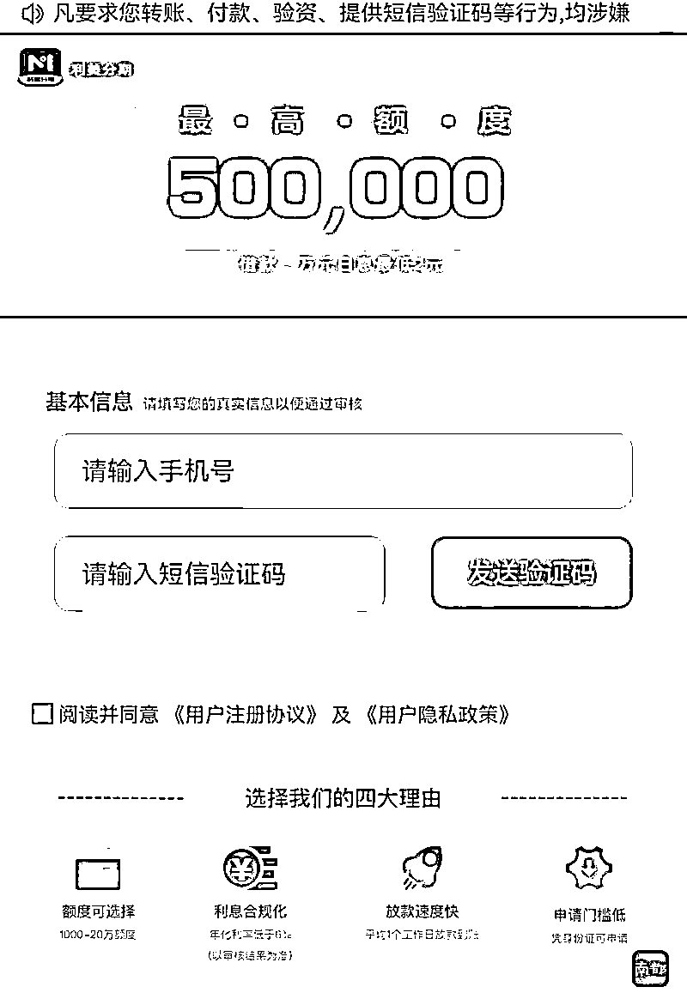
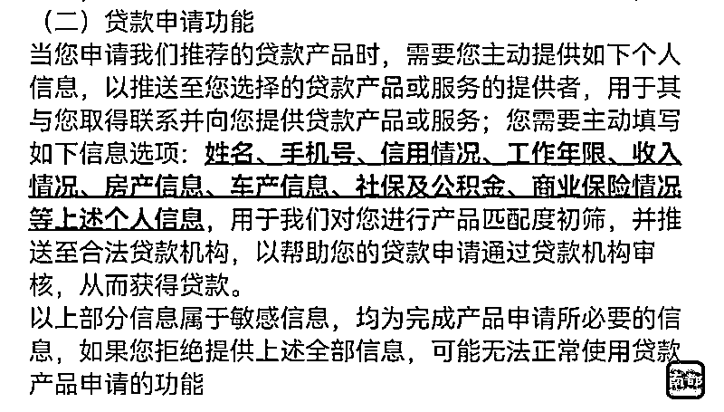
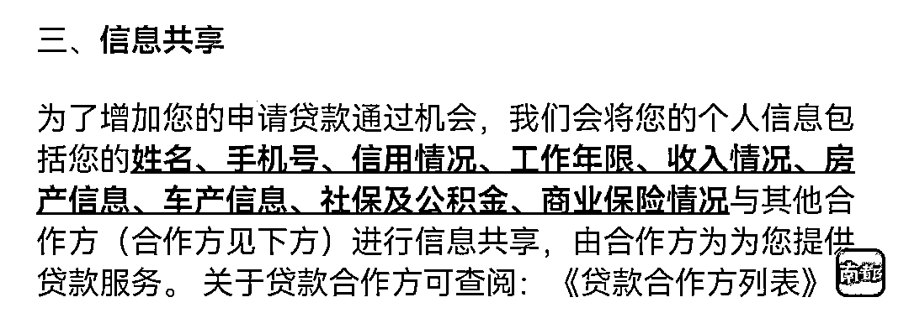
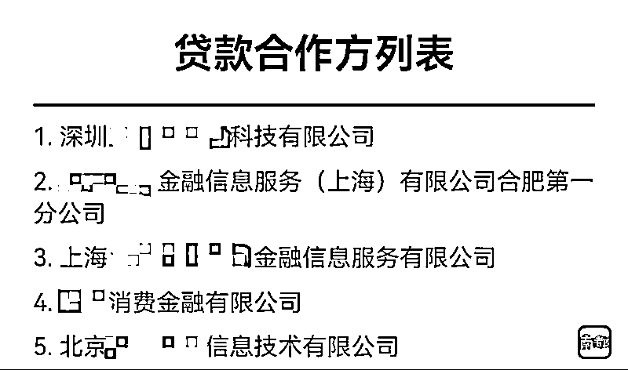
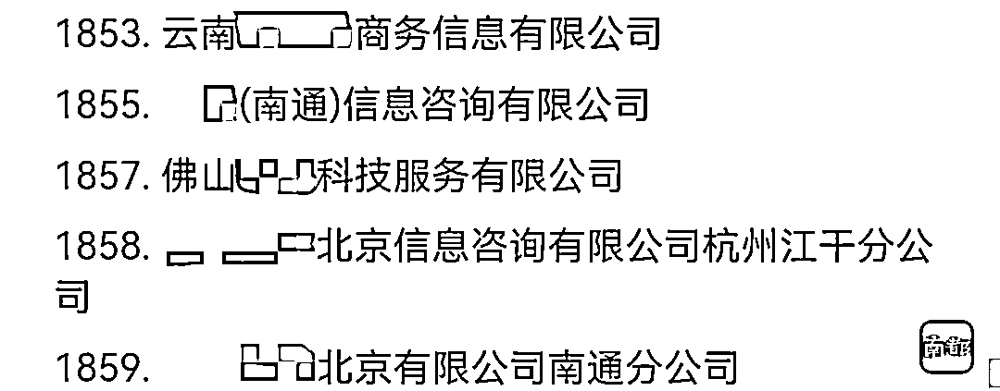

# 当心！你的信息，可能被一键共享给 1859 家公司

> 原文：[`mp.weixin.qq.com/s?__biz=MzIyMDYwMTk0Mw==&mid=2247531903&idx=8&sn=03ed24636965b5dfc651d8198574105b&chksm=97cbb647a0bc3f510a50e66295d79e89dd6a2818df6dcb67869bcf1d7c4479caa409a73e202b&scene=27#wechat_redirect`](http://mp.weixin.qq.com/s?__biz=MzIyMDYwMTk0Mw==&mid=2247531903&idx=8&sn=03ed24636965b5dfc651d8198574105b&chksm=97cbb647a0bc3f510a50e66295d79e89dd6a2818df6dcb67869bcf1d7c4479caa409a73e202b&scene=27#wechat_redirect)

“急用钱？就用 xxx”“借钱不求人，真的借到了！感谢 xxx 借我 20 万”“借了 3 次都成功！我到账 16 万”……互联网平台上，充斥着各种网贷广告。有贷款需求的用户点进广告后，均被要求点击同意各项协议才能进行下一步操作，而对于文字繁密的协议，部分用户可能并不会细看，但很多“猫腻”就藏在其中。

南都记者近日调查发现，不少网络借贷平台均要求用户同意并授权其向合作方共享用户的各项个人信息，有平台的合作方竟达 1859 家公司，其中还包括企业管理、房产中介、汽车销售、汽车租赁、传媒等公司。

南都记者注意到，3 月 14 日，银保监会发布《关于警惕过度借贷营销诱导的风险提示》，其中特别强调了过度收集个人信息，侵害消费者个人信息安全权的问题。银保监会提醒消费者认真阅读合同条款，不随意签字授权，注意保管好个人重要证件、账号密码、验证码、人脸识别等信息。

实测：

**网贷平台要求一键授权将个人信息共享给 1859 家公司**

近日，南都记者随机对网上十余家借贷平台进行测试发现，通过广告点击进入页面后，平台一般会用醒目的大号数字宣传最高可借款额度。如要进行下一步操作，均需用户勾选同意“服务协议”“隐私政策”等协议。

南都记者在点击广告进入一个名为“利美分期”的平台后发现，页面上方宣称“最高额度 50 万，借款一万元日息最低 2 元”。如要进行借款，首先要输入手机号获取验证码，并勾选同意《用户注册协议》及《用户隐私政策》。

据该平台《用户隐私政策》显示，基于用户有贷款申请的需求，为了向用户提供与贷款机构之间贷款申请的撮合服务，“我们在撮合服务过程中需要您的个人信息收集、存储、使用、共享，您同意并授权我们对您的个人信息进行收集、存储、使用、共享等。”该协议还写明，如不同意该协议条款之任何内容，将无法使用公司在该协议项下提供的任何服务。

南都记者继续浏览该协议发现，如要使用贷款申请功能，还需要用户主动填写姓名、手机号、信用情况、收入情况、房产信息、车产信息、社保及公积金、商业保险情况等个人信息。同时该协议还提到，会将上述信息与其他合作方进行信息共享。

当南都记者打开利美分期贷款合作方列表发现，其中竟有 1859 家公司，除一些小额贷款公司、保险公司外，大部分是一些信息技术、科技、金融服务外包、信息咨询、商务咨询公司。此外还包括企业管理、房产中介、汽车销售、汽车租赁、商贸、传媒、电子科技、大数据等公司。

为何一键勾选后会授权将个人信息共享 1859 家公司？合作列表中的信息咨询、房产中介等部分公司如何提供贷款服务？针对这些问题，南都记者尝试联系利美分期方，发现其未留下联系电话，页面显示“如遇问题或投诉请联系公众号”，但其所留公众号却无法搜索到。

天眼查显示，利美分期运营公司“徐州维梦科技有限公司”在工商信息中留下的官网同样无法打开，也并未登记电话。南都记者尝试通过其所留客服邮箱取得联系，截至发稿前对方未作出回应。

后续：

**浏览页面仅一天后便接到推销电话**

南都记者在对十余家借贷平台的实测中发现，大部分平台均在相关协议中要求，会将用户的个人信息共享至第三方，如不同意相关协议则无法使用，而部分平台也并未列明将信息共享的第三方公司具体有哪些。

**南都记者在浏览了多个借贷平台的第二天，便接到了一个来电显示为中国香港的推销电话，对方声称其为支付宝上的一家贷款平台，最高可以信用贷款 50 万元，贷款 1 万元的月息为 60 元。**对方还称，贷款仅需提供身份证信息，其便可查询南都记者的相关征信信息，最快半小时就可以下款。

当南都记者询问如何获取本人的手机号时，对方称，**“你去浏览页面，一般会用你的手机号获取验证码，然后才能测试额度，我们就有了电话号码。”南都记者随后多次与对方强调，并未在其平台输入过手机号获取验证码，该推销人员则表示，这是公司下发的号码，“哪里来的我也不清楚”。然而南都记者在挂断电话后，也并未在支付宝上查询到对方自称的某平台。**

实际上，网络借贷业务侵害消费者个人信息安全已经引起监管部门注意。

3 月 14 日，银保监会发布《关于警惕过度借贷营销诱导的风险提示》，其中特别强调了过度收集个人信息，侵害消费者个人信息安全权的问题。

银保监会表示，一些金融机构、互联网平台在开展相关业务或合作业务时，对消费者个人信息保护不到位，比如以默认同意、概括授权等方式获取授权；未经消费者同意或违背消费者意愿将个人信息用于信用卡业务、消费信贷业务以外的用途；不当获取消费者外部信息等。以上过度收集或使用消费者个人信息的行为，侵害消费者个人信息安全权。

银保监会提醒消费者认真阅读合同条款，不随意签字授权，注意保管好个人重要证件、账号密码、验证码、人脸识别等信息。不随意委托他人签订协议、授权他人办理金融业务，避免给不法分子可乘之机。一旦发现侵害自身合法权益行为，要及时选择合法途径维权。

**背后：**

**快递行业也是个人信息泄露的“重灾区”之一**

近年来，个人信息安全问题屡屡引发关注。2021 年 12 月 16 日，银保监会消费者权益保护局发布关于华夏银行屏蔽消费者权益情况的通报，指出华夏银行违规查询、存储、传输和使用个人客户信息，侵害消费者信息安全权。

通报中提到，华夏银行存在违规查询个人客户交易信息、违规存储和传输个人客户信息的情况，存在信息泄露风险。华夏银行在公用互联网电脑、公用办公电脑中违规存储大量个人客户信息。在开展互联网贷款业务时，通过互联网邮箱向合作方传输个人客户信息，数据交互未实现全面系统控制。上述个人客户信息包括姓名、身份证号、电话号码、通信地址、银行账号、信贷记录、房产信息等。

通报称，华夏银行还存在违规使用个人客户信息的情况。2019 年 1 月至 2021 年 3 月，华夏银行信用卡中心向 1.99 万名已注销信用卡账户的客户致电营销保险产品，部分客户多次明确表示拒绝来电，该行仍持续向其电话营销。

此外，快递行业也是个人信息泄露的“重灾区”之一。南都此前报道，2020 年 11 月，有媒体曝光，不法分子与圆通快递多名“内鬼”勾结，通过有偿租用圆通员工系统账号盗取公民个人信息，再层层倒卖公民个人信息至不同下游犯罪人员，40 万条公民个人信息被泄露。

而早在 2012 年，就有媒体报道称，包括申通、圆通、中通等多家快递公司的快递单号的信息被大面积泄露，单号被放到网上公开售卖，价格从 0.4 到 2 元不等。

南都记者了解到，除“内鬼”泄密之外，消费者隐私被窃取的方式还有面单拍照、系统软件漏洞以及外挂等。南都记者调查发现，快递单买卖生意在网络盛行，个人信息齐全的快递面单 1 元就可买到。

“本工作室长期大量诚心出售实时面单（照片 1 元 文档 2 元 拉群 50 元）”，南都记者在某社群平台发现了一条出售快递面单的帖子，并与对方取得了联系。“照片的不做了，现在都是做文档形式的。”这位卖家表示。随后，其发来一个内含 2000 多条快递信息的 Excel 文档给南都记者“作测试使用”。

南都记者在该文档中看到，每条信息都包含快递单号、收件人的姓名、手机号码、收货地址以及寄件人姓名。其中，从名称来看，寄件人多为商家，收件人位于全国各地。

南都记者随机选取了几个快递单号进行查询，发现确为有效单号。查询网站显示，这些单号均来自韵达快递，相关快件均已在此前不久被签收。

据该卖家介绍，这些快递信息来自各个快递公司，历史信息每条 1 元，实时信息每条 2 元。问及这些信息通过何种方式得到，对方则表示“渠道你别管，肯定安全”。其还表示，“客户”每天都需要从其这里获得几百、几千到几万条不等的信息。

个人信息买卖已形成黑色产业链。上海市公安局有关负责人曾向南都记者介绍，黑客或内鬼盗取信息，中间商从他们手中获取大量信息并建立数据库，信息使用者从他们手中购买信息用于精准推销，甚至用于诈骗、敲诈勒索等下游犯罪。除黑客攻击外，包括物流行业在内的多个行业是信息泄露的“重灾区”，部分从业者将个人信息当作商业信息非法买卖，非法获取及出售公民个人信息呈现职业化趋势。

**判例：**

**曾有团伙获取 40 万条贷款申请人个人信息，涉案上亿元**

个人信息泄露除了会接到不堪其扰的骚扰电话，还有可能面临电信网络诈骗风险。

南都此前报道，按照全国公安机关“云剑-2020”行动打击贷款类电信网络诈骗犯罪集群战役部署，2020 年 7 月 8 日上午 10 时，在公安部统一指挥下，北京、河北、上海、江苏等 15 个省区市公安机关开展集中收网行动，依法严厉打击为贷款类电信网络诈骗犯罪提供服务的非法网络推广团伙。截至 8 日 16 时，共捣毁非法网络推广团伙 57 个，抓获违法犯罪嫌疑人 460 余名，收网行动取得阶段性成效。

2020 年以来，以交纳手续费、保证金为由实施贷款类电信网络诈骗犯罪的案件多发高发。公安机关在工作中发现，不法分子对受害人能够实施精准诈骗，关键在于一些非法网络推广团伙向其贩卖了大量有贷款意向的公民个人信息。

南都记者了解到，在江苏苏州公安机关侦破的案件中，非法网络推广团伙获取了 40 万条贷款申请人的个人信息，并以每条 30 至 50 元不等的价格出售给电信网络诈骗分子，受害人达 4700 名，涉案金额 1.1 亿元。

经初步查明，非法网络推广团伙通常将矛头指向有明确贷款意向的人员，根据他们在互联网、手机 APP 等的浏览、搜索记录，特别是关于“贷款”“下款快”等关键词搜索及相关贷款页面的停留时间，分析其贷款意向，从而精确推送大量虚假贷款广告。

在此基础上，不法分子诱骗有贷款意向人员在虚假贷款广告页面填写姓名、身份证号、手机号等个人信息，进而将非法收集的个人信息贩卖给电信网络诈骗团伙，成为诈骗帮凶。

从非法收集公民个人信息到完成贩卖的过程中，有的不法团伙负责伪造或租用正规营业执照、金融牌照、企业域名、对公账户等；有的负责租用服务器、开发虚假贷款广告页面或手机 App；有的负责投放虚假贷款广告；有的负责将公民个人信息层层转售给电信诈骗分子，各团伙之间相互分工协作，涉案人员多、团伙专业性强、影响危害大。

公安部有关负责人表示，全国公安机关将保持对此类犯罪活动的高压严打态势，会同有关部门强化监管整治，坚决铲除为电信诈骗提供各类非法服务的犯罪团伙，切实维护人民群众财产安全和合法权益。公安机关正告为电信诈骗提供各类非法服务的人员，不要有任何侥幸心理，悬崖勒马主动投案。同时，提醒广大群众增强防范意识，不要轻信免抵押、无手续费、先交钱后放贷等虚假贷款宣传，防止被骗。

来源：南方都市报，利箭在行动

← 向右滑动与灰产圈互动交流 →

