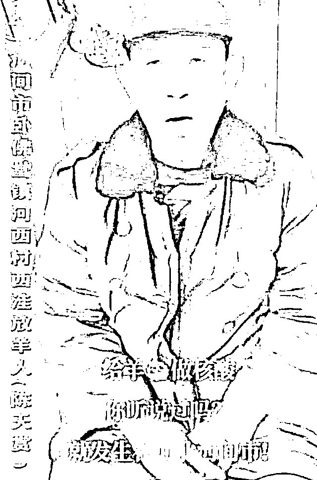
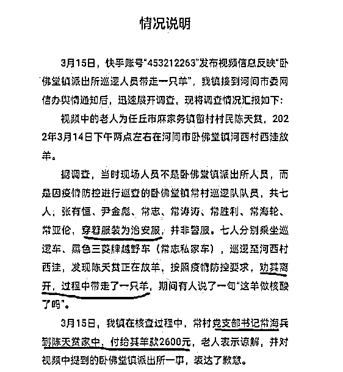
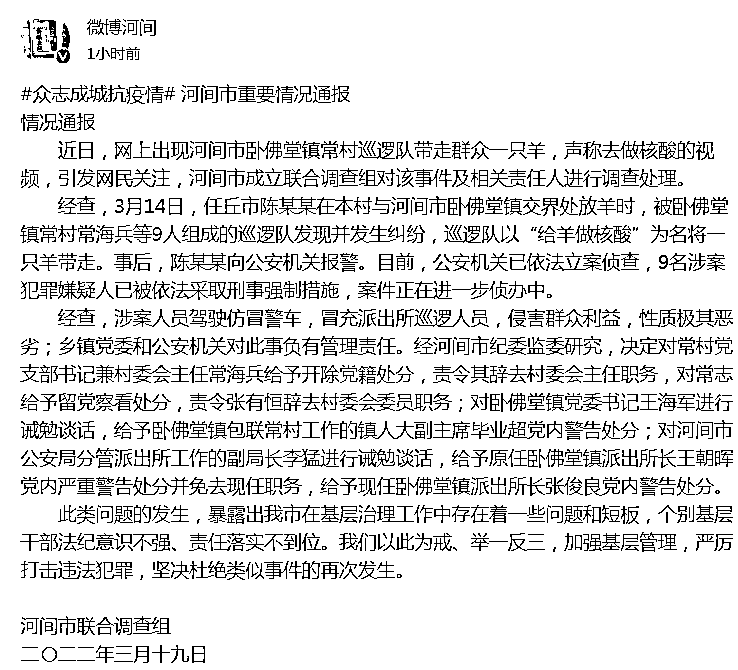
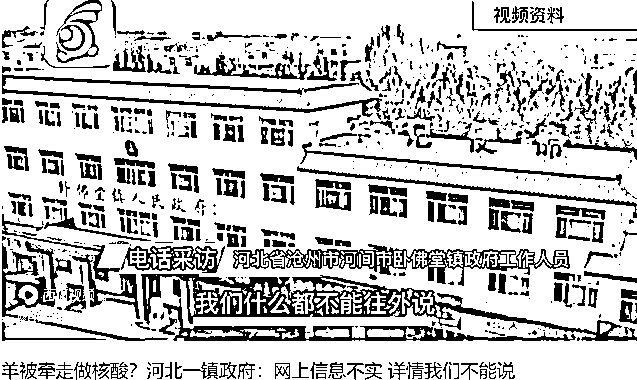
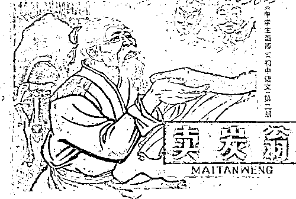

# 老乡，这羊做核酸了吗！是“羊”性还是阴性？

> 原文：[`mp.weixin.qq.com/s?__biz=MzIyMDYwMTk0Mw==&mid=2247531966&idx=1&sn=a1a710d70a6c76ac35c1da33a2c7fbdb&chksm=97cbb686a0bc3f902d533183ed4222926cec33e7f142d02b45e1567635de99205942d623e6a6&scene=27#wechat_redirect`](http://mp.weixin.qq.com/s?__biz=MzIyMDYwMTk0Mw==&mid=2247531966&idx=1&sn=a1a710d70a6c76ac35c1da33a2c7fbdb&chksm=97cbb686a0bc3f902d533183ed4222926cec33e7f142d02b45e1567635de99205942d623e6a6&scene=27#wechat_redirect)

“你家的羊，做核酸了吗？”

村里疫情防控组的人，开着巡逻车来到陈大爷面前，一番冠冕堂皇对话之后以防疫为理由，抓走了陈大爷一只羊，说要去给它做核酸，也没给陈大爷留个电话。

老人于是上网发视频找羊，事情一闹大了，河北省河间市的顺手牵羊就捂不住了。

事后村支书出面给老人 2600 元，算是赔偿了损失，但 7 名巡逻队员如何处置那只羊，以及自己如何被处理，却成了一个谜。

19 日上午，河北省河间市就此事发布情况通报：**涉案人员驾驶仿冒警车，多人被处分。**

目前，公安机关已依法立案侦查，**9 名涉案犯罪嫌疑人已被依法采取刑事强制措施，案件正在进一步侦办中。**

**经查，涉案人员驾驶仿冒警车，冒充派出所巡逻人员，侵害群众利益，性质极其恶劣；乡镇党委和公安机关对此事负有管理责任。**经河间市纪委监委研究，决定对常村党支部书记兼村委会主任常海兵给予开除党籍处分，责令其辞去村委会主任职务，对常志给予留党察看处分，责令张有恒辞去村委会委员职务；对卧佛堂镇党委书记王海军进行诫勉谈话，给予卧佛堂镇包联常村工作的镇人大副主席毕业超党内警告处分；对河间市公安局分管派出所工作的副局长李猛进行诫勉谈话，给予原任卧佛堂镇派出所长王朝晖党内严重警告处分并免去现任职务，给予现任卧佛堂镇派出所长张俊良党内警告处分。

**不禁想到两个成语——顺手牵羊和亡羊补牢。**

**巡逻队员的顺手牵羊，情况通报的亡羊补牢。**

人找到了，羊也做完核酸了，把羊送还给老人家，这事就两清了。

为什么不还羊而赔钱呢？

我估计，羊已经不在世上了——懂的都懂。

**别人薅羊毛，你却薅全羊。**

**打着防疫的幌子，给一只羊做核酸，全国头一回独一份。**

**羊说：来时好好的，回不去了！做核酸不是拿棉签儿捅嗓子眼儿吗？你们怎么拿刀子抹我的脖子呀？**

目前来看，怎么都不像是抓羊去做核酸，更像是 7 个巡逻队员平均每人掏了近 400 元，众筹了那只羊。

白居易笔下的《卖炭翁》当年遭遇官兵强行拿走一车炭，还落个“半匹红纱一丈绫，系向牛头充炭直”，简直是异曲同工之妙。

古代的皇家强买人家的木炭，还知道给半匹红纱一丈绫，现在的治安员可是没收人家的羊啊，而且理由又是那么充分：给羊做核酸检测。

**大家看到的不只是一只羊，而是权力的肆无忌惮。**

仅仅只是巡逻员而已，甚至都称不上是“芝麻大的官”，无非是胳膊上套了个红袖箍而已，但这伙人居然就已经卑劣到令人发指的程度！

通报内容中的 9 名涉案犯罪嫌疑人已被依法采取刑事强制措施，但并未透露涉嫌的具体罪名。

**我觉得应定性为招摇撞骗罪。**

所谓招摇撞骗罪，是指冒充国家机关工作人员进行招摇撞骗活动，损害国家机关的形象、威信和正常活动，扰乱社会公共秩序的行为。

本案中，行为人驾驶仿冒警车、冒充派出所巡逻人员，以“给羊做核酸”为名将一只羊带走，后经网络曝光后，短时间内点击浏览量骤增，迅速形成群众网上围观，对公安机关造成了恶劣影响，严重降低了人民群众对公安机关的公信度和满意度，严重损害了公安机关的形象和威信。

我国《刑法》第 279 条规定，冒充国家机关工作人员招摇撞骗的，处三年以下有期徒刑、拘役、管制或者剥夺政治权利；**情节严重的，处三年以上十年以下有期徒刑。**该条第二款规定，冒充人民警察招摇撞骗的，依照前款的规定从重处罚。

**这么判，我看“刑”。**

关键的是，那只被“拉去做核酸的羊”，通报中依然没有交代去向。

我想，如果羊被隔离了，就公布一下隔离情况；如果羊被吃掉了，也公布一下除这几个冒牌的“巡逻队员”外，还有没有其他人沾了羊的膻味。

**我们最想看到的是：羊的核酸检测报告。**

来源：昌南大队长

← 向右滑动与灰产圈互动交流 →

