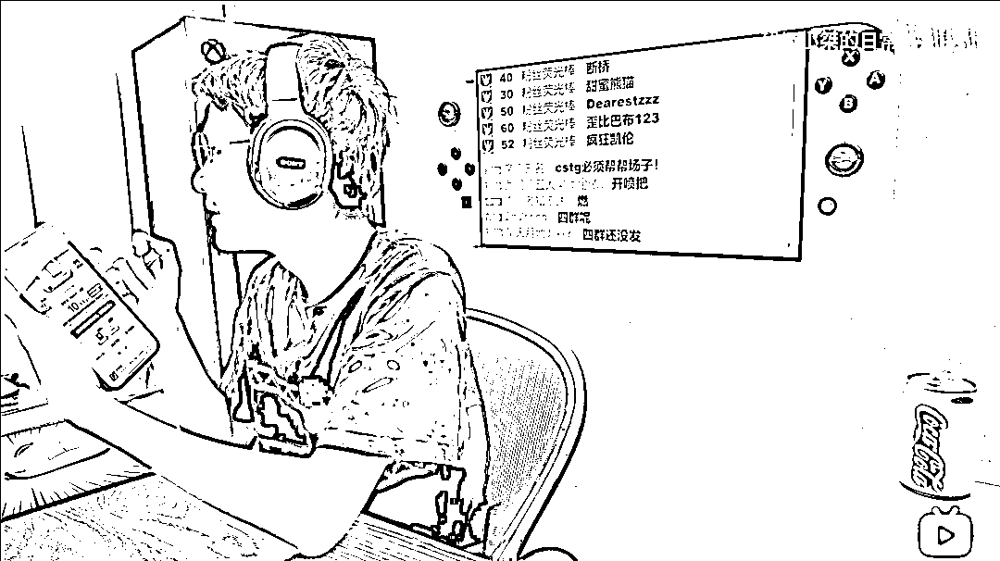

# 6 万人帮砍价,竟然砍价失败?

> 原文：[`mp.weixin.qq.com/s?__biz=MzIyMDYwMTk0Mw==&mid=2247531966&idx=2&sn=145cc438dda75f8647258875e3274456&chksm=97cbb686a0bc3f90ae54a076b4494878d8de4d3cf5cf88bc17dd215644ed868ef69a90c7922a&scene=27#wechat_redirect`](http://mp.weixin.qq.com/s?__biz=MzIyMDYwMTk0Mw==&mid=2247531966&idx=2&sn=145cc438dda75f8647258875e3274456&chksm=97cbb686a0bc3f90ae54a076b4494878d8de4d3cf5cf88bc17dd215644ed868ef69a90c7922a&scene=27#wechat_redirect)

在日常生活中，你肯定会遇到多年不联系的老朋友/同事/亲戚 

突然微信发你个拼多多链接，让你帮砍一刀的事情

不管你有没有帮他砍，都会让你有点烦躁

毕竟看过这么多视频，你是知道这玩意有多坑的 

但你的那些微信好友可能并不知道

所以为了以后不再受“砍一刀”的烦恼，灰灰今天整了这篇文章

* * *

故事是这样的，有一位叫“超级小桀”的主播

他前天在直播时整了一个活

邀请直播间和粉丝群的观众一起参与拼多多的砍价活动

看是否真的能免费砍下这台手机

在经过接近 1 个小时的努力后 

主播成功将手机砍到了只需 10 金币就可以免费获取的程度 

至于参与的人数有多少？直播间当时最高达到了 74751 人观看

加上主播的粉丝群，上千人肯定是有了 

但拼多多似乎并不想让这位主播拿到手机 

因为还剩 10 金币后，主播的活动链接别人已经无法访问了

所以他选择了拨打拼多多客服 

得到了这样的答复 

这真是让人流汗黄豆， 按照这个规则，即使是那种明星来砍也无法砍成功

（因为活动一般是 24 小时有效）

所以他也放弃了这件事，但滑稽的是事情结束两小时后

拼多多官方给他发了一张优惠券

并作出了这种回应 

3 月 19 日消息，针对近日游戏博主@超级小桀 直播参与拼多多的砍价免费领手机的活动后续，拼多多方面回应称，“未砍成功”不实，且并非几万名观众参与了实际的砍价。 

拼多多关于“游戏博主直播砍价拿手机”事件的说明如下：

1、“未砍成功”不实。活动信息显示，该博主 3 月 17 日 12 点 52 分开团砍价一款价值 2099 元的 vivo 手机，3 月 17 日 16 点 40 分已砍价成功，平台已根据活动规则，向其账号发送了特制优惠券用以领取该款商品，博主于当晚 23 点 34 分领取，砍价所获商品已于 3 月 18 日 9 点 27 分发货，19 日 8 点 31 分已送达博主所在的长沙市雨花区某代收点。

2、“几万人参与砍价”不实。博主直播期间已公开说明，自己是向其 QQ 群友发出帮砍邀请，并非几万名观众实际参与了砍价。事实上，关于砍价人数，传言经历了多重演变，从“上千”逐步演变为“几万”、“6 万”、“7 万”。

3 月 17 日，博主@超级小桀 在当天直播中参与拼多多的砍价免费领手机活动，在直播间中，该主播将砍价链接发至其 20 多个 QQ 群中，让粉丝帮忙参与砍价。上述群内共计 3 万多粉丝，但实际参与砍价人数未知。拼多多方面也没有给出明确回复，仅表示“该主播直播时仅是向上万名 QQ 群友发出帮砍邀请，并非几万名观众参与了实际的砍价。”

该主播在直播间砍了两个小时后，拼多多页面显示砍价进度一度达到 99.98%，但依旧没能成功砍下手机，途中也一度出现了砍价二维码链接失效的情况。

随后该主播致电拼多多人工客服，该主播转述拼多多客服回应称，砍价邀请的好友存在随机有效的情况，例如你邀请了 100 个好友砍价，但有可能只有 50 或 80 个人是有用，另外由于大量粉丝涌入链接，系统可能检测到恶意刷量行为，于是作出处理，导致部分砍价失效。后续只要重新刷新，再生成砍价链接即可。

在直播的过程中，该主播未能成功砍下手机，后续是直播当天下午 4 点 40 分，该主播的账户中显示，最终领到平台的无门槛券，成功获得了砍价手机。

在此次回应中，拼多多还表示，一单砍价成功的案例，却在某种蓄意推动下，成为与事实完全相反的热搜、热议话题，进而混淆舆论视听。公司法务部门已完成相关证据保全。同时感谢社会各界对拼多多相关活动的关注和支持，未来平台将进一步完善活动流程和规则，优化活动指引，提升活动体验。

去年 4 月，拼多多法务部高级总监唐江荣曾发布了对类似事情的的相关回应，称正在进行的“砍价免费拿”活动共有 1200 余款商品参与，已免费送出 709 万余件。该活动的本意是为消费者提供免费福利，让每一个用户能公平参与，通过参加砍价免费拿活动，在 24 小时内砍到 0 元的方式免费获得商品。

“对于消费者反映的‘始终差 0.09%’，是因为部分‘免费砍’的商品金额较大，拉少量用户砍掉的金额不足以让百分比变化，所以消费者以为砍价没有变化。同时在日常活动中还会出现恶意刷单、机器刷单等异常砍价行为，甚至收费帮忙砍价，违背了活动的本意，这些行为影响了游戏的公平性，会导致砍价失败。以上情况影响了用户体验。”

至于是哪边在说谎

主播的这条微博或许能说明一切

我估计要不是因为是比较有名气的主播，最后肯定也很难砍到这台手机

来源：界面新闻，比翼之吻

← 向右滑动与灰产圈互动交流 →

