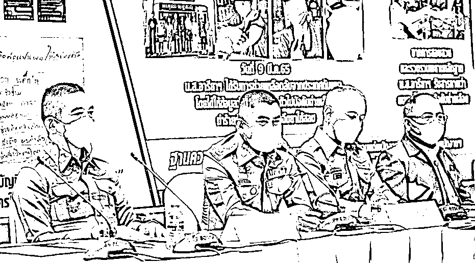
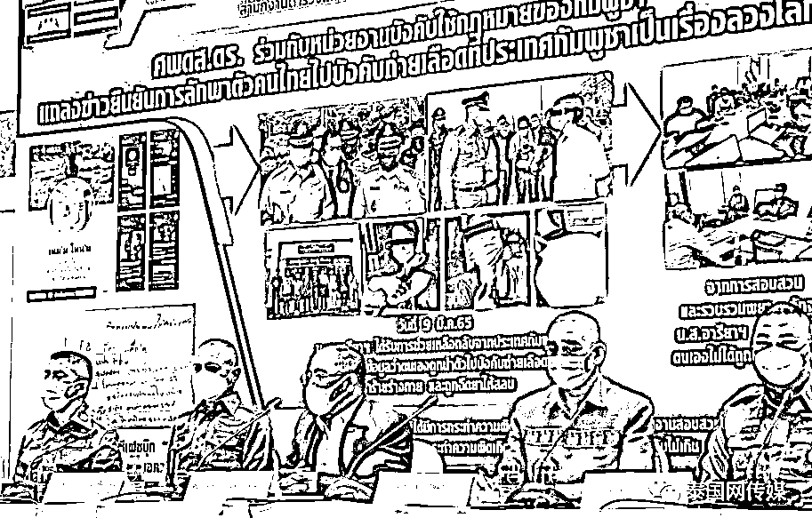
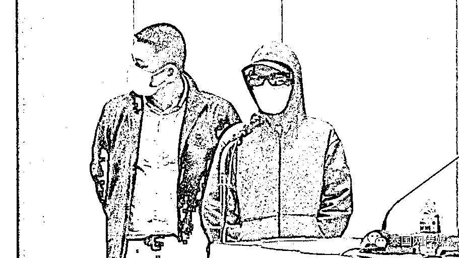

# 泰国血奴案也反转了！泰国警方：没有中国团伙，更没有人被抽血…… .

> 原文：[`mp.weixin.qq.com/s?__biz=MzIyMDYwMTk0Mw==&mid=2247531966&idx=3&sn=3a79ff3d4054cd8d05ae488b95c22e5f&chksm=97cbb686a0bc3f90d885235f1b0d7015cabe4a1b7d1f3a54fe0b71d038674580cb75330b3272&scene=27#wechat_redirect`](http://mp.weixin.qq.com/s?__biz=MzIyMDYwMTk0Mw==&mid=2247531966&idx=3&sn=3a79ff3d4054cd8d05ae488b95c22e5f&chksm=97cbb686a0bc3f90d885235f1b0d7015cabe4a1b7d1f3a54fe0b71d038674580cb75330b3272&scene=27#wechat_redirect)

根据**泰国网**的报道，2022 年 3 月 18 日，泰国国家警察总署召开新闻发布会，会上通报了近期发生的“泰国血奴案”案件进展——经警方调查，证实此案为编造的虚假内容。

自称为受害者的泰国女子因掩盖自己前往柬埔寨从事违法犯罪活动，自行注册了虚假脸书账号，伪造了谈话内容，干扰了警方初期的调查取证，下一步，涉事泰国女子将移交泰国沙缴府警方依法处置。

发布会还向公众声明，此案中“中国团伙”完全不存在，“中国团伙抽血、卖器官”的行为更不存在，没有中国护照，没有任何证据与中国团伙关联。同时，此案没有任何人在柬埔寨遭到殴打或虐待。

**造假来龙去脉：当诈骗客服想回国了……** 

发布会上警方详细介绍了“泰国血奴案”的发展全程。

3 月 9 日，泰国警方在泰柬边境解救了 8 名泰国工作者，其中一名 25 岁的泰国女子 A 称，自己在柬埔寨被中国团伙虐待、抽血、贩卖器官。由于描述惊心动魄，泰国警方为此召开了新闻发布会。

3 月 10 日、11 日、12 日，柬埔寨外交部、边境警方喊话泰国当局，表明反对抹黑的态度和立场，理由是柬埔寨警方要求提供的证据，泰国根本无法公布，哪怕是单独一项。因此只有泰国受害女子 A 的一面之词。

柬埔寨警方当时十分愤怒，直言泰国警方办案缺乏专业程序，仅仅听从受害人单方面描述就将矛头指向柬埔寨治安条件恶劣…..

3 月 13 日-17 日，泰国警方配合柬埔寨警方开展“地毯式”取证，最终核实了以下信息：

> 第一、案件初期的受害泰国女子 A，叫阿里雅（音译），年龄 25 岁；
> 
> 第二、在本案中，阿里雅并非被骗去柬埔寨工作，而是私自前往柬埔寨从事“诈骗工作”，常年哄骗泰国人投资根本不存在的空壳项目。
> 
> 第三、与阿里雅同去柬埔寨的还有阿里雅的男友。两人最后因担忧非法工作的风险，希望安全回到泰国不被逮捕，因此注册了虚假的脸书账号，开始伪造虚假对话，妖魔化描述“中国团伙”如何凶狠，如何抽血和贩卖器官，并将相关信息发送至脸书吸引泰国官方注意。两人根本的目的是希望自己能安全回国，并且是泰国警方名正言顺地接他们回国。
> 
> 第四、泰国警方因为担心海外人民安危，当天抵达柬埔寨救人时，阿里雅其实仍在网络诈骗自己的泰国同胞，未停止任何违法工作….
> 
> 第五、关于“中国团伙”的编造，阿里雅表示自己之前曾被一名“中国老板”强势要求不准回泰国，因此在编造谎言时刻意加入了“中国团伙”的恶魔形象进行抹黑……

此外，阿里雅还称，她估计泰国赴柬埔寨的非法劳工共 2000 名，他们都在被强迫劳动的水深火热之中。

泰国警方经过反复核查，认定上述“中国老板”和“2000 名非法劳工”一事并不属实，逻辑混乱，时间地点不符，同样为阿里雅的虚假编造。

泰国警方表示，阿里雅及其男友将受到 6000 泰铢的罚款，3 年以下有期徒刑。泰国沙缴府警方已经将两人关押，等待法院后续执行。

此“乌龙 " 过后，泰国国家警察总署助理署长表示：网络的时代，信息的时代，任何新闻都会迅速传播、扩散。今后我们会叮嘱一线办案人员，提升取证规范和办案质量… ..

**此前报道：**

**[血奴事件波及短视频博主？有的疑销号，有的哭诉被网暴](http://mp.weixin.qq.com/s?__biz=MzIyMDYwMTk0Mw==&mid=2247530226&idx=1&sn=d442bba79fa53bd78947083b70ab6bec&chksm=97cbbdcaa0bc34dc9674620991035e3bf51c1ada91da6e7f5fdff764357ee4188bf66720baac&scene=21#wechat_redirect)**

**[柬埔寨警方：“血奴案”纯属编造！网友炸锅了](http://mp.weixin.qq.com/s?__biz=MzIyMDYwMTk0Mw==&mid=2247530747&idx=3&sn=15c11a32b96f74d12d9c5336958e6ac5&chksm=97cbb3c3a0bc3ad5e16b8c15a168071569c2c1e2e50f2c769abb13ff924e2d63cbad249c97d1&scene=21#wechat_redirect)**

**[“血奴”事件、百万粉丝的网红涉诈一一反转了？外交部和大使馆发出新提醒](http://mp.weixin.qq.com/s?__biz=MzIyMDYwMTk0Mw==&mid=2247530747&idx=2&sn=0338254755f36988407e55138a123099&chksm=97cbb3c3a0bc3ad544dc3d5e1833967723a5fffdf73ca0f1c18f304a5948ab6b881709303f83&scene=21#wechat_redirect)**

**[“血奴”案当事人和 3 名涉案人员被控多项罪名](http://mp.weixin.qq.com/s?__biz=MzIyMDYwMTk0Mw==&mid=2247531021&idx=2&sn=83323a93f114bc76b4f194857e010077&chksm=97cbb135a0bc3823fa04c36815fafa72f98ac31cfa4a80ad98f81cc7d756ea617a5b9a89f5a6&scene=21#wechat_redirect)**

来源：泰国网

← 向右滑动与灰产圈互动交流 →

