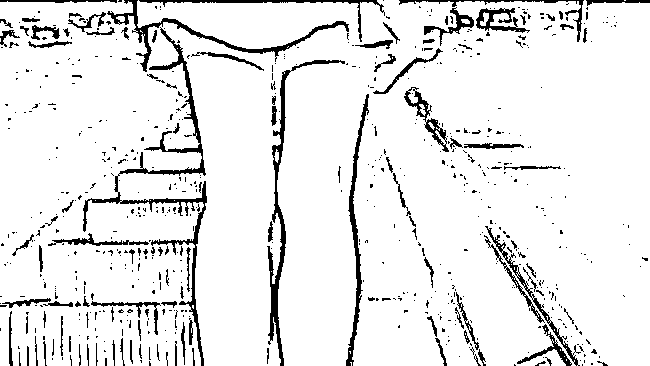
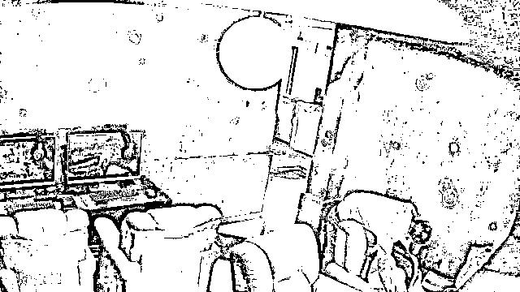
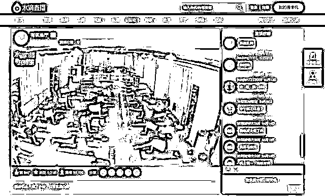
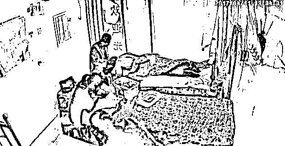
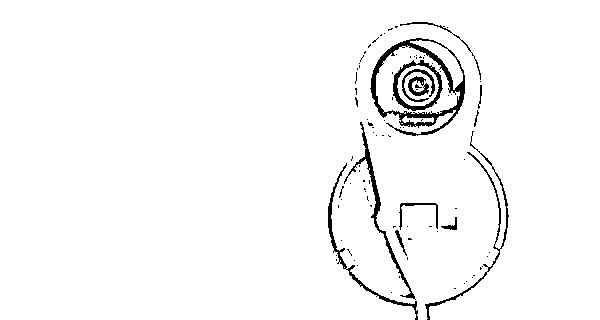
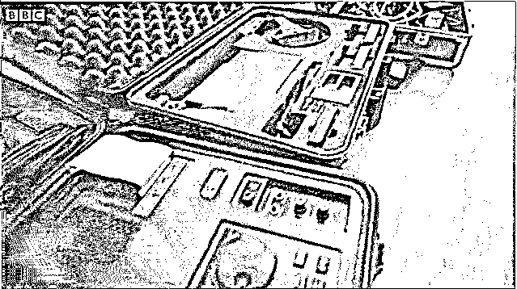
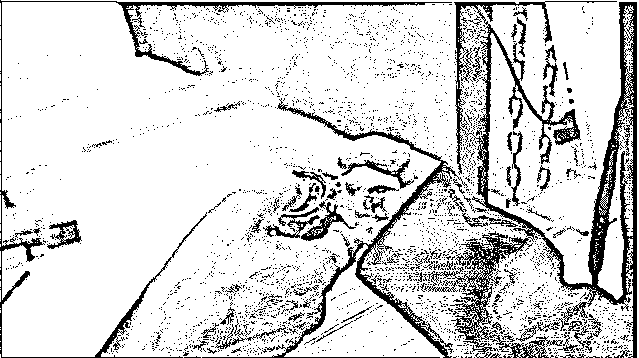

# 偷拍无孔不入，民宿秒变三级片片场

> 原文：[`mp.weixin.qq.com/s?__biz=MzIyMDYwMTk0Mw==&mid=2247531966&idx=4&sn=b44efac14e07eea11d7b0170bafa91d7&chksm=97cbb686a0bc3f90764f68ca67e3ec1c7c0d1cd82bba3a86174e238146af143d2e98ed1ec715&scene=27#wechat_redirect`](http://mp.weixin.qq.com/s?__biz=MzIyMDYwMTk0Mw==&mid=2247531966&idx=4&sn=b44efac14e07eea11d7b0170bafa91d7&chksm=97cbb686a0bc3f90764f68ca67e3ec1c7c0d1cd82bba3a86174e238146af143d2e98ed1ec715&scene=27#wechat_redirect)

广东姑娘小郑的平静生活因为一次出差被彻底打破。 

小郑因工作出差，可没成想，自己竟然因为入住民宿而成了色情片女主角，更可笑的是，要不是朋友在网上看到了打电话告诉她，她自己还蒙在鼓里。

朋友告诉她，她在民宿晚上睡觉脱衣服、换衣服，去洗澡间洗澡的视频被偷拍了，还被人发到了网上。

自己的隐私被曝光，自己的生活被直播，被几次售卖，被网上传播。

小郑没想到，时不时看到的偷拍事件，竟然这么不经意就发生在自己身上。

她的头嗡嗡响，她愤怒又害怕，这个视频就像一个雷，不知哪天就会把她平静的生活炸得四分五裂。

不止小郑，类似的受害者还有很多，有的人甚至都不知道自己可能被偷拍了。

有网友在微博上评论，“你在酒店睡过的每一张床，都有可能是他人的直播房。”更有酒店业内人士透露，80%的情侣酒店都藏有偷拍摄像头。

从出售偷拍设备、拍摄视频再到出售视频，一条让人触目惊心的黑色产业链呈现在我们眼前。

曾经的 360 水滴直播事件大家都还历历在目吧...哦不对，还有“历历在百度”！ 

之前泄露出来的直播视频现在随便一搜都还能搜到...

而当时 360 也是甩锅给用户，说自己只提供了直播功能，开不开通都是用户自己的选择。

但是—— 

你说这对小情侣是故意直播秀恩爱的么？

这位女士是故意换衣服给别人看的么？

这位母亲是故意在镜头前给孩子喂奶的么？

 显然不是，也许他们现在都还蒙在鼓里呢...更别说那些公共场所里的直播了——

万千肉体的游泳池

美女云集的瑜伽馆

还有各种按摩店和发廊...

这些直播开不开通可都是由店主说了算，而被直播的顾客知不知情就不晓得了，但归根结底，这些直播平台都脱不了干系。公众号：瓜之又呱，每晚推送人性、An 网故事、案件，敬请关注。

因为给私人监控摄像头提供“公开直播”这种服务本身就不合理。

尤其是用于家庭监控的，我想正常用户都不会把自己家里的情况直播给陌生人看吧...是想让全国人民帮忙看家么？

即便是有些商户想利用直播来吸引客流，平台也不能确定店主是否征得了顾客同意，全靠人家自觉了。

而偷拍不仅存在于我们身边，在其他国家甚至更为猖獗。

近年来，韩国各种震惊国内外的性犯罪几乎都与偷拍有关，包括已故女星具荷拉曾被前男友以偷拍视频威胁....

而偷拍的“重灾区”，要数按小时收费的情趣酒店。

BBC 记者 Stacey Dooley 这次就来到首尔，深入探讨了韩国偷拍成风这一问题。

Stacey 请来了韩国知名的“摄像头猎人”Seung Hee Jung，他的工作是寻找那些隐藏的针孔摄像机。

Seung 和团队经验很丰富，装备也十分现代齐全，

他解释说，这是因为偷拍设备更新换代的频率非常快，现在市面上已经出现了自带 Wi-Fi 功能的摄像头，用它们拍下的画面能够在网络上同步直播，不仅如此，他甚至还曾在莲蓬头中发现防水摄像机。

Seung 警示大家说，酒店中的烟雾报警器、电视、沙发底部都是摄像头经常出现的地方，而为了把“针孔摄像头藏起来有多隐秘”表现得更为直观，Seung 还提前在一间情趣酒店的房间中布下 30 余个摄像头，并邀请 Stacey 来一一寻找。

一进入房间，Stacey 就感慨到，如果是根本不知道房间被做了手脚的普通客人，短时间内不可能发觉出这里有什么不一样。 

不过很快，Stacey 就在洗手池边的沐浴露瓶子上发现了摄像头的小黑点：

 之后，她在装饰用相框的顶部也发现了摄像头的存在：

就连手表、梳子、玩具都无一幸免：

很多人觉得摄像头是电子设备，单是装有摄像头的小物品就铺满了大半个床面....

监控者也可以通过 Wi-Fi 摄像头看到她最实时的反应。

这样的偷拍，真可谓“全方位无死角”....

在这些摄像头背后，是一条偷拍产业链，从业者有组织地从中牟利。等偷拍录像带制作完成之后，会通过产业链最后一环的人，把这些带子通过境外网站卖出去。 

而通过卖这些非法的偷拍录像带，月入能达到 7000 美元到上万美元。

在《失控》这本书中，作者凯文·凯利如是写到：

“网络把隐私从道德领域转移到了市场领域，隐私成了一种商品。在欲望与暴利的诱惑下，人性中贪婪的一面裸露无遗。千万人的生活和隐私，被当成商品，曝光于可耻的交易台之上。”

科技便利生活的同时，也因人性滋生罪恶。

数据显示，高达 80%的女性存在被偷拍风险。

庞大的偷拍产业链背后，女性是永远的受害者。

比起身体上的伤害，有些精神伤害更能摧毁一个人。

当一个个案件不再成为热点，我们不遗忘那些受伤灵魂的同时，也惟愿每一位女孩、妻子、母亲，都能被温柔以待。

来源：漂移神父

← 向右滑动与灰产圈互动交流 →

