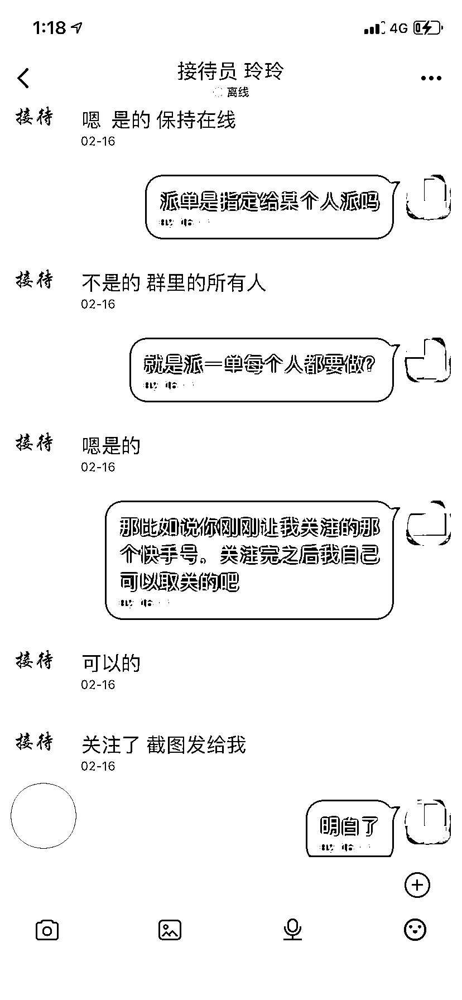

# 已多人中招！有人盯上了刷短视频的你……

> 原文：[`mp.weixin.qq.com/s?__biz=MzIyMDYwMTk0Mw==&mid=2247531966&idx=7&sn=dd80ee4ca8be88e229f30972a57324be&chksm=97cbb686a0bc3f90c98ea377878baca5454f020d5877cc5c4be031eccef8c3acf18003d3fb49&scene=27#wechat_redirect`](http://mp.weixin.qq.com/s?__biz=MzIyMDYwMTk0Mw==&mid=2247531966&idx=7&sn=dd80ee4ca8be88e229f30972a57324be&chksm=97cbb686a0bc3f90c98ea377878baca5454f020d5877cc5c4be031eccef8c3acf18003d3fb49&scene=27#wechat_redirect)

如今很多人都爱通过短视频平台记录生活、分享成长，如果这时有人告诉你，给指定用户点赞、关注就能日赚斗金，你会心动吗？ 

近日，江苏苏州的刘女士（化名）向警方求助，称其在刷短视频时被骗 13 万余元。

[`mp.weixin.qq.com/mp/readtemplate?t=pages/video_player_tmpl&action=mpvideo&auto=0&vid=wxv_2305018449817075713`](https://mp.weixin.qq.com/mp/readtemplate?t=pages/video_player_tmpl&action=mpvideo&auto=0&vid=wxv_2305018449817075713)

刘女士在某平台刷短视频时，无意看见一则高薪招工广告。隔天刘女士通过电话，添加了对方微信并下载了一款 APP。

**对方称在该 APP 内，只要根据任务要求给指定的账号“关注、点赞”，就可以获得丰厚的佣金。**

刘女士很快做完了任务并顺利拿到了返利，在对方的“推荐”下，刘女士的任务越做越多，她自己账户里积累的佣金越来越多，就在她想把佣金提现的时候，问题来了......

**对方分别以银行卡填错、账号冻结、缴纳保证金等理由，要求刘女士先后转账 13 万余元。**

而此时的刘女士还并未察觉异样，等待返现的期间，她得意地向朋友介绍着自己的新“工作”，结果被朋友识破骗局，带着她来到派出所报案。目前，案件正在进一步办理当中。

**警方提醒**

**刷单诈骗套路如下，注意识别：**

> 1.骗子利用 QQ、微信、互联网等平台发布广告，以“低门槛高收益”、“先垫付再返利”、“刷单时间地点自由”等吸引宝妈、学生、无业人员等。
> 
> 2.骗子利用滚雪球赚取佣金模式，前一两次都先以小额单，迅速返现并兑现少量佣金来赢取受害人信任，待受害人放松警惕后多次投入大额资金，对方会有系统故障、订单超时不能提现为由让你重复转账。

来源 ：江苏网警，潇湘晨报

← 向右滑动与灰产圈互动交流 →

