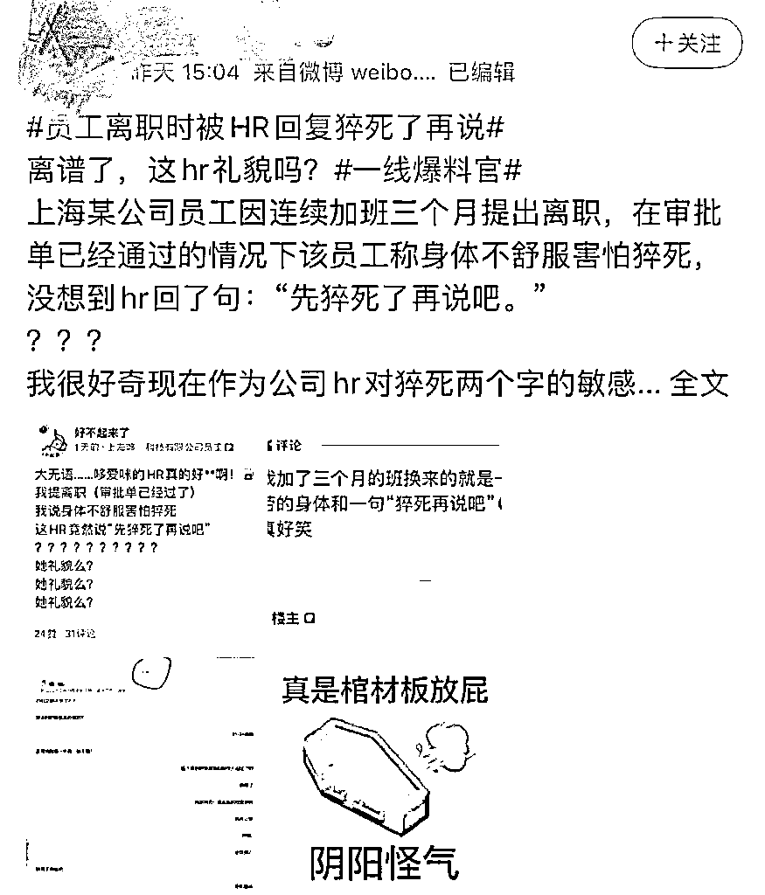
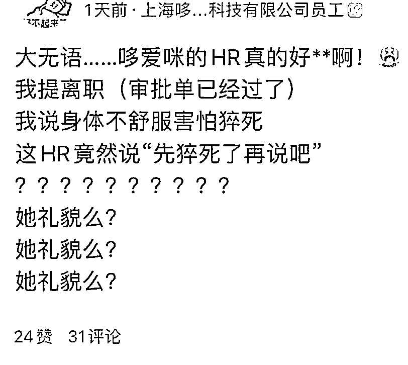
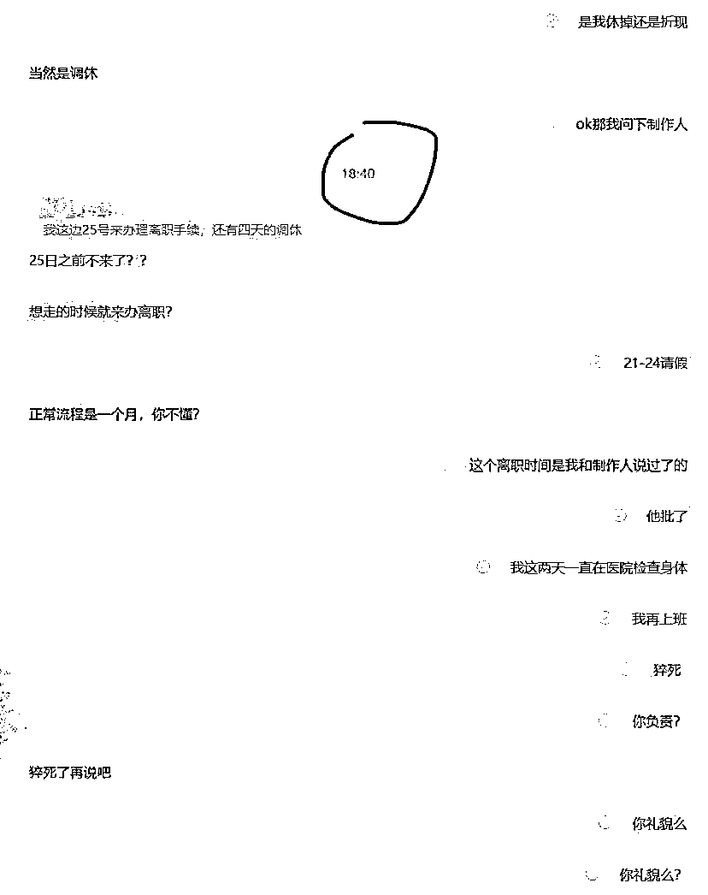
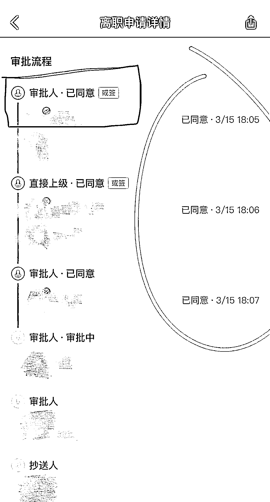
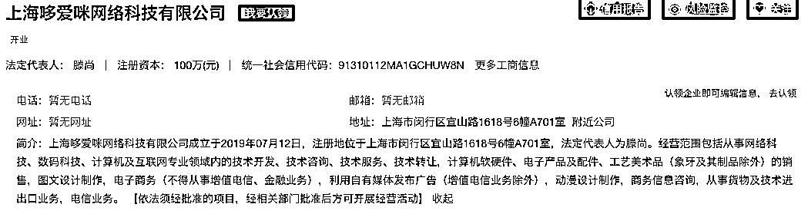
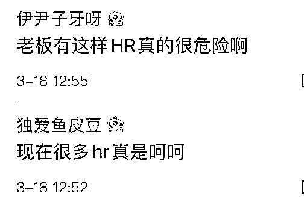
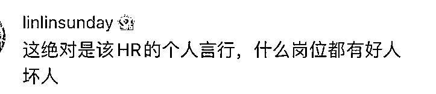
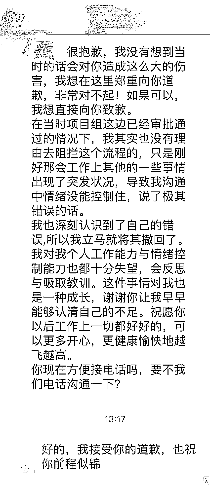

# 连续加班 3 个月提离职，竟被 HR 回复“猝死了再说”

> 原文：[`mp.weixin.qq.com/s?__biz=MzIyMDYwMTk0Mw==&mid=2247531966&idx=8&sn=74564eeaa431da7d6fffee45563cf627&chksm=97cbb686a0bc3f90f49bc690a530a8b66ba97890b7686f688721427ed154a04e8f9c731004eb&scene=27#wechat_redirect`](http://mp.weixin.qq.com/s?__biz=MzIyMDYwMTk0Mw==&mid=2247531966&idx=8&sn=74564eeaa431da7d6fffee45563cf627&chksm=97cbb686a0bc3f90f49bc690a530a8b66ba97890b7686f688721427ed154a04e8f9c731004eb&scene=27#wechat_redirect)

该公众号已被封禁

近日一条热搜

引发舆论热议

↓↓↓

据了解，

一名认证为

“上海哆爱咪网络科技有限公司员工”

的用户在某平台爆料称，

自己因连续加班三个月

感到身体不适

提出离职

与公司 HR 交谈中产生不快

HR 质疑其离职时间

该员工称是与制作人商量过已获批准的

这两天检查身体后再上班

并补充“猝死，你负责？”

公司 HR 回复“猝死了再说吧。”

爆料员工指出，

HR 与自己这段对话发生在 18 时 40 分，

但是 HR 作为离职审批流程第一人

早在 18 时 05 分就同意了离职申请。

因此，这名员工认为 HR 是故意针对自己。

天眼查 APP 显示，上海哆爱咪网络科技有限公司成立于 2019 年 7 月，经营范围含从事网络科技、数码科技、计算机及互联网专业领域内的技术开发服务；电子商务；动漫设计制作等。

这消息一爆出，

引发了网友们激烈的讨论。

**“企业有这样的 HR 真的很危险”**

****

****

****

**该事件的议论还在持续发酵，**

**当日下午，记者联系该公司。**

**哆爱咪网络的相关负责人回复称：** 

**“刚知道此事，会尽快调查处理。”**

**随后，联系到上述爆料人，**

**对方表示，**

**“HR 已经亲自打电话道歉，**

**我接受了，事已至此，**

**我也不再追究了。**

**也希望大家能理性看待。”**

****

**根据爆料人发布的截图，**

**曾说“猝死了再说吧”的 HR 表示，**

**已深刻认识到自己的错误，**

**所以立马将消息撤回了，**

**也对个人工作能力与情绪控制能力**

**也十分失望，**

**会反思并吸取教训。**

**来源: 九派新闻、红星新闻、新闻晨报**

****

**← 向右滑动与灰产圈互动交流 →**

****