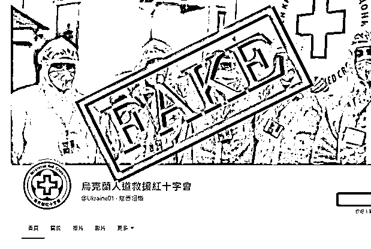
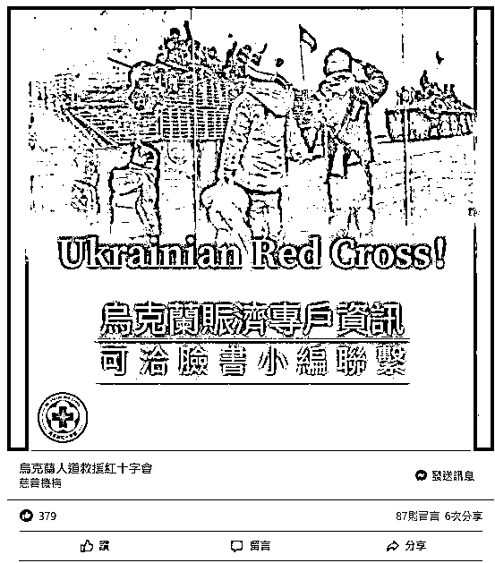
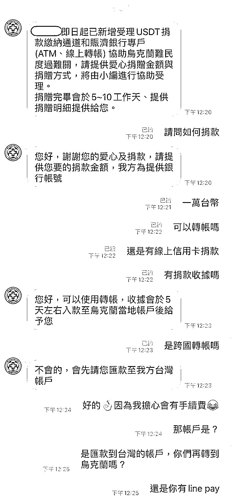
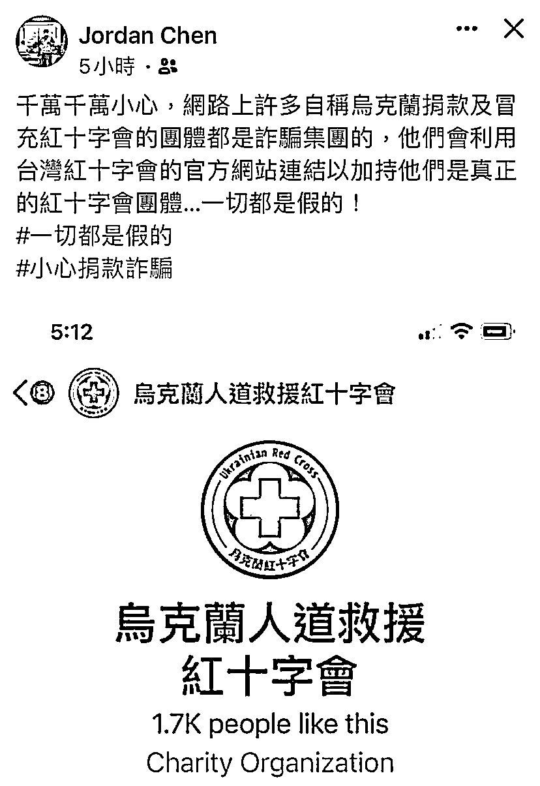
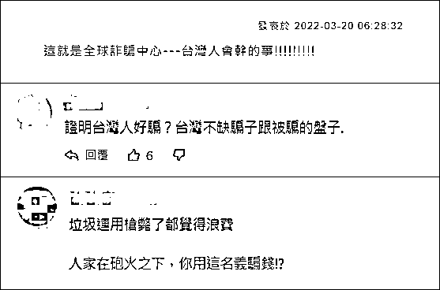

# 在台湾，真的防不胜防啊

> 原文：[`mp.weixin.qq.com/s?__biz=MzIyMDYwMTk0Mw==&mid=2247532020&idx=1&sn=5a7aad0d20922bfcd1e1ce11b9951722&chksm=97cbb6cca0bc3fdaf399a0877d2ef00e46c232c6f55eaecc9b791c2e561f57d04d5909ce8af9&scene=27#wechat_redirect`](http://mp.weixin.qq.com/s?__biz=MzIyMDYwMTk0Mw==&mid=2247532020&idx=1&sn=5a7aad0d20922bfcd1e1ce11b9951722&chksm=97cbb6cca0bc3fdaf399a0877d2ef00e46c232c6f55eaecc9b791c2e561f57d04d5909ce8af9&scene=27#wechat_redirect)

俄乌局势引发关注之际，台当局“[蹭](http://mp.weixin.qq.com/s?__biz=MzIyMDYwMTk0Mw==&mid=2247531903&idx=4&sn=9191896faf8534d30f28a92d37eeafd7&chksm=97cbb647a0bc3f510cb3b1fa7ada8150bd5cc34ecaf745cc17903fcb4e3ac6284620a64e6988&scene=21#wechat_redirect)”得不亦乐乎，岛内骗子也开始纷纷冒头了：继有人假冒“乌克兰女医生”、“[乌克兰军官](http://mp.weixin.qq.com/s?__biz=MzIyMDYwMTk0Mw==&mid=2247531903&idx=2&sn=c846518b57f8f6a24b7f74b01d0701bd&chksm=97cbb647a0bc3f51621b39e34ebf8a1ffdf0b49cb13881f2c44e582022d62f89decf485bb0d3&scene=21#wechat_redirect)”骗钱后，又出现了冒充“乌克兰人道救援红十字会”骗捐款的账号…… 

据台湾联合新闻网 3 月 19 日报道，台湾红十字会 18 日发文称，近日有诈骗分子在脸书冒用“乌克兰人道救援红十字会”名义对外公开募款，台湾红十字会已报警处理。

台湾红十字会近日宣布，由于大批乌克兰难民涌入波兰，台红十字会捐助了 1700 箱、逾 24 万件物资，将送往波兰等地的红十字会，这些宣传也让不法分子有了可趁之机。

3 月 18 日，台湾红十字会发文称，该会日前在脸书上发现有诈骗集团冒用“乌克兰人道救援红十字会”名义对外公开募款，要求有意捐款的岛内网民私信该“赈济专户资讯”的小编，并要求民众在聊天软件添加该账户小编为好友。

诈骗集团通过私信继续诱骗台民众捐款。截图显示，骗子称，相关捐款将“协助乌克兰难民渡过难关”，并谎称收到捐赠后会于 5-10 个工作日提供捐款明细，还要求有意捐款的台网民先汇款至台湾账户。

台湾红十字会会长王清峰称，对于不法分子这种趁机欺骗大众的手法，台红十字会已报警处理。该会还呼吁台民众捐款前查明各公益组织相关资讯。

实际上，在俄乌冲突升级后，岛内发生的骗局已经不止一件了。

据台媒 3 月 14 日报道，有诈骗集团假冒“乌克兰女医生”，称要包机来台湾避难，向屏东一名 7 旬男子借 9 万美元，男子到银行汇款时被眼尖的职员阻止并报警。

3 月 16 日，岛内还出现了一起“乌克兰军官求爱骗钱”事件，受骗者是嘉义县一名 68 岁庄姓妇人，她在交友软件上认识一名自称在乌克兰担任军官的男子，在 14 日下午依照该“乌克兰军官”要求，前往邮局汇款，被邮局工作人员发现不对劲后阻止并报警。

对于利用乌克兰局势诈骗的事件，台网民怒而直言：“这就是全球诈骗中心——台湾人会干的事！”

来源：观察者网

← 向右滑动与灰产圈互动交流 →

