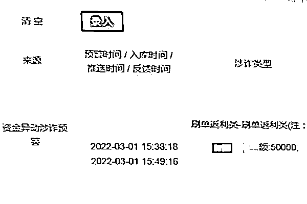
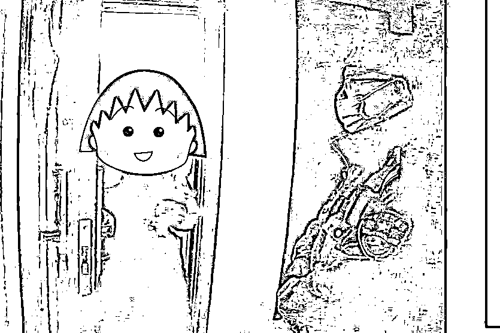
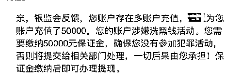
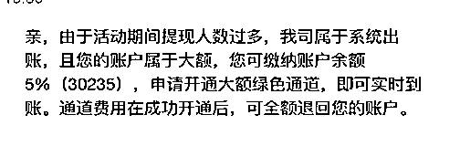

# “对方告诉我，一定不要告诉别人，特别是警察！”结果 28 万送给了骗子

> 原文：[`mp.weixin.qq.com/s?__biz=MzIyMDYwMTk0Mw==&mid=2247532020&idx=5&sn=9c5a9040c8129889e6f24a4ca8d2ad59&chksm=97cbb6cca0bc3fdacba5ef220864c87c89d84f4761b4c4ef4e3155e8908b6bc37da08ecbe4d1&scene=27#wechat_redirect`](http://mp.weixin.qq.com/s?__biz=MzIyMDYwMTk0Mw==&mid=2247532020&idx=5&sn=9c5a9040c8129889e6f24a4ca8d2ad59&chksm=97cbb6cca0bc3fdacba5ef220864c87c89d84f4761b4c4ef4e3155e8908b6bc37da08ecbe4d1&scene=27#wechat_redirect)

**诈骗手段**

**层出不穷、花样翻新**

**可谓“与时俱进”**

**面对骗子们绞尽脑汁的“撒网”**

**大家一定要提高警惕**

最近，拱墅区半山辖区林女士（化名）遭遇网络诈骗，期间半山派出所多次对其进行预警，但林女士拒不承认，最终被骗 28 万余元。

**多次预警，她拒不承认**

3 月 1 日 15 时 38 分，拱墅区分局半山派出所接上级预警，住在辖区某小区的林女士可能被刷单返利类诈骗。为了防止群众被骗，半山派出所指挥中心第一时间电话联系林女士，在其表示自己没有被骗后，为保险起见，再次致电其丈夫进行核实。

预防诈骗，保障群众的财产利益一直是派出所工作的重中之重，虽然已得到“双重保障”，但半山派出所民警还是决定上门预警。

“这个朋友你认不认识的？”、“如果有不认识的来理财投资，你一定要和我们实话实说”、“确定没有被骗噢？”……在林女士多次保证自己的钱是转给认识的朋友之后，民警才放心离开。

**骗子的话，她深信不疑**

3 月 2 日下午，半山派出所再次接到关于林女士的电诈预警，但致电林女士后，其再次否认，且再三保证自己没有被骗。

然而在 3 月 2 日晚上，半山派出所接到了林女士的报警，称其被诈骗了 28 万元。林女士追悔莫及地告诉民警，之前说把钱转给了朋友那都是骗子教的。

据了解，2 月初，林女士经一名陌生人介绍接触到了一款“**资本”APP，收益非常高。一段时间下来，看着“周边”的人赚得盆满钵满，她很心动，于是抱着试试看的心态投了 2000 元，赚了 400 元成功提现后，开始对这一“生财之道”深信不疑。

截至报警，林女士陆陆续续共投资了 28 万余元。民警预警期间，她还按骗子交代的告诉民警钱是借给认识的朋友的，**“对方告诉我，一定不要告诉别人，特别是警察，因为类似的高利润投资如果警方知道了会干涉的！”**因生怕警方介入导致自己赚不到钱，她这才多次拒绝承认有转账给陌生人。

**信骗子不信警察，损失惨重**

3 月 2 日，林女士提现失败，APP 及客服则多次以各种理由让她再次转账，最后 APP 都打不开了，她才意识到可能被骗，这才想到向半山派出所报警。

**“这就是打着投资幌子的诈骗！说了多少遍了，不要相信骗子！一定要相信人民警察！”**民警赶紧让其拨打 96110 止损，语重心长地对其进行教育并开展反诈宣传。目前，案件正在进一步调查中。

**友情提醒：**

**一定要相信人民警察！一定要下载国家反诈中心 APP！那些让你不要相信人民警察，让你卸载国家反诈中心 APP 的一定是骗子！！**

来源：杭州公安，利箭在行动，防骗每日电讯

← 向右滑动与灰产圈互动交流 →

