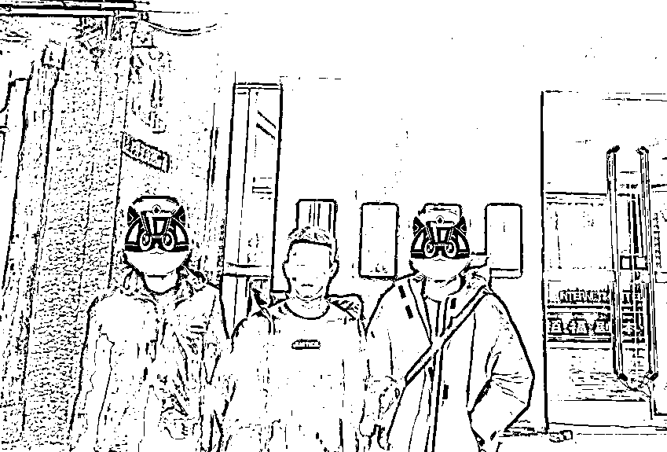
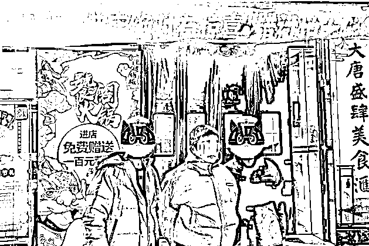
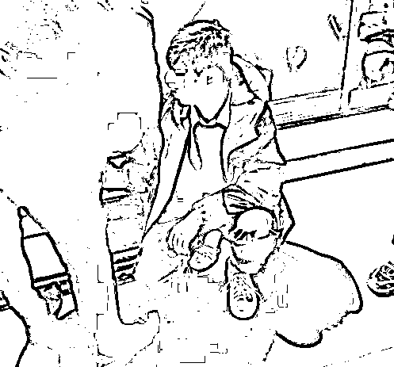
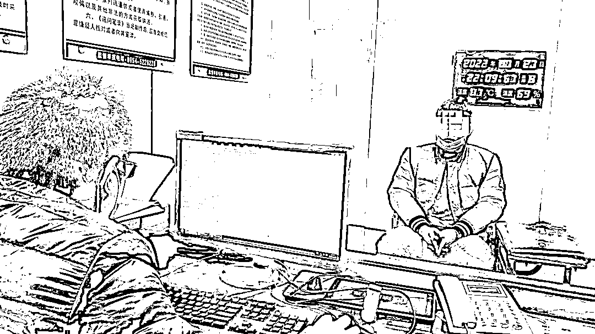
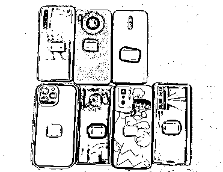
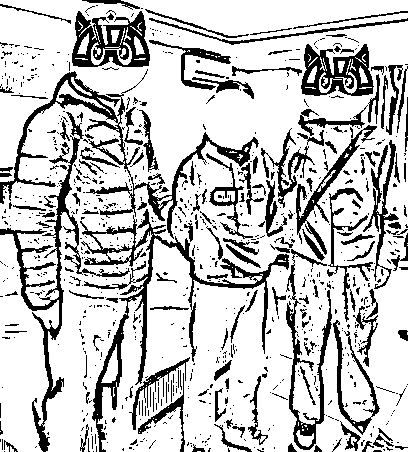
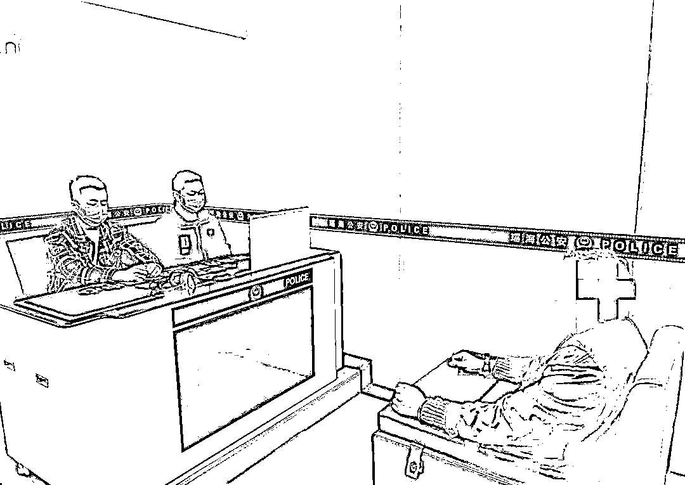
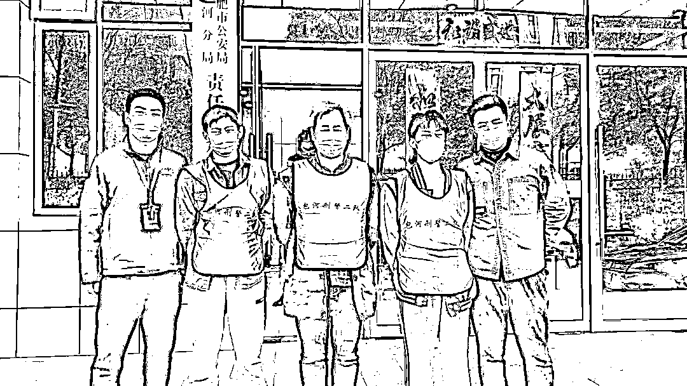

# 已有多人落网！这种“买卖”可千万别做！

> 原文：[`mp.weixin.qq.com/s?__biz=MzIyMDYwMTk0Mw==&mid=2247532020&idx=6&sn=50b94e9dd9afe2b97ec3d30f610e7bde&chksm=97cbb6cca0bc3fdad76b1415ab66966a05bf1fcf6ecc67e3a04e887c965d722d063cc30c724d&scene=27#wechat_redirect`](http://mp.weixin.qq.com/s?__biz=MzIyMDYwMTk0Mw==&mid=2247532020&idx=6&sn=50b94e9dd9afe2b97ec3d30f610e7bde&chksm=97cbb6cca0bc3fdad76b1415ab66966a05bf1fcf6ecc67e3a04e887c965d722d063cc30c724d&scene=27#wechat_redirect)

电信网络诈骗犯罪活动中最重要的

载体是银行卡和手机卡（统称为“两卡”）

**一直以来** 

**合肥警方持续保持严打高压态势**

溯本追源，斩断买卖、租售

银行卡、电话卡的黑灰产业链

持续对非法开办、贩卖电话卡、银行卡

违法犯罪线索深挖彻查

守护好市民群众的“钱袋子”

**案例一**

近期，包河公安分局责任区刑警二队民警在对电信网络诈骗案件线索进行深度研判时，发现一名嫌疑人持有的多张银行卡涉及多起电信网络诈骗案件。

2 月 21 日，民警将该嫌疑人抓获。经讯问，嫌疑人供述了自己利用持有的银行账户，伙同他人对受害人实施裸聊电信网络诈骗的犯罪事实。当晚，民警组织收网行动，迅速将嫌疑人谢某、胡某等犯罪嫌疑人抓获归案。目前，案件正在进一步侦办中。

**案例二**

1 月 23 日，庐江县公安局刑侦大队在侦办一起杀猪盘类电信网络诈骗案件中，根据线索，先后抓获将银行卡出租给电信网络诈骗团伙实施犯罪的何某某、朱某某等人，并根据案件线索将为境外诈骗团伙从事洗钱犯罪的李某某、白某某、杨某某等人悉数抓获。目前，该案仍在进一步侦办中。

**案例三**

近日，庐阳公安分局责任区刑警一队民警在工作中发现，犯罪嫌疑人孙某名下的几张银行卡被用于电信网络诈骗活动。

民警经过缜密研判，将犯罪嫌疑人孙某抓获。随后，民警根据线索研判，又抓获其同伙王某和张某、王某某、杨某某等人，缴获现金 4.3 万余元。目前，案件仍在进一步侦办中。

 

**案例四**

2 月 21 日，包河公安分局责任区刑警二队在核查一起刷单诈骗案件时，发现受害人的资金流向了嫌疑人谭某的银行卡中。2 月 24 日，民警赴重庆市将嫌疑人谭某抓获，并为相关受害人追回被骗资金一万余元。

经审讯，嫌疑人谭某供述了为牟利而将自己名下的银行卡租用给不法分子实施电信网络诈骗违法犯罪的全过程。目前，嫌疑人谭某已被采取刑事强制措施。

**案例五**

3 月 8 日，瑶海公安分局责任区刑警一队根据线索抓获犯罪嫌疑人赵某。据赵某供述，其通过一微信群参加了“跑分”洗钱团伙，为获取非法收益，向电信网络诈骗犯罪团伙提供自己名下的银行卡用以收取赃款，造成被害人损失五十余万元。目前，赵某已被依法采取刑事强制措施，案件正在进一步办理中。

**案例六**

3 月 8 日，包河公安分局责任区刑警二队民警在案件侦办中发现，有 3 名开卡人的银行卡在短时间内交易频繁，不断有大额资金转入转出，疑似从事电信网络诈骗犯罪活动。民警随即进行研判，并于当天 14 时许将 3 人抓获。3 人对出租银行卡、电话卡的违反事实供认不讳。目前，3 人已被依法采取刑事强制措施，案件正在进一步侦办中。

电信网络诈骗犯罪团伙为逃避警方打击

一般会通过租赁、购买

由他人实名注册的“两卡”

进行身份伪装

这就滋生了买卖“两卡”的黑灰产业

2020 年 10 月 10 日，国务院打击治理电信网络新型违法犯罪工作部际联席会议全国“断卡”行动部署会召开。“断卡”行动与我们每个人都有关！

01**“断卡”断的哪些卡？**

**手机卡**

包括平时所用的三大运营商的手机卡、虚拟运营商的电话卡和物联网卡。 

**银行卡**

包括个人银行卡、对公账户、结算卡、非银行支付机构账户，即我们平时所说的微信、支付宝等第三方支付。

02**为什么实行“断卡”行动**

“实名不实人”的电话卡，不但会被犯罪分子用来实施电信诈骗，还会用来进行网络贩毒、网络赌博，而这些钱大部分都是通过买卖的银行卡走账，难以追查和打击。

03**出售电话卡、银行卡的危害**

银行卡、电话卡一旦被收购很可能会被用于不法行为。部分出借、出租、售卖个人银行卡的人员不仅要承担相应的法律责任，还会给生活带来极大的不便！

请身份证有遗失经历、前期电话卡或者银行卡有异常情况的人，一定要抽空去查询下名下是否有不知情的电话卡或者银行卡存在，以免被当作“违法犯罪嫌疑人”进行打击、惩戒，影响个人生活。

警方提醒

买卖银行卡是违法行为

** 贪图小利 害人害己**

千万不要为了蝇头小利

铤而走险

成为骗子的帮凶

保护好个人身份信息安全

如果遇身份证丢失的情况

及时到派出所报失备案

如果有不用的银行卡、电话卡

也要及时注销

以免给不法分子可乘之机

来源：合肥警方，利箭在行动

← 向右滑动与灰产圈互动交流 →

