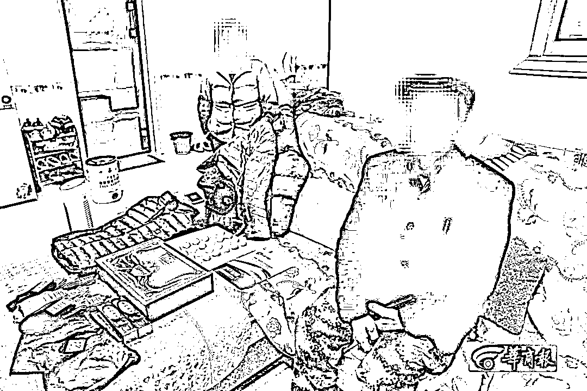
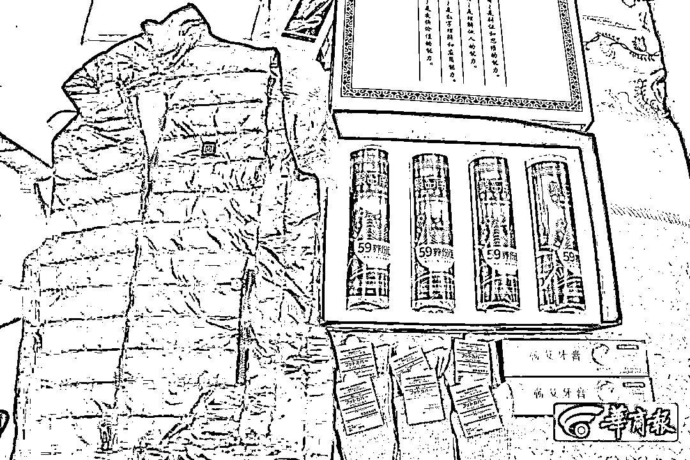
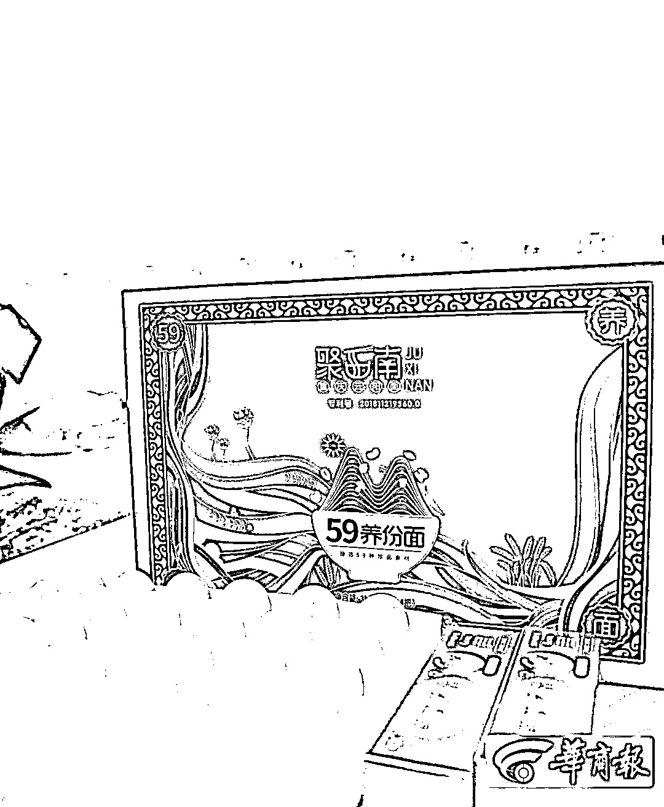
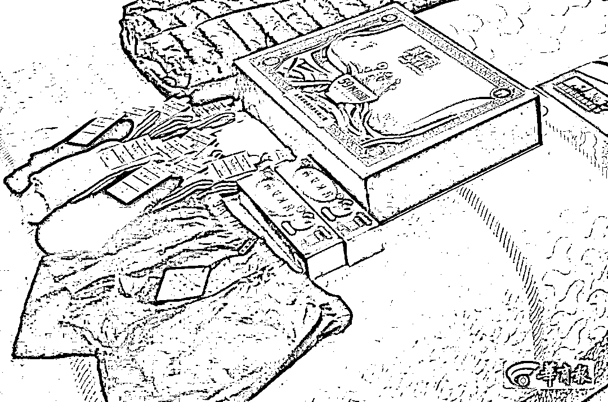
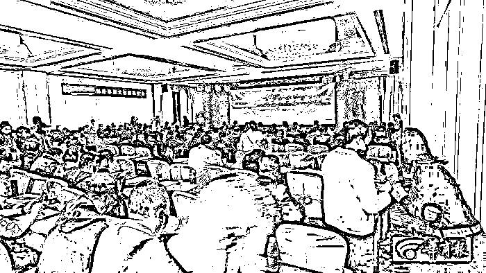

# 1 袋米 876 元，1 个鸡蛋 28 元！消费 20 万元 可转化提现 80 万元？

> 原文：[`mp.weixin.qq.com/s?__biz=MzIyMDYwMTk0Mw==&mid=2247532020&idx=7&sn=1911a217b027c8f7356e95ed84aefb8a&chksm=97cbb6cca0bc3fda3a12b0b50041b666a6b1072fbe84b52eedb9bef089aaad596798dab1bcff&scene=27#wechat_redirect`](http://mp.weixin.qq.com/s?__biz=MzIyMDYwMTk0Mw==&mid=2247532020&idx=7&sn=1911a217b027c8f7356e95ed84aefb8a&chksm=97cbb6cca0bc3fda3a12b0b50041b666a6b1072fbe84b52eedb9bef089aaad596798dab1bcff&scene=27#wechat_redirect)

**在平台上高于几倍甚至 10 倍的价格购买商品，会得到商家“最高 5 倍换票”，可兑换商品或提现**，这些网购平台的企业在海南合法注册，都会不定期地进行线下培训。

一袋米 876 元 ※ 一个鸡蛋 28 元

你吃过吗？吃了还能赚钱？

# ***网购平台 买单赚钱***

# ***合法营销 ******非法传销***

# ** 诈骗？**

该公众号已被封禁

**1** 

**- 坚信买单可赚钱、积分可提现 -**

**西安男子三个月网购消费 17 万元**

　　吴明（化名）从 2021 年 11 月开始接触某网上购物平台，已经在该购物平台 App 上消费了 17 万多元。他认为在这个 App 上消费可以实现“买单赚钱”，而他的家人则怀疑这是一种传销或诈骗行为。

**市民花 876 元买一袋 5 公斤大米**

**--****还跑到深圳去“学习”****--**

　　吴明一家是西安国际港务区某村村民，女儿小吴因工作原因平时都租住在城里。由于平时工作比较忙没时间回家，小吴便会在网上购买一些米面油等日用品寄到家里给父母使用。

　　2021 年 11 月的一天，小吴像往常一样通过网购给家里寄了些东西，父亲收到东西后便给她打了一个电话。小吴说：“那天我爸说他收到东西了，他告诉我以后别给家里买东西了，**他发现了一个网购的好地方，东西很不错**，当时我还嘱咐他太便宜的东西不要相信，却没想到他被人忽悠着进了套路。”

　　2021 年 11 月 27 日，小吴从弟弟处得知父亲有两天没在家，打电话也一直没人接。经过警方调查得知父亲乘飞机去了深圳，3 天后才返回西安。后来小吴知道父亲是去深圳“学习”去了，怀疑被骗到了传销组织，她便询问去学习什么，但父亲不愿意说。

　　由于小吴知道父亲手机的解锁密码，在他回西安的当天晚上，小吴打开父亲的手机查看，发现了手机上出现一款某网购平台的 App。根据上面的订单记录显示，**吴明已经在上面购买数千元的东西，包括大米、保温壶、鞋以及挂面等东西**。这些东西的价格让小吴十分震惊：**一双非知名品牌运动鞋 1580 元、一袋 5 公斤大米 876 元、一盒四扎挂面 788 元……**从已经收到的鞋、大米、挂面等看来，这些东西并不值这个价。

该公众号已被封禁

**相信买东西返利可以赚钱**

**--****三个月消费 17 万多元****--**

　　在家人的追问下，吴明才说，在该 App 上买东西虽有点贵，但东西质量好，还能通过返利赚钱。

　　不过小吴还是觉得父亲被骗了，这个购物平台可能是传销，于是便报了警，公安灞桥分局新合派出所民警将吴明一家叫到派出所进行调查。小吴说，当时民警说父亲应该是被骗了，但他根本听不进去，最后拿了产品和培训资料说要上报，他才答应不再买东西了。

　　春节期间，小吴再次查看父亲手机时，发现父亲仍在该 App 上消费，从 2021 年 11 月至 2022 年 2 月中旬消费总金额已高达 17 万元，**其中包括价值 5800 元一件的马甲、1680 元一盒的鸡蛋（黑鸡蛋，60 个，折合每个 28 元）、520 元一条的男士内裤以及 69999 元的床等物品。**

　　小吴说，她翻看父亲手机微信聊天记录发现，他每次买完东西后都会将自己买过的东西截屏发给一个人，那个人好像是隔壁村的。此后，她先后给相关部门进行投诉，因属地管理的问题都没结果。

**商城里购物送 5 倍积分**

**--****积分按每天千分之一可返现****--**

　　2 月 22 日晚，记者来到吴明家。吴明说，他是 2021 年 11 月在一家商店了解到这个 App 的，他否认自己有上线，也没拉人进来。

　　据吴明的介绍，**他知道买的这些东西很贵，之所以仍在该 App 上买这些东西是因为可以赚钱，所以贵一些他也愿意。**

**“买东西赚钱”的方式为：**在该 App“爆款区”上买东西，可以获得消费额 5 倍的“换票”（积分的意思），普通区的商品可能就是两倍或三倍的“换票”。“换票”可以用于在“换票区”换商品，也可以每天按千分之一的比例兑换成“换豆”，每 100“换豆”可提现 80 元，直到所有“换票”都用完，这样大概七八个月后买东西的钱就可以回本，之后仍然可以按每天千分之一赚钱。目前，他已经拿回近 3 万元。

　　**根据吴明手机上该 App 的订单显示**，他从 2021 年 11 月 15 日至 2022 年 2 月 18 日，共消费 17 万元，其中大部分产品价格高得离谱。例如：名为“梦露密码男士底裤”520 元一条、“五斗地艾艾绒被子、床垫四件套”12880 元、“聚西南 59 养分面”（挂面、750g×4 扎）788 元、双层汤锅+汤漏勺+小圆勺 19944 元、不锈钢炒锅 2490 元、5L 水壶+4 个杯子+电磁炉 5855 元、宇多原种旧院黑鸡蛋 60 枚 1680 元等。

**记者采访: **

**商家称该商城米价是市场价的 10 倍**

　　在吴明已经收到的部分产品中，价值 5855 元的 5L 水壶+4 个杯子+电磁炉套件中，水壶是一个普通的烧水壶，杯子是不锈钢材质的，而 App 上显示为“宜冠量子电磁炉”的产品，实际上是美的牌某款电磁炉，京东售价 140 元；价值 520 元的男士内裤和价值 5800 元棉质马甲也没有什么特别之处。另外，在日常用的购物平台上，60 枚黑鸡蛋最贵的也就 300 元左右，还有其他一些产品在常用的购物平台上并没有同品牌的产品。

　　沟通过程中，记者注意到一袋 5 公斤的大米，袋子上印有联系方式，记者拨打过去询问价格。接线人员先问“大米是不是在该 App 上买的”，在得到确定的答复后，对方称，5 公斤大米在这个 App 上售价是 876 元，是市场价的 10 倍，因为 App 给用户赠送“换票”返利，八个月后用户相当于免费吃米，具体咋回事要问你的介绍人。抛开这个 App，如果要集中采购大米，成本价不到 8 元一斤。

　　吴明的家人称，当初吴明去深圳时，同行的还有另外 5 人。另外，在西安国际港务区和高陵区周边有不少人都在使用这个 App。

**注册、使用该 App 必须要有邀请码**

**一直有人直播推广**

　　2 月 23 日，华商报记者下载了该 App，必须注册才能浏览商城里的商品，否则只能显示首页内容，但该 App 无法直接注册，需要使用邀请码（可以是已注册用户的邀请码，也可以是已注册用户的手机号码）才能完成注册，新注册用户会产生一个新的邀请码。在用户页面有金额、换票、换豆等。

　　在首页“XX 超市”“XX 商城”“火爆热款”等二级页面可以购买商品，其中“XX 超市”为普通区，在这里购买商品只能得到等值的“换票”，价格正常；“XX 商城”中东西只能用赠送的“换票”购买；“火爆热款”为爆款区，商品会赠送 5 倍“换票”，价格很高，大部分产品无法在日常使用的购物平台上找到。

　　据这家公司简介显示，该公司成立于 2020 年 8 月，它是以产销一体化生态体系为基础，集线上购物消费和线下实体服务为一体的创新型社交换商平台。记者通过查询得知，该公司于 2020 年 8 月 25 日在海南省市场监管局注册。

　　吴明说，这家 App 的公司除了会不定期进行线下培训，每周的一三五公司创始人徐某某都会直播给大家讲课，很多用户都看直播学习。根据吴明提供的直播链接，华商报发现某直播平台上的直播回放，从 2021 年 6 月 17 日开始至今已经有近百场直播，直播人员大多都是自称徐某某的讲师，直播内容为经济形式或国家政策与其公司经营模式的关系，以及这个 App 为什么好，使用该 App 会给消费者创造价值等方面的内容。

**对话 App 用户**

**--****他自己也觉得有风险****--**

**华商报：你从哪知道这个 App？**

吴明：在一个商店听别人说的。

**华商报：有没有上线？**

吴明：没有。

**华商报：别人跟你一说，你就在这买了十几万元的东西？**

吴明：刚开始也怀疑，所以先买了几百元的东西，后来又买了 1000 多元的，想着先试试看。

**华商报：你去深圳干了些什么？**

吴明：学习 App 的使用方法，还参观了这个公司成立的学校和一些产品的厂家。

**华商报：谁介绍你去深圳的？**

吴明：群里通知的，谁都能去。

**华商报：学习后，你就觉他们所说的“消费赚钱”是靠谱的？**

吴明：是的，人家公司和学校在那，很有实力。

**华商报：你是干什么工作的？**

吴明：我是一名建筑工人。

**华商报：收入怎么样？**

吴明：每天 200 多元。

**华商报：你赚的是辛苦钱，买这 28 元一个的鸡蛋、5800 元一件马甲和 520 元一条内裤不心疼吗？**

吴明：不心疼，因为这些东西很好，而且还能返利赚钱。

**华商报：这个返利怎么兑现？**

吴明：在 App 上消费可以赠送“换票”，“换票”可以按每天千分之一兑换成“换豆”，每满 100 个“换豆”可以提现 80 元，只有你有 100 个“换豆”就每天都可以提现，不过提现的前提是要看 App 上的广告。

**华商报：也就是说你花费高价钱购买这些东西是为了这个提现的返利？你觉得通过这个可以赚钱？**

吴明：是的。

**华商报：根据目前你每天返利的金额，预计什么时候能赚钱？**

吴明：今年下半年回本，之后就是赚的？

**华商报：那为什么还要在这个 App 上继续消费？**

吴明：这家公司目前是起步阶段，给最早一批加入者的兑换的“换票”是有优惠的（消费金额的五倍），以后就没有五倍了，不过如果现在消费够 20 万元，就可以终身享受五倍“换票”的福利，这样就可以多返利。

**华商报：你和这个 App 之间的这种返利关系有没有签订相关协议？**

吴明：没有，你买了东西 App 上就有显示，很清楚。

**华商报：一旦这家公司因各种原因停止返利或者无法提现，是否有追究损失的方式？**

吴明：专家都说了，这种经营模式是国家支持的经济模式，可以长久持续发展，不会出现问题。

**华商报：所有事情都不是万无一失的，这模式很可能出现资金链断裂的情况，如果有一天出现了问题呢？**

吴明：我觉得目前不会，不过你说得有点道理，这（不能提现）可能是这件事的最大风险。

**2**

- 消费 20 万元 可转化提现 80 万元？-

**华商报记者重庆暗访换商培训会，**

**发现极其类似传销**

　　今年 3 月初，吴明所说的这家公司在重庆举办了为期 2 天的培训会，华商报记者以听课者身份全程参加了 2 天的会议。培训人员在介绍经营方式和分配方案的同时，鼓动参会人员加入或介绍人加入使用该 App 消费。

**200 多名来自全国各地的用户**

**--****到重庆参加培训****--**

　　2 月底，吴明告知华商报记者该 App 所属公司将于 3 月 7 日、8 日在重庆举办培训会，记者便以听课者的身份到重庆进行调查。

　　3 月 7 日上午，该培训会在重庆渝北区某酒店举行，共有 200 余人参会。据介绍，该培训会原计划在深圳举办，但因疫情防控要求临时改到重庆。

　　记者注意到，部分参会人员与该公司核心成员非常熟悉。据培训人员的介绍，**参会人员来自四川、辽宁、浙江等地**，很多都是吴明所购买产品的商家，**这些商家大多是一些非知名品牌企业**。

　　华商报记者全程参加了为期 2 天的培训会，听了 7 名公司核心成员对该平台的介绍。培训中，自称该公司创始人的徐某某称，该 App 做的是数字生意，在别的地方买东西一次性买卖，买在该 App 买东西会产生数据，会得到“换票”，可以实现“买单赚钱”。

**培训人员反复强调“买单赚钱”等概念**

**--****消费 20 万元可转化提现 80 万元****--**

　　培训中，**多名培训人员提到“购物送 5 倍换票”“买单赚钱”“消费者受益”的概念，以达到“共同富裕”的目的**。

**徐某某在培训中举例：**如果一个人没钱怎么办，那他可以借 2 万元，在 App 爆款区购买商品，这样就可得到 10 万“换票”，按每天千分之一兑换成 100“换豆”每天可以提现，七八个月后就可赚回 2 万元，之后还能继续转化提现。

　　除此之外，多名培训者都提到他们没有入门费，注册 App 用户也不强制消费，想买多少就买多少，拉进用户也不会获得提成，所以他们不是传销，而是可让大家实现“共同富裕”的工具。

　　培训人员汪某某细讲述了该 App 的运营方式和分配办法。汪某某称，App 内的“换票”等同于积分，获得“换票”有两种方式：线上购物获得厂商赠送换票和线下联盟商家消费获得商家赠送的换票。用户获得“换票”后，可用“换票”到“换票商城”兑换其他商品，也可以通过浏览或分享厂商广告，按当日换票总数千分之一转化为“换豆”，“换豆”可充值话费或买机票等，也可以满 100“换豆”兑换 80 元广告奖金。

　　汪某某称，公司计划首批招募 11111 新个体，新个体就是在 App 消费满 20 万元的用户，这些新个体终身享受“爆款区”赠送 5 倍“换票”的权益。

　　**按照汪某某所说返利方案计算，消费 20 万元获赠 100 万“换票”，可转化提现 80 万元左右。**

**培训人员现场鼓动参会人员**

**--****成为消费 20 万元新个体****--**

　　记者通过汪某某与现场参会人员的互动中发现，现场消费满 20 万元的新个体很多，甚至有人拥有几个消费满 20 万元的新个体账户。一位来自成都的用户就消费满 20 万元，他就获得了 100 万“换票”，每天可转换千分之一的“换豆”提现，直到 100 万“换票”用完。

　　在介绍该分配方式的同时，汪某某在现场还鼓动参会人员成为消费满 20 万元的新个体。另外，汪某某表示，如果你觉得 App 用着很好，可以推荐给别人，直接推荐“爆款区”消费，可按消费金额 6%加速推荐人账户换票转化为换豆；间接推荐，可按消费金额 2%加速推荐人账户换票转化为换豆。比如，用户直接推荐的消费了 1 万元，直接推荐人当天转化千分之一的基础上，再转化 600“换豆”，间接推荐的就是再转化 200“换豆”。

　　华商报记者现场询问多名 App 使用者，他们均表示用“换票”兑换商品有些划不来，他们都为等着将“换票”转化为“换豆”提现。

　　根据培训人员所说，对于入驻 App 的商家而言，只要是合法经营，上传相关资料就可免费成为联盟商家，商家 80%的销售额秒到账，让利 20%获赠等值“换票”。用户直接推荐商家，可获得商家让利金额 3%换豆奖励；间接推荐商家，可获得商家让利金额 1%换豆奖励。

　　培训中，记者试图了解加盟商家是否是按 10 倍价格结算，但在场几位商家均不愿透露。

**该公司宣称 App 上线一年多**

**--****活跃会员 20 多万人****--**

　　在培训的间隙，该公司一工作人员表示，给消费者赠送的“换票”是厂商让利赠送的（根据该 App 的规则：厂商让利只有每笔消费金额的 20%，赠送“换票”则是消费金额的 5 倍，存在巨大差距），而不是公司给的，这与其他项目是不一样的，不存在没有新的用户加入，前边的返利就拿不到的问题。另外，分享者不赚被分享者的钱（虽然介绍人到 App 消费，但不能赚被介绍人的钱，只能加速转化自己的“换票”），再加上没有入门费，所以他们不是传销。

　　记者注意到，**在这些培训人员讲解的间隙，一直推广“买单赚钱”“消费赚钱”“购物返利”概念**，也强调该 App 的经营模式哪些细节与传销有所不同，同时不断地介绍现场某某参会人员每天可以赚多少钱，并且非常安全。一位培训人员甚至表示，即便他以后去世了，这个 App 肯定也会存在。

　　根据培训会上的资料显示，该公司成立一年多，注册会员超过 100 万，活跃会员 20 多万人，并在全国成立了 30 多家运营中心。另外，有培训人员称公司 2021 年营业额超过 4 亿元。

　　3 月 10 日，华商报记者将该公司相关运营模式反映给其公司注册地海南省市场监督管理局。一工作人员询问相关模式后表示，由于该企业运营模式中没有“入门费”，暂时还不能按传销进行调查，具体如何处理需向上级汇报。

　　除此之外，华商报记者已将相关情况反映给了西安警方。

**相关新闻：**

**“购物返利”模式**

**曾被认定为涉嫌非法吸收公众存款**

　　2016 年，山东潍坊警方查处过一起“购物返利”案件，该案主要以线下超市为主。其门面和物品陈设上并没有什么特别，卖日用品、手机、粮油等等，但是这些东西的价格远高于市面上的销售价格。比如“正规超市 40 元左右的一箱奶，在这里标价竟达 100 多元；集市上 20 多元一袋的小米，在这里卖 80 多元。”虽然价格高，却吸引了不少人来买，诱人之处就在于“消费返现”的规则：买 200 元的商品附赠价值 200 元购物卡，一个月后可以兑换现金和等值商品，但最终因资金链断裂破灭。当时，相关部门认定这是一种涉嫌非法吸收公众存款的行为。

　　相关部门总结其特点为：名目繁多：常见的有“XX 商城”“XX 易购”“XX 商贸”“XX 公益基金”“XX 网购”等。迷惑性强：有的打着响应国家“大众创业，万众创新”的旗号，在宣传中使用“你消费、我买单”“全民创业、全民致富”“响应国家政策、支持实体企业发展”等蛊惑性词汇，通过建立所谓“公平、公正、互惠、诚实的平台”，引诱大家投资返利，个人获取暴利的目的。

**利诱性强：**宣称投资门槛低、周期短、收益高。例如，免费注册后，一般无最低消费额，只要在指定的商店中以高出正常价格数倍的资金购物，满 XX 天即可全额返还货款。

**隐蔽性强：**“购物返现”模式的资金流向不明，购物款往往通过个人银行账户网银转账或现金支付。

**投机性强：**“购物返现”模式是一种金钱再分配游戏，某些利欲熏心的投机者通过带头炒作，引诱公众不理性消费，以达到个人套利的目的。但该模式无明显的盈利点，往往是利用新会员的资金支付老会员的报酬，违背价值规律，无法长期维系，最终将会出现资金链断裂，使消费者蒙受损失。

**风险提示：**　　　

**国家六部门曾联合**

**发布防范“消费返利”**

　　2018 年 4 月，中国银行保险监督管理委员会、工业和信息化部、公安部、商务部、人民银行、国家市场监督管理总局六部门就曾联合发布《防范“消费返利”风险谨防利益受损》的提示。

　　提示中称，一些第三方平台打着“创业”“创新”的旗号，以“购物返本”“消费等于赚钱”“你消费我还钱”为噱头，承诺高额甚至全额返还消费款、加盟费等，吸引消费者、商家投入资金。此类“消费返利”，存在较大风险隐患：

**一、高额返利难以实现。**返利资金主要来源于商品溢价收入、会员和加盟商缴纳的费用，多数平台不存在与其承诺回报相匹配的正当实体经济和收益，资金运转和高额返利难以长期维系。

**二、资金安全无法保障。**一些平台通过线上、线下途径，以“预付消费”“充值”等方式吸收公众和商家资金，大量资金由平台控制，存在转移资金、卷款跑路的风险。

**三、运营模式存在违法风险。**一些平台虚构盈利前景、承诺高额回报，授意或默许会员、加盟商虚构商品交易，直接向平台缴纳一定比例费用，谋取高额返利，平台则通过此方式达到快速吸收公众资金的目的。部分平台还采用传销的手法，以所谓“动态收益”为诱饵，要求加入者缴纳入门费并“拉人头”发展人员加入，靠发展下线获取提成。平台及参与人员的上述行为具有非法集资、传销等违法行为的特征。

　　此类平台运作模式违背价值规律，一旦资金链断裂，参与者将面临严重损失。按照有关规定，参与非法集资不受法律保护；参与传销属违法行为，将依法承担相应责任。请广大公众和商家提高警惕，防止利益受损。同时，对掌握的违法犯罪线索，可积极向有关部门反映。 

该公众号已被封禁

来源：华商报

← 向右滑动与灰产圈互动交流 →

