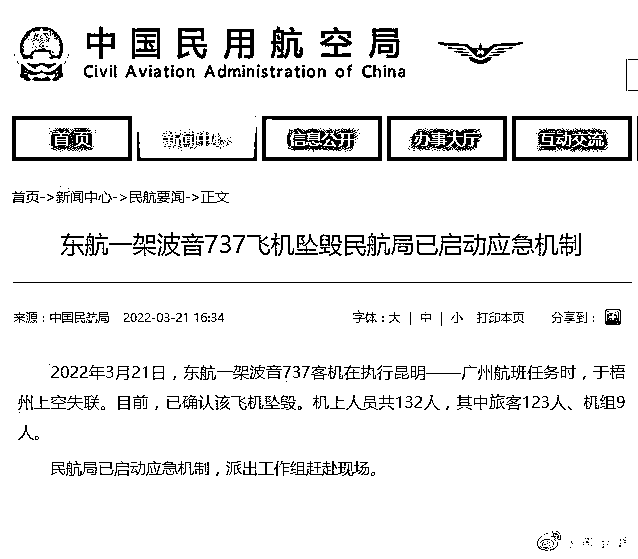

# 2022 又一惨痛悲剧：132 人的航班，2 分钟从 8000 米坠落地面

> 原文：[`mp.weixin.qq.com/s?__biz=MzIyMDYwMTk0Mw==&mid=2247532085&idx=1&sn=1739e1ae7c948f312dcb7ac3ebeead24&chksm=97cbb50da0bc3c1be8bbee91ef5003ea297057a37c9c4d14ccdf8f4efc4a7a632abf33d0d64b&scene=27#wechat_redirect`](http://mp.weixin.qq.com/s?__biz=MzIyMDYwMTk0Mw==&mid=2247532085&idx=1&sn=1739e1ae7c948f312dcb7ac3ebeead24&chksm=97cbb50da0bc3c1be8bbee91ef5003ea297057a37c9c4d14ccdf8f4efc4a7a632abf33d0d64b&scene=27#wechat_redirect)

**Mu5735！热搜第一！**

对新闻场外的你我来说，它或许只是一个不明所以的拉丁字母与阿拉伯数字组合的词汇。

令人心酸的是，这个词语承载着厚重且苦涩的悲剧。

往后，它会像马航一样为我们铭记、缅怀。它是一辆飞机型号，全称东方航空 MU5735，由昆明飞往广州。

机上旅客 123 人、机组 9 人，目前伤亡未知。起初据央视新闻报道，**飞机的速度和高度在广西梧州突然出现骤降，并在当地引发山火。**

在一些航空 app 上，刚失事的时候，这架飞机的状态是「失联」。

从 app 上看到，这架飞机在过梧州的时候，高度骤降，雷达消失。

之后的高度和速度： 

飞行数据显示，MU5735 航班从昆明机场起飞后，一直在约 8869 米高度进行巡航。**下午 2 点 19 分，飞机突然从巡航高度下降，同时飞行速度从约每小时 845 公里开始下降。2 点 21 分，MU5735 航班丢失 ADS-B 雷达信号，同地面失联。**

该航班由 B-1791，波音 737-800（NG）执行，机龄 6.8 年，2015 年 6 月 22 日交付东航云南，客舱布局为 J12Y150。

看到这样的消息，实在是太震惊了，感觉「空难」这个词明明已经很遥远了，而且是非起飞降落阶段的失事。

在广西梧州当地，有一些人拍到了飞机失事现场。

不远处的山林燃起大火，浓烟滚滚。 

还有引发的山火情况。

广西消防表示，已经调集救援力量开展救援。

虽然大家都希望机上一百多人平安，但这样子的状况，幸存概率很低了吧......

相关模拟的数据，也显示飞机坠毁前下降率 157 米每秒，即 1 分钟 9420 米，换算为飞行专业数据约为 31000ft/min 

这次空难让人想到中国民航史上损失第二惨重的「92 年南航桂林空难」。也是波音 737，也是 133 名乘客（今天的东航一开始说 133 人，后证实是 132 人），也是发生在广西，始发地广州。

1992 年 11 月 24 日，南方航空公司执行广州-桂林的 CZ3943 航班（执飞飞机为波音 737 型 B-2523）在向桂林机场正常进近过程中，高度突然下降，在阳朔县撞山粉碎性解体。机上乘客 133 人和机组人员 8 人全部遇难，无一生还，并且找不到一具完整的遗体，这是中国民航历史上最为惨烈的空难之一。  11 月 25 日下午，搜寻人员在天马山附近的丛林里找到了飞机黑匣子，从而了解到飞机在 11 月 24 日早晨 7:54 分呈接近 90°的右坡度向山撞去，瞬间飞机粉碎。

30 年之后，东航一架波音 737 在广西失事。

上个月，中国民航局宣布，中国民航运输航空持续安全飞行时间突破 1 亿小时。 

**今天 MU5735 失事，中国民航 137 个月的安全飞行记录就此终结。**

一场意外，不知又有多少家庭破碎，又让多少人为之心碎。

我们只能祈祷，伤亡能再小一点，所有乘客都能平安回家！

**延伸阅读：**

**中国发生过哪些重大空难？**

**1982 年 12 月 24 日，一架伊尔-18B 在从长沙飞往广州时，在广州白云国际机场失火，机上人员：旅客 58 人，机组人员 11 人，其中旅客 25 人罹难。**

**1983 年 9 月 14 日，一架三叉戟型号飞机在桂林奇峰岭军民两用机场滑行过程中,与一架空军轰六飞机相撞。机上人员：机组 6 人旅客 100 人，其中旅客 11 人遇难。**

**1985 年 1 月 18 日，济南复飞坠地空难。飞机进行复飞操作时处置不当，因失速坠地。机上人员：机组 7 人旅客 34 人，其中机组 7 人,旅客 31 人遇难。**

**1988 年 1 月 18 日，中国西南航空公司伊尔-18-222 号飞机执行北京—重庆航班任务时在重庆机场附近坠毁，108 人遇难。**

**1988 年 8 月 31 日，三叉戟香港着陆冲入海中意外。飞机偏离跑道中心线，即将落地前右机翼外侧与引导灯柱相撞，右起落架机轮与机场护堤相撞。机上人员：机组 11 人，旅客 78 人，其中机组 6 人，旅客 1 人共 7 人遇难。**

**1988 年 10 月 7 日，山西航空 IL14 临汾坠机意外。飞机机械故障,但 14 个固定座位却挤上了 44 名旅客,严重超载。机上人员：机组 4 人，旅客 42 人，造成机组 4 人，旅客 38 人，地面 2 人共 44 人遇难。**

**1989 年 8 月 15 日，东方航空 AN24 虹桥起飞意外。在上海机场起飞离地过程中,右发动机突然停车。机上人员：机组 8 人，旅客 32 人，其中机组 6 人，旅客 28 人共 34 人遇难。**

**1989 年 9 月 28 日，中国民航飞行学院四分院(今绵阳分院)一架 TB—20 型 8914 号飞机在四川绵阳机场训练飞行，起飞上升过程中不幸失事。4 名机组成员中有 3 人遇难，1 人受重伤，飞机报废，造成一等飞行事故。**

**1990 年 10 月 2 日，北京亚运会期间，一架从厦门飞往广州的厦门航空公司的波音 737 飞机在起飞后遭到劫持，在白云机场迫降时，接连撞上停在机场跑道上的一架波音 707 和一架波音 757，最终导致 128 人死亡，三架飞机报废。**

**1992 年 7 月 31 日，中国通用航空公司由南京飞往厦门的 GP7552 航班 2755 号雅克-42 型飞机起飞滑跑途中冲出跑道，在距机场约 600 米处失事。107 人死亡，19 人受伤。**

**1992 年 11 月 24 日，中国南方航空公司波音 737—2523 号飞机执行 3943 航班任务，由广州飞桂林，在广西阳朔县杨堤乡土岭村后山粉碎性解体，141 人遇难。这是中国民航史上最严重的一次空难。**

**1993 年 7 月 23 日，中国西北航空公司 BAe146 型 2716 号飞机执行银川至北京航班任务，在银川机场起飞时冲入水塘，54 人遇难，机组 3 人受伤。**

**1993 年 10 月 26 日，东方航空 MD82 福州落地意外。飞机姿态不稳，尾部擦地，由于速度快,飞机冲出跑道。机上人员：机组 9 人，旅客 71 人，其中旅客 2 人遇难。**

**1993 年 11 月 26 日，北方航空 MD82 乌鲁木齐降落意外。机组误将塔台通报的高度表拨正值 1024 设置为高度,飞机撞上地面高压线后,在距跑道外 2200 米处坠地烧毁。机上人员：机组 10 人，旅客 92 人，其中机组 4 人，旅客 8 人共 12 人遇难。**

**1994 年 6 月 6 日中国西北航空公司图-154 型 2610 号飞机，执行西安-广州 2303 号航班任务，在陕西省长安县鸣犊镇坠毁 160 人遇难。**

**1995 年 3 月 23 日，中国民航飞行学院广汉分院的一架夏延 3A 高级教练机在执行航线训练任务时，在济南机场进近过程中，收错定位用导航台，致使飞机严重偏离预定航线，加之盲目下降高度而撞山失事，机上 7 人全部遇难。**

**1997 年 5 月 8 日,执行重庆至深圳 3456 航班中国南方航空有限公司深圳公司波音 737—300 型 B2925 号飞机,在着陆过程中失事。机上旅 65 人,死亡 33 人(包括重庆某报社的一名女记者),空勤组 9 人,死亡 2 人。**

**1998 年 2 月 16 日，中国台湾“中华航空公司”一架 A300-600 客机在台北机场降落时撞入附近建筑，共造成机上 196 名乘员和地面 7 人丧生。这也是中国台湾地区有史以来的最大空难。**

**1999 年 2 月 24 日中国西南航空公司图 154—2622 号飞机在执行成都至温州航班任务时坠毁，61 人遇难。**

**2000 年 6 月 22 日下午 3 时左右，武汉航空公司一架从湖北恩施至武汉的运七型客机，在武汉郊区坠毁，武汉空难客机坠地时将汉江南岸一泵船撞毁，当时在船上作业的 7 人全部遇难。这样，加上机上的 42 名死者，此次空难中共有 49 人死亡。**

**2002 年 4 月 15 日，中国国际航空公司 CA129 北京-釜山航班在韩国庆尚南道金海市坠毁。机上共有 155 名乘客和 11 名机组人员，确定死亡人数为 122 人，失踪 6 人，幸存者 38 人。**

**2002 年 5 月 7 日，中国北方航空公司一架麦道 82 飞机在大连附近海域坠毁。机上 103 名乘客和 9 名机组人员全部罹难。**

**2002 年 5 月 25 日，中国台湾“中华航空公司”CI611 班机在澎湖附近海域坠机，机上乘客和机组人员共 225 人全部死亡。**

**2004 年 5 月 18 日，上午一架阿塞拜疆货机在新疆乌鲁木齐机场附近坠毁，机组 7 人全部遇难，其中乌克兰籍 6 人，阿塞拜疆籍 1 人。**

**2004 年 6 月 29 日上午 9 时许，中国民航飞行学院绵阳分院一架 TB-200 型 8830 号教练机起飞后不久发生故障，坠毁在绵阳机场附近的一处葡萄园中，机上教练、学员各一人当场死亡。**

**2004 年 6 月 30 日，一架歼七军用飞机在训练返程中因遇雷雨发生故障，在距武汉市区约 80 公里处坠毁。造成地面人员(儿童)1 死 1 伤，并烧毁了两间民房，飞行员跳伞后安全着陆。**

**2004 年 9 月 16 日，下午 15 时左右，一架执行航拍任务的直升机在浙江余姚玉石园附近坠毁，机上机组和乘客 7 人，4 死 3 伤。**

**2004 年 11 月 21 日 8 时 21 分，由内蒙古自治区包头市飞往上海市的 MU5210 航班，在起飞后不久坠入机场附近南海公园的湖里。包括 47 名乘客、6 名机组人员在内的机上 53 人全部罹难，同时遇难的还有一名地面公园工作人员。截至 17 时 10 分左右，此次事故中 54 名遇难人员遗体已全部找到。“11·21”空难事故中遇难人数为 55 人，其中机上遇难人员为 53 人，地面遇难人员为 2 人。**

**2009 年 11 月 28 日，津巴布韦 AVIENT 航空公司 MD-11 型飞机执行浦东至吉尔吉斯斯坦比什凯克马纳斯货运包机任务，北京时间 8:21 该机在浦东机场 35R 跑道起飞过程中冲出跑道，发生燃油泄漏并起火。机上共七人，三人死亡，四人重伤。**

**2010 年 8 月 24 日 22 时 10 分左右，河南航空有限公司一架 B3130 号 ERJ-190 型支线客机执行 VD8387 哈尔滨飞往伊春的客机在伊春林都机场跑道 690 米处场外提前接地坠毁，客机断成两截，部分乘客在出事时被甩出机舱。机上共 96 人，其中机组人员 5 人，儿童 5 人。事故造成 42 人遇难，54 人生还。本次空难使中国民航自 2004 年东航“11.21 包头空难”以后的 2102 天飞行安全纪录终结。**

**2014 年 7 月 23 日晚间 7 点，发生在 2014 年 7 月 23 日晚间 7 点，复兴航空 222 号班机在执飞台湾高雄国际机场飞往澎湖马公机场（现已改名澎湖机场）航线时，疑因台风麦德姆风雨过大造成飞机降落不顺利，复飞失败，于澎湖县湖西乡西溪村坠落，起火燃烧。机上 48 人罹难，10 人重伤。此次空难被称为复兴航空 222 号班机空难。**

**中国东航 3 月 21 日晚间公告，公司下属东方航空云南有限公司一架波音 737 客机在执行昆明——广州航班任务时，于广西梧州上空失联。目前，已确认该飞机失事。机上人员共 132 人，其中旅客 123 人、机组 9 人。**

**公告称，飞机失事后，公司高度重视，立即启动应急机制，派出工作组赶赴现场，并已开通家属应急援助专线 4008495530。本次飞机失事的原因还在调查中，公司将积极配合相关调查。公司对本次飞机失事中遇难的旅客和机组人员表示沉痛的哀悼。**

****

**来源：昌南大队长**

****

**← 向右滑动与灰产圈互动交流 →**

****