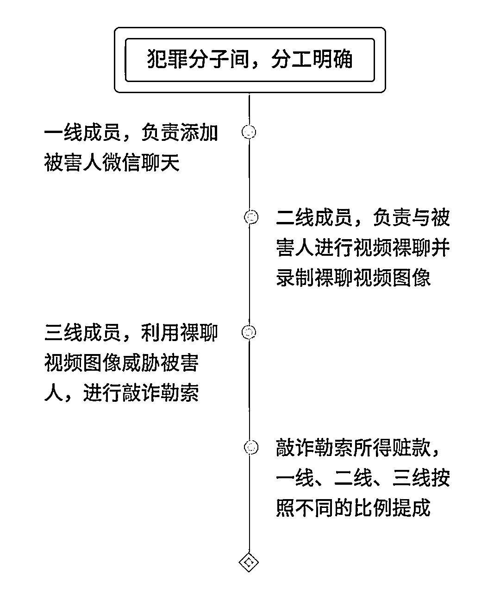

# 巧遇“美女”搭讪“裸聊”？有人被骗十几万…

> 原文：[`mp.weixin.qq.com/s?__biz=MzIyMDYwMTk0Mw==&mid=2247532085&idx=3&sn=a1a080bce0b8fd21f2b740b7898bd207&chksm=97cbb50da0bc3c1b1aa69bbff7371c0a1834be1e48df8a2aa9ae938c19af13b33137c0f57f22&scene=27#wechat_redirect`](http://mp.weixin.qq.com/s?__biz=MzIyMDYwMTk0Mw==&mid=2247532085&idx=3&sn=a1a080bce0b8fd21f2b740b7898bd207&chksm=97cbb50da0bc3c1b1aa69bbff7371c0a1834be1e48df8a2aa9ae938c19af13b33137c0f57f22&scene=27#wechat_redirect)

近日 

央视公布了一段

裸聊敲诈的真实声音

**“你觉得几千块钱和**

**你的人格尊严比起来**

**兄弟你嫌贵**

**那你可以不处理**

**我发出去了看你怎么做人**

**……”**

嫌疑人就是抓住了

受害人的贪色之心

以及惧怕曝光隐私的心态

一次又一次地进行敲诈

其实

近些年类似的案件

并不少发生

**视频裸聊敲诈勒索团伙被端，受害者超百人**

2022 年 3 月 16 日，涉嫌敲诈勒索的犯罪嫌疑人谷某到徐州铁路公安处投案自首，至此，徐州铁路公安处经过 16 个月的调查摸排，成功打掉一个通过裸聊视频敲诈勒索的犯罪团伙，**抓获犯罪嫌疑人 14 人，涉及受害人 100 余人，涉案总金额 80 余万元**。

*   **难抵诱惑，男子裸聊被勒索近 5 万元**

2020 年 11 月 27 日，在江苏连云港务工的河南人张先生走进徐州铁路公安处连云港站派出所报案，称被人敲诈勒索了将近 5 万元。

原来，11 月 24 日，张先生去上海出差期间通过一个交友软件消磨时光，有一个头像显示是美女的网友主动与其聊天。没有任何戒备心理的他就加了对方的 QQ，**对方不时发出贴心的问候，又时不时发一些美女图片和一些诱惑性、挑逗性的语言。禁不住诱惑的张先生在 QQ 上与对方热聊，后来开始裸聊**。

对方还发给他一个小程序，声称会有很多美女视频福利，让他点开。实际上，这个小程序含有木马病毒，等张先生点开后，手机通讯录里的电话号码立即被对方获取。

几次裸聊后，11 月 26 日，对方声称他们已将张先生的裸聊视频截屏，还录制了视频，也掌握了他手机通讯录里的联系人和电话，**如果他不转钱，就将图片、视频寄给他的家人、领导和朋友，进行扩散，让他抬不起头来**。

此时，张先生意识到被骗了，在乘坐列车回连云港的路上，对方不停地对他进行恐吓。张先生答应了对方的“解决方案”，第一次转了 1000 元，**但对方声称，这些钱只能删掉一个号码，变着花样地让他继续转账**。

一连转了七八次，张先生手机里没有钱了，对方还不依不饶地又让其在互联网平台上借钱。最后，**张先生一共给他们转账了 13 次，共计 47954 元**。

*   **顺线追击，摧毁敲诈勒索团伙**

接到报警后，连云港站派出所迅速将案情上报。随后，徐州铁路公安处成立专案组，抽调精干警力开展侦查工作。

通过对“资金流”的分析研判，专案组很快确定了“最底层”的嫌疑人刘某，并于 2020 年 12 月 15 日在广州将嫌疑人刘某抓获，随后经过进一步侦查，初步掌握了一个敲诈勒索犯罪团伙。

该团伙犯罪嫌疑人李某、胡某进行策划，拉拢人员前往缅甸组建团伙实施网络裸聊敲诈勒索。由李某负责人员管理、资金管理、场地租赁、设备购买，胡某拉拢人员偷渡到缅甸，组建成以李某、胡某为首的团伙，成员共 14 人，分工明确，**由“客服”负责通过互联网交友平台寻找男子，引诱受害人视频裸聊，并通过非法软件获取对方手机通讯录，然后交由“枪手”，负责变换各种招数对受害人进行敲诈**。赃款全部汇总到李某手中，由李某根据团伙成员的作用分配钱款。

专案组通过与地方公安机关的合作，前往广东惠州、东莞及湖南耒阳等地进行抓捕，截至目前，已将 14 名嫌疑人全部抓获。据初步统计，该团伙于 2020 年 9 月至 2021 年 5 月期间，累计敲诈受害人 100 余人，涉案金额 80 余万元。

经审查，民警发现 14 名嫌疑人都是“95”后，最大的 27 岁，最小的只有 19 岁。除了一名嫌疑人家在广东，其他的嫌疑人都是湖南省耒阳市的老乡，有的还是亲戚。这 14 人全部为男性，有的要同时面对几名“男友”，他们给“男友”编号、起名，在本子上记录下“男友”的地址、年龄、爱好等，避免出现差错。其中，一名担任“客服”的嫌疑人共诱惑成功了 30 名受害人。

据嫌疑人交代，他们在缅甸过着纸醉金迷的生活，出入各大酒店、宾馆、娱乐场所，吃喝玩乐，有的还吸食过毒品，敲诈勒索的钱财基本被挥霍一空，有的嫌疑人回国时，一些交通、生活费用还是让家里人给转的钱。

**男子“裸聊”被敲诈 11 万元**

灵台县公安局专案民警在安徽省宿州市将犯罪嫌疑人李某龙、王某抓获

网上聊天巧遇“美女”搭讪，邀约“裸聊”后，“桃花运”变“桃花劫”，结果被勒索 11 万元。近日，甘肃灵台警方远赴千里之外的安徽省宿州市抓获“裸聊”诈骗团伙犯罪嫌疑人 2 名。

2022 年 1 月 6 日 17 时许，灵台居民夏某在某聊天 App 上和一个昵称为“小妞”的网友聊天时，**没有经受住对方言语挑逗，按照对方的诱导下载了指定的 App，随后进行视频裸聊**。

裸聊 1 分 54 秒后对方将视频挂断，随后一个陌生女子添加夏先生微信，并将他的裸聊截图和视频传过来，威胁夏某给其汇款，否则就把裸聊视频、图片发给其手机通讯录好友。**因害怕隐私暴露造成不良影响，夏某累计向犯罪嫌疑人指定账户转账款 11 万元**。不料对方欲壑难填，无力再付款的夏某最终选择了报警。

案发后，灵台县公安局刑侦、网安部门立即成立专案组对此案开展侦查。经对案件资金流水认真分析研判，发现涉案资金通过多张银行卡进行了转移，这些银行卡分别属于两名安徽籍男子李某龙和王某。

近日，在当地警方的协助下，专案组民警在安徽省宿州市将犯罪嫌疑人李某龙、王某抓获，当场缴获涉案银行卡 5 张。经审讯，李某龙、王某对自己的犯罪事实供认不讳。

**在校学生遭遇裸聊类电信网络诈骗果断报警**

自己与网友在正常网络聊天，突然对方发来自己的不雅照，问自己要钱，不给钱就把照片“曝光”，可这照片根本是伪造合成的，怎么办？近日，某学校的一位在校学生就遭遇了这么一件糟心事，不过这位同学认真听过民警的反诈宣传，没有转账，而是选择了报警，避免了财产损失。

2022 年 3 月 3 日上午，某学校保卫处报警反映学校一名同学可能遭受了电信网络诈骗。上海市公安局崇明分局陈家镇派出所民警彭佳威立即前往。见到了心有余悸的学生小陈（化名），民警一边安抚其情绪，一边耐心询问了详情。

原来，3 月 2 日上午，**在常用的聊天软件上，有一社交账号昵称名为“彼岸花”的人与小陈添加了好友**，而这个“彼岸花”和小陈同在一个校外辅导的群里，对方添加的申请理由写着想要一份群里之前发过的学习资料，小陈便通过了对方的好友申请，并提供了相关资料。

聊天过程中，对方发起了视频聊天，可小陈接受后对方却是黑屏状态，软件中小陈的脸刚显示出来，对方就关闭了视频。接着，**对方又发给他一个某手机 App 的安装包，称该 App 内有最新的辅导资料。陈同学按照对方的要求安装了这款 App**。

等陈同学登录该 App 后，却发现这是个成人视频 App，吓得小陈马上退出并删除了该 App。就在这时，“彼岸花”却将一张裸露身体的不雅照发给小陈，不雅照的脸部正是之前视频聊天时小陈的画面截图，接着**“彼岸花”向陈同学索要 3000 元人民币，并发来一张陈同学手机通讯录的截图，声称如果不同意就将这张不雅照发给其通讯录内的联系人**。

紧张、恐惧、无助一下子涌上小陈的心头，他开始坐立不安、不知所措，纠结着是不是要给对方打钱、破财消灾，此时他想起之前有民警到学校开展过的反诈宣传。**于是小陈马上与学院保卫处取得联系并报警求助**。

根据小陈的描述，并查看了相关聊天记录后，民警判定这是裸聊类电信网络诈骗案件的一起变种案件。民警随即安抚小陈，向他讲解这是电信网络诈骗中常见的手法，对方发来的恶意 App 会盗取被害人的通讯录信息，之前的视频聊天中，对方截图被害人脸部照片，再合成出不雅照，进而要挟被害人转账，但就算给对方转了钱，对方也不会删除照片，只会让受害人不断打钱，甚至就算无力支付，骗子也会要求被害人通过借款贷款等形式，直至榨干被害人，**因此不转账、快报警是正确的选择**。

在民警的劝慰下，陈同学的情绪逐渐舒缓下来，顾虑也打消了。

目前，崇明警方正在对该社交软件账号开展进一步追查工作。

**总结以上**

**裸聊的诈骗套路是这样的**

↓↓↓

[`mp.weixin.qq.com/mp/readtemplate?t=pages/video_player_tmpl&action=mpvideo&auto=0&vid=wxv_2319468072111407105`](https://mp.weixin.qq.com/mp/readtemplate?t=pages/video_player_tmpl&action=mpvideo&auto=0&vid=wxv_2319468072111407105)

**关于“裸聊”** 

**你可能还有以下疑问**

**一、什么样的情况更容易“中招”？**

1、根据警情数据显示，遭遇裸聊诈骗的受害人，从职业上看，特征并不明显。无论是企业老板、政府职员，还是金融白领、待业青年，每一个都可能中招。工作越体面，损失金额可能越大。

2、从上网习惯看，经常使用微信“摇一摇”“附近的人”，喜欢加入 QQ“福利群”，以及热衷“陌陌”“探探”等聊天交友软件的人，更容易被盯上。

**二、手机通讯录为什么泄露？**

大多数受害人在裸聊之前会被要求下载某款 App，无论理由是“直播软件”还是“特定视频软件”，甚至是“色情软件”，这些软件安装后大抵不能正常使用，或者“货不对版”。

实际上这些 App 是木马软件，一旦安装，会窃取受害人手机通讯录信息，即使马上卸载也无济于事。

**三、真有女子跟受害男子裸聊吗？**

真有！但你看到的美女只是犯罪链条中的一个环节，在她背后是犯罪集团成员之间的分工协作。

**四、裸聊被敲诈要不要私下解决？**

通常，对方不会一上来就狮子大开口，吓到你直接报警。每要求你转一笔承受范围内的钱，都会许诺转账后删除视频，但是之后又会变着方儿让你无休止地转钱，所以遭遇此类事件，别犹豫，马上报警！

最后

还是要提醒大家

**保持健康的上网习惯**

不要浏览色情信息

切勿试图寻求刺激

**不要轻信陌生人**

不轻易下载他人指定的所谓 App

更不要向陌生人泄露

身份和家庭等敏感信息

发现被骗或者被敲诈后

不要选择沉默

**第一时间报警**

**第一时间报警**

**第一时间报警**

积极配合公安机关调查取证

来源：平安北京，央视财经

← 向右滑动与灰产圈互动交流 →

