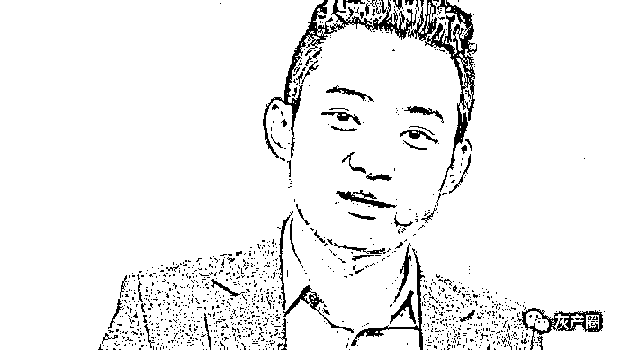

# 虚拟货币割“韭菜”老手孙某晨被美调查，最高或判罪 25 年，比特大陆吴某寒曾助其逃离中国！！！

> 原文：[`mp.weixin.qq.com/s?__biz=MzIyMDYwMTk0Mw==&mid=2247532085&idx=4&sn=1d3a31fc2251618018cf79f7bd8e6383&chksm=97cbb50da0bc3c1b779f986cb198be0d677e7aa54406c64ee6242f6f34c0a3b20717dcc49b84&scene=27#wechat_redirect`](http://mp.weixin.qq.com/s?__biz=MzIyMDYwMTk0Mw==&mid=2247532085&idx=4&sn=1d3a31fc2251618018cf79f7bd8e6383&chksm=97cbb50da0bc3c1b779f986cb198be0d677e7aa54406c64ee6242f6f34c0a3b20717dcc49b84&scene=27#wechat_redirect)

美国媒体报道称，从中国神奇逃亡出去的虚拟货币界臭名昭著的割韭菜大王、波场创始人孙宇晨涉嫌内幕交易、涉嫌欺诈以及通过移民洗钱，目前被美国国税局和 FBI 调查。调查已接近尾声，孙宇晨最高或被判处 25 年监禁。而孙宇晨正试图使用其它国家公民身份躲避美国的法律制裁。

**发币割韭菜后，孙宇晨紧急逃亡**

2017 年 9 月，孙宇晨走出仁川国际机场，那时，他的公司 Tron 刚刚完成波场币 TRX 的发行，快速收获了 7000 万美元。但是，孙宇晨是违规发行的数字货币。就在 2017 年 9 月 4 日，中国央行等七部委联合发布《关于防范代币发行融资风险的公告》，全面叫停代币融资。

孙宇晨逆风而上，不惜与政府法规对着干。而与他站在一起的私募名单里有很多大名鼎鼎的人物，包括比特大陆 CEO 吴忌寒、FBG 资本创始合伙人周硕基、峰瑞资本创始合伙人李丰、量子链创始人帅初，甚至还有 OFO 创始人戴威。

The verge 报道称，孙宇晨等人明知 ICO 禁令即将到来，但仍然选择加速推进销售，最终在 2017 年 9 月 3 日完成销售。一周后，孙宇晨迅速乘飞机逃到了韩国仁川国际机场，并从那里离开。

孙宇晨是如何精准踩点销售 TRX 并及时逃到首尔的？The verge 称，孙宇晨从北京到首尔的逃跑路线是一个谜，The verge 引述知情人士的说法称，币安的创始人兼首席执行官赵长鹏向孙宇晨透露了政府禁令的消息。也有说法称，孙是通过自己的渠道了解到政府即将出台禁令。

孙的前雇员称，孙宇晨与赵长鹏是（发行 TRX 收割中国“韭菜”）一伙的。赵长鹏没有否认他与孙宇晨的合作关系但不承认有更私密的来往。不过，2019 年，两人还曾一起在日内瓦湖畔度假。

孙宇晨从首尔乘飞机到了旧金山，完成了他虚拟货币生涯中第一次逃跑。对孙宇晨来说，这点冒险并不困难。他很早之前就领悟到，要在虚拟货币世界收割韭菜，就必须在被抓住前及时脱身。

**遥控中国团队从事内幕交易**

逃到美国后，孙宇晨躲在旧金山的一个高层公寓里。几个月后，受益于 Tron 的代币 TRX 的价格飙升。孙宇晨套现了数亿美元财富。随后他通过香港一家叫 Davidyo Limited 的公司转了数百万美元到他在美国的银行账户。随后，他斥资 1.4 亿美元收购了陷入困境的 BitTorrent。

据说，孙宇晨经常在 Tron 位于旧金山的办公室中声情并茂地讲述他的逃跑故事，他的员工们对此习惯。他们经常会收到一条信息：“贾斯汀又哭了。”

那时候，孙宇晨在北京的 Tron 总部仍然正常运营，其中包括一个内幕交易团队。

据称，这个做市团队由一名叫叫徐宝龙（Baolong Xu）的技术官僚领导。徐及其团队的主要工作就是确保“TRX 价格达到贾斯汀（孙宇晨）想要的某个水平”。孙宇晨每当在宣布好消息之前，会指示这个团队买入 TRX，消息宣布后，代币价格飙升，他们卖出代币收获利润。

孙宇晨通过收割“韭菜”用户发财致富，但他毫不掩饰对 “韭菜”的嘲弄。一名前雇员曾问他，北京团队“做市”是什么意思时，他笑着说：“你知道中国人是怎么做的，对吧”。他解释说，做市团队的工作是与波场外面的有钱“大户”合作，“我们有办法推高 TRX 的价格，这些大户很有钱但没脑子，你可以随意操纵他们。”

BitTorrent 的首席财务官从 Tron 北京总部返回美国后，曾与同事谈到 Tron 可能涉嫌非法活动。最后，他们得出的一致结论是，尽可能远离跟 TRX 有关的工作，做到不知情，不参与。

美国金融法律专家称，孙宇晨以及 Tron 北京总部的内幕交易行为如果被证实，最高刑罚为 20 年监禁。此外，加密货币如果没有在美国证券交易委员会注册，则向公众出售这些加密货币就是犯罪行为，在美国最高可判处 5 年监禁。

为了让自己发行虚拟货币的行为合法化，孙宇晨一度聘请了一名前美国证监会的高管担任顾问。孙宇晨提出了一个可笑的要求，让这名前监管人员证明 TRX 不是证券代币，而是一种公用事业代币。对这种匪夷所思的要求，该高管拒绝了。

随后，孙宇晨在美国发行了第二次代币，也就是 BitTorrent 代币，简称 BTT。BitTorrent 拥有 1 亿活跃用户，孙宇晨当初收购这家公司显然是盯上了庞大的用户群。

孙宇晨希望前述美国证监会前高管写一份法律文件证明 BTT 不是非法证券，以保护他免遭可能的指控，但遭到拒绝。接着，孙宇晨宣布免费向公众发放 BTT，也就是所谓的“空投”。这种营销策略相当危险，因为这会被认为是推销证券产品的行为。最后，前述美国前证监会顾问宣布辞职。

有钱能使鬼推磨。孙宇晨最终找到了一名来自香港的律师，写了一份调查报告，证明 TRX 是公用事业代币。

当收购了 Poloniex 加密货币交易所后，孙宇晨变得更加喜欢冒险。Poloniex 就像加密货币的赌场，那里什么货币都能交易，非常混乱。

但 2018 年，Poloniex 被一家名为 Circle 的加密金融公司收购后，该公司试图从交易所清除非法活动，并将其转变为接近纳斯达克证券交易所的东西。Poloniex 严格执行了 KYC（“了解你的客户”）规则，结果交易量暴跌。

随后，孙宇晨接手 Poloniex，他决定恢复之前不对客户做审查的政策。他将 Poloniex 搬到了对加密货币没有任何监管的塞舌尔群岛，但该公司的总部位于美国波士顿，大约有 50-70 名员工。表面上，这家公司为远在塞舌尔的 Poloniex 提供技术服务。

很快孙宇晨就要求推翻 Poloniex 的所有 KYC 规定，为了扩大中国用户的通过率，孙宇晨甚至要求伪造“KYC”。为此，他要求公司建立了一个自动化的 KYC 系统，无论用户提交什么身份证件都会获得通过，哪怕你提交的是一张鸭子的照片。

一名雇员称，孙宇晨似乎将交易所变成了他的个人银行。

狡兔三窟

为了逃脱被美国政府起诉的风险，孙宇晨一直在寻找第三国合法身份。2018 年，孙宇晨派代表到马耳他会见了该国总统和经济与工业部长。

随后，孙宇晨秘密投资了 100 万美元获取该国公民身份。孙宇晨在马耳他租了一套公寓，并用中国名字设立了一家名为 Tron Limited 的公司。不久，孙宇晨拿到了在马耳他的居留卡。同时，孙宇晨还在马耳他进行了两项 5 万欧元(1.0987, -0.0001, -0.01%)的投资，这是为其父亲和母亲申请公民身份。

有说法称，孙宇晨属于狡兔三窟。除了马耳他外，他还曾声称自己是加勒比群岛圣基茨和尼维斯的公民。

为了转移资金，孙宇晨在世界各地开设了大量银行账户，仅在美国，他就有至少 13 个银行账户。不过，他在开账户时从不敢透露自己从事加密货币行业工作，因为那样极可能被银行冻结账户和资金。

孙宇晨还在马耳他开设了至少 8 个银行账户。孙宇晨的一位合作伙伴称，他这样做的一个目的尽可能少缴税。孙宇晨认为缴税很愚蠢。

去年圣诞节前，孙宇晨的一名前雇员接到了 FBI 和美国国税局的约谈，要求了解孙宇晨的一些情况。这两家机构询问了 TRON 在美国和北京的员工情况，还有美女模特带着孙宇晨飞往世界各地的传闻，以及他私下里有没有做生意。

此外，为孙宇晨工作的另一些员工已收到法庭大陪审团的传票。通常处理华尔街金融犯罪的纽约南区检察官办公室正在寻找针对孙宇晨的刑事证据。目前，官方调查已经接近尾声，据称，针对孙宇晨的指控罪名包括：电汇欺诈、阴谋或意图进行电汇欺诈、诈骗、洗钱、发行未注册证券并撒谎、协助和教唆犯罪，以及合谋欺骗美国。

孙宇晨的最终结局是什么，恐怕没有人清楚。

孙宇晨在新冠疫情爆发前就离开了美国，迄今未返回。在过去两年里，孙宇晨仍然很活跃。他在艺术品艺术品和 NFT 拍卖上花费了数百万美元，其中一个是价值 50 万美元的岩石数字图像，另一个是阿尔贝托·贾科梅蒂的价值 7840 万美元的雕塑。他还透露，他以 2800 万美元的高价赢得了 Blue Origin 的拍卖，获得了其中一个飞往太空的飞船座位。

值得注意的是，孙宇晨还高调宣布他现在是格林纳达驻世界贸易组织的大使。前雇员猜测，孙宇晨弄到这个新头衔可能是为了争取外交豁免权。不过，如果美国真的判决孙宇晨有罪的话，他现在获得公民身份的几个岛国都跟美国签有引渡协议，因此并不能让他逃脱牢狱之灾。

这一次，孙宇晨还能顺利逃脱法律的制裁吗？孙宇晨的那些老朋友们是不是正瑟瑟发抖呢？

来源：金融项目深度分析，巴蜀反诈

← 向右滑动与灰产圈互动交流 →

