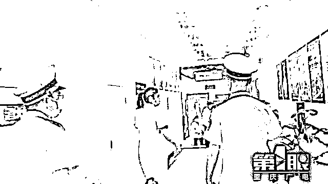

# 重庆一医院声称可以“定制”胎儿性别？当地卫健委：已叫停

> 原文：[`mp.weixin.qq.com/s?__biz=MzIyMDYwMTk0Mw==&mid=2247532085&idx=5&sn=b42586d0b93e6840357136db06883b8f&chksm=97cbb50da0bc3c1bd6707bbce7439a1854887e1d89fde5d91667f63e78970784651b0fd7741d&scene=27#wechat_redirect`](http://mp.weixin.qq.com/s?__biz=MzIyMDYwMTk0Mw==&mid=2247532085&idx=5&sn=b42586d0b93e6840357136db06883b8f&chksm=97cbb50da0bc3c1bd6707bbce7439a1854887e1d89fde5d91667f63e78970784651b0fd7741d&scene=27#wechat_redirect)

**3 月 19 日，重庆沙坪坝区卫健委介入调查重庆一医院的“精婴定制计划”。** 

**男孩女孩任选？**

近日，有市民爆料，重庆沙坪坝区爱德华医院出现一则广告，称可以“定制怀孕”，想要男孩还是女孩可任选。

医院一位杨主任声称，这是从英国、德国、日本引进的“LST”精婴定制技术，有三种方案，价格最高的方案性别筛选成功率高达 99%，还额外包括“个人大数据收集计算过的定制化辅导”。

价格略低的另外两个方案则主要是口服药物和外力理疗。

当记者询问大数据的定制化辅导具体是什么时，杨主任却不愿多说，表示“你不要问了，（交钱定了）之后我们给你说怎么办。”

对于广告上的“成功率高达 99%”，杨主任也承认“我不知道，反正他们是这么宣传的”。

当记者询问“LST”技术具体是什么医学术语，能不能查得到时，杨主任说这是项多国家联合技术，不方便透露具体内容，付款签协议之前都不会详细说明。

根据《中华人民共和国母婴保健法》第三十二条，医疗保健机构依照本法规定开展婚前医学检查、遗传病诊断、产前诊断以及施行结扎手术和终止妊娠手术的，必须符合国务院卫生行政部门规定的条件和技术标准，并经县级以上地方人民政府卫生行政部门许可。**严禁采用技术手段对胎儿进行性别鉴定，但医学上确有需要的除外。**

杨主任表示，爱德华医院也不做胎儿性别鉴定，要抽血送到别的地方去检查，大概花费两千元。 

**官方回应**

18 号上午，记者将情况反映给了重庆沙坪坝区卫健委。

综合执法支队的工作人员和记者一起来到了爱德华医院，要求医院方面拆除了相关的广告牌。

**现场执法过程中， 记者了解到，爱德华医院的“LST”精婴定制计划并没有获得相关备案和许可。**

爱德华医院的杨主任告诉综合执法支队的工作人员，该项计划其实还处于宣传阶段，目前并没有病人问诊。

对于医院的这项计划，杨主任表示，本来是想聚焦“优生优育”，“不晓得怎么搞偏了”。她又强调，都是院方的意思。

爱德华医院医务科负责人刘先生表示，医院的“精婴定制计划”昨天已经叫停，对于广告中提到的“LST”技术，他表示，自己也不是很清楚。

对于此事，刘先生也表示，院方进行了反省。

**目前，综合执法支队已经叫停了该项目并按规定对爱德华医院进行了警告，同时下达了卫生监督意见书，责令立即拆除广告牌。**

来源：央视网、@重庆广电-第 1 眼、九派新闻、中国政府网

← 向右滑动与灰产圈互动交流 →

