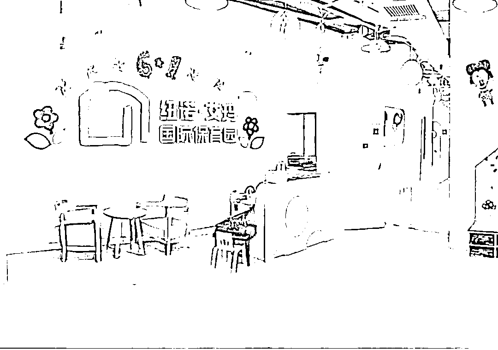
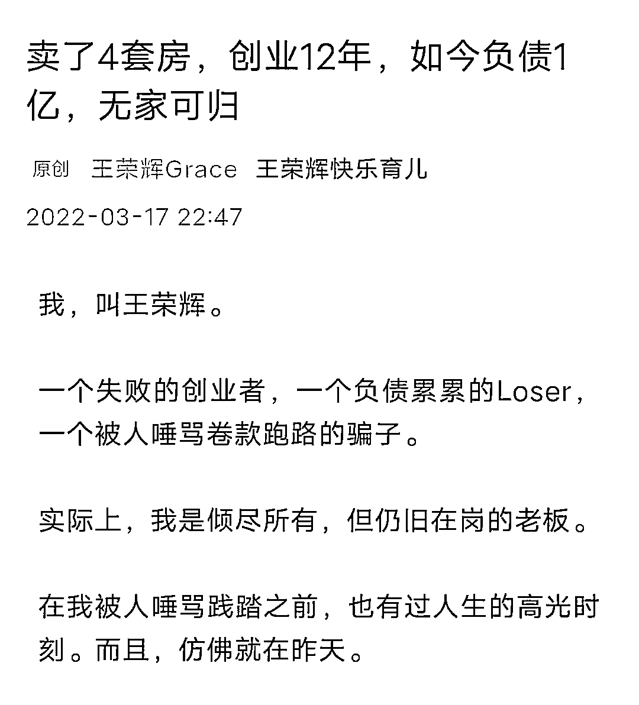
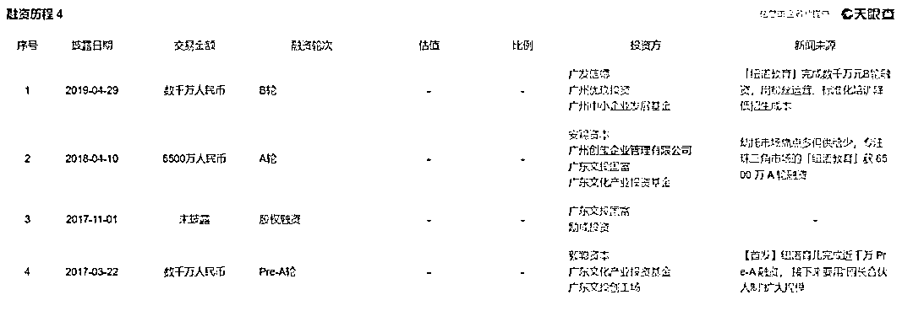
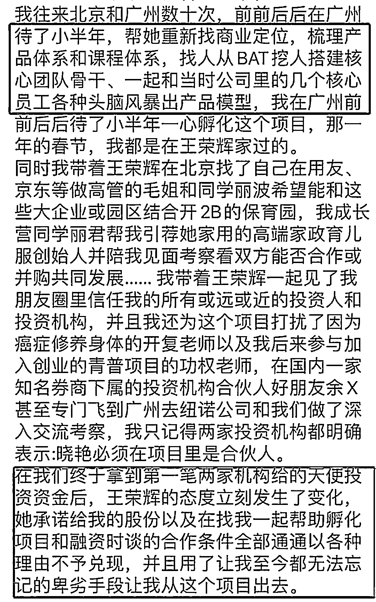
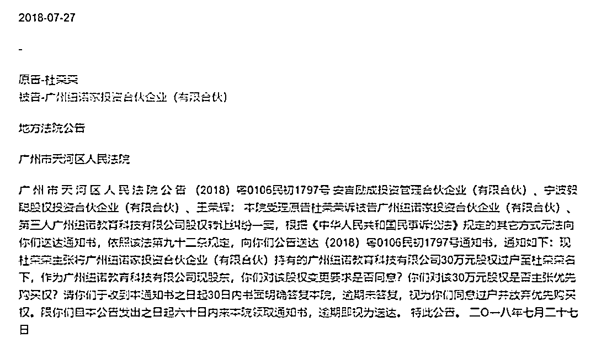
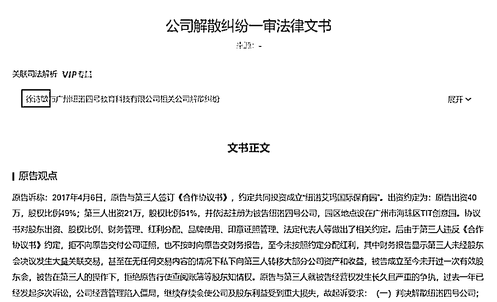
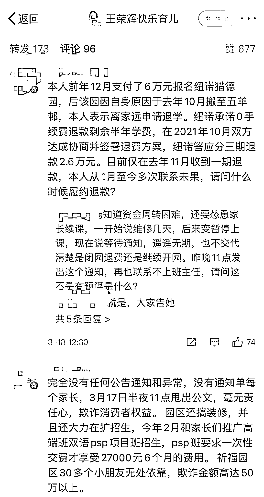
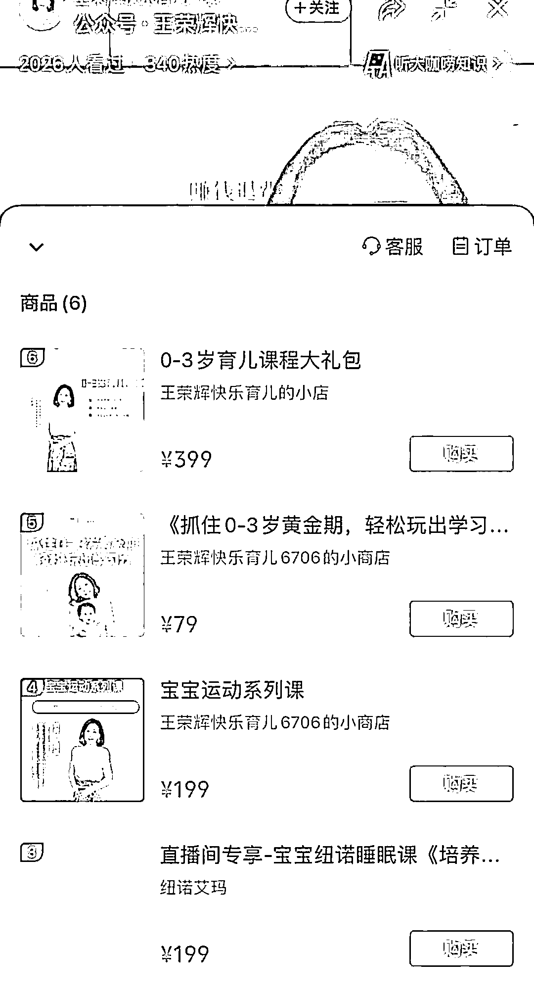

# 卖 4 套房创业负债 1 亿！纽诺教育深陷“光卖惨不退费”争议

> 原文：[`mp.weixin.qq.com/s?__biz=MzIyMDYwMTk0Mw==&mid=2247532085&idx=6&sn=f594ee06f1f904bad535f0524b5cc928&chksm=97cbb50da0bc3c1be2a00b3d2f2d656f07cff5699554930473a4e956488da2069e6dc0d045b9&scene=27#wechat_redirect`](http://mp.weixin.qq.com/s?__biz=MzIyMDYwMTk0Mw==&mid=2247532085&idx=6&sn=f594ee06f1f904bad535f0524b5cc928&chksm=97cbb50da0bc3c1be2a00b3d2f2d656f07cff5699554930473a4e956488da2069e6dc0d045b9&scene=27#wechat_redirect)

##### **▎****争议也随之而来，一边是，不少家长自发组建维权群，向纽诺教育要求退费；另一边，有前合伙人发文，直指王荣辉并没有她自己说的那么努力、单纯，曾用各种手段排挤、踢走包括她在内的一同创业的合伙人。**

钛媒体编辑丨刘萌萌

近日，一篇“卖了 4 套房，创业 12 年，如今负债 1 亿，无家可归”的自述文章刷屏，作者王荣辉及其创立的广州纽诺教育科技有限公司（以下简称“纽诺教育”）迅速收获大量关注。

不少网友表现出同情和支持，感慨创业不易并鼓励其东山再起。争议也随之而来，一边是，不少家长自发组建维权群，向纽诺教育要求退费；另一边，有前合伙人发文，直指王荣辉并没有她自己说的那么努力、单纯，曾用各种手段排挤、踢走包括她在内的一同创业的合伙人。

## **巅峰期估值 5 亿，疫情下“卖房求生”告败**

## 

“一个失败的创业者，一个负债累累的 Loser，一个被人唾骂卷款跑路的骗子，一个倾尽所有但仍旧在岗的老板。”这是王荣辉对当下的自己的定义，但正如她所说，在被人唾骂之前，也有过人生的高光时刻。

公开资料显示，王荣辉曾供职于外企金融公司，担任人力资源总监，有了女儿之后，萌生了做早教创业的想法。最初以加盟的形式开办了一家澳洲品牌的早教机构，“花了 300 万元就当是给我的孩子一个重新成长的机会”，后来多番思虑，决定自主创业。

据王荣辉自述，2009 年，她卖了第一套房开始创业，打造了一个口碑不错的早教机构；2011 年，她卖了第二套房，壮志勃勃拓展第二家、第三家早教机构；2013 年，她开办第一家托育园，学位一票难求，很快就开了第二家、第三家；2016 年，她再卖一套房，用来拓展更多托育园，第五家、第六家、第七家……

期间，王荣辉还自己研发相关课程、做全国性的讲座，获得了不少全职妈妈的认可。“纽诺教育”这个品牌也是在这期间、于 2015 年 9 月启动的，致力于为 0~6 岁儿童家庭提供线上线下专业、优质育儿服务及教育，广州纽诺教育科技有限公司随之于 2016 年 1 月正式成立。

2017 年，王荣辉迎来了事业的一个重大转折点。这年 3 月，纽诺教育拿到了文投创工厂、毅聪资本投资的 1000 万元 Pre-A 轮融资。接下来的两年里，纽诺又相继完成了由安赐资本、威创股份领投的 6500 万元 A 轮融资，以及由广发德信领投、广州市中小企业发展基金跟投的数千万元 B 轮融资。

随着纽诺成为中国首个完成 B 轮融资的托育品牌，王荣辉本人也站上了创业巅峰。按照她的说法，2019 年，纽诺也成了全国最大的托育直营连锁品牌，在珠三角地区的分园扩展到近 40 家，估值达 5 个多亿，“前来合作的风投络绎不绝，我接待了一批又一批。”

直到疫情爆发。自 2020 年 2 月开始，纽诺教育所有园区持续关园了 6 个月。“不能经营，没有收入，但园区的租金、物业、老师们的社保工资却需要照常开支。更要命的是，疫情停课还引来一波退费潮……很快，我们就耗空了公司多年积攒下的现金流，”

王荣辉表示，为了保证公司正常经营，老师员工不流失，家长能及时退费，她不仅把全家的积蓄拿出来，还个人担保找银行贷款 1000 多万，更以个人名义从亲朋好友处集资了上千万现金，最后又不得不卖掉了自住的房子。“我像一个疯狂的赌徒，掏空一切来‘押注’，只为最后一搏。”

不过，疫情反复之下，“在生死存亡线上挣扎了将近三年”的王荣辉已然无力。她承认了失败，并在文章中强调，“我不会跑路，不会躲避。只要我活着，我就会努力偿还一切我该偿还的债务。”

## **遭合伙人爆料，股份纠纷疑似问题所在**

## 

然而，“史上最悲情创业者”形象刚树立不久，事情就出现了反转。

网传自称为王荣辉“早期合伙人”的李晓艳在朋友圈发文，直指王荣辉并没有她自己说的那么努力、单纯，曾用各种手段排挤、踢走包括她在内的一同创业的合伙人。

据李晓艳自述，作为大学校友、老乡，在入门天使投资圈后，她决定帮王荣辉一起孵化纽诺教育的项目。从找商业定位到梳理产品体系，李晓燕都参与其中，甚至带着王荣辉一起见了朋友圈中信任她的投资人和投资机构。

但在拿到第一笔两家机构的天使投资资金后，“王荣辉的态度立刻发生了变化，承诺给我的股份以及找我一起帮忙孵化项目和融资时谈的合作条件全部通通不予兑现，并且用了让我至今都无法忘记的卑劣手段让我从这个项目出去。”

此外，李晓艳还提到了几个有类似遭遇的人，包括：王荣辉的前合伙人付 X、纽诺育儿 COO 兼合伙人杜 RR、园区合伙人徐 SM、傅 YS。其中，“杜 RR”在借钱投入多年、坚持拿低薪之后被扫地出门，后与王荣辉对簿公堂；“徐 SM”从来看不到财务报表，也没有分红，还被篡改数据，最终也走上法庭。

值得注意的是，天眼查信息显示，王荣辉确实和“付 X 及徐 SM”存在股权转让纠纷。

据天眼查资料，杜荣荣曾于 2018 年 7 月向广州市天河区人民法院主张将广州纽诺家投资合伙企业（有限合伙）持有的广州纽诺教育科技有限公司 30 万元股权过户至杜荣荣名下。徐诗敏在法律文书中描述的遭遇也基本与李晓艳爆料一致。

李晓艳说，看到王荣辉写的文章，自己既开心又平静。“上苍没有辜负我的善良和信仰，善恶有报因果轮回终于显现……创业不易，每个人都不容易！更何况在疫情大的历史背景下——但我想说，每一个人不能因为不容易而去伤害和剥夺他人，人品和善良是任何时候的底线！”

对于上述言论，王荣辉并没有公开回应，不过，有疑似为王荣辉朋友圈的截图传出，显示其驳斥了李晓艳的说法，称“李的大量邀功完全不属实，（在）她短暂地出现之前，纽诺已有了自己的商业模式和课程体系，（这些）跟她毫无关系。”

另据每日经济新闻报道，纽诺教育一早期投资人认为，纽诺教育“迟早要出问题”。一方面是看到公司长年都有与股东、员工的司法纠纷，另一方面则是觉得纽诺教育扩张速度太快。

## **尚未提供退费方案，家长质疑“暴雷”早有预谋**

## 

爆料风波之外，纽诺教育还深陷“光卖惨不退费”舆论。

与微信文章下面的感恩、支持、同情不同，在王荣辉的微博评论区，排名靠前的留言基本都是家长讨债的：一位家长称，纽诺去年承诺分三期退还的学费，目前还有两期没有退款；另有几位家长表示，纽诺 2 月份还在装修、大力招生，才收了高达 2 万多的学费，却突然说公司不行了，就是诈骗；甚至有家长透露，纽诺在 3 月初及前几天让缴费……

此外，有家长指出，纽诺教育如果按照国家规定只收不超过 3 个月的预付款，而不是 6 个月，也不会给自己埋那么大的雷；王荣辉如果真的有良知，就会主动告诉家长真实情况，而不是明知要闭园还怂恿家长续费，招致那么多不满。

在不少被欠费的家长眼里，纽诺教育的忽然“暴雷”早有预谋，王荣辉发文章的做法就是想引流。

事实上，又发文《一个负债一亿的人，来跟大家聊聊“财商教育”》后，王荣辉于 3 月 18 日在视频号开启了直播，主题是教授财商课，全程几乎都在推销其线上课程，收费从 50 到 399 元不等，观看人次超过 10 万。

虽然王荣辉在直播中提到要“赚钱退费”，但据红星资本局援引一位家长透露，纽诺教育的工作人员在和他们沟通时，完全没有提供退费的解决方案，而是给出了个“三转”方案，包括课程转移到仍营业的保育园园区使用、课程可转化为线上课程、可以转让给非纽诺会员的亲友使用。

但这位家长表示：“我们家长的诉求其实就是要么继续上课、要么退费，我们还是希望（原保育园园区）可以继续上课的，因为换学校也很麻烦。”

而对于一些外界的说法，王荣辉在此次直播中表示，自己现在不管别的，只想好好直播做内容，然后卖课退费还债。

公开资料显示，王荣辉的所有任职企业共有 10 家，多数与其创立的纽诺品牌相关，其中 5 家已注销，3 家注销于新冠疫情爆发后的 2020 年。目前，王荣辉关联的 5 家在业的企业存在多项风险信息，其中广州纽诺教育科技有限公司、广州纽诺信息科技有限公司、广州纽诺育儿教育科技有限公司 3 家企业被列为经营异常。此外，王荣辉还因纠纷被冻结股权。

来源：钛媒体 App 编辑刘萌萌综合自三言财经、腾讯深网、红星资本局、每日经济新闻等

← 向右滑动与灰产圈互动交流 →

