# 借东航飞机坠毁搞“灾难营销”？悲剧面前请守住人性底线！

> 原文：[`mp.weixin.qq.com/s?__biz=MzIyMDYwMTk0Mw==&mid=2247532139&idx=1&sn=c6488d25cd52bd7d66b96a340f020b2f&chksm=97cbb553a0bc3c4532fd4ed5db5873d0bad8c612e085d53d854ea0d8bf37186af0784d939edb&scene=27#wechat_redirect`](http://mp.weixin.qq.com/s?__biz=MzIyMDYwMTk0Mw==&mid=2247532139&idx=1&sn=c6488d25cd52bd7d66b96a340f020b2f&chksm=97cbb553a0bc3c4532fd4ed5db5873d0bad8c612e085d53d854ea0d8bf37186af0784d939edb&scene=27#wechat_redirect)

3 月 21 日下午，一架东航波音 737 客机在广西梧州藤县发生坠毁，据中国民航局网站发布消息确认，该客机在执行昆明-广州航班任务时于梧州境内坠毁，机上共 132 人，其中旅客 123 人、机组 9 人。

目前，各相关职能部门仍在紧张开展搜救工作。

在坠机搜救核心区域，救援人员发现了飞机残骸及失联人员的钱包、身份证、银行卡等随身物品。 

[`mp.weixin.qq.com/mp/readtemplate?t=pages/video_player_tmpl&action=mpvideo&auto=0&vid=wxv_2320793579599773696`](https://mp.weixin.qq.com/mp/readtemplate?t=pages/video_player_tmpl&action=mpvideo&auto=0&vid=wxv_2320793579599773696)

在航班坠毁区域，山坡上一些树木有燃烧过的痕迹，一些飞机的残骸也能够被识别。

事故发生后，各种消息在网上开始流传。其中一些被证实为谣言，有一些尚未得到证实。对于近期这些谣言，我们进行了一些梳理，希望大家理性辨别，不信谣不传谣。

制图：张玉阶

MU5735 航班被证实失事后，网上开始流传出两条信息：一条是东航发送的 MU5735 航班座位预留短信，一条是 MU5735 航班的退票信息截屏。随后，传出有两人没有登上这班飞机。

但令人疑惑的是，短短一两个小时时间，网络上竟出现了近 20 位自称自己就是没登上飞机的“幸运儿”的人。

经记者多方采访求证，目前可以确认的是，真正没有登上飞机的两人，一位是来自腾冲的黄先生，他因天气原因错过腾冲飞往昆明的第一班联程航班，最终也没有登上 MU5735 航班。

第二位则是最早晒出高清退票截屏图的辛女士，虽然她在此后删除了这张截图，遭到了网友“蹭热度”的质疑，不过她后来再次发文表示不蹭热度不造谣，确实是本人，并表示：如果假冒伪造本人愿意承担一切法律责任。

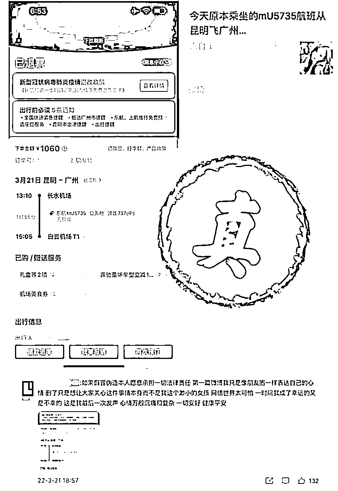

除此之外，有网络截图流传的包括“杨丽萍经纪人王焱武”，以及“张士卿”等人，都无法证实其真实性。

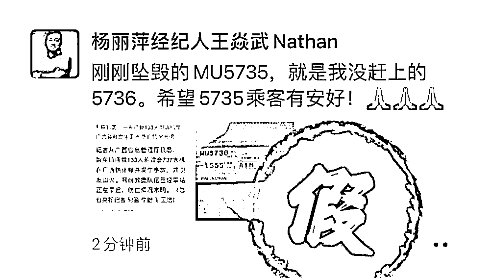

无法证实的“遇难者”

事故发生后，多条网络截图疑似在讨论部分乘客身份信息。

其中，一条对话截图显示，“MU5735 航班上有 9 名机组成员，其中包括 20 名飞行员”。对此，记者未在东航或其他任何官方渠道看到类似信息，也无法证实该信息的真实性。

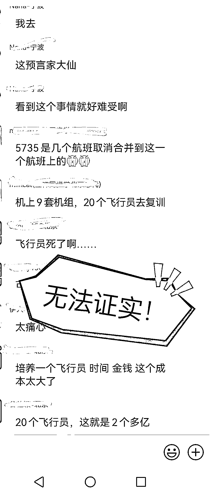

另外一条对话截图则显示，某公司有 7 位领导都乘坐了这架航班。但该截图无任何上下文信息，也无法追踪这是哪家公司。截至发稿，记者未在任何其他渠道发现有关该信息的真实性证明。

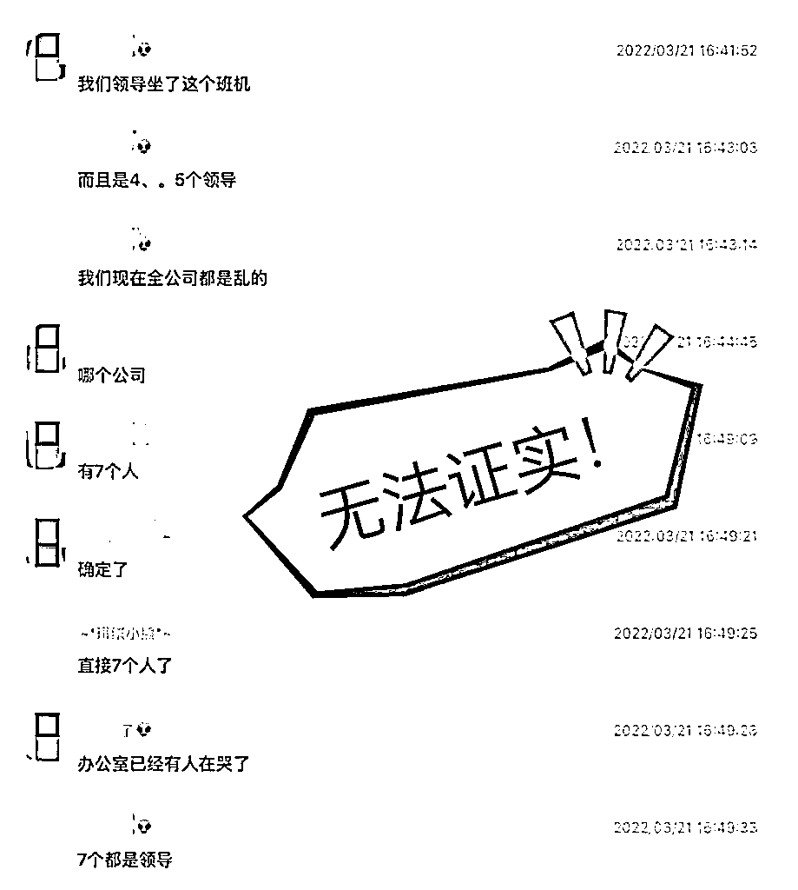

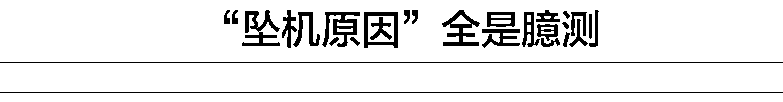

每一次航空事故后，公众最关心的无疑就是坠机原因。世界航空史上有无数的案例说明，调查坠机原因是一个长期而复杂的过程。然而，在事故发生还不到半天的时间里，网络上已经开始流传各种臆测的“坠机原因”。

一张网络截图显示，“据传飞行员因财务问题，支开副驾驶，驾机坠毁”。对此，有航空专家分析称，极短的时间内从高空以高速撞地，这种情况几乎不可能是飞行员人为操纵造成，而是飞机发生了严重的机械故障。

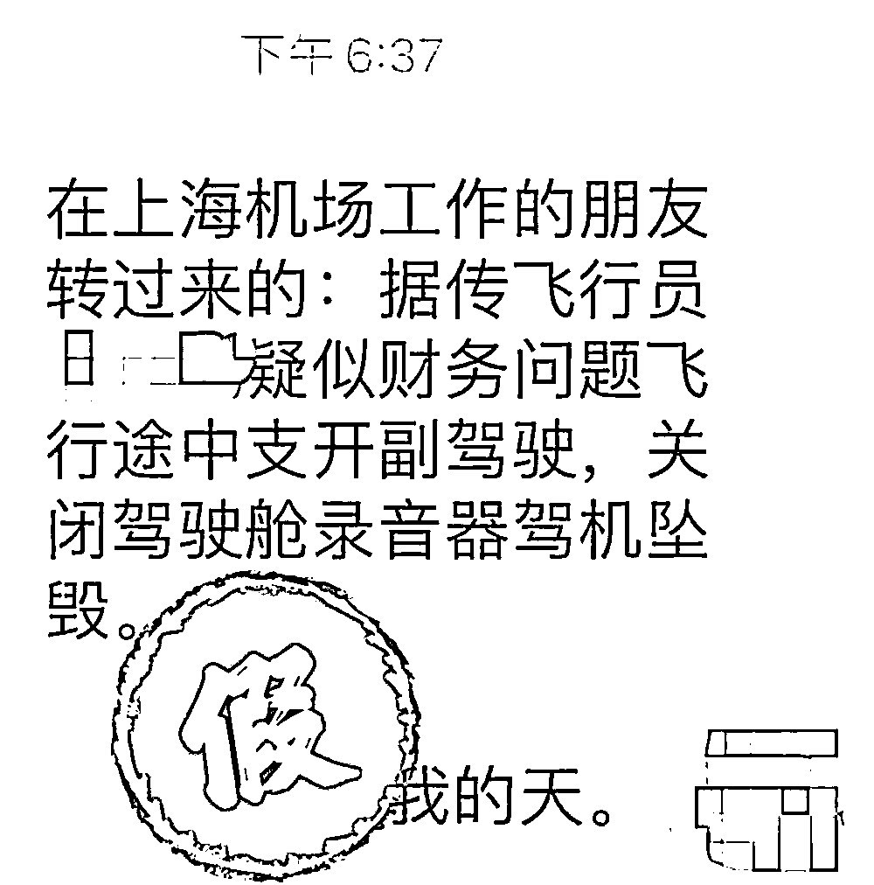

另一张对话截图显示，“飞机给塔台发出了 7500 指令，代表的是劫机”。但根据此前综合的信息，MU5735 航班从失联到坠毁的时间极短，部分航空旅行 App 方面甚至一度挂出“已到达”的信息，在记者向机场方面求证时，也没有获得相关的信息，因此可以判断这大概率是一条假信息。

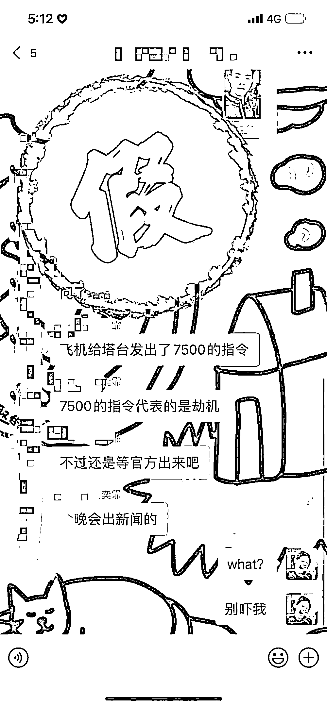

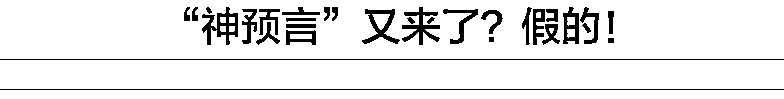

一张显示为某社交媒体平台社区的截图上，有匿名用户对“可以留下一个你对未来的预言吗？”的提问进行了回答，答案是：“2022 年 3 月底会有坠机事件”。截图显示，回答时间为 2022 年 1 月 1 日。

不过，这张图片很快就被某社交媒体平台网友证实为假消息，原回答为“2022 年 12 月底会有坠机事件”，却被人将时间 p 为 3 月后发布到网上。

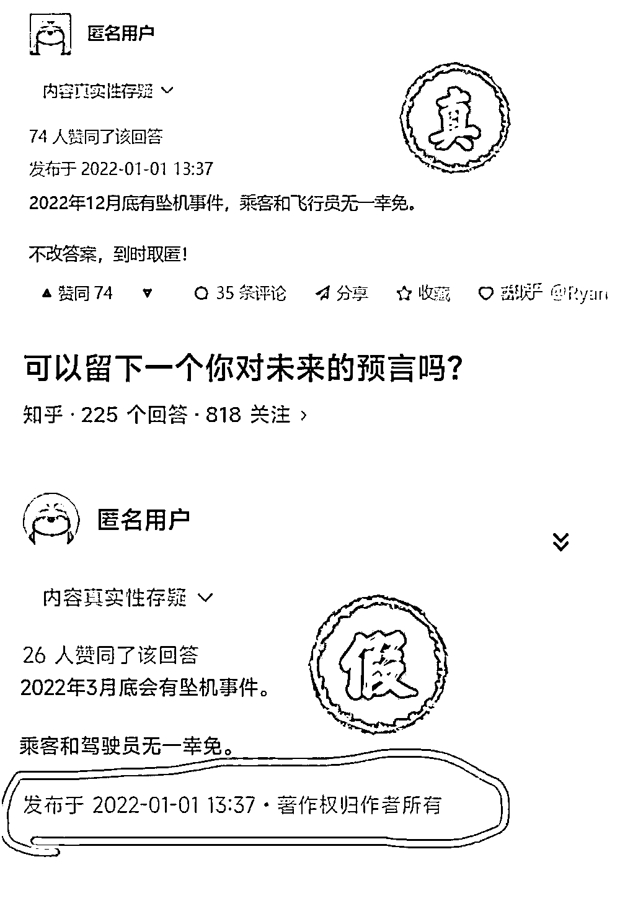

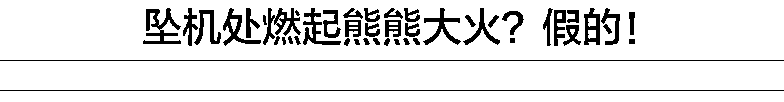

事故发生后，网上有一段视频广为流传，被认为是坠机现场画面。画面中山林冒出滚滚浓烟和红色火苗，背景音为方言。不过，多位网友指出，这是 20 日福建一地祭祖引发的火灾，并且口音与广西梧州对不上。有媒体记者电话核实福建省龙岩市上杭县官庄畲族乡人民政府，工作人员告诉记者，该视频画面为 20 日当地一个村子因为祭祖引发了山火，并非坠机现场，网传信息不实，已经上报有关部门。

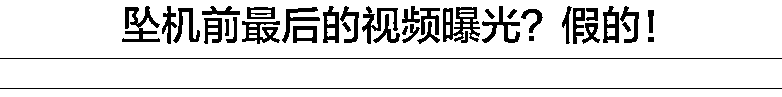

坠机发生后，有一段被称为是 MU5735 航班坠毁前最后一秒的短视频在网络流传，画面显示为一个水平倒置的镜头，对着飞机舷窗外的倾斜的机翼，还可以看到飞机正在快速接近地面的山体，同时还配有乘客惊恐的叫声。

不过，该段视频画面有多处漏洞。首先，画面中的机翼上并不是东航的涂装标识，另外，窗外的天空和山体都严重失真，背景中的声音除了人声尖叫外，也没有真实现场录制所产生的环境噪音。其后有不少网友指出，该视频只是某游戏的视频截取，并非真实画面。

3 月 21 日，中国东方航空 一架波音 737 客机坠毁。网上有自媒体称，东航因上百亿巨亏压力而严控维修费用、压降成本。

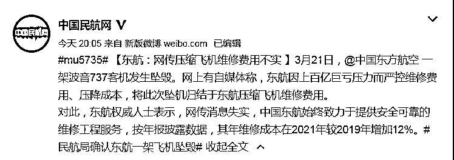

据中国民航网报道：对此，东航权威人士表示，网传消息失实，中国东航始终致力于提供安全可靠的维修工程服务，按年报披露数据，其年维修成本在 2021 年较 2019 年增加 12%。

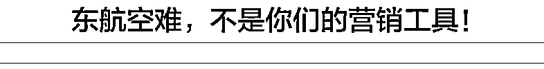

据媒体报道，山西一家房地产公司制作了失事航班背景宣传图，如此蹭流量、博眼球的无底线行为引发众怒，令人发指。

更有一些网友，在网络上随意流传所谓“失事航班机组成员信息”。

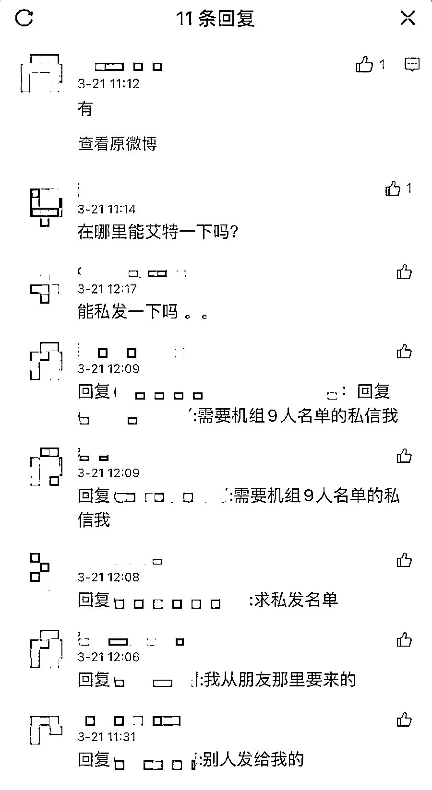

甚至有部分营销号通过灾难营销自己的产品，行为令人唾弃！

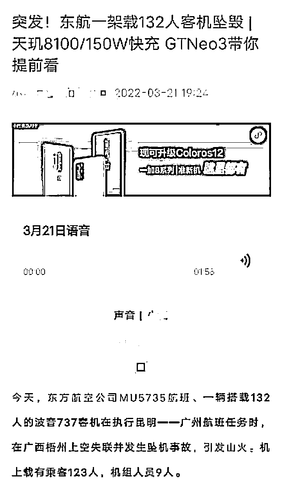

**针对以上情况**

**一些社交媒体平台**

**也作出了相关处理办法** 

**微博处置 25 个调侃坠机灾难账号**

MU5735 客机事件牵动人心，@微博管理员 21 日发文称，站方在巡查中发现，有极个别网友发布幸灾乐祸、调侃灾难等不当言论，对此，站方坚决反对并严肃处置。截至目前，站方根据《微博社区公约》等相关规定，对违规的 25 个账号，视程度采取禁言 30 天至永久禁言处置，并清理违规内容。

**抖音提醒用户不要借热点事件玩梗**

抖音安全中心 21 日发布公告：一架东航搭载 132 人的波音 737 客机失事坠机事件引发各方关注，目前事故正在调查和处理中，抖音在此提醒广大用户，在平台发布相关信息、内容要遵守真实、客观原则，不借助热点事件蹭热、玩梗，更不要主动挑起、参与网暴相关人员。与此同时，平台将运用策略模型+技术手段严加管控，如发现有人企图蹭热点、博眼球、引关注，将视情节严重程度处以禁言甚至封禁帐号处罚。

东航 MU5735 坠机残骸。  通讯员江怀鹏  武警广西梧州支队提供

3 月 21 日，东航 MU5735 航班坠毁事故令人痛心。事故发生后，中央领导作出重要批示，各方救援力量迅速集结展开救援。

发生灾难，大部分网民都在关心机上人员安危，祈盼出现奇迹。而在这令人揪心的时刻，少数企业、自媒体营销号以及个别网友却借机搞起了“灾难营销”，没有底线地编造谣言、制造耸人听闻的“内幕消息”、借机打广告博眼球，更有甚者还有人调侃玩梗……这些行径无异于“吃人血馒头”！更可怕的是，这些内容，正在提前给事故定性，这种先入为主的舆论，这些不实信息将会干扰调查工作正常开展，会严重影响官方后续调查结果出台的公信力。

毫无人性的“灾难营销”必须遏制。要知道，这不仅违背公序良俗，还是典型的违法行为，该落下的鞭子一定要落下去，过于低廉的违法成本，对于胆大妄为的浑水摸鱼者来说，很难起到应有的震慑作用，也无法有效警示潜在的违法者不要突破伦理底线、逾越法律的雷池。一个文明的社会，首先是法治的社会，面对这些乱象，有关部门有必要果断出拳、依法查处，让违法者付出足够的代价，倒逼其强化法治意识、守护社会伦理，避免类似乱象重演。

我们在此呼吁，悲剧面前请守住人性底线，官方调查报告未发布前，希望大家理性发言，一起用实际行动支持救援及调查工作开展。

来源：共青团中央综合整理自“中国新闻网”、“央视新闻”、微博@中华全国学联、新华社客户端、北美留学生日报

← 向右滑动与灰产圈互动交流 →

