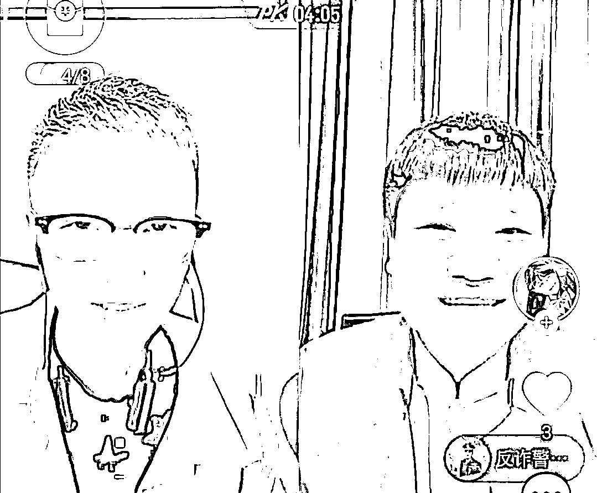
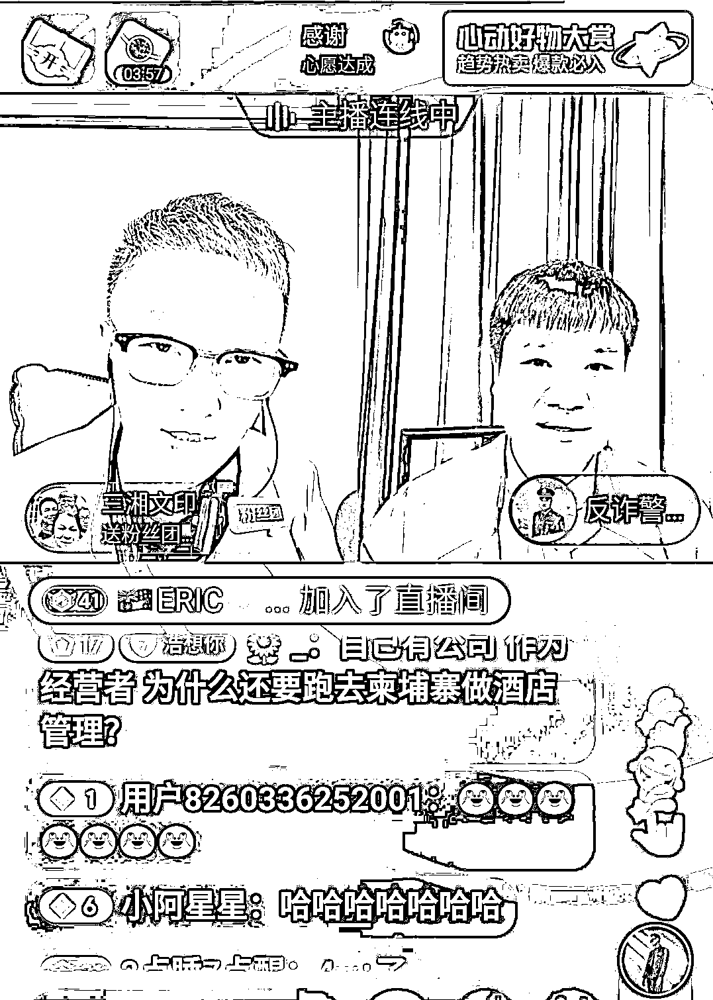
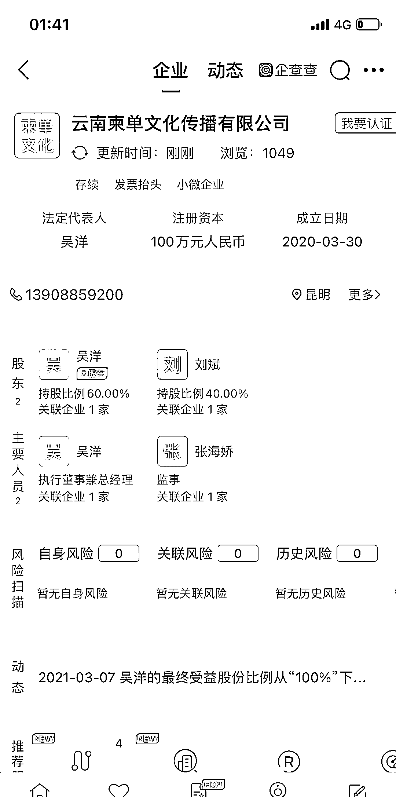
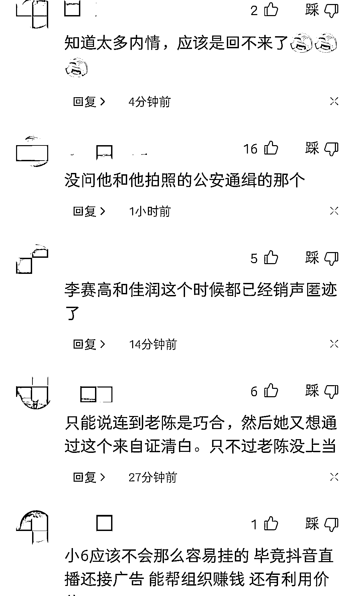

# 在柬中国网红小 6 被疑电诈分子，与反诈警官老陈连线诉说被网暴。

> 原文：[`mp.weixin.qq.com/s?__biz=MzIyMDYwMTk0Mw==&mid=2247532139&idx=3&sn=1318ca03d89bfca9f757e0e812562b61&chksm=97cbb553a0bc3c45dee4c526f4d4bdd5c7e434dfbe01e255fdd2f0d293e0e2596720c0ac5def&scene=27#wechat_redirect`](http://mp.weixin.qq.com/s?__biz=MzIyMDYwMTk0Mw==&mid=2247532139&idx=3&sn=1318ca03d89bfca9f757e0e812562b61&chksm=97cbb553a0bc3c45dee4c526f4d4bdd5c7e434dfbe01e255fdd2f0d293e0e2596720c0ac5def&scene=27#wechat_redirect)

前段时间缅甸网红李赛高，佳润，以及本文提到的主人公柬埔寨小 6，被国内网友怀疑为电信诈骗嫌疑份子，纷纷登上热搜，柬埔寨小 6 使出浑身解数解释也于事无补，加上柬埔寨“血奴”事件（纯属编造的事件）的发酵，在柬埔寨的中国网红们成了网爆和被讨伐对象。 

近日，网红柬埔寨小 6 为了证实自己不是诈骗份子，3 月 18 日在直播间连麦反诈主播陈警官，平时自信满满的柬埔寨小 6 见到陈警官时看起来有些紧张，回答陈警官问题时，也支支吾吾，陈警官不慌不忙面带微笑的提问柬埔寨小 6，本次连麦的几个重点如下：

第一点，陈警官问柬埔寨小六，你的真实名字叫什么？

柬埔寨小六回答到叫张海娇，自己还特意地说我不是殷红婷，称自己没有上榜，并不是通缉犯，并反问陈警官自己有没有上榜。

陈警官微微一笑，回答到应该没有，陈警官说自己不知道，不能胡乱说。

第二点，柬埔寨小 6 说道，柬埔寨这边没有技术没有技能，根本没法生存，直接找不到工作，跟咱国内没法比，就连自己招聘运营网红之类也要招有经验的，这下评论区可炸了锅。

评论说以前柬埔寨小 6 的视频可不是这么说的，说的柬埔寨多么好，是个人就可以赚大钱，咋了？见到陈警官全撩实底了啊？

第三点，柬埔寨小 6 直接不建议大家去柬埔寨，主要还是安全问题，就拿交警来说，哪里有天眼摄像头啊，交警就藏在草丛里，说不定啥时候就蹦出来，罚你个 10 块 8 块的，你更别说别的违法犯罪的了，更找不到嫌疑犯了，治安环境差的离谱，他说道自己认识的几个朋友都无缘无故不见了，网友们好好看看，这才是真实的柬埔寨，缅甸也是一样，全世界都没有一个抵得上中国安全。

第四点，也是在评论区大家比较关心的问题，陈警官问柬埔寨小 6，跟吴洋什么关系，柬埔寨小 6 说是自己女朋友，陈警官又问到，这个叫吴洋的在哪里呢？柬埔寨小 6 说跟她分手了，而且还强调，这个吴洋并不是上榜的那个吴洋。

有网友爆出了他们几个人 2020 年在云南成立一家叫柬单传媒公司，法人刚好是一个叫吴洋的人，2021 年被检察院批准逮捕。

最后陈警官问小六什么时候回来（中国），这或许触及到柬埔寨小 6 的神经了，说机票太贵，回来还得隔离。

陈警官果然是审讯和宣传的老手，把大家想问的问题全问明白了，还特意让柬埔寨小 6 转告那些在国内犯法逃到柬埔寨的人们，回国自首是最好的出路，不然国内身份户口都给注销掉了，还告诉柬埔寨小 6 在那边也宣传国家反诈 APP，说完俩人就下线了.

**连线之后第二天，警官老陈发出了声明！声明如下：**

**3 月 19 日警官老陈在视频表示：昨天和柬埔寨小 6 连麦以后，很多网友给我发私信，说我就是胆小鬼，不敢去抓他！**

**老陈表示：我就是普通的警察，首先我只负责我管辖的范围，现在也没有证据能够证明柬埔寨小 6 他就是做诈骗的！**

**我和柬埔寨小 6 的连麦目的就是让她证明：在柬埔寨这个国家，不是随随便便就是能够赚大钱的地方，而且他也向我们说到：柬埔寨这个地方非常危险，建议国内的网友不要去柬埔寨去工作！**

**老陈表示：而且我还发现一个重要的线索就是，给我发信息的账号基本上都是空白号（零粉丝），我也明白我现在做直播的目的已经严重影响到他们的利益！**

**网友表示：老陈就是普通的民警，直播就是给网友做普法宣传，在柬埔寨小 6 是否真的就是搞电信诈骗工作的，他也没有确凿的证据，所以老陈也不敢妄下结论！**

****

**以上这都是别的媒体发文的内容，一直以来很多粉丝都在后台留言，让我讲讲柬埔寨小 6 的事情，我今天在这里郑重说明，我不认识她，没法评论，至于真假都等待大家去揭晓答案吧。**

**我只能说，最近我在抖音上发作品，也会遇到黑粉对我恶意中伤，但我选择一笑而过，如果你们觉得我有热度，想蹭我的流量，那对不起了，我抖音已经停止更新四天了。我要说，蹭热度也要有底线，如果没有黑粉对我的恶意攻击，我都不知道还有网暴这回事，现在看来，真的有很多人在互联网上好比乞丐一样蹭流量，而且，毫无底线，是不是我替东南亚底层弱势群体的同胞发声影响了你？还是说我替国内家属发文求救寻人影响了你？还是说通过曝光救出同胞而影响到了你？我们中国人在海外，一定要相互帮助，很多人都愿意与强权黑恶交友，没人愿意替海外弱势同胞发声，这个可以理解，但是，用恶意语言攻击一个真心帮助同胞的人，请问你的道德底线在哪里呢？你是不是希望所有被坑害的，被迫害的，被囚禁的，被虐待的同胞都活该倒霉？不希望任何人帮助这些社会底层的同胞发声呢？如果你是这种人，我明白你攻击我，污蔑我的含义，我不多讲了，大家自己品吧。**

 **[`v.qq.com/iframe/preview.html?width=500&height=375&auto=0&vid=t3328s9qhc4`](https://v.qq.com/iframe/preview.html?width=500&height=375&auto=0&vid=t3328s9qhc4)** 

**来源：阿龙闯荡记**

****

**← 向右滑动与灰产圈互动交流 →**

****