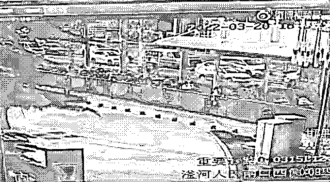
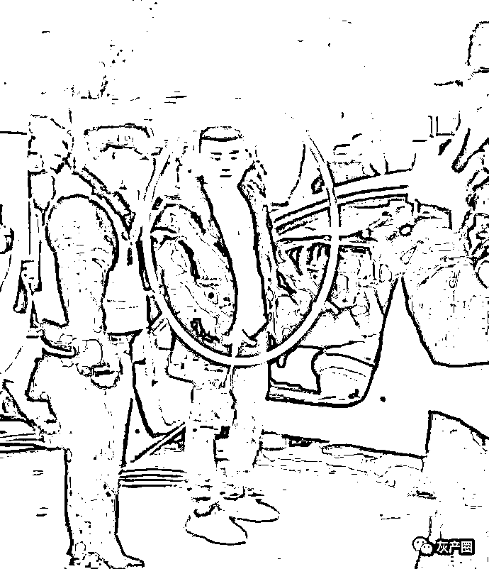
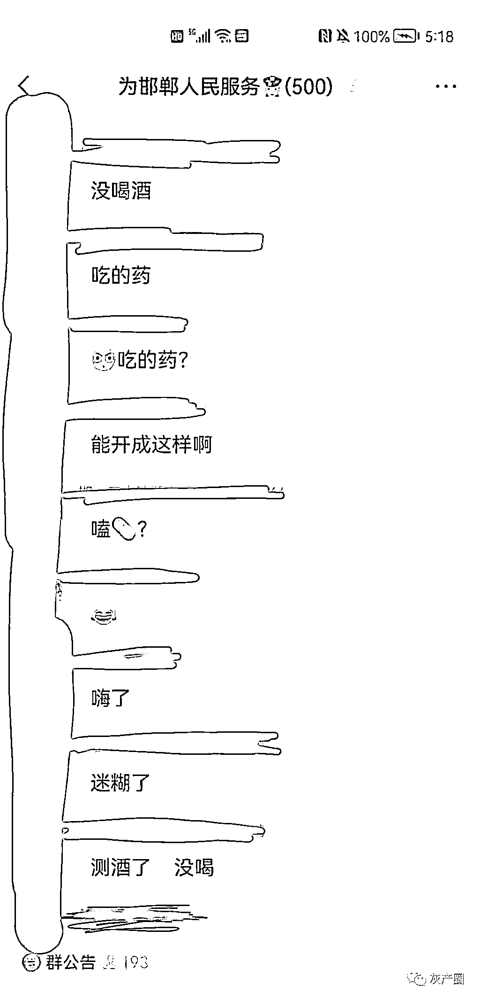
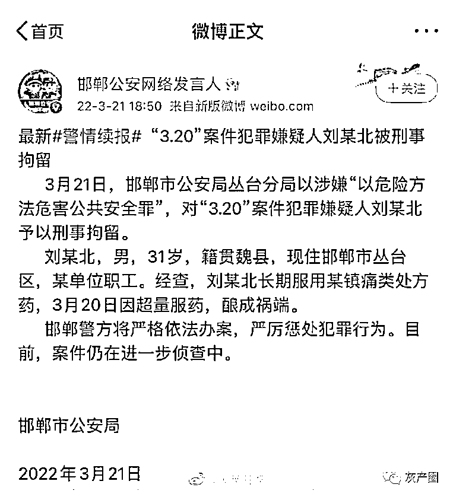
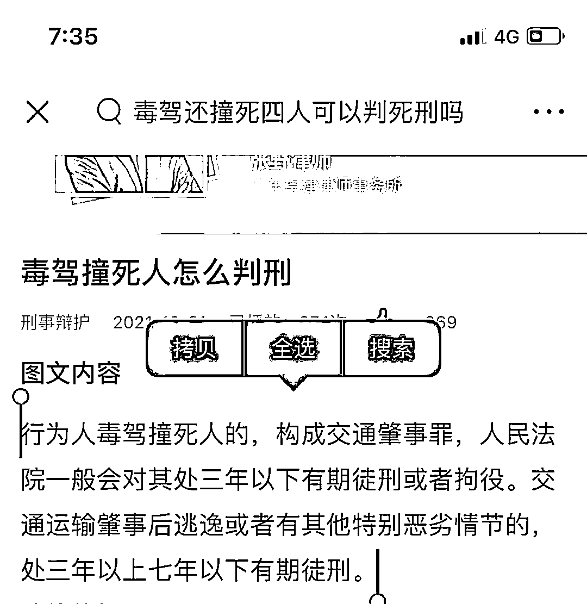
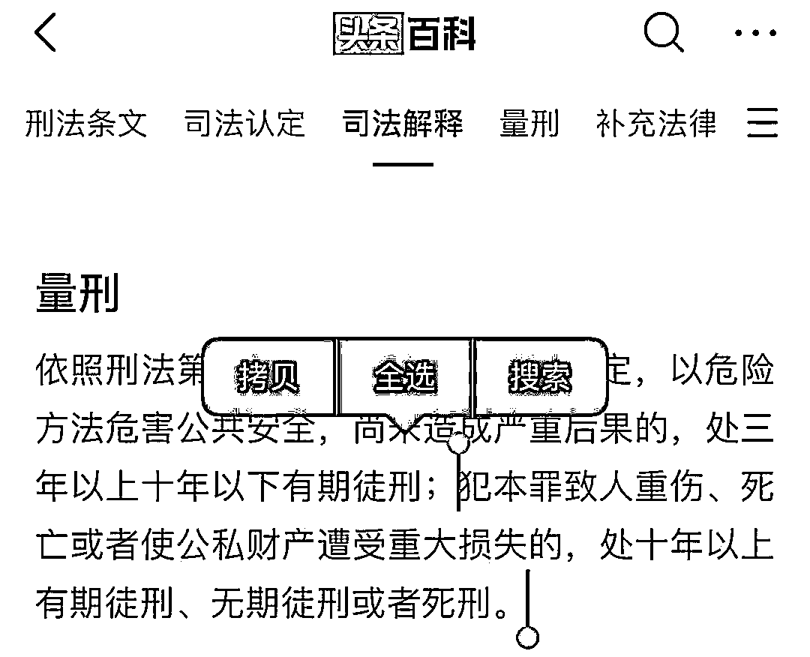

# 邯郸车祸司机被刑拘，罪名“以危险方法危害公共安全罪”，最高可死刑

> 原文：[`mp.weixin.qq.com/s?__biz=MzIyMDYwMTk0Mw==&mid=2247532139&idx=4&sn=0f24b9f06be57843ea988d0d5c34900a&chksm=97cbb553a0bc3c45b7e64c1ad324474f5d63b5bde7ee310ca5e2886e6ab6278f181b2e669360&scene=27#wechat_redirect`](http://mp.weixin.qq.com/s?__biz=MzIyMDYwMTk0Mw==&mid=2247532139&idx=4&sn=0f24b9f06be57843ea988d0d5c34900a&chksm=97cbb553a0bc3c45b7e64c1ad324474f5d63b5bde7ee310ca5e2886e6ab6278f181b2e669360&scene=27#wechat_redirect)

3 月 20 日 16 时 40 分左右，河北邯郸市人民路与滏河大街西口南侧发生一起交通事故，一辆白色小轿车在非机动车道内撞上多辆非机动车。

[`v.qq.com/iframe/preview.html?width=500&height=375&auto=0&vid=e3328q69xmx`](https://v.qq.com/iframe/preview.html?width=500&height=375&auto=0&vid=e3328q69xmx)

现场 14 人受伤，4 人经抢救无效死亡，肇事司机当场被控制。

当时就有网传聊天记录称该司机是服用了某种药品

3 月 21 日，邯郸市公安局丛台分局以涉嫌“以危险方法危害公共安全罪”，对“3.20”案件犯罪嫌疑人刘某北予以刑事拘留。
刘某北，男，31 岁，籍贯魏县，现住邯郸市丛台区，某单位职工。经查，刘某北长期服用某镇痛类处方药，3 月 20 日因超量服药，酿成祸端。
邯郸警方将严格依法办案，严厉惩处犯罪行为。目前，案件仍在进一步侦查中。

警方这次以“以危险方法危害公共安全罪”，而非“交通肇事罪”刑拘该司机

该司机面临的后果完全不同，如果以交通肇事罪，那么该司机最高被判 

而“以危险方法危害公共安全罪”的量刑最高可至死刑

* * *

小乖是个大天才:这个才是真的恶魔在人间

无为李爷 :它倒是镇痛了，10 多个家庭痛不欲生。

cositsalwaysgoodtime :定这个罪的意思大概就是两个字：死刑 不过也要看是不是过失了 毕竟嗑药了

来源：微博那些事儿

← 向右滑动与灰产圈互动交流 →

