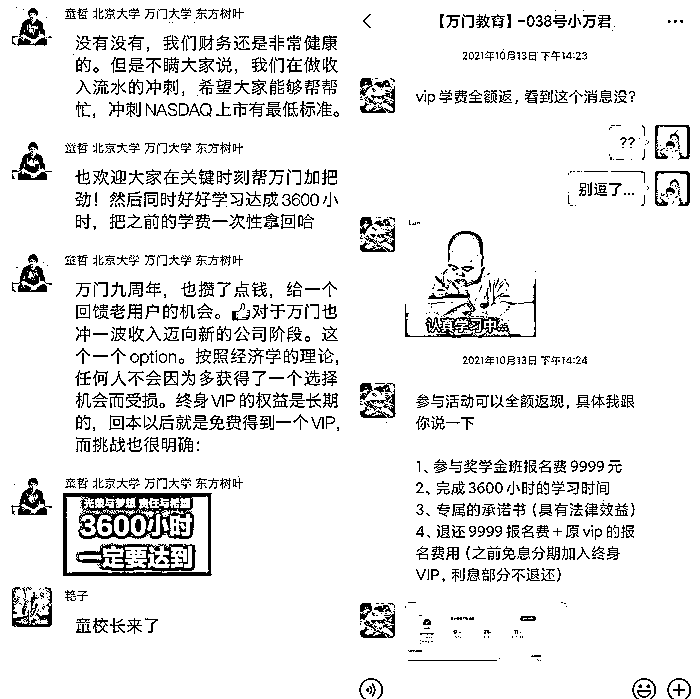
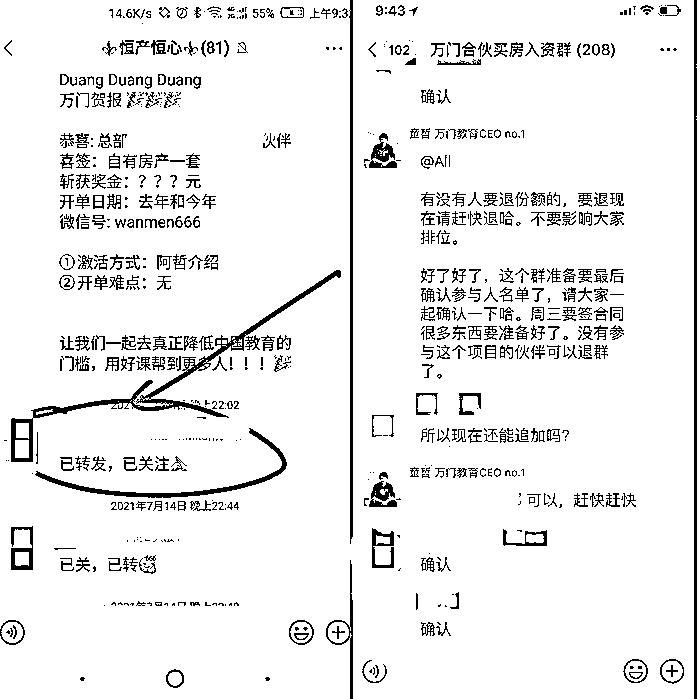

# 万门大学 CEO 童哲疑似跑路！涉及学费或达 1.4 亿

> 原文：[`mp.weixin.qq.com/s?__biz=MzIyMDYwMTk0Mw==&mid=2247532139&idx=6&sn=76568cc55a771fc27e1bfb3872203797&chksm=97cbb553a0bc3c4501cd2fbbc85fa7d274cbe4de986d0475042446cb3a87a00f51d65edd869f&scene=27#wechat_redirect`](http://mp.weixin.qq.com/s?__biz=MzIyMDYwMTk0Mw==&mid=2247532139&idx=6&sn=76568cc55a771fc27e1bfb3872203797&chksm=97cbb553a0bc3c4501cd2fbbc85fa7d274cbe4de986d0475042446cb3a87a00f51d65edd869f&scene=27#wechat_redirect)

图源：图虫

“今早，万门大学 CEO 童哲突然将个人微信名字改为‘小助手’，并解散所有会员群。”

3 月 22 日，万门大学一位中层管理人士王鑫告诉界面教育，“员工 2 月份工资未发，社保未交。老板童哲、林丹已经 3 个多月没来公司，”据万门大学员工李杰透露，“童哲和林丹似乎是夫妻关系。”

万门大学创始人、CEO 童哲曾以全国中学生物理竞赛福建省第一的成绩，保送至北京大学物理系，大三时以全球前十名的成绩通过法国巴黎高等师范学院入学考试，并转学至巴黎高师，于 2011 年获理论物理学士和 M1 硕士。2012 年回国创业，在人人网建立“万门大学”公共主页。林丹也曾法国留学，2014 年放弃外企工作，全职加入万门大学创业。

天眼查显示，北京万门教育科技有限公司（下称万门大学）于 2014 年 5 月成立，提供职业教育类课程，品类涵盖 IT、职场成长、经济金融、小语种、职业考试及生活兴趣类课程。2014 年，万门大学获得人人公司天使轮融资，2017 年获长融资本 Pre-A 轮融资。

其官网显示，万门大学注册用户超 1300 万，累计课程超 1700 门。其在大连、厦门、武汉等地有四家分公司，且处于存续状态。

界面教育从学员维权群获悉，截至 3 月 22 日下午 5 时许，已有 3014 名学员登记维权，单人金额多在一万至两万。

同日，界面教育多次拨打由王鑫提供的童哲电话，均未拨通，微信好友申请未通过。万门大学官网电话则提示“由于来电较多”，无法接通。

目前，IOS 端、安卓手机端的应用商城皆搜索不到“万门大学”APP。万门大学所有的课程均无法收看，疑似服务器关停。

与其他教育机构不同，万门大学主要售卖的是会员服务，VIP 会员可浏览全站内容，分为一年 VIP、终身 VIP 两种选择，VIP 价格在 1.2 万-2 万元不等。

据李杰透露，目前万门大学约有超 3 万 VIP 会员。去年 9 月，万门大学推出奖学金班级，即学员完成 3600 小时的学习时长，可退还 9999 元报名费以及原 VIP 的报名费用。

奖学金班级推销内容。图源：万门大学维权群内学员提供

娜娜是其中一位学员。2018 年，她花费 15999 元购买万门大学的终身会员。今年 1 月，再次花费 9999 元进入奖学金班级。

“完成 3600 个小时的学习时长，我觉得挺难的，因为我没那么自觉，但是架不住那段时间他们的销售天天打电话，心软（购买）了。”娜娜告诉界面教育。

据王鑫透露：“3600 小时挑战赛项目，卖了 7000 个 VIP，近 1.4 亿元。按 500 人，每人发 1 万工资，能发两年。”

据李杰提供的内部邮件显示，自 3 月 11 日起，由于办公场地调整，员工被要求居家办公。“万门原办公地点的房东多次来催缴房租。”王鑫告诉界面教育。

今年 3 月 16 日，万门大学因总部登记经营场所无法联系，被北京市海淀市场监督管理局列入经营异常名录。

据李杰称，本月初，该公司要求课程部员工先完成现有课程，不再推进新项目，“我正在合作的老师的课时费都未结算。”

“万门合伙买房群” 图源：李杰供图

拖欠学员薪资和学员退费之外，王鑫向界面教育透露，多位万门员工曾参与童哲集资代持买房项目，即员工集资全额房款，由童哲代持买房，但具体操作他不得而知。目前，童哲已将王鑫微信删除。

[`v.qq.com/iframe/preview.html?width=500&height=375&auto=0&vid=q3328u9yr35`](https://v.qq.com/iframe/preview.html?width=500&height=375&auto=0&vid=q3328u9yr35)

（应受访者要求，文中王鑫、李杰、娜娜均为化名）来源：界面新闻

← 向右滑动与灰产圈互动交流 →

