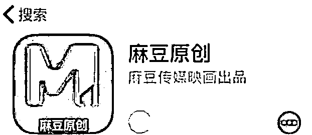
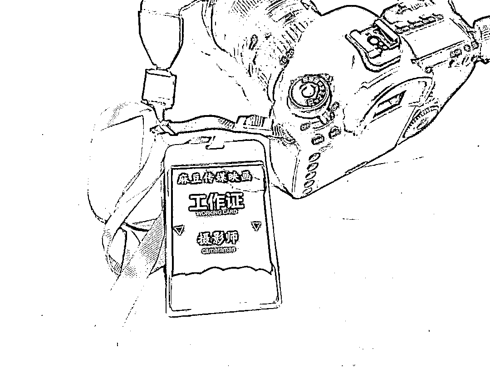
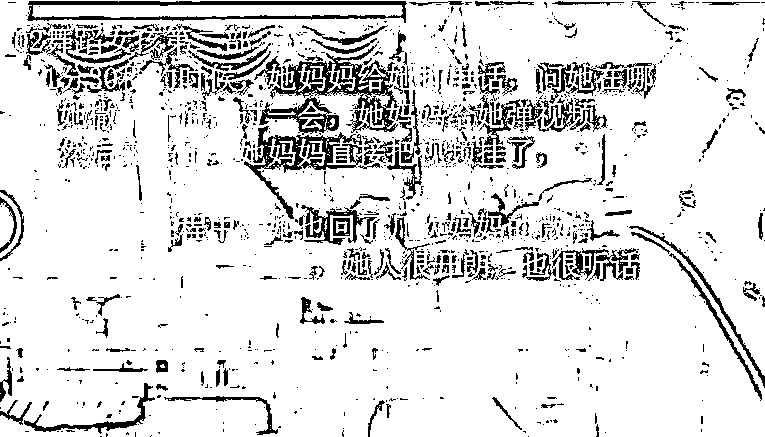
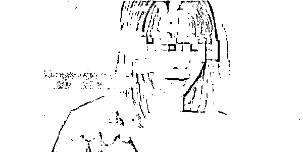
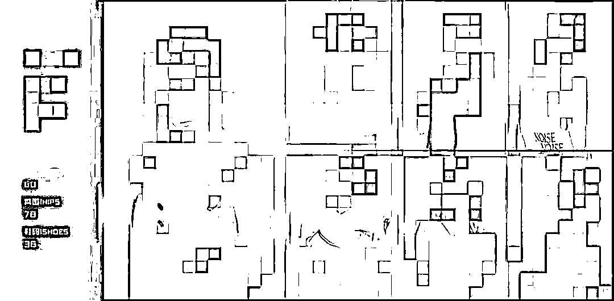
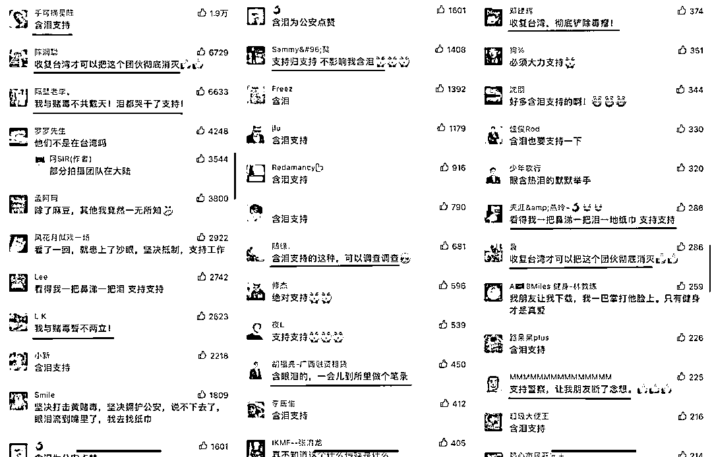

# “91 视频”、“麻豆传媒”拍摄团队被抓！拍摄淫秽视频 50 余部，牟利 500 余万元

> 原文：[`mp.weixin.qq.com/s?__biz=MzIyMDYwMTk0Mw==&mid=2247532208&idx=1&sn=ed6a8afb92d1154fc5d420476bba14fa&chksm=97cbb588a0bc3c9e943616cd7452020e3f92bc4fea3ade8bbacefda015177e791af7fe68f9e4&scene=27#wechat_redirect`](http://mp.weixin.qq.com/s?__biz=MzIyMDYwMTk0Mw==&mid=2247532208&idx=1&sn=ed6a8afb92d1154fc5d420476bba14fa&chksm=97cbb588a0bc3c9e943616cd7452020e3f92bc4fea3ade8bbacefda015177e791af7fe68f9e4&scene=27#wechat_redirect)

近日，上海市公安局奉贤分局侦破了一起制作、贩卖、传播淫秽物品案。

该视频号不可引用

[`v.qq.com/iframe/preview.html?width=500&height=375&auto=0&vid=i3328iegi3a`](https://v.qq.com/iframe/preview.html?width=500&height=375&auto=0&vid=i3328iegi3a)

经查，2021 年 1 月以来，犯罪嫌疑人孙某、罗某等人利用境外聊天软件**Telgram**和**Potato**与涉黄 APP**“九一视频”“麻豆传****媒”**的工作人员联络，确定剧本、片酬，并组织拍摄、剪辑、灯光、剧务、男女演员、化妆师等演职人员组成团队，**拍摄淫秽视频 50 余部，卖给****“九一视频”“麻豆传媒”****牟利 500 余万元，总点击量共 400 余万次。**

今年 1 月，奉贤警方组织警力赶赴广东、四川等省，打掉为涉黄 APP 制作淫秽视频的拍摄团队 3 个，抓获犯罪嫌疑人孙某等 24 人。此案正在进一步查办中。

2020 年 12 月，国家网信办清理处置 105 款违法违规移动应用程序，首批清理下架**猫途鹰、面具公园、剧能玩、麻豆传媒、红杏视频、51 漫画**等 105 款违法违规移动应用程序。同时，对未落实审核要求、上架违法违规应用程序的极速下载、Win 之家、皮皮巴士、7230 手游网、软件帝等 8 家应用商店，依法依规采取停止下载服务处置措施。

[`v.qq.com/iframe/preview.html?width=500&height=375&auto=0&vid=r3309uq9b7s`](https://v.qq.com/iframe/preview.html?width=500&height=375&auto=0&vid=r3309uq9b7s)

2021 年 11 月，山东东营。交警查车时发现一摩托车车身贴着某传媒贴纸后，立即责令驾驶员撕掉，因为该传媒是一个涉黄的工作室，“这个传媒是干什么的不知道吗？”驾驶员表示自己并不了解，看别的摩友贴自己就跟风贴了。检查中交警还发现其涉嫌无证驾驶，最终将其车辆暂扣。

由于近年来活跃于互联网上的一个传媒公司，麻豆传媒的作品可不是什么普通传媒公司那么简单，而是效仿岛国风俗产业从事特殊摄影。

众所周知在中国这是不合法的，但也正是因为不合法，所以没有什么人敢做，没人做，也就没有竞争。所以让一些别有居心的的人看到了暴利。像近些年来落网的广东小鲜肉，还有 91 秦先生，夯先生，唐先生等都是一群在利益的驱使下铤而走险的人。

他们常用的套路是以恋爱的名义和女孩子约会出去开房，用摄影机偷拍下发生关系的过程拿到网上售卖，有些做得好的收益上百万。

跟上述那些人不同，麻豆传媒是一帮有组织，有策划，有整个完整团队的传媒摄影公司，他们有人写剧本，有人负责物色年轻漂亮的女孩子做演员，还有专业的摄影师和灯光师，而且女孩子还几乎全都是露脸出镜，因此他们拍摄出来的作品，和上述那几位偷拍出来的自然不可同日而语，不管是灯光，还是机位，完全都是吊打那些偷拍视频的存在。

在日本，特种拍摄行业由于经过了很多年的市场化发展，而且还是合法的，因此有很多专业演员，在我国，由于这方面是不合法的，因此只能找一些素人女孩或者是小网红来兼职，她们的表演十分生涩，几乎没什么演技可言，但也正是由于没什么演技，所以看起来更为真实，也更为符合很多广大国内宅男的胃口。

也正是如此，麻豆传媒在近年来才能在国内得到如此迅猛的发展。

从警方的公告中可以看到麻豆的窝点主要在广东和四川，大胆猜测拍摄基地在四川，而广东应该是制作和发行市场。

正所谓几家欢乐几家愁，麻豆倒了，很多为青少年着想的人会拍手称快，但是很多宅男就苦恼了，还去留言纷纷说道：**”含泪支持“**、**”我与赌毒不共戴天！泪都哭干了支持！“**、**”收复台湾，彻底铲除毒瘤！”**

再次强调，制作不雅视频在中国是不合法的，像麻豆的很多视频会涉及到什么老师、邻居、闺蜜啥的，这些视频要是给还在成长中的青少年看到了，影响是非常不好的，所以，把这些团伙端掉是很有必要的。

来源：上海扫黄打非 分享：吃瓜不吐葡萄皮

← 向右滑动与灰产圈互动交流 →

