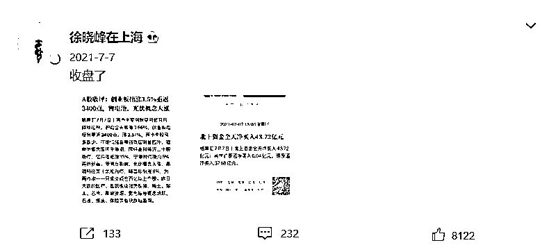
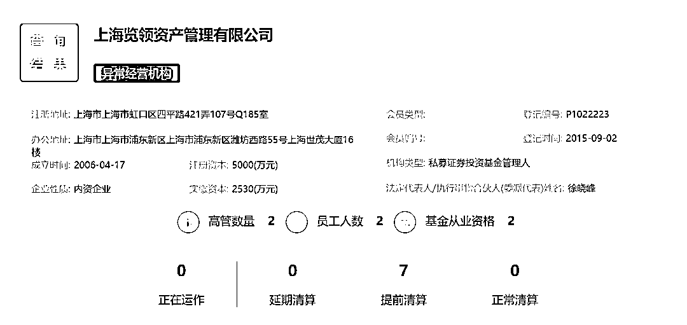
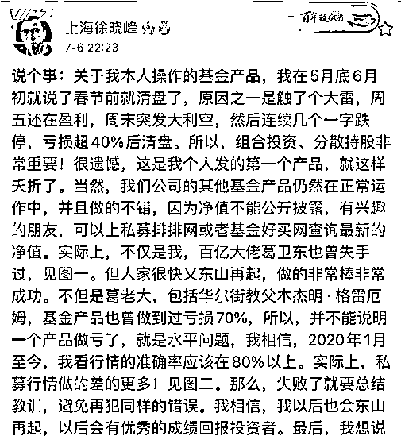

# 400 万粉丝理财大 V 徐晓峰被公诉，“割韭菜”手段曝光

> 原文：[`mp.weixin.qq.com/s?__biz=MzIyMDYwMTk0Mw==&mid=2247532208&idx=3&sn=62ad1ced5585e62cf90f6f003e7326e8&chksm=97cbb588a0bc3c9e2eaf29dd6b5b3fa72998a8c65e0975aab7eda6f3343a7bd1f14633b2a232&scene=27#wechat_redirect`](http://mp.weixin.qq.com/s?__biz=MzIyMDYwMTk0Mw==&mid=2247532208&idx=3&sn=62ad1ced5585e62cf90f6f003e7326e8&chksm=97cbb588a0bc3c9e2eaf29dd6b5b3fa72998a8c65e0975aab7eda6f3343a7bd1f14633b2a232&scene=27#wechat_redirect)

“手里有点闲钱，应该怎样理财投资？”带着这个疑问，很多人将目光投向了网上的一些“专家大 V”，但这些大 V 并不一定靠谱，本意是“理财”，但不曾想跟着大 V 一不小心就成了“韭菜”，这不又有一位大 V 因此翻了车。

3 月 21 日，最高人民检察院主管的《检察日报》官方公众号“检察日报正义网”发文披露，某平台坐拥 400 余万粉丝的金融大 V 终“翻车”。近日，上海市浦东新区检察院以涉嫌虚假广告罪、帮助网络信息犯罪活动罪、非法经营罪对徐某提起公诉。

据每日经济新闻、北京青年报等多方消息显示，该坐拥 400 余万粉丝的金融大 V 徐某为徐晓峰。

自去年 7 月 7 日之后，徐晓峰的微博账号便不再更新。

其实早在去年 8 月，就有“徐晓峰已被警方带走”的消息传出，原因是“疑因为开设对赌 ETF 盘，伙同他人坐庄坑害开户的散户。”

此前徐晓峰多次在微博转发广告，在 2019 年到 2020 年间，徐晓峰在他的微博和视频直播中，多次对公众宣传、推广在他公司开期权账户，其中就包括 50ETF 期权交易平台。

据《检察日报》，2019 年，陈某、李某（均另案处理）等人与他人签订代理合同，代理期权分仓软件，在未获得国家有关部门批准，未取得期货、期权经营资质的情况下，从事非法经营期权的活动。

为了将此分仓软件宣传出去，陈某找到了朋友，即上述的金融大 V 徐某。两人签订合作协议约定，徐某帮助陈某代理该分仓软件，利用徐某的影响力引流粉丝至该分仓软件上进行投资，徐某每单收取佣金 20 元左右。

有消息指出，上述陈某，也是网上另一个金融大 V，就是“迈克·陈”陈杰，粉丝近 130 万。

此后，徐某便在平台上发文进行宣传推广，以无资金限额、无交易限制等为诱饵将粉丝引流至该软件。眼看产品效益不错，徐某还让自己团队的员工在直播间推广此产品，并通过自己的客服人员招揽客户进行投资，参与期权买卖业务，从中赚取佣金。经审计，徐某涉及 12 个代理账户，涉案金额 1600 余万元，违法所得 150 余万元。

非法经营证券期货并非徐某唯一的来钱手段。徐某交代，“有中介来找我们这些大 V 发广告，基本都是导流，他们把编好的内容发给我，里面的短链接附有二维码。”这样的广告，徐某每条收取 2 万元至 3 万元费用，后来涨到 5 万元。

可对于广告的真实性，徐某一点儿不上心。2019 年 3 月，徐某接了条股票咨询交流的广告，不久就有粉丝陆续向徐某和平台反映该链接为诈骗链接，徐某还因此被禁言了一段时间。但在金钱的诱惑下，徐某首先想到的不是维护粉丝的权益，而是怎样让自己免责。

2020 年 6 月，徐某在明知新广告链接与先前被举报的诈骗链接相同的情况下，只是在广告后添加了“不要做股票以外的投资”“不要与其他银行账户发生资金往来”之类的提醒，仍继续多次发布该广告，非法获利 39 万元。该链接后来被证实为诈骗团伙的微信二维码，现已被公安立案侦查。

“推荐一位老朋友，他跟踪了两只 5G 概念强势牛股，分享给兄弟们，需要的加微信。”这是徐某的惯用话术，但事后查明他所宣传的所谓自己熟悉、认识、操股能力强的朋友，其实都不认识，也没有核实过这些人的身份和广告内容。

除了上述已查实为诈骗链接的广告外，徐某还发布了多条其他广告。经审计，徐某发布虚假广告非法获利 19 万余元。

《检察日报》指出，在审查起诉阶段，承办检察官从广告清单、资金流水、聊天记录等方面同时入手，对涉案的 60 余条广告逐一进行梳理，筛选出其中的虚假广告，经与上海市市场监管局广告处沟通，确认行政法上虚假广告的认定标准，又增加了虚假广告罪，将徐某以涉嫌三罪提起公诉。最终，徐某自愿认罪认罚，并签署了具结书。

天眼查信息显示，徐晓峰共有包括上海览领资产管理有限公司（下称上海览领资产）在内的 6 家关联公司，徐晓峰担任其中 4 家公司的法定代表人，在 5 家公司中持有股份。

上海览领资产 2015 年 9 月 2 日在基金业协会登记备案，公司管理规模在 0~5 亿之间，实际控制人、法定代表人、董事长、总经理都是徐晓峰。目前，上海览领资产在基金业协会官网显示为“异常经营机构”，7 只私募产品均被提前清算。

其管理的“览领上海徐晓峰”于 2020 年 11 月 25 日备案，基金信息的最后更新时间是 2021 年 3 月 24 日。当时媒体报道显示，其清算公告称：“览领上海徐晓峰基金在 2021 年 2 月 2 日的份额净值低于止损线 0.7 元，根据产品合同约定，管理人上海览领资产管理有限公司于 2021 年 2 月 5 日决定提前终止本产品的正常运作。”该私募产品备案后在不满 4 个月的时间内就被提前清算。

彼时徐晓峰在微博就此事回应称，这只基金春节前就已清盘，原因之一是“触了个大雷”，周五还在盈利，周末突发大利空，然后连续几个一字跌停，亏损超 40%后清盘。

此外天眼查信息显示，徐晓峰存在多条周边风险信息。上海览领资产曾因借款合同纠纷被起诉，今年 2 月被法院强制执行 103 万余元，其后该公司与徐晓峰被限制高消费。此外，徐晓峰担任董事的中明嘉业（上海）信息科技有限公司也存在多条终本案件、失信被执行人信息。

来源：观察者网 文 ：贺喜格

← 向右滑动与灰产圈互动交流 →

