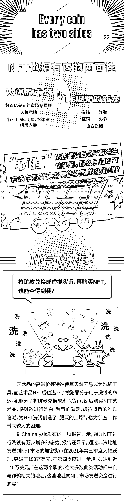
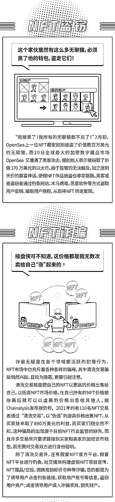
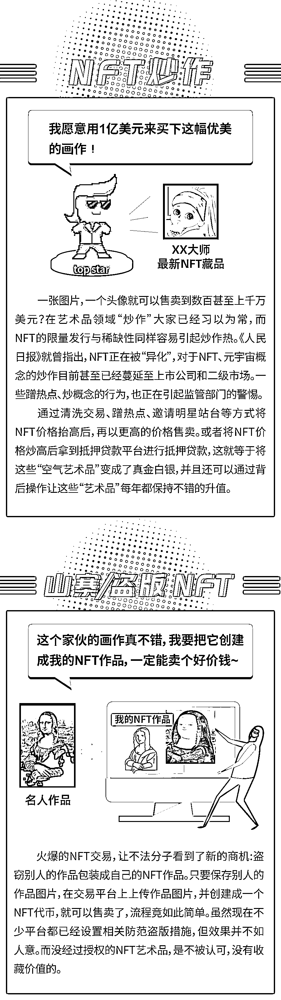

# 暴富的天堂？超 200 亿美元交易额背后还有肆意生长的洗钱、诈骗、盗窃、炒作……

> 原文：[`mp.weixin.qq.com/s?__biz=MzIyMDYwMTk0Mw==&mid=2247532208&idx=4&sn=3d6a1e0b957c84d179d938614b192603&chksm=97cbb588a0bc3c9e35520bacda7f6d26756460652860f9c05b4be97b804426264758717f3793&scene=27#wechat_redirect`](http://mp.weixin.qq.com/s?__biz=MzIyMDYwMTk0Mw==&mid=2247532208&idx=4&sn=3d6a1e0b957c84d179d938614b192603&chksm=97cbb588a0bc3c9e35520bacda7f6d26756460652860f9c05b4be97b804426264758717f3793&scene=27#wechat_redirect)

一幅数字藏品被竞拍到了约 4.5 亿人民币的天价，而这只是 2021 年众多天价 NFT 数字艺术品竞拍中的一个。

2021 年被称为 NFT 的元年，据相关数据显示，2021 年 NFT 市场累计交易额暴涨数百倍，各个行业巨头、艺术家、各界明星，纷纷入局 NFT。热潮也伴随着乱象，在 NFT“出圈”的同时，相关犯罪活动也在不断滋生。

**监管的缺乏是 NFT 犯罪不断增长的主要原因之一**，任何涉足或者正准备涉足 NFT 市场的人都应该看到热潮背后的乱象和犯罪。急速爆发的市场，吸引着一批又一批的人入场，也就给了犯罪分子可乘之机，让不少投资者误入骗局，损失资产，同时也给相关犯罪的打击带来极大的挑战。

而作为普通大众，我们要对 NFT 市场的风险有充分的认知，不轻易参与各类所谓的“投资”活动，保护好账号、私钥等个人信息，避免陷入各类骗局，保护好自己的资产安全。

**参考资料：**

《警惕！常见 NFT 炒作方式》，芝士课堂

《山寨 NFT 问题，只会越来越严重》，元宇宙虫洞

《多国监管提示 NFT 金融风险 纽交所计划进入 NFT 市场？》，金融风险管理 50 人论坛

来源：成都链安

← 向右滑动与灰产圈互动交流 →

