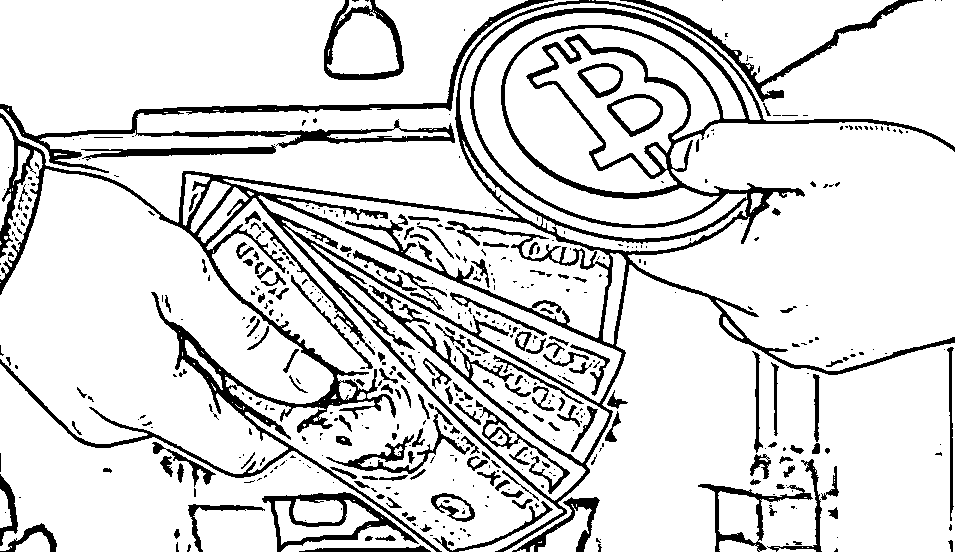

# 传销、币圈、盘圈之后，交易所或将成为庞氏骗局的主战场

> 原文：[`mp.weixin.qq.com/s?__biz=MzIyMDYwMTk0Mw==&mid=2247532250&idx=5&sn=9fcd46338a03ddc3cd14f89b4233e882&chksm=97cbb5e2a0bc3cf4c8b0cbfd3747cff90d58b32a968b0e363f78a2bf72f730fbf0518636a2d2&scene=27#wechat_redirect`](http://mp.weixin.qq.com/s?__biz=MzIyMDYwMTk0Mw==&mid=2247532250&idx=5&sn=9fcd46338a03ddc3cd14f89b4233e882&chksm=97cbb5e2a0bc3cf4c8b0cbfd3747cff90d58b32a968b0e363f78a2bf72f730fbf0518636a2d2&scene=27#wechat_redirect)

2021 年的观察里，感受到传销开始进入低迷期，一方面是不断重拳打击，另一方面则是被非法集资冲击。 

今年 2022 年度，执法监管将对非法集资领域重拳出击，所以未来会变成什么样，中国庞氏骗局发展趋势预测，盘圈作为传销和非法集资的交汇处，也代表着现在的庞氏主战场，还会有什么变化发生呢。

**传统涉传生态**

涉传生态即人际网络，或者更通俗偏激的说，就是笼统认知里的“传销”和传销。

人际网络的主流阵地直销，客观因素因为权健和疫情，主观因素缺乏自我改造动力，在社会中被进一步边缘化和老龄化的危险越来越大；

直销衍生而来的社交电商，大败局已定，云联惠类消费返利的屡战屡败，所有基于裂变的所谓的商业模式创新，基本都走到了尽头，而且没有新花样出现，能看到的都是新瓶装旧酒；

唯独社区团购的兴盛优选杀出重围，效仿者基本偃旗息鼓，但不同的是兴盛优选在应用层面是轻量级的，团队计酬制度骨子里都没有鸡血，所以受众与我所说的涉传生态没什么交集，这里提一笔撇清干系；

诸多主流互联网大厂用灰色合规技巧制造出的拉新制度，奖励花样虽然不断翻新，但互联网的天花板已至，再多技巧都是苍白的，“传销式拉新”已经被社会新生代开始厌倦，羊毛党的平均年龄越来越大，这个社会心理的变化很微小，但我很清晰的感觉到了。

自此，团队计酬在商业运用层面多个方向的尝试，除开社区团购全盘失利，整体受众面约六亿。

**传统非法集资生态**

庞氏老阵地是非法集资，较新的阵地是币圈，最新阵地则是现在的盘圈。

传统庞氏大多是非法集资高息揽储一类，治理后基本灭绝，随后变种大致可分为传统线下非法集资（原始股盘），线上各种扶贫慈善虚拟币庞氏，传销式电商盘返利盘，但在治理中基本都是以传销罪定义，所以大多数还是涉传生态（老式纯粹的非集不具备社会性）。

非法集资经常和传销杂交变异。把 币圈 说成庞氏，被怼被骂是难免的，币圈第一批布道者里相当数量都是 MMM 的受众，他们中的一部分人去了币圈，另一部分则开启了互助盘的潘多拉魔盒。

**盘圈受众群体心理轨迹**

从韭菜的感官来说，传统非法集资来钱快，年息 30%太低，月息 30%正常，所以利益驱动的能量远比辛辛苦苦拉人头的涉传模式，容易的多的多，毕竟“躺赚”已经大行其道。

币圈特点是猛，发币三天十倍，七天百倍的，动物币疯涨屎尿屁币满天飞，多到韭菜恨不得见币就买，被收割再多次只需一次押中，就全部回本暴富，投机心态之强令人叹为观止。

币圈因为知识里的硬逻辑太多，受众集中于年轻人；传销式非法集资因为其多样性不仅仅集中于中老年人，其中云数贸和善心汇开发出海量的老年人群体受众，资产解冻的骗子在后面跟着捡漏，所以最终启蒙忽悠中老年人韭菜的活儿，顺理成章交给了盘圈。

盘圈借助币圈刀法收割术，其中最极致就是 OTC 机制的 GEC 和趣步系，收益表面远比老旧非法集资要有吸引力的多，高息揽储变化为虚拟币名目出现，变现通过交易所洗一洗，简单粗暴却又非常有力，学习难度确实大幅下降。

**盘圈特点**

老中青通杀：币圈对思维认知有一定要求，零撸、趣步系、空气币诸多妖魔鬼怪的盘圈，用简单的方法通过虚拟币和交易所，做到高息揽储的变种应用，就这样莫名其妙的变成最高音，也逐渐发展出最大受众群体。

更快、更高、更强，回钱更快风险小；回报更高值得押注；规避法律风险的策略更多、教育程度（洗脑强度）更大、学习成本大幅下降（微信群和短视频）、博弈对赌的相对公平性透明度有所提高、沉浸时间更少、进入门槛随机灵活、传销质疑淡化。

币圈只在疯牛时会全民皆币，传统涉传和庞氏则相对更细水长流，既然都是投机属性，折中而来的盘圈儿，自然是这两年里庞氏骗局的天选之子了。

流动规律：年轻人炒第一棒，中年人接力，老年人用棺材本接盘收尾，一个中老年群体能够“简单易复制”的百倍币千倍币，对社会各阶层的穿透力无与伦比。

操作层面特征：或强调币圈理论来洗脑，或强调币圈微信群控制策略，或强调币圈 OTC 透明公平，再组合币价控制和概念炒作，币圈工具包里的刀法、各种欺骗手法、炒作包装手法，一一铺展开来组合运用，镰刀挥舞的是虎虎生风。

群体心理：尚未出现共识性的高强度群体认知，情绪波动方向也较为多变，内斗问题和涉传生态一样，分化后按年龄一分为三的可能性较大。

结论：一个币圈和非法集资的模式刀法结合出的模式折中体，最大化容纳了传统庞氏受众里的投机势能。

其中，趣步系相对表面化，数据容易推理，其大盘总量不低于两万亿人民币，资金流动量不低于十万亿，趣步（赞丽）币价落差几十倍，GEC 甚至上千倍，看起来颇得币圈真传，盘圈尤其是趣步系，必然成为法律完善过程中的一个标志性存在，当然现阶段是一个挑战，而且涉及法律尊严。

**法律迟滞**

从监管治理层面来看，盘圈犯罪方法极其混杂，传销和非法集资互相胶着，各种说不清楚的收割方法实在难搞，尤其是在币圈定性之后，我们都能看到，集合传销、非集、灰色金融组合犯罪手法的庞氏骗局新类型，以令人崩溃的发展速度，远超出法律法规的完善速度，极其深刻的衬托出相关法律的迟滞。

趣步系 OTC 交易所伪装下的隐蔽收割，不仅成功规避几乎所有法律，而且处置难度百倍增长，以至于著名律所湖南通程和著名法学教授孙选中，在论证趣步商业模式时下了个“不是传销、不是非法集资”的断论，现在变成了一个笑话，未来几个月，会变成耻辱。

唯一的好消息是，新司法解释里传销与非集竞合时取重罪办理，看起来是封堵了传销式非法集资这条路；小步慢跑的补充和新版防非条例组合后，到底在执行层面能体现多少威力，看目前发展事态只怕开局就落后于犯罪现实了。

在金融层面的“交易所”，审批交易所权限现在是省级，有些在上面，乱象爆发则会收回审批权，那我们自然会想到，在问题暴露之前会是什么状态呢？

**下一个庞氏战场**

交易所要繁荣，离不开受众群体，金融本身就有投机属性，贵金属和期货交易所门槛极高，相对规范不会风险扩散；

文交所、茶交所为代表的乱象已经很久，币圈思维惯性早晚会“督促”他们提升刀法，更多花样值得“期待”；

三亚积分交易所，还在谨慎行进中，不少人挖空心思合规想钻进去，如果不严把门槛，随后就是审核不严厉的灰色“创新”交易所就会大量出现，以及现有交易所的灰色化“创新尝试”。

**灰色后面，必然是黑色**

紧随而来的则是暗网交易所、离岸交易所、空中交易所。

所有币圈盘圈积累的刀法施展开，

所有涉传生态的合规大法辅助，

所有币圈离岸战术、暗网化加持，

所有盘圈韭菜的嗷嗷待割，

十万亿人民币容量的庞氏骗局巅峰期，

三年内就能到来，甚至更快。

出海的赵长鹏们、孙宇晨们必然会借尸还魂，他们不仅有嗜血本能，还有作为“成功者”的粉丝，只需一人收割成功，效仿者便会蜂拥而起。

**韭菜历史轨迹之一**

这图磨磨蹭蹭画了一年多，找出来用在这里比较合适，也是传销对社会造成的流毒体现。

**未来三年的庞氏骗局**

币圈元宇宙概念来得快去的更快，至于他们又能玩出什么新花招，这实在无法预测，我是追不上他们的脚步了，但韭菜地已经最小化了。

社交电商大败局之后，年轻人尤其是宝妈群体的流失，但多数还是会回流至微商及新社交电商、新消费返利，这个受众的基本盘不会动，微商盘那些事，就是个可笑的闹剧。

培训盘里，财商情商、教练技术、九型人格这些半人半鬼的洗脑课程，还在进一步演变中，有些新套路中隐藏的刀法因为调查成本太高，还需要些时间去摸。

电商盘，因为互联网大厂的天花板下降，社交电商后吹泡泡没人信了。

在新的经济形势下，传统镰刀里的线下连锁加盟，可能会迎来一次爆发期，现在我们看不到与团队计酬的融合，不代表未来没有，毕竟振兴线下实体经济已经全面开启。

新一代返利盘，会组合些社交电商的路数，有一个小规模的泛滥，若模式设计上有跨越性突破的话，会形成第四次消费返利高峰，能感觉到一丝丝波动，我最近闲暇时也在揣摩设计，待成型后开个盲盒直接晒了。

盘圈里的中老年人，会被嫁接币圈外衣的诈骗盘再血洗几年，资产解冻已经被诈骗犯们玩烂了，预警信息和打击力度足够，所以新花样马甲都会出现，人群会被扩充。

盘圈里的中青年体量太大，用户层次丰富口味不一，现有各个盘口体量不足以去容纳，即便想分化容纳，又因为币圈流毒导致群体心理不同而无法吸收，这就变成了一个未来的不安定因素。

基于这个因素产生的投机势能，新类型庞氏骗局的爆发就有了温床，未知的、惊悚的、惊喜的都有可能发生，新的庞氏“神盘”到底是什么易铁无从可知，而本篇推导的灰黑色交易所，只是现有经验中社会心理推导下的可能之一。

传统交易所与庄家联合收割，规则有约束力也有完善机制，尚且不太担心，政策也会影响到灰色边界。

各种 APP 的自建交易所，庄家自建规则，收割起来天马行空，从治理角度看是最直接治理入口，落实操作层面第一个问题是，怎么定性，谁来管。

一个穿着传销外皮的 APP 和交易所，到底是什么东西？

来源：反传 365

← 向右滑动与灰产圈互动交流 →

