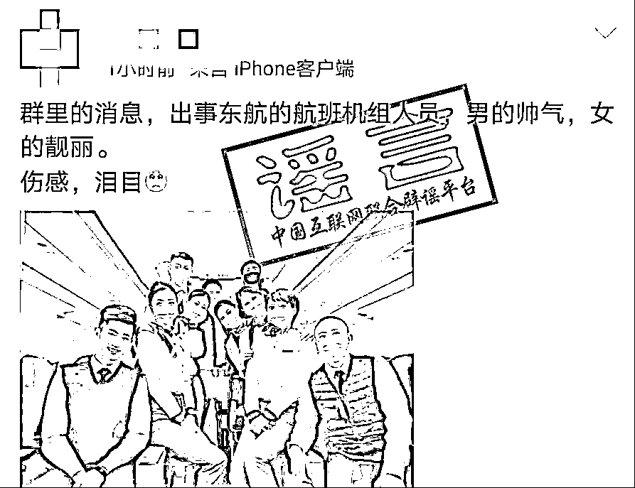
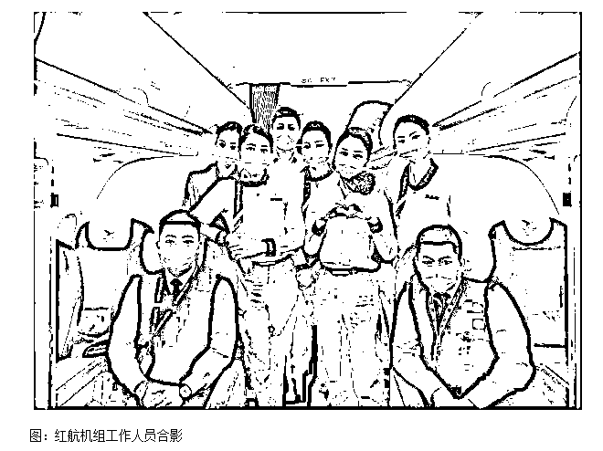
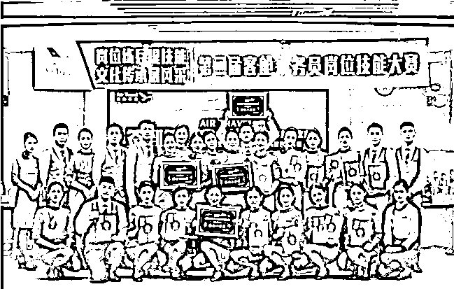
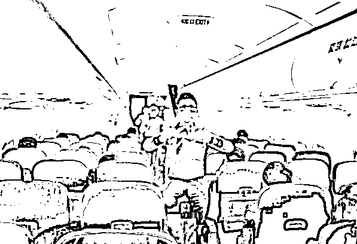
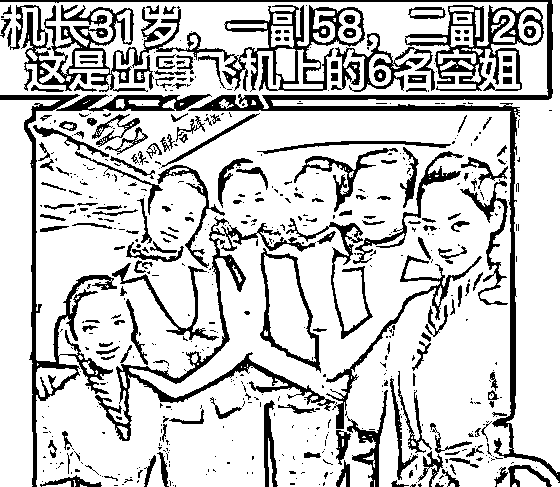
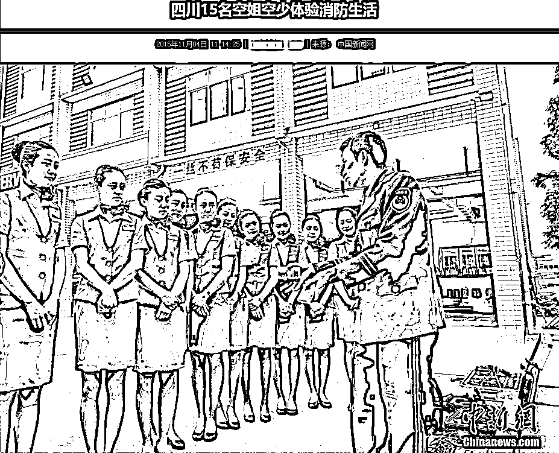
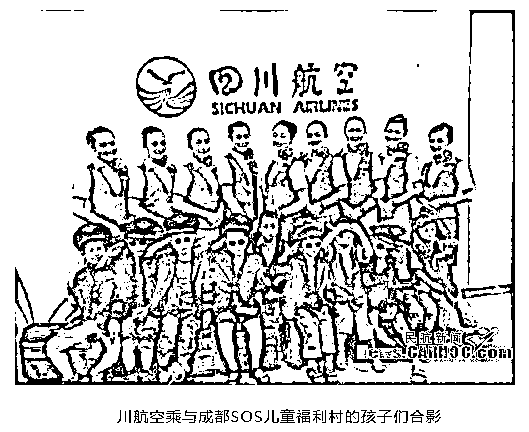
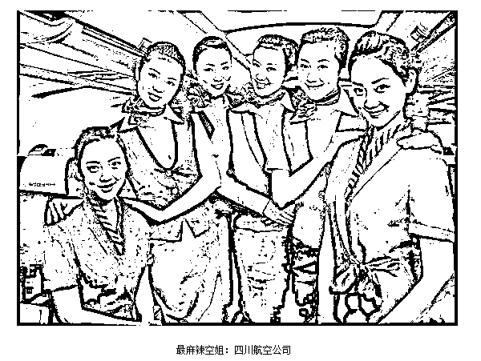

# 网传东航失事航班机组人员照片？这些都是假的！

> 原文：[`mp.weixin.qq.com/s?__biz=MzIyMDYwMTk0Mw==&mid=2247532301&idx=1&sn=c0144c12e49397746ce9df60dd736706&chksm=97cbb435a0bc3d23491e0f2ce154c7a853adf2fd8c316dfcfacbb1bac4fc26508dba62400e61&scene=27#wechat_redirect`](http://mp.weixin.qq.com/s?__biz=MzIyMDYwMTk0Mw==&mid=2247532301&idx=1&sn=c0144c12e49397746ce9df60dd736706&chksm=97cbb435a0bc3d23491e0f2ce154c7a853adf2fd8c316dfcfacbb1bac4fc26508dba62400e61&scene=27#wechat_redirect)

3 月 21 日 14 时 38 分许，东方航空公司 MU5735 航班执行昆明－广州任务时，在广西梧州市上空失联并坠毁。机上共有旅客 123 名（无外籍旅客），机组人员 9 名（飞行员 3 名，乘务员 5 名，安全员 1 名）。目前，现场救援、善后处置及事故原因调查等工作正在紧张进行中。 

近日，网上流传一些东航 MU5735 失事航班的机组人员图片。经中国互联网联合辟谣平台核查，**鉴定为假！** 

**【传言一】**

**【核查一】**

经核查

以上图片中制服应为

湖南航空公司空乘人员制服

**并非东航制服**

 2020 年 10 月之前

“湖南航空”原名为“红土航空”

以下为当时红航机组工作人员合影宣传照

 从湖南航空官网上

也查到客舱乘务员的正式制服

既有灰色短袖

也有白色长袖

但颈部**均有一条红色的丝巾作为点缀**

 图片来自湖南航空公司官网

湖南航空客舱服务人员疫情期间为旅客做安全演示。（图片来自湖南航空公司官网）

**【传言二】**

**【核查二】**

经核查

在 2019 年 1 月 1 日四川航空

第七代空乘新制服全面上线前

以上图片显示的制服为

**四川航空空乘人员原制服**

从 2015 年媒体报道的相关图片

可清晰辨出

 资料图片来源：中国新闻网

资料图片来源：民航新闻 

也有网站在**2015 年**报道航空公司空乘人员时

将四川航空公司空姐评为“最麻辣空姐”

**使用的也正是这张照片**

**郑重提醒**

东航 MU5735 失事客机事件牵动人心，现场救援、善后处置及事故原因调查等工作正在紧张进行中。

中国互联网联合辟谣平台郑重提醒，请广大网友**客观理性**地参与讨论、发表观点，**不发布缺乏同理心的内容，**不轻信和传播不实信息，用实际行动支持救援工作。

来源：新华网，综合中国互联网联合辟谣平台，中国新闻网

← 向右滑动与灰产圈互动交流 →

