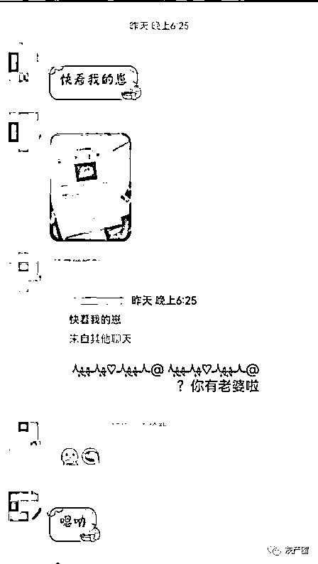
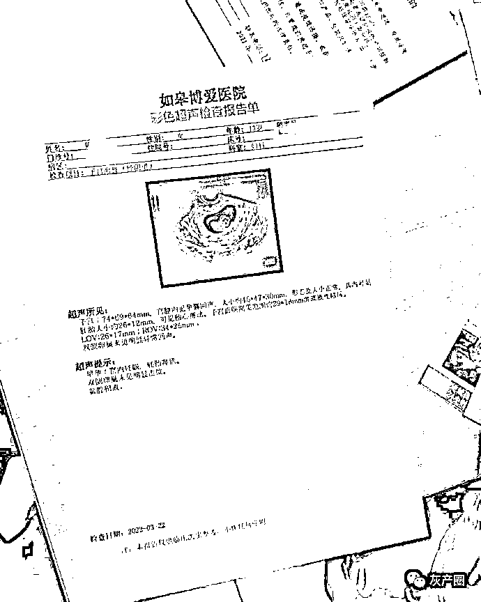
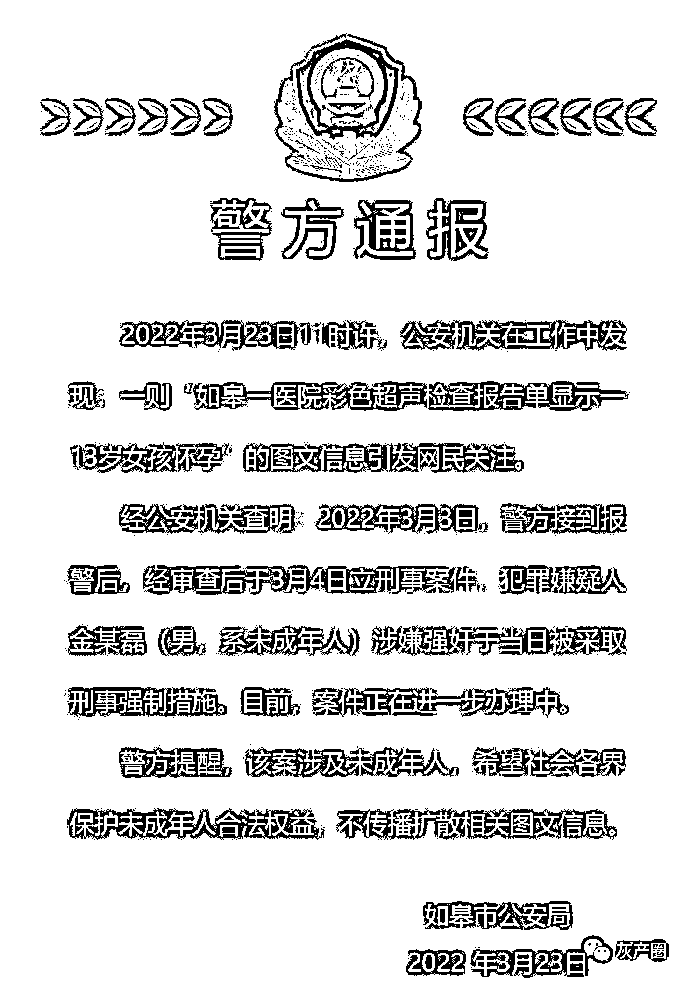
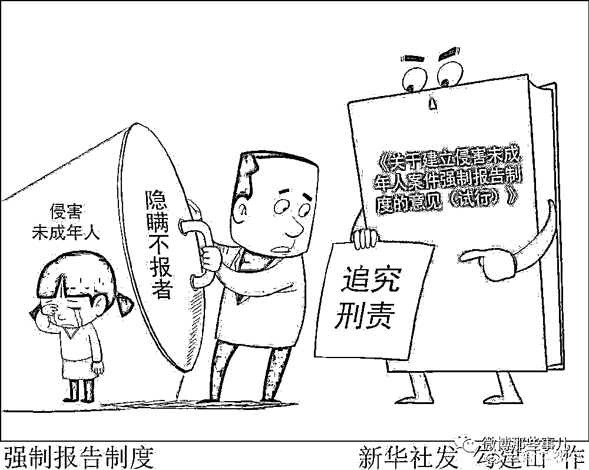

# 男子炫耀 13 岁的女友怀孕了，警方：未成年男子涉嫌强奸 已被采取刑事措施

> 原文：[`mp.weixin.qq.com/s?__biz=MzIyMDYwMTk0Mw==&mid=2247532301&idx=2&sn=84275018554a37b762182c128ad0cd6e&chksm=97cbb435a0bc3d23984e7ed120e9cfc7c175235eb550138f8a80fae126840945ac61e207db31&scene=27#wechat_redirect`](http://mp.weixin.qq.com/s?__biz=MzIyMDYwMTk0Mw==&mid=2247532301&idx=2&sn=84275018554a37b762182c128ad0cd6e&chksm=97cbb435a0bc3d23984e7ed120e9cfc7c175235eb550138f8a80fae126840945ac61e207db31&scene=27#wechat_redirect)

“快来看我的崽！”，江苏南通，一名男子炫耀 13 岁的女友怀孕了，并发了一张彩超图和报告单。 

根据《刑法》第 236 条，以暴力、胁迫或者其他手段强奸妇女的，处 3-10 年有期徒刑。奸淫不满 14 周岁的幼女的，以强奸论，从重处罚。
我国刑法将性同意权的年龄定位 14 岁。如果女孩未满 14 周岁，和她发生关系的男子如果明知她的年龄，即使女孩同意发生性关系，男子也构成强奸罪。

经公安机关查明：2022 年 3 月 3 日，警方接到报警后，经审查后于 3 月 4 日立刑事案件，犯罪嫌疑人金某磊（男，系未成年人）涉嫌强奸于当日被采取刑事强制措施。

* * *

这个事件中，还有一方的责任被忽视了，就是女孩没报警、医院也没报警。

根据最高检、公安部等 9 部门《关于建立侵害未成年人案件强制报告制度的意见（试行）》第 2 条，侵害未成年人案件强制报告，是指国家机关公职人员、医院等密切接触未成年人行业的各类组织和从业人员，在工作中发现未成年人遭受或者疑似遭受不法侵害以及面临不法侵害危险的，应当立即向公安机关报案或举报。 本意见第 4 条明确，不满十四周岁的女性未成年人遭受或疑似遭受性侵害、怀孕、流产的，应当立即报案。但本案中的医院和医务人员却没有报告。  
根据本意见第 16 条 ，相关单位和人员应当受到主管机关和单位的行政处分。

* * *

愿你们都得到自己想要的:额，记得我初中的时候就听到有初二的怀孕退学回老家了，哎……我依稀记得那个时候的同学都拿有男朋友做炫耀的事

拥有一切之后就让它走:这个可并不是绝对的，也有两小无猜原则 已满十四周岁不满十六周岁的人偶尔与幼女发生性行为，情节轻微、未造成严重后果的，不认为是犯罪。当然具体到这个个案造成怀孕了可算不上情节轻微了

三聿卿:很明显，既然刑拘了，那这个未成年就是 16-18 这个区间，会定罪量刑，但也会从轻处罚

来源：微博那些事

← 向右滑动与灰产圈互动交流 →

