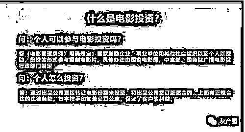
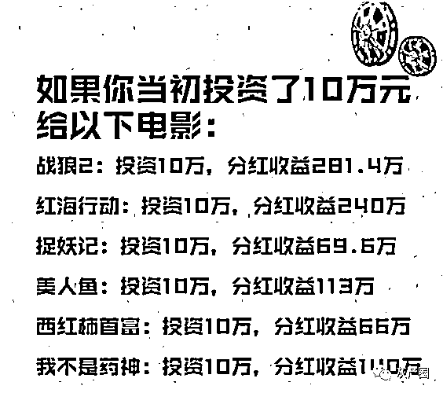
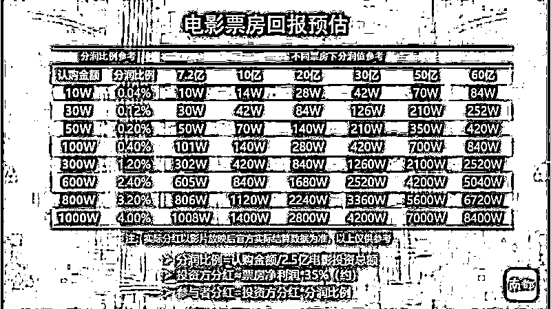
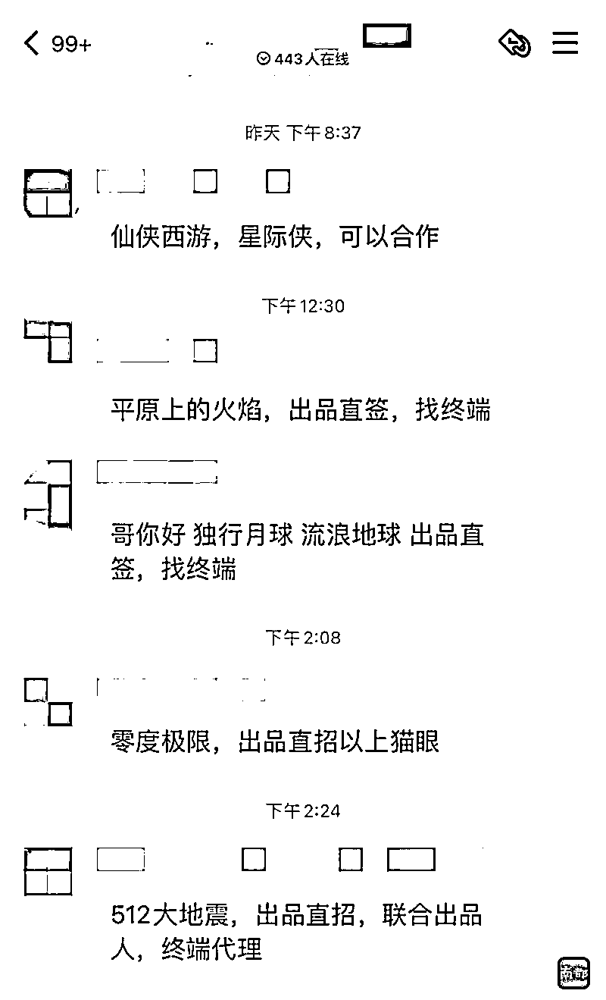

# 女子向一部电影投资 50 万，结果傻眼了

> 原文：[`mp.weixin.qq.com/s?__biz=MzIyMDYwMTk0Mw==&mid=2247532301&idx=4&sn=f4704aaf07c4ef9296415278452f4a76&chksm=97cbb435a0bc3d23471186f2eec91afe896b3b021277977ca8875a78b9a2b66b4b2de04e072b&scene=27#wechat_redirect`](http://mp.weixin.qq.com/s?__biz=MzIyMDYwMTk0Mw==&mid=2247532301&idx=4&sn=f4704aaf07c4ef9296415278452f4a76&chksm=97cbb435a0bc3d23471186f2eec91afe896b3b021277977ca8875a78b9a2b66b4b2de04e072b&scene=27#wechat_redirect)

****

**投资认购电影版权，等电影火爆上映后就能参与票房分红，有机会获得数倍收益？然而，有投资者向南都“记者帮”反映，其花 50 万元认购一部电影的版票，等了 3 年，电影至今却仍未公映，既领不到分红，50 万元也可能“打水漂”。**

## **当事人**

## ****50 万元买电影版票****

## ****上映时间一拖再拖****

**“希望用我的经历，给同样想投资电影的市民提个醒！”3 月 14 日，家住上海的汪小姐向南都记者讲述，2019 年 3 月，她加入一个股票群，有群友分享称此前曾认购多部电影版权，赚了数倍收益，还附有分红截图。在对方推荐下，她了解到广州禾优影业有限公司在投资拍摄一部电影，据其称将由明星沈某等参演，总投资 2.5 亿元，按 10 万元/张版票对外发售。王小姐提供了群里发布的广州禾优影业有限公司制作的电影宣传海报，其中沈某处于海报“C 位”。**

**眼见国产电影频频刷出票房纪录，2019 年 5 月，汪小姐转账 50 万元给广州禾优影业有限公司购买 5 张电影版票，由公司邮寄协议后签字确认。**

**汪小姐向南都记者出示相关转账记录和认购协议。协议称“甲方为促进市场，提高本片知名度，发行电影纪念版票，乙方按认购版票金额占电影总投资额比例获得相关权益。”根据协议提供的影视信息，该部喜剧电影时长 90 至 120 分钟，制作完成时间为 2019 年。协议中仅注明了导演名字，未提及参演具体演员，并称根据剧本创作需求及演员档期等因素，导演、演员和制作人员可能会有所调整，但不影响协议执行。**

**协议中提到，本片投资额为 2.5 亿元，乙方购版票五张，认购金额人民币 50 万元，获得投资方净收入 0.2%份额的收益权。影片在商业院线公映下线后 6 个月内，在双方对结算报表确认的情况下，甲方根据实际收款情况，向乙方支付收益分成款。此外，协议中还有“如因制片方原因导致本片未能在制作完成之日起一年内公映，甲方应按照版票原始发行价格进行回购”“影片上映前，乙方不得无条件要求甲方回购”等条件。**

****

**汪小姐出示一份该公司提供的《电影票房回报预估》显示，她投资 50 万元，按照电影投资 2.5 亿计算，“票房要达到 7.2 亿元，我才能回本”。**

**汪小姐强调，她是冲着沈某的名气才购买的版票。她出示了客服人员的聊天记录，在被问及演员是否确定下来时，客服称除了已公布的部分主演，其他部分演员暂不公布，沈某应是根据拍摄进度进组。**

**从 2020 年起，汪小姐便开始不断询问客服，电影何时上映。对方开始说是 2021 年春节档，后面说是五一档、暑期档，“每次问都是快了，结果 3 年过去了，电影还没上映！”面对她的质疑，客服答复称，现在电影进展顺利，是由于不定的因素影响了规划，但推迟并不影响电影的正常推进的，这达不到协议上回购的标准。**

**2022 年 3 月 9 日，由于电影迟迟未公映，汪小姐来到广州禾优影业有限公司与相关负责人协商退款遭到拒绝，“还是说快上映了，具体时间又说不清楚”。近几日，该公司大门紧闭，暂不对外办公。**

****

**广州禾优影业有限公司大门紧闭，暂停对外办公。**

## **制作方：**

## ****电影受疫情影响延迟上映****

**南都记者登录国家电影局官网查询到，该电影已在国家电影局备案，备案单位是南京禾优影业有限公司。**

**南京禾优影业有限公司工作人员表示，公司是电影制作方，沈某并未出演，广州禾优影业有限公司投资该电影，“我们只负责帮他们拍电影，具体投资情况不清楚”。电影现已更名并拿到公映许可证，“在等合适的档期，因为现在疫情不能贸然上”“疫情有缓解的话，今年就可以上”。她强调，目前无法给出确切上映时间，还需公司的发行宣传人员统一开会决定。**

**在国家电影局官网上，更名后的电影确实取得公映许可证，不过第一出品单位为宁夏群英影业有限公司，而非广州禾优影业有限公司。而汪小姐从广州禾优影业有限公司获取的一份公映许可证复印件显示，出品单位有包括宁夏群英影业有限公司、广州禾优影业有限公司在内共 12 家公司。**

**有业内人士指出，个人参与影视投资的正规渠道是向电影的第一出品方认购电影的版权份额，因为只有第一出品方才是电影版权和收益的拥有方和分配方，联合出品方通常只能从第一出品方处取得电影的小部分份额，通过将电影份额二次拆分后再溢价“出售”给个人投资者。**

**3 月 15 日，南都记者拨打广州禾优影业有限公司客服电话，无人接听，尝试以媒体身份添加客服微信号，截至发稿时尚未通过。**

## **记者暗访**

## ****影视投资信息火爆****

## ****发帖者多无授权书****

**在百度贴吧、QQ 群等社交平台上，涉及影视投资的信息发布火热，影视投资百度贴吧发帖超过 3 万条。发帖者通常在发布影片宣传内容后，留下个人微信号或 QQ 号吸引私聊，群里不时会抛出关于影片超高回报率的海报。发布的电影项目中，绝大多数是近年将上映的大咖出演的大片，五六万元起投。**

**记者以投资者身份加了几个发帖者的 QQ 和微信，交流后得知他们并非电影的出品方工作人员，他们自称下游宣传方、中介或帮朋友代推，均无法提供来自影片第一出品方的出售影片份额授权书。**

****

**QQ 群内关于电影投资的信息。**

**自称专业影投顾问的杨先生向记者推荐了一部预计今年暑期上映的喜剧大片。“我自己也投了。”他称，该电影有两家出品公司出售份额，成本报价分别为 2 亿元和 3 亿元。为何同一部电影的成本计算不一样？他解释，联合出品方从第一出品方购买电影份额后再溢价卖出，不同的公司溢价不一样。**

**个人至少投 6 万元，按 6 万元投资计算，等票房出来后，可以获得投资方净收入的 0.03%，票房如果 20 亿，投资者可以获得收益大约 23 万多元，“电影这种大投资，如果几千几百就能投，那应该你自己都会觉得太儿戏了！”**

**当南都记者提出看第一出品方的出售电影份额授权书时，他表示要“先交定金，再给你发视频看”。记者随后从该电影官网上找到出品方名单，他声称的两家出品公司均不在名单中。**

**另一名发布电影《流浪地球 2》投资信息的网友称，该电影成本 5 亿，5 万元起投，“帮朋友代推的，都是互相帮忙的”。记者随后上网查询发现，2021 年 12 月 6 日，《流浪地球 2》出品方中国电影股份有限公司等发布联合声明称，近日市场上出现利用电影《流浪地球 2》擅自发布虚假融资信息的情况，“影片出品方从未亦无计划通过网站、微博、微信公众号、微信朋友圈等任何公开渠道或委托任何机构或自然人开展《流浪地球 2》项目融资业务。”**

## **业内人士**

## ****下游投资人受益比例非常低****

**众筹电影对大众而言并不陌生。2015 年，动画电影《西游记之大圣归来》上映 20 天便揽下 7.3 亿元高票房，其中 89 位众筹者投资 780 万元，获得了本息总和 3000 万元，获利近 4 倍。**

**然而，电影获得分红的前提是需要完成拍摄制作和公映，由于前期电影市场封闭，造成投资者信息不对称，加上电影涉及资金、演员、审片等，不可控因素较多，极易出现延迟甚至无法上映，为投资者带来风险。南都记者在中国裁判文书网查询发现，2021 年涉及众筹电影的国内案件超过 10 宗，不少因电影无法如约完成拍摄和在网络平台投播造成合同纠纷。**

**电影投资人姚华曾分析电影项目融资的套路：如果一部电影的票房收益是 50 亿元，去除院线收益、电影专项基金税费、发行代理费等，真正留给投资方可以进行分配的，大概也就是 30%至 35%之间。在这个范围里，如果以 30%计算，50 亿元的票房里，投资人只能拿到 15 亿元。**

**15 亿元里面，去除作为基础投资方、制片方、主创奖励等，再进行拆分，下游投资人能够拿到的收益比例会非常低。这种情形之下，做成理财产品或拆分份额向他人进行融资，绝大部分注定失败，极易引发群体诉讼，甚至会对影片口碑产生恶劣影响。另外，上述方式常常导致电影份额被放到一些投资理财群或股票群推销，“杀熟”情形非常多，风险很大。**

## **律师**

## ****公司或涉嫌构成非法吸收公众存款罪****

**北京韬安律师事务所律师王军则称，投资方将电影份额对外转让或再融资的时候，必定是溢价的，而合同一般以制作成本或票房预估为前提向投资人“兜售”。其中，电影核心成本和评估方式极易被虚报或隐瞒，涉嫌合同欺诈。众筹具有极高法律风险，和非法集资、向不特定公众吸收公众存款此类违法行为距离很近，属于游走在法律灰色地带和红线边缘。**

**广东法制盛邦律师事务所邓刚律师也表示，对于收取资金的一方没有按承诺使用资金，且符合约定的退款条件的，投资人可以向法院起诉，要求对方退还款项。如果企业以投资入股等方式非法吸收资金，具备以下特点，即未经有关部门依法许可或者借用合法经营的形式吸收资金，通过网络、媒体、推介会、传单、手机信息等途径向社会公开宣传，承诺在一定期限内以货币、实物、股权等方式还本付息或者给付回报，并且向社会公众即社会不特定对象吸收资金达到一定金额的，则涉嫌构成非法吸收公众存款罪。因此，投资人还可以向公安机关报案，追究其刑事责任。**

**来源：南方都市报，巴蜀反诈**

****

**← 向右滑动与灰产圈互动交流 →**

****