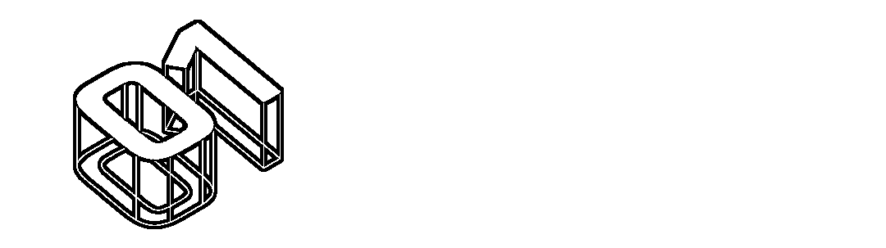

# 怎么贷了一次款，我就在网上“裸奔”了呢？

> 原文：[`mp.weixin.qq.com/s?__biz=MzIyMDYwMTk0Mw==&mid=2247532301&idx=5&sn=db39d9d2e32fa82c92206dbe1ade0293&chksm=97cbb435a0bc3d23ea3898d7009f9f95fc6b8deebb5558e13e46cad2a5ba564c048bc489c375&scene=27#wechat_redirect`](http://mp.weixin.qq.com/s?__biz=MzIyMDYwMTk0Mw==&mid=2247532301&idx=5&sn=db39d9d2e32fa82c92206dbe1ade0293&chksm=97cbb435a0bc3d23ea3898d7009f9f95fc6b8deebb5558e13e46cad2a5ba564c048bc489c375&scene=27#wechat_redirect)

“免审核”“不要求征信，放款快”“无抵押秒放款”……

充满诱惑的网贷广告充斥各大网络平台，似乎能为急需用钱的人带去“临时提现”的“一线生机”。

**醒醒吧，这些都是骗子的谎言！**

如果不懂网络贷款诈骗套路，贷款贷不成，反倒越贷越穷，甚至后患无穷——最近，守哥又发现了一个网贷“后遗症”：**当你申请过一个网贷后，就会接连不断收到各类网贷平台的推销电话和短信。**

**明明只在一个平台办贷过，只点击了一个网贷平台协议，怎就授权了上千家公司查询信息，成为众多推销骚扰方的“公共接收器”？**

**“一键式”信息共享多家平台**

守哥发现，网贷平台申请的第一步操作，往往需要用户输入手机号获取验证码，并勾选“同意服务协议”“同意隐私政策”等协议。

**而你的信息，也就从这一步就开始泄露。**

在这些协议中，平台需要用户提供姓名、身份证、手机号、信用情况、社保公积金等个人信息，如果用户拒绝提供，则无法正常使用贷款产品申请的功能。

（图源：南方都市报）

如要使用贷款申请功能，用户需要再填写涵盖社保及公积金、商业保险情况等的个人信息。

**此时，猫腻来了。**

协议会提及“将上述信息与其他合作方进行信息共享”。**让你万****万没想到的是，有的平台合作方竟达上千家公司，而消费者大都事前草草“阅过”，事后“惊雷”。**

（图源：南方都市报）

当看到某平台贷款合作方列表时，守哥直呼好家伙，该平台合作方竟有 1859 家公司！

（图源：南方都市报）

这些公司可谓涉及各行各业。有小额贷款公司、保险公司科技、金融服务外包、还有一些信息咨询、房产中介、汽车销售、汽车租赁等公司等等。

**这波操作，让个人隐私同时共享给这么多平台，这和“信息裸奔”有何差别？！** 

**“套娃式”导流个人信息被多次共享**

除了“一键式”信息共享，还有一类“套娃式”导流个人信息的方式，也让守哥咋舌。

前不久，网络借贷人小李就“享受”到一次“套娃式”服务。

前期贷款时遭遇“跳转了 6-7 个平台，多次输入身份证、手机号、验证码等信息，还勾选了很多协议”。之后又“强制下款 1000 元，期限仅两天，就要还款 1600 元。”

为了验证小李的“套娃式”遭遇，守哥决定“以身试毒”。

（某网贷平台下可链接多个第三方贷款机构）

通过对几个平台亲测，守哥发现：**这些网贷平台在借款过程中，均通过跳转第三方贷款机构进行导流，而平台本身并不提供贷款业务，这些第三方机构多数是小额贷款公司。**

此外，守哥还观察到，这些平台实际上并不具有贷款业务的相关牌照，不能直接开展借贷业务。

但只要它符合联合贷款资质以及互联网贷款的相关要求，居然就可以和其他有资质的金融机构合作，通过导流的方式为用户提供贷款业务。

另外，一些网贷 APP 还会使用大量的 SDK（可理解为一种植入 APP 的第三方工具包），这些 SDK 也会获取使用权限，直接获取用户的网络链接、精确地理位置、手机状态与身份等用户信息。

（某网贷平台个人信息收集清单）

**这些数据一旦交出，意味着个人隐私尽被网贷平台掌握，而且有可能分享给催债公司或是其它第三方，后患无穷无尽。**

这里，守哥也和大家再汇总一下，因不正规网贷导致的个人信息泄露会给你带来哪些“填不完的坑”。

**危害有以下几点：**

1、**面临网络钓鱼诈骗风险。**被网络灰黑产业盯上，遭遇有针对性的网络钓鱼和电信诈骗。

2、**面临各种营销骚扰。**本来只有朋友、同学或亲戚知道的电话被不法分子打包营销，引来各种广告骚扰。

3、**面临隐私泄露风险。**个人隐私泄露后，那些躲在暗处的不法分子会费尽心机地想法子坑你、蒙你、骗你。稍不留神，可能就会落入坏人的圈套。

4、**面临被冒名办卡风险。**不法分子通过你的个人信息，在网上骗取银行的信用，从银行办理出各种各样的信用卡，恶意透支消费。

5、**面临刑事责任风险。**不法分子可能利用你的个人信息干些坏事，公安机关或交通管理部门可能会依据身份信息找到你的头上。

****说一千道一万**，在这里，守哥一定要再次提醒各位小伙伴：**

**首先，树立正确消费观，适度消费。**在消费能力的前提下，从实际需求出发，不要情绪化消费，避免攀比心理和一时冲动而造成的浪费。

**同时，远离网贷，如需要选择正规平台。**远离网贷最根本的就是养成良好消费习惯，如发生急需用钱情况，要向正规银行寻求帮助，切莫轻信网络虚假广告。 

**此外，发现个人信息泄露，及时报警或向相关部门反应。**及时止损，防止事态发展失控。

欲望永无止境

养成良好消费习惯

才有实现“诗和远方”的可能

来源：守护者计划

← 向右滑动与灰产圈互动交流 →

